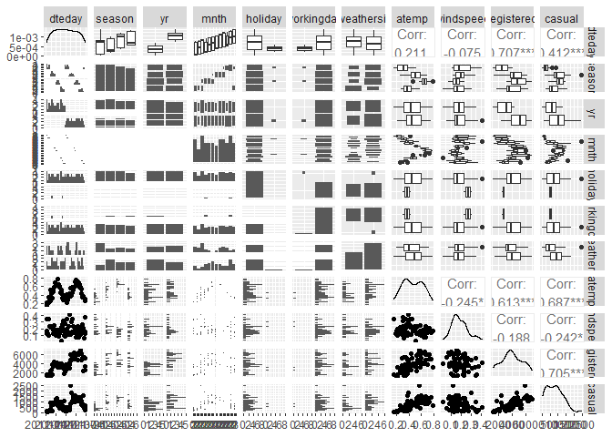
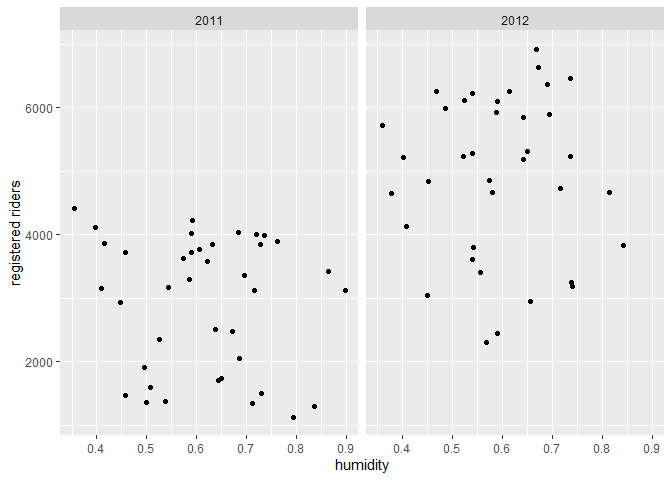

ST 558 Project 2
================
David Arthur
6/28/2021

-   [Introduction](#introduction)
-   [Data](#data)
-   [Summarizations](#summarizations)
-   [Modeling](#modeling)
    -   [First linear regression model](#first-linear-regression-model)
    -   [Second linear regression
        model](#second-linear-regression-model)
    -   [Random Forest Model](#random-forest-model)
-   [Comparison of models](#comparison-of-models)

# Introduction

…

# Data

We begin by reading in the data, changing the names of some factor
levels, and filtering by day of week

``` r
day <- readr::read_csv("day.csv", col_types = cols(
  season = col_factor(),
  yr = col_factor(),
  mnth = col_factor(),
  holiday = col_factor(),
  weekday = col_factor(),
  workingday = col_factor(),
  weathersit = col_factor()))

day <- day %>% mutate(season = fct_recode(season, winter = "1", spring = "2", summer = "3", fall = "4")) %>%
  mutate(yr = fct_recode(yr, "2011" = "0", "2012" = "1")) %>%
  mutate(weekday = fct_recode(weekday, Sunday = "0", Monday = "1", Tuesday = "2", Wednesday = "3", Thursday = "4", Friday = "5", Saturday = "6")) %>%
  mutate(weathersit = fct_recode(weathersit, clear = "1", mist = "2", lightRainOrSnow = "3", heavyRainOrSnow = "4")) %>%
  filter(weekday == params$dayOfWeek)

# read in version without factors for correlation plot
dayNF <- readr::read_csv("day.csv", col_types = cols(
  weekday = col_factor()))
```

Next, we partition the data into training and test sets

``` r
set.seed(21)
trainIndex <- createDataPartition(day$cnt, p = 0.7, list = FALSE)
dayTrain <- day[trainIndex, ]
dayTest <- day[-trainIndex, ]
```

# Summarizations

We begin our exploratory analysis of the data with a graphical overview
of the relationships between variables. Obvious patterns in the plots,
as well as high correlation values, indicate associations between
variables.

``` r
GGally::ggpairs(dayTrain %>% select(2:6, 8:9, atemp, windspeed, registered, casual))
```

<!-- -->

``` r
# dayNFCor <- cor(as.matrix(dayNF %>% select(3:9, atemp, windspeed, casual, registered,cnt)))
# corrplot(dayNFCor, type = "upper", tl.pos = "lt")
# corrplot(dayNFCor, type = "lower", method = "number", add = TRUE, diag = FALSE, tl.pos = "n")
```

We will now look in more detail at relationships between time-related
variables and the `registered` response variable. When we do our linear
regression modeling we will need to decide which (if any) of these
predictors to use. For example, the date variable (`dteday`) and
`season` may not be useful in the presence of `weekday`, `mnth`, and
`yr` (or vice versa), as they provide largely redundant information.

``` r
g <- ggplot(data = dayTrain)
g + geom_point(aes(x = dteday, y = registered))
```

<!-- -->

``` r
meanByMonthYr <- dayTrain %>% group_by(mnth, yr) %>%
  summarize(meanReg = mean(registered))
```

    ## `summarise()` has grouped output by 'mnth'. You can override using the `.groups` argument.

``` r
g2 <- ggplot(meanByMonthYr, aes(x = mnth))
g2 + geom_bar(aes(y = meanReg, fill = yr), position = "dodge", stat = "identity")
```

<!-- -->

We will look next in more detail at the relationship between
quantitative weather variables and the `registered` response variable.
The appearance of nonlinear relationships in the plots may indicate the
need for quadratic terms in our linear regression models. The adjusted
temperature variable, `atemp`, seems particularly likely to require a
quadratic term, as both low and high temperatures can discourage people
from bicycling. Similarly, with humidity and windspeed, low to moderate
values may have no effect, but particularly high values could have an
effect, so those variables may also require quadratic terms.

``` r
g + geom_point(aes(x = atemp, y = registered)) + facet_wrap(~ yr)
```

<!-- -->

``` r
g + geom_point(aes(x = hum, y = registered)) + facet_wrap(~ yr)
```

<!-- -->

``` r
g + geom_point(aes(x = windspeed, y = registered)) + facet_wrap(~ yr)
```

<!-- -->

We now view at a table displaying the mean number of `registered`,
`casual`, and total riders at each level of the categorical `weathersit`
variable. It seems plausible that in rain or snow, the number of casual
riders might decrease by a larger factor than would the number of
registered riders.

``` r
meanByWeather <- dayTrain %>% group_by(weathersit) %>%
  summarize(meanCas = mean(casual), meanReg = mean(registered), meanTotal = mean(cnt))
kable(meanByWeather, digits = 1, col.names = c("Weather", "Mean Casual Riders", "Mean Registered Riders", "Mean Total Riders"), caption = "Average # of riders by weather category")
```

| Weather | Mean Casual Riders | Mean Registered Riders | Mean Total Riders |
|:--------|-------------------:|-----------------------:|------------------:|
| mist    |              611.3 |                 3566.7 |            4178.0 |
| clear   |              870.9 |                 4118.7 |            4989.6 |

Average \# of riders by weather category

Exploratory data analysis and summary (James)

``` r
ggpairs(dayTrain %>% select(-instant,-dteday, -season, -yr, -cnt, -weekday), 
        ggplot2::aes(colour=workingday))
```

    ## Error in cor.test.default(x, y, method = method, use = use): not enough finite observations

<!-- --> Notes from
looking at ggpairs plots: Working days are the highest usage for
registered riders, but non-working days are the highest usage for casual
riders. Registered riders are the primary volume, so we definitely care
most about them but worth keeping in mind. There are two types of
non-working days: weekends and holidays, and there is a difference in
volume for each of those rider types depending on whether it is a
holiday or a weekend.

Air temperature and temperature are nearly 100% correlated. We should
probably figure out which one of them we want to use. Speaking of
correlated, can we drop the date and only use months? Unfortunately, it
looks like we need to keep the year field as well, since year 2 had
better performance than year 1. Do we want to keep season and month? I
lean towards keeping year and month, but dropping season and date. Let
me know what you think.

Looking at the scatter of casual vs registered, broken out by working
day, it’s crazy how separate the linear relationships look:

``` r
g <- ggplot(data=dayTrain, aes(x=registered, y=casual))
g + geom_point(aes(color=workingday))
```

<!-- --> On working
days, registered bikes are the main rider group. On non-working days, it
switches to casual. Looking at day of the week, we may be able to
exclude it since it will be covered by the working day flag and holiday
flag, but I guess we can check the models to see if it provides anything
extra.

``` r
g <- ggplot(data=dayTrain %>% 
                 select(weekday, casual, registered) %>%
                 pivot_longer(cols=c(casual, registered),
                              names_to = 'metrics',
                              values_to = 'riders') %>%
                 group_by(weekday, metrics) %>%
                 summarise(avg_riders = mean(riders)), 
            aes(x=weekday, y=avg_riders, fill=metrics))
```

    ## `summarise()` has grouped output by 'weekday'. You can override using the `.groups` argument.

``` r
g + geom_bar(stat='identity', position='dodge')
```

<!-- --> Looking at
this graph, weekday definitely seems relatively stable across the days
(working days for registered and non-working days for casual are the
jumps), but there may be enough variation to include it.

\#\#I like this graph. I thought about doing one like it, but wasn’t
sure how to code it. pivot\_longer hadn’t occurred to me.

\#\#About which variables to include, I agree with your comments. My
understanding is that each of us comes up with our own models (I do a
linear regression and a random forest, you do a linear regression and a
boosted tree), so you and I don’t need to include the same predictors.
We do need to agree ahead of time on which response we’re going to model
(casual, registered, or cnt), so that the results of the 4 models can be
compared to each other. I’m fine with any of the 3. Do you have a
preference?

Yeah, no preference here either. I guess we could just say registered
since it’s the highest volume customer, and if we were doing this
analysis for that company then registered users would be the most
important group.

\#\#Sounds good, we’ll go with registered.

# Modeling

We will now fit two linear regression models, using differing
approaches, with the goal of creating a model that does a good job of
predicting the number of registered riders on any given day, based on
the values of the predictor variables in the data set. We will fit the
models using the training data set that we partitioned above, and then
test the accuracy of the models’ predictions using the test data set.

Linear regression estimates the effect of each predictor variable on the
mean value of the response variable, with the other predictor variables
held constant. A linear regression model can be expressed as  
*Y*<sub>*i*</sub> = *β*<sub>0</sub> + *β*<sub>1</sub>*X*<sub>*i*1</sub> + *β*<sub>2</sub>*X*<sub>*i*2</sub> + ... + *β*<sub>*p*</sub>*X*<sub>*i**p*</sub> + *E*<sub>*i*</sub>

where *Y*<sub>*i*</sub> is the response, *i* represents the observation
number, *X*<sub>*i**j*</sub> are the predictor variables, and
*E*<sub>*i*</sub> is the normally distributed random error. The
*β*<sub>*j*</sub> coefficents must be linear, but the predictor
variables can be higher order terms (e.g. *x*<sup>2</sup>) or
interaction terms (e.g. *x*<sub>1</sub>*x*<sub>2</sub>). Creating a
model to estimate the response using observed data, we have  
$$\\hat{y\_i} = \\hat\\beta\_0 + \\hat\\beta\_1x\_{i1} + \\hat\\beta\_2x\_{i2} + ... + \\hat\\beta\_px\_{ip}$$

The *β̂*<sub>*j*</sub> coefficients (estimates for *β*<sub>*j*</sub>) are
calculated for each predictor variable to minimize the residual sum of
squares, using the observed values of *x*<sub>*i**j*</sub> and
*y*<sub>*i*</sub>  
$$min\_{\\beta\_0, \\beta\_1, ..., \\beta\_p}\\sum\_{i=1}^{n}(y\_i - \\beta\_0 - \\beta\_1x\_{i1} - \\beta\_2x\_{i2} - ... - \\beta\_px\_{ip})^2$$

The linear regression model can be used for inference, to understand the
relationships between the predictor variables and the response, as well
as for prediction of a mean response given new values of the predictor
variables. There are varying approaches to choosing which predictor
variables to include in a linear regression model. For our first linear
regression model, we ….  
For our second linear regression model, we ….

### First linear regression model

``` r
library(leaps)

data <- dayTrain %>% 
               filter(weekday == params$dayOfWeek) %>% drop_na() %>%
               select(-instant,-dteday, -season, 
                    -weekday, -atemp, -casual, -cnt)

#this function converts new data to a model matrix
#so that a prediction can be run via matrix multiplication
#on a best subsets model
predict.regsubsets = function(object,newdata,id,...){
      form = as.formula(object$call[[2]]) 
      mat = model.matrix(form,newdata)    
      coefi = coef(object,id=id)          
      xvars = names(coefi)                
      mat[,xvars]%*%coefi               
}


#let's do cross validation with folds
k <- 4
set.seed(21)
folds <- sample(1:k, nrow(data), replace=T)

cv_errors = matrix(NA, k, 16, dimnames = list(NULL, paste(1:16)))

for (j in 1:k) {
  best <- regsubsets(registered ~ ., 
                     data=data[folds!=j,], nvmax=20)
  
  for (i in 1:16) {
    pred <- predict(best, data[folds==j,], id=i)
    
    
    cv_errors[j, i] <- mean((temp_data$registered[folds==j]-pred)^2)
  }
}
```

    ## Warning in leaps.setup(x, y, wt = wt, nbest = nbest, nvmax = nvmax, force.in = force.in, : 2 linear
    ## dependencies found

    ## Reordering variables and trying again:

    ## Error in eval(x): object 'newX' not found

``` r
# Take the mean of over all folds for each model size
mean_cv_errors = apply(cv_errors, 2, mean)

# Find the model size with the smallest cross-validation error
min = which.min(mean_cv_errors)

#the model w/ 14 variables was best when using 4 fold cv.
#i did 4 fold because there are only about 80 rows of data per weekday

best_full <- regsubsets(registered ~ ., 
                     data=temp_data[folds!=j,], nvmax=20)
```

    ## Error in is.data.frame(data): object 'temp_data' not found

``` r
fit <- lm(registered ~ temp*hum,
        data=dayTrain %>% 
             filter(weekday == params$dayOfWeek) %>% drop_na() %>%
             select(-instant,-dteday, -season, 
                    -weekday, -atemp, -casual, -cnt))
```

### Second linear regression model

In this approach, we start with a full linear regression model that
includes all of the predictor variables. We will then reduce
collinearity (correlation among predictor variables) by removing
redundant predictors until we reach an optimal (lowest) AIC. We will
calculate the condition number (*κ*) for each of the candidate models,
which is a measure of collinearity. Roughly, *κ* &lt; 30 is considered
desirable. Finally, we will choose among several variations of the
optimal model (including various higher order terms) using cross
validation (described below).

We begin with the full model, which includes all of the predictors.
`holiday` and `workingday` are excluded for days of the week that
include only one level of `holiday` and `workingday`, respectively.

``` r
mlrFull <- lm(registered ~ dteday + season +  yr + mnth + weathersit + temp + 
                    atemp + hum + windspeed, dayTrain)
if(length(unique(dayTrain$workingday)) != 1){
  mlrFull <- update(mlrFull, . ~ . + workingday)
}
if(length(unique(dayTrain$holiday)) != 1){
  mlrFull <- update(mlrFull, . ~ . + holiday)
}

summary(mlrFull)
```

    ## 
    ## Call:
    ## lm(formula = registered ~ dteday + season + yr + mnth + weathersit + 
    ##     temp + atemp + hum + windspeed + workingday + holiday, data = dayTrain)
    ## 
    ## Residuals:
    ##      Min       1Q   Median       3Q      Max 
    ## -2414.85  -297.16    19.39   324.94   956.19 
    ## 
    ## Coefficients: (1 not defined because of singularities)
    ##                   Estimate Std. Error t value Pr(>|t|)   
    ## (Intercept)      85357.745 135721.602   0.629  0.53210   
    ## dteday              -5.596      9.061  -0.618  0.53953   
    ## seasonspring      1274.306    444.936   2.864  0.00598 **
    ## seasonsummer       370.934    622.738   0.596  0.55394   
    ## seasonfall        1153.720    512.253   2.252  0.02847 * 
    ## yr2012            3914.311   3328.081   1.176  0.24479   
    ## mnth2              218.086    490.061   0.445  0.65812   
    ## mnth3              477.742    652.265   0.732  0.46713   
    ## mnth4              -31.565    973.809  -0.032  0.97426   
    ## mnth5             1084.617   1163.790   0.932  0.35558   
    ## mnth6             1351.343   1476.763   0.915  0.36430   
    ## mnth7             1912.904   1885.226   1.015  0.31487   
    ## mnth8             2508.974   2109.381   1.189  0.23957   
    ## mnth9             3328.527   2304.637   1.444  0.15455   
    ## mnth10            2156.625   2579.860   0.836  0.40694   
    ## mnth11            1481.648   2834.976   0.523  0.60341   
    ## mnth12            2207.987   3084.198   0.716  0.47719   
    ## weathersitclear    256.607    203.308   1.262  0.21242   
    ## temp             -7435.732   7136.834  -1.042  0.30220   
    ## atemp            10353.747   7660.143   1.352  0.18223   
    ## hum              -1623.454    832.150  -1.951  0.05636 . 
    ## windspeed           58.024   1247.898   0.046  0.96309   
    ## workingday1        -41.407    498.913  -0.083  0.93417   
    ## holiday1                NA         NA      NA       NA   
    ## ---
    ## Signif. codes:  0 '***' 0.001 '**' 0.01 '*' 0.05 '.' 0.1 ' ' 1
    ## 
    ## Residual standard error: 632.2 on 53 degrees of freedom
    ## Multiple R-squared:   0.88,  Adjusted R-squared:  0.8302 
    ## F-statistic: 17.67 on 22 and 53 DF,  p-value: < 2.2e-16

``` r
AIC(mlrFull)
```

    ## [1] 1216.563

``` r
x <- model.matrix(mlrFull)[, -1]
e <- eigen(t(x) %*% x)
# e$val
# condition number = sqrt(e$val[1]/min(e$val))
```

We see that *κ* = 4.0632348^{7}, which is a sign of high collinearity,
so we begin removing insignificant predictors one at a time, each time
checking to confirm that AIC declines, or at least that it increases
only marginally.

To help in consideration of which variables to remove, we view the
correlations. For days of the week that don’t include any holidays, `?`
will appear in the `holiday` and `workingday` rows and columns.

``` r
dayNFCor <- cor(as.matrix(dayNF %>%
                            mutate(weekday = fct_recode(weekday, Sunday = "0", Monday = "1", Tuesday = "2", Wednesday = "3", Thursday = "4", Friday = "5", Saturday = "6")) %>%
                            mutate(dteday = as.numeric(dteday)) %>%
                            filter(weekday == params$dayOfWeek) %>%
                            select(2:6, 8:13, registered)))
corrplot(dayNFCor, type = "upper", tl.pos = "lt")
corrplot(dayNFCor, type = "lower", method = "number", add = TRUE, diag = FALSE, tl.pos = "n")
```

<!-- -->

First, we remove `workingday`, as it is fully determined by the day of
the week and the `holiday` variable, so adds nothing to the model. We
also remove `temp`, as it is almost perfectly correlated with `atemp`,
and `dteday`, which adds little if any predictive value beyond `yr` plus
`mnth` plus `season`.

``` r
mlr2 <- update(mlrFull, . ~ . - workingday - temp - dteday)
summary(mlr2)
```

    ## 
    ## Call:
    ## lm(formula = registered ~ season + yr + mnth + weathersit + atemp + 
    ##     hum + windspeed + holiday, data = dayTrain)
    ## 
    ## Residuals:
    ##     Min      1Q  Median      3Q     Max 
    ## -2401.6  -259.2    78.7   288.4  1080.5 
    ## 
    ## Coefficients:
    ##                 Estimate Std. Error t value Pr(>|t|)    
    ## (Intercept)      1744.47     668.65   2.609  0.01167 *  
    ## seasonspring     1180.42     435.00   2.714  0.00887 ** 
    ## seasonsummer      352.11     618.46   0.569  0.57145    
    ## seasonfall       1244.13     503.92   2.469  0.01669 *  
    ## yr2012           1854.80     166.18  11.161 9.42e-16 ***
    ## mnth2              87.52     403.74   0.217  0.82920    
    ## mnth3             155.26     415.80   0.373  0.71029    
    ## mnth4            -471.71     606.63  -0.778  0.44014    
    ## mnth5             486.06     656.25   0.741  0.46205    
    ## mnth6             372.80     733.12   0.509  0.61313    
    ## mnth7             602.11     915.99   0.657  0.51370    
    ## mnth8            1080.40     852.79   1.267  0.21053    
    ## mnth9            1801.94     747.88   2.409  0.01935 *  
    ## mnth10            490.23     660.55   0.742  0.46115    
    ## mnth11           -297.75     605.02  -0.492  0.62458    
    ## mnth12            300.41     393.23   0.764  0.44817    
    ## weathersitclear   274.96     200.31   1.373  0.17542    
    ## atemp            2468.39    1317.08   1.874  0.06623 .  
    ## hum             -1734.04     819.93  -2.115  0.03899 *  
    ## windspeed        -410.60    1157.96  -0.355  0.72426    
    ## holiday1           14.92     492.83   0.030  0.97595    
    ## ---
    ## Signif. codes:  0 '***' 0.001 '**' 0.01 '*' 0.05 '.' 0.1 ' ' 1
    ## 
    ## Residual standard error: 628.9 on 55 degrees of freedom
    ## Multiple R-squared:  0.8768, Adjusted R-squared:  0.832 
    ## F-statistic: 19.57 on 20 and 55 DF,  p-value: < 2.2e-16

``` r
AIC(mlr2)
```

    ## [1] 1214.578

``` r
x <- model.matrix(mlr2)[, -1]
e <- eigen(t(x) %*% x)
# e$val
# condition number = sqrt(e$val[1]/min(e$val))
```

We see that AIC has changed little, and that *κ* = 36.19, which
indicates a large reduction in collinearity.

`mnth`, `weathersit` and `windspeed` appear to be marginally
significant, so we look at the effect of removing each of them from the
model:  
Remove `mnth`

``` r
mlr3 <- update(mlr2, . ~ . - mnth)
summary(mlr3)
```

    ## 
    ## Call:
    ## lm(formula = registered ~ season + yr + weathersit + atemp + 
    ##     hum + windspeed + holiday, data = dayTrain)
    ## 
    ## Residuals:
    ##     Min      1Q  Median      3Q     Max 
    ## -2849.2  -272.5   146.2   358.5  1394.4 
    ## 
    ## Coefficients:
    ##                 Estimate Std. Error t value Pr(>|t|)    
    ## (Intercept)       1174.2      687.5   1.708 0.092381 .  
    ## seasonspring      1084.0      282.9   3.832 0.000286 ***
    ## seasonsummer      1079.5      383.7   2.814 0.006450 ** 
    ## seasonfall        1258.5      255.9   4.918  6.1e-06 ***
    ## yr2012            1865.0      171.8  10.858  2.5e-16 ***
    ## weathersitclear    220.9      202.7   1.089 0.279920    
    ## atemp             3300.6      906.1   3.643 0.000532 ***
    ## hum               -874.4      776.9  -1.125 0.264490    
    ## windspeed         -778.3     1202.4  -0.647 0.519689    
    ## holiday1          -396.8      532.2  -0.746 0.458543    
    ## ---
    ## Signif. codes:  0 '***' 0.001 '**' 0.01 '*' 0.05 '.' 0.1 ' ' 1
    ## 
    ## Residual standard error: 701.9 on 66 degrees of freedom
    ## Multiple R-squared:  0.8158, Adjusted R-squared:  0.7907 
    ## F-statistic: 32.48 on 9 and 66 DF,  p-value: < 2.2e-16

``` r
AIC(mlr3)
```

    ## [1] 1223.125

``` r
x <- model.matrix(mlr3)[, -1]
e <- eigen(t(x) %*% x)
# e$val
# condition number = sqrt(e$val[1]/min(e$val))
```

Remove `weathersit`

``` r
mlr4 <- update(mlr2, . ~ . - weathersit)
# summary(mlr4)
AIC(mlr4)
```

    ## [1] 1215.138

``` r
x <- model.matrix(mlr4)[, -1]
e <- eigen(t(x) %*% x)
# e$val
# condition # =
# sqrt(e$val[1]/min(e$val))
```

Remove `windspeed`

``` r
mlr5 <- update(mlr2, . ~ . - windspeed)
# summary(mlr5)
AIC(mlr5)
```

    ## [1] 1212.752

``` r
x <- model.matrix(mlr5)[, -1]
e <- eigen(t(x) %*% x)
# e$val
# condition # =
# sqrt(e$val[1]/min(e$val))
```

For `mnth`, `weathersit`, and `windspeed`, removal from the model
results in only marginal change to AIC. If our main goal were inference
and understanding the relationships between the variables, we might want
to remove them from the model for the sake of simplicity,
interpretability, and more narrow confidence intervals. Because our
primary goal here is prediction, we will leave them in the model, and
choose mlr2 as our base linear regression model.

We will now do some diagnostic plots on our base model, and then
consider adding higher order terms to the model.

``` r
# compare to model chosen by leaps::step() function
mlrStep <- step(mlrFull)
```

    ## Start:  AIC=998.88
    ## registered ~ dteday + season + yr + mnth + weathersit + temp + 
    ##     atemp + hum + windspeed + workingday + holiday
    ## 
    ## 
    ## Step:  AIC=998.88
    ## registered ~ dteday + season + yr + mnth + weathersit + temp + 
    ##     atemp + hum + windspeed + workingday
    ## 
    ##              Df Sum of Sq      RSS     AIC
    ## - windspeed   1       864 21183326  996.89
    ## - workingday  1      2753 21185215  996.89
    ## - dteday      1    152414 21334877  997.43
    ## - temp        1    433847 21616310  998.43
    ## - yr          1    552871 21735333  998.84
    ## <none>                    21182462  998.88
    ## - weathersit  1    636692 21819154  999.13
    ## - atemp       1    730167 21912629  999.46
    ## - hum         1   1521168 22703631 1002.15
    ## - mnth       11  10672881 31855343 1007.89
    ## - season      3   5604827 26787289 1010.73
    ## 
    ## Step:  AIC=996.89
    ## registered ~ dteday + season + yr + mnth + weathersit + temp + 
    ##     atemp + hum + workingday
    ## 
    ##              Df Sum of Sq      RSS     AIC
    ## - workingday  1      3065 21186392  994.90
    ## - dteday      1    152149 21335475  995.43
    ## - temp        1    482674 21666000  996.60
    ## - yr          1    552291 21735617  996.84
    ## <none>                    21183326  996.89
    ## - weathersit  1    652465 21835792  997.19
    ## - atemp       1    799405 21982731  997.70
    ## - hum         1   1820275 23003601 1001.15
    ## - mnth       11  10828066 32011392 1006.27
    ## - season      3   5795203 26978529 1009.27
    ## 
    ## Step:  AIC=994.9
    ## registered ~ dteday + season + yr + mnth + weathersit + temp + 
    ##     atemp + hum
    ## 
    ##              Df Sum of Sq      RSS     AIC
    ## - dteday      1    155924 21342316  993.46
    ## - temp        1    481076 21667468  994.60
    ## - yr          1    559635 21746027  994.88
    ## <none>                    21186392  994.90
    ## - weathersit  1    666236 21852628  995.25
    ## - atemp       1    799563 21985955  995.71
    ## - hum         1   1818838 23005230  999.16
    ## - mnth       11  11138377 32324769 1005.01
    ## - season      3   5801075 26987467 1007.29
    ## 
    ## Step:  AIC=993.46
    ## registered ~ season + yr + mnth + weathersit + temp + atemp + 
    ##     hum
    ## 
    ##              Df Sum of Sq      RSS     AIC
    ## - temp        1    459166 21801482  993.07
    ## <none>                    21342316  993.46
    ## - weathersit  1    634842 21977158  993.68
    ## - atemp       1    768633 22110949  994.14
    ## - hum         1   1995916 23338232  998.25
    ## - mnth       11  11486330 32828646 1004.18
    ## - season      3   5679133 27021449 1005.39
    ## - yr          1  50707366 72049682 1083.92
    ## 
    ## Step:  AIC=993.07
    ## registered ~ season + yr + mnth + weathersit + atemp + hum
    ## 
    ##              Df Sum of Sq      RSS     AIC
    ## <none>                    21801482  993.07
    ## - weathersit  1    911416 22712898  994.19
    ## - atemp       1   1340782 23142264  995.61
    ## - hum         1   1827312 23628794  997.19
    ## - mnth       11  11313505 33114987 1002.84
    ## - season      3   6061239 27862721 1005.72
    ## - yr          1  50793249 72594731 1082.49

``` r
names(mlrStep)
```

    ##  [1] "coefficients"  "residuals"     "effects"       "rank"          "fitted.values" "assign"       
    ##  [7] "qr"            "df.residual"   "contrasts"     "xlevels"       "call"          "terms"        
    ## [13] "model"         "anova"

``` r
mlrStep$call
```

    ## lm(formula = registered ~ season + yr + mnth + weathersit + atemp + 
    ##     hum, data = dayTrain)

``` r
mlr2$call
```

    ## lm(formula = registered ~ season + yr + mnth + weathersit + atemp + 
    ##     hum + windspeed + holiday, data = dayTrain)

``` r
AIC(mlr2, mlrStep)
```

    ##         df      AIC
    ## mlr2    22 1214.578
    ## mlrStep 20 1210.752

``` r
# does mlr3  agrees with step() choice?
```

We can check for constant variance of our error term, an assumption of
our model, by looking at a plot of the model’s fitted values vs the
residuals (difference between fitted response and observed response). A
“megaphone” shape can indicate non-constant variance.

``` r
plot(mlr2$fitted, mlr3$residuals)
```

<!-- -->

Another way to assess constant variance is with the Box-Cox method,
which can suggest transformations of the response to address problems
with non-constant variance. If the maximum log-likelihood of *λ* close
to 1, as in this case, indicates that non-constant variance is not a
problem with the existing model.

``` r
MASS::boxcox(mlr2)
```

    ## Error in `contrasts<-`(`*tmp*`, value = contr.funs[1 + isOF[nn]]): contrasts can be applied only to factors with 2 or more levels

We will also look at for signs of nonlinearity, which can indicate the
need for quadratic terms for some of the predictors. The partial
residual plots below plot the relationship between each predictor and
the response, with the effect of the other predictors removed.

``` r
termplot( mlr2, partial.resid = TRUE, terms = c("atemp", "windspeed", "hum"))
```

<!-- --><!-- --><!-- -->

For at least some days of the week there is a nonlinear pattern to the
plots, particularly for `atemp`, so we will try adding quadratic terms
for each of them to our base model.

Try adding *a**t**e**m**p*<sup>2</sup>

``` r
mlr8 <- update(mlr2, . ~ . + I(atemp^2))
summary(mlr8)
```

    ## 
    ## Call:
    ## lm(formula = registered ~ season + yr + mnth + weathersit + atemp + 
    ##     hum + windspeed + holiday + I(atemp^2), data = dayTrain)
    ## 
    ## Residuals:
    ##     Min      1Q  Median      3Q     Max 
    ## -2464.1  -244.9    65.0   318.3  1016.9 
    ## 
    ## Coefficients:
    ##                  Estimate Std. Error t value Pr(>|t|)    
    ## (Intercept)        223.41     878.15   0.254  0.80014    
    ## seasonspring      1188.59     415.25   2.862  0.00597 ** 
    ## seasonsummer       691.17     605.48   1.142  0.25869    
    ## seasonfall        1366.64     483.47   2.827  0.00658 ** 
    ## yr2012            1828.58     158.97  11.503 3.83e-16 ***
    ## mnth2             -146.68     396.43  -0.370  0.71282    
    ## mnth3             -174.41     417.88  -0.417  0.67807    
    ## mnth4             -879.30     601.19  -1.463  0.14938    
    ## mnth5              128.24     642.30   0.200  0.84250    
    ## mnth6              320.26     700.12   0.457  0.64919    
    ## mnth7              583.29     874.40   0.667  0.50756    
    ## mnth8              915.89     816.65   1.122  0.26703    
    ## mnth9             1317.63     739.27   1.782  0.08032 .  
    ## mnth10             -17.07     661.85  -0.026  0.97952    
    ## mnth11            -789.77     609.59  -1.296  0.20063    
    ## mnth12             -10.05     395.04  -0.025  0.97979    
    ## weathersitclear    294.12     191.36   1.537  0.13013    
    ## atemp            12185.66    4052.96   3.007  0.00400 ** 
    ## hum              -1892.43     785.19  -2.410  0.01938 *  
    ## windspeed         -582.48    1107.45  -0.526  0.60107    
    ## holiday1            17.38     470.44   0.037  0.97066    
    ## I(atemp^2)      -11187.15    4435.86  -2.522  0.01465 *  
    ## ---
    ## Signif. codes:  0 '***' 0.001 '**' 0.01 '*' 0.05 '.' 0.1 ' ' 1
    ## 
    ## Residual standard error: 600.3 on 54 degrees of freedom
    ## Multiple R-squared:  0.8898, Adjusted R-squared:  0.8469 
    ## F-statistic: 20.75 on 21 and 54 DF,  p-value: < 2.2e-16

``` r
AIC(mlr8)
```

    ## [1] 1208.116

Reduced or similar AIC, so keep mlr8 as new base model.

Try adding *h**u**m*<sup>2</sup>

``` r
mlr9 <- update(mlr8, . ~ . + I(hum^2))
summary(mlr9)
```

    ## 
    ## Call:
    ## lm(formula = registered ~ season + yr + mnth + weathersit + atemp + 
    ##     hum + windspeed + holiday + I(atemp^2) + I(hum^2), data = dayTrain)
    ## 
    ## Residuals:
    ##      Min       1Q   Median       3Q      Max 
    ## -2481.36  -256.09    49.09   335.71   960.98 
    ## 
    ## Coefficients:
    ##                   Estimate Std. Error t value Pr(>|t|)    
    ## (Intercept)       -760.415   1704.195  -0.446  0.65727    
    ## seasonspring      1176.660    417.735   2.817  0.00680 ** 
    ## seasonsummer       691.150    608.556   1.136  0.26118    
    ## seasonfall        1363.212    485.956   2.805  0.00702 ** 
    ## yr2012            1817.167    160.672  11.310 9.56e-16 ***
    ## mnth2             -171.187    400.094  -0.428  0.67048    
    ## mnth3             -180.751    420.105  -0.430  0.66876    
    ## mnth4             -831.770    608.339  -1.367  0.17731    
    ## mnth5              172.886    648.944   0.266  0.79096    
    ## mnth6              346.831    704.773   0.492  0.62467    
    ## mnth7              606.188    879.498   0.689  0.49368    
    ## mnth8              915.108    820.803   1.115  0.26993    
    ## mnth9             1328.851    743.214   1.788  0.07950 .  
    ## mnth10             -34.150    665.691  -0.051  0.95928    
    ## mnth11            -801.579    612.939  -1.308  0.19660    
    ## mnth12             -45.897    400.582  -0.115  0.90921    
    ## weathersitclear    274.815    194.449   1.413  0.16341    
    ## atemp            12427.694   4089.313   3.039  0.00368 ** 
    ## hum               1406.781   4952.065   0.284  0.77746    
    ## windspeed         -537.547   1115.065  -0.482  0.63174    
    ## holiday1            -4.055    473.896  -0.009  0.99321    
    ## I(atemp^2)      -11477.602   4479.121  -2.562  0.01327 *  
    ## I(hum^2)         -2738.964   4058.601  -0.675  0.50270    
    ## ---
    ## Signif. codes:  0 '***' 0.001 '**' 0.01 '*' 0.05 '.' 0.1 ' ' 1
    ## 
    ## Residual standard error: 603.4 on 53 degrees of freedom
    ## Multiple R-squared:  0.8907, Adjusted R-squared:  0.8453 
    ## F-statistic: 19.63 on 22 and 53 DF,  p-value: < 2.2e-16

``` r
AIC(mlr9)
```

    ## [1] 1209.465

Similar AIC for most days of week, so keep mlr9 as a candidate model to
compare using cross validation.

Try adding *w**i**n**d**s**p**e**e**d*<sup>2</sup>

``` r
mlr10 <- update(mlr8, . ~ . + I(windspeed^2))
summary(mlr10)
```

    ## 
    ## Call:
    ## lm(formula = registered ~ season + yr + mnth + weathersit + atemp + 
    ##     hum + windspeed + holiday + I(atemp^2) + I(windspeed^2), 
    ##     data = dayTrain)
    ## 
    ## Residuals:
    ##      Min       1Q   Median       3Q      Max 
    ## -2414.90  -206.01   -39.07   279.67  1061.51 
    ## 
    ## Coefficients:
    ##                  Estimate Std. Error t value Pr(>|t|)    
    ## (Intercept)        721.79     955.11   0.756  0.45317    
    ## seasonspring      1237.37     414.51   2.985  0.00428 ** 
    ## seasonsummer       697.57     601.87   1.159  0.25165    
    ## seasonfall        1372.98     480.60   2.857  0.00610 ** 
    ## yr2012            1821.87     158.11  11.523  4.7e-16 ***
    ## mnth2             -145.82     394.06  -0.370  0.71282    
    ## mnth3             -167.36     415.41  -0.403  0.68865    
    ## mnth4             -852.77     597.95  -1.426  0.15969    
    ## mnth5              182.15     639.83   0.285  0.77699    
    ## mnth6              378.10     697.38   0.542  0.58997    
    ## mnth7              614.56     869.51   0.707  0.48279    
    ## mnth8              952.24     812.26   1.172  0.24630    
    ## mnth9             1383.12     736.61   1.878  0.06593 .  
    ## mnth10              25.04     658.70   0.038  0.96981    
    ## mnth11            -755.68     606.52  -1.246  0.21827    
    ## mnth12             -20.71     392.76  -0.053  0.95815    
    ## weathersitclear    295.87     190.22   1.555  0.12580    
    ## atemp            11474.86    4066.46   2.822  0.00671 ** 
    ## hum              -1815.58     782.78  -2.319  0.02426 *  
    ## windspeed        -5372.78    3885.51  -1.383  0.17253    
    ## holiday1            19.40     467.62   0.041  0.96706    
    ## I(atemp^2)      -10476.92    4443.77  -2.358  0.02211 *  
    ## I(windspeed^2)   11396.70    8865.34   1.286  0.20419    
    ## ---
    ## Signif. codes:  0 '***' 0.001 '**' 0.01 '*' 0.05 '.' 0.1 ' ' 1
    ## 
    ## Residual standard error: 596.7 on 53 degrees of freedom
    ## Multiple R-squared:  0.8931, Adjusted R-squared:  0.8487 
    ## F-statistic: 20.12 on 22 and 53 DF,  p-value: < 2.2e-16

``` r
AIC(mlr10)
```

    ## [1] 1207.782

Similar AIC for most days of week, so keep mlr10 as a candidate model to
compare using cross validation.

Try including all 3 quadratic terms

``` r
mlr11 <- update(mlr8, . ~ . + I(hum^2) + I(windspeed^2))
summary(mlr11)
```

    ## 
    ## Call:
    ## lm(formula = registered ~ season + yr + mnth + weathersit + atemp + 
    ##     hum + windspeed + holiday + I(atemp^2) + I(hum^2) + I(windspeed^2), 
    ##     data = dayTrain)
    ## 
    ## Residuals:
    ##      Min       1Q   Median       3Q      Max 
    ## -2432.38  -245.47     7.98   251.25   990.62 
    ## 
    ## Coefficients:
    ##                   Estimate Std. Error t value Pr(>|t|)    
    ## (Intercept)       -561.984   1693.662  -0.332  0.74136    
    ## seasonspring      1227.201    415.266   2.955  0.00469 ** 
    ## seasonsummer       698.355    602.765   1.159  0.25192    
    ## seasonfall        1369.080    481.332   2.844  0.00635 ** 
    ## yr2012            1805.387    159.352  11.330 1.17e-15 ***
    ## mnth2             -179.253    396.313  -0.452  0.65293    
    ## mnth3             -175.158    416.111  -0.421  0.67553    
    ## mnth4             -784.362    603.448  -1.300  0.19940    
    ## mnth5              250.073    645.028   0.388  0.69983    
    ## mnth6              421.774    700.024   0.603  0.54945    
    ## mnth7              649.850    871.638   0.746  0.45930    
    ## mnth8              955.760    813.465   1.175  0.24538    
    ## mnth9             1406.754    738.146   1.906  0.06221 .  
    ## mnth10               6.988    659.966   0.011  0.99159    
    ## mnth11            -767.544    607.555  -1.263  0.21211    
    ## mnth12             -71.121    397.151  -0.179  0.85857    
    ## weathersitclear    269.666    192.626   1.400  0.16747    
    ## atemp            11716.386   4080.952   2.871  0.00591 ** 
    ## hum               2710.291   4989.485   0.543  0.58931    
    ## windspeed        -5916.334   3935.999  -1.503  0.13885    
    ## holiday1            -9.691    469.386  -0.021  0.98361    
    ## I(atemp^2)      -10784.800   4462.947  -2.417  0.01921 *  
    ## I(hum^2)         -3749.259   4081.988  -0.918  0.36260    
    ## I(windspeed^2)   12836.204   9015.712   1.424  0.16049    
    ## ---
    ## Signif. codes:  0 '***' 0.001 '**' 0.01 '*' 0.05 '.' 0.1 ' ' 1
    ## 
    ## Residual standard error: 597.6 on 52 degrees of freedom
    ## Multiple R-squared:  0.8948, Adjusted R-squared:  0.8483 
    ## F-statistic: 19.23 on 23 and 52 DF,  p-value: < 2.2e-16

``` r
AIC(mlr11)
```

    ## [1] 1208.559

Similar AIC for most days of week, so keep mlr11 as a candidate model to
compare using cross validation.

We will now compare the 4 candidate models using cross validation. Cross
validation subdivides the training set into *k* folds, then fits a model
using *k* − 1 of those folds, and tests its accuracy predicting on the
*k*<sup>*t**h*</sup> fold. This is repeated *k* − 1 more times, so that
each fold gets a turn as the test set. Several measures of the
performance of the model are returned. We will choose the best model in
terms of lowest Root Mean Squared Error.

``` r
if(length(unique(dayTrain$holiday)) != 1){
  mlrFit8 <- train(registered ~ season + yr + mnth + holiday + weathersit + atemp + hum + windspeed + I(atemp^2), data = dayTrain,
      method = "lm",
      preProcess = c("center", "scale"),
      trControl = trainControl(method = "repeatedcv", number = 4, repeats = 3))
  
  mlrFit9 <- train(registered ~ season + yr + mnth + holiday + weathersit + atemp + hum + windspeed + I(atemp^2) + I(hum^2), data = dayTrain,
      method = "lm",
      preProcess = c("center", "scale"),
      trControl = trainControl(method = "repeatedcv", number = 4, repeats = 3))
  
  mlrFit10 <- train(registered ~ season + yr + mnth + holiday + weathersit + atemp + hum + windspeed + I(atemp^2) + I(windspeed^2), data = dayTrain,
      method = "lm",
      preProcess = c("center", "scale"),
      trControl = trainControl(method = "repeatedcv", number = 4, repeats = 3))
  
  mlrFit11 <- train(registered ~ season + yr + mnth + holiday + weathersit + atemp + hum + windspeed + I(atemp^2) + I(hum^2)+ I(windspeed^2), data = dayTrain,
      method = "lm",
      preProcess = c("center", "scale"),
      trControl = trainControl(method = "repeatedcv", number = 4, repeats = 3))
}else{
  mlrFit8 <- train(registered ~ season + yr + mnth + weathersit + atemp + hum + windspeed + I(atemp^2), data = dayTrain,
      method = "lm",
      preProcess = c("center", "scale"),
      trControl = trainControl(method = "repeatedcv", number = 4, repeats = 3))
  
  mlrFit9 <- train(registered ~ season + yr + mnth + weathersit + atemp + hum + windspeed + I(atemp^2) + I(hum^2), data = dayTrain,
      method = "lm",
      preProcess = c("center", "scale"),
      trControl = trainControl(method = "repeatedcv", number = 4, repeats = 3))
  
  mlrFit10 <- train(registered ~ season + yr + mnth + weathersit + atemp + hum + windspeed + I(atemp^2) + I(windspeed^2), data = dayTrain,
      method = "lm",
      preProcess = c("center", "scale"),
      trControl = trainControl(method = "repeatedcv", number = 4, repeats = 3))
  
  mlrFit11 <- train(registered ~ season + yr + mnth + weathersit + atemp + hum + windspeed + I(atemp^2) + I(hum^2)+ I(windspeed^2), data = dayTrain,
      method = "lm",
      preProcess = c("center", "scale"),
      trControl = trainControl(method = "repeatedcv", number = 4, repeats = 3))
}
comparison <- data.frame(t(mlrFit8$results), t(mlrFit9$results), t(mlrFit10$results), t(mlrFit11$results))
colnames(comparison) <- c("mlrFit8", "mlrFit9", "mlrFit10", "mlrFit11")
kable(comparison)
```

|            |     mlrFit8 |     mlrFit9 |    mlrFit10 |    mlrFit11 |
|:-----------|------------:|------------:|------------:|------------:|
| intercept  |   1.0000000 |   1.0000000 |   1.0000000 |   1.0000000 |
| RMSE       | 737.6305656 | 798.1714512 | 700.6696170 | 764.1839189 |
| Rsquared   |   0.7967779 |   0.7411012 |   0.7996442 |   0.7533367 |
| MAE        | 550.7370056 | 597.5181114 | 529.2784032 | 572.1962273 |
| RMSESD     | 177.0384027 | 123.1424207 | 156.9797577 | 163.7138563 |
| RsquaredSD |   0.0945487 |   0.0991870 |   0.0912906 |   0.1144566 |
| MAESD      | 111.4228611 |  91.5533180 | 106.9761575 | 113.6074662 |

Save the model with the lowest RMSE as our second linear regression
model.

``` r
candidates <- list(mlrFit8 = mlrFit8, mlrFit9 = mlrFit9, mlrFit10 = mlrFit10, mlrFit11 = mlrFit11)
indexLowestRMSE <- which.min(c(candidates[[1]][["results"]]["RMSE"], candidates[[2]][["results"]]["RMSE"], candidates[[3]][["results"]]["RMSE"], candidates[[4]][["results"]]["RMSE"]))
mlrFinal2 <- candidates[[1]]
mlrFinal2$call
```

    ## train.formula(form = registered ~ season + yr + mnth + holiday + 
    ##     weathersit + atemp + hum + windspeed + I(atemp^2), data = dayTrain, 
    ##     method = "lm", preProcess = c("center", "scale"), trControl = trainControl(method = "repeatedcv", 
    ##         number = 4, repeats = 3))

The model with the lowest RMSE for Friday is mlrFit10

### Random Forest Model

Intro to Random Forest …

``` r
rfFit <- train(registered ~ . - instant - casual - cnt, data = dayTrain,
               method = "rf",
               trControl = trainControl(method = "repeatedcv", number = 4, repeats = 3),
               preProcess = c("center", "scale"),
               tuneGrid = expand.grid(mtry = c(2, 7, 10:16, 20, 24)))
rfFit
```

    ## Random Forest 
    ## 
    ## 76 samples
    ## 15 predictors
    ## 
    ## Pre-processing: centered (30), scaled (30) 
    ## Resampling: Cross-Validated (4 fold, repeated 3 times) 
    ## Summary of sample sizes: 57, 58, 56, 57, 57, 57, ... 
    ## Resampling results across tuning parameters:
    ## 
    ##   mtry  RMSE       Rsquared   MAE     
    ##    2    1041.6017  0.7303204  837.2936
    ##    7     753.1916  0.7765166  602.5859
    ##   10     733.1846  0.7808311  577.3182
    ##   11     730.1191  0.7801274  573.2066
    ##   12     731.5063  0.7775613  572.8566
    ##   13     726.6143  0.7804443  566.7941
    ##   14     729.3071  0.7785403  566.6800
    ##   15     727.7288  0.7789531  564.9043
    ##   16     726.3864  0.7791692  564.3167
    ##   20     726.4052  0.7795556  556.6567
    ##   24     727.6004  0.7787834  552.9910
    ## 
    ## RMSE was used to select the optimal model using the smallest value.
    ## The final value used for the model was mtry = 16.

# Comparison of models

Discussion …

``` r
# declaration of "winner" needs to be automated
mlrFinal2Pred <- predict(mlrFinal2, newdata = dayTest)
```

    ## Warning in predict.lm(modelFit, newdata): prediction from a rank-deficient fit may be misleading

``` r
rfFitPred <- predict(rfFit, newdata = dayTest)
postResample(mlrFinal2Pred, dayTest$registered)
```

    ##        RMSE    Rsquared         MAE 
    ## 725.7520363   0.7281124 504.4005330

``` r
postResample(rfFitPred, dayTest$registered)
```

    ##        RMSE    Rsquared         MAE 
    ## 649.5562326   0.7800608 512.7708308

I added an initial version of my MLR and random forest models, and wrote
a separate R script (ST558RenderProject2.r) to automate the reports for
each day of the week. There’s still plenty of clean-up to do with the
output, but the automation generally seems to be working. Since the
dataset now includes only one weekday at a time, some of our graphs,
tables, etc. that included weekday don’t make as much sense. I still
have some questions about whether we’re supposed to do any initial data
exploration with the full training set, or if we only work with one day
at a time. I might post a question on the discussion board or go to
Wednesday office hours unless it’s clear to you.
