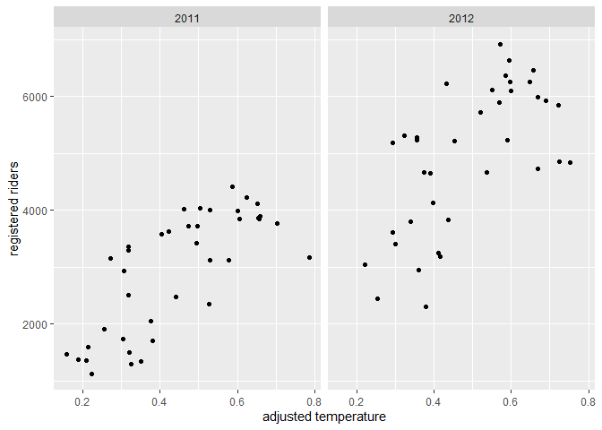

ST 558 Project 2
================
David Arthur
6/28/2021

Read in data, filter by day of week

``` r
day <- readr::read_csv("day.csv", col_types = cols(
  season = col_factor(),
  yr = col_factor(),
  mnth = col_factor(),
  holiday = col_factor(),
  weekday = col_factor(),
  workingday = col_factor(),
  weathersit = col_factor()))

day <- day %>% mutate(season = fct_recode(season, winter = "1", spring = "2", summer = "3", fall = "4")) %>%
  mutate(yr = fct_recode(yr, "2011" = "0", "2012" = "1")) %>%
  mutate(weekday = fct_recode(weekday, Sunday = "0", Monday = "1", Tuesday = "2", Wednesday = "3", Thursday = "4", Friday = "5", Saturday = "6")) %>%
  mutate(weathersit = fct_recode(weathersit, clear = "1", mist = "2", lightRainOrSnow = "3", heavyRainOrSnow = "4")) %>%
  filter(weekday == params$dayOfWeek)
```

    ## Warning: Unknown levels in `f`: 4

``` r
dayNF <- readr::read_csv("day.csv")
```

Partition data into training and test sets

``` r
set.seed(21)
trainIndex <- createDataPartition(day$cnt, p = 0.7, list = FALSE)
dayTrain <- day[trainIndex, ]
dayTest <- day[-trainIndex, ]
```

Exploratory data analysis and summary (David)

``` r
GGally::ggpairs(dayTrain %>% select(3:9, atemp, windspeed, casual, registered, cnt))
```

<!-- -->

``` r
# dayNFCor <- cor(as.matrix(dayNF %>% select(3:9, atemp, windspeed, casual, registered,cnt)))
# corrplot(dayNFCor, type = "upper", tl.pos = "lt")
# corrplot(dayNFCor, type = "lower", method = "number", add = TRUE, diag = FALSE, tl.pos = "n")
```

Exploration of individual predictors

``` r
g <- ggplot(data = dayTrain)
g + geom_point(aes(x = dteday, y = registered))
```

<!-- -->

``` r
meanByMonth <- dayTrain %>% group_by(mnth) %>%
  summarize(meanCas = mean(casual), meanReg = mean(registered), meanTotal = mean(cnt))
g2 <- ggplot(meanByMonth, aes(x = mnth))
g2 + geom_bar(aes(y = meanCas), stat = "identity")
```

<!-- -->

``` r
g2 + geom_bar(aes(y = meanReg), stat = "identity")
```

<!-- -->

``` r
g2 + geom_bar(aes(y = meanTotal), stat = "identity")
```

<!-- -->

``` r
meanByYear <- dayTrain %>% group_by(yr) %>%
  summarize(meanCas = mean(casual), meanReg = mean(registered), meanTotal = mean(cnt))
g2 <- ggplot(meanByYear, aes(x = yr))
g2 + geom_bar(aes(y = meanCas), stat = "identity")
```

<!-- -->

``` r
g2 + geom_bar(aes(y = meanReg), stat = "identity")
```

<!-- -->

``` r
g2 + geom_bar(aes(y = meanTotal), stat = "identity")
```

<!-- -->

``` r
meanByWeather <- dayTrain %>% group_by(weathersit) %>%
  summarize(meanCas = mean(casual), meanReg = mean(registered), meanTotal = mean(cnt))
kable(meanByWeather, digits = 1, col.names = c("Weather", "Mean Casual Riders", "Mean Registered Riders", "Mean Total Riders"), caption = "Average # of riders by weather category")
```

| Weather | Mean Casual Riders | Mean Registered Riders | Mean Total Riders |
|:--------|-------------------:|-----------------------:|------------------:|
| mist    |              611.3 |                 3566.7 |            4178.0 |
| clear   |              870.9 |                 4118.7 |            4989.6 |

Average \# of riders by weather category

``` r
meanByHoliday <- dayTrain %>% filter(workingday == 0) %>%
  group_by(holiday) %>%
  summarize(meanCas = mean(casual), meanReg = mean(registered), meanTotal = mean(cnt))
kable(meanByHoliday, digits = 1, col.names = c("Holiday (0 = no, 1 = yes)", "Mean Casual Riders", "Mean Registered Riders", "Mean Total Riders"), caption = "Average # of riders on holidays vs. non-holiday non-workdays")
```

| Holiday (0 = no, 1 = yes) | Mean Casual Riders | Mean Registered Riders | Mean Total Riders |
|:--------------------------|-------------------:|-----------------------:|------------------:|
| 1                         |                541 |                   2706 |              3247 |

Average \# of riders on holidays vs. non-holiday non-workdays

Exploratory data analysis and summary (James)

``` r
ggpairs(dayTrain %>% select(-instant,-dteday, -season, -yr, -cnt), 
        ggplot2::aes(colour=workingday))
```

    ## Error in cor.test.default(x, y, method = method, use = use): not enough finite observations

<!-- --> Notes from
looking at ggpairs plots: Working days are the highest usage for
registered riders, but non-working days are the highest usage for casual
riders. Registered riders are the primary volume, so we definitely care
most about them but worth keeping in mind. There are two types of
non-working days: weekends and holidays, and there is a difference in
volume for each of those rider types depending on whether it is a
holiday or a weekend.

Air temperature and temperature are nearly 100% correlated. We should
probably figure out which one of them we want to use. Speaking of
correlated, can we drop the date and only use months? Unfortunately, it
looks like we need to keep the year field as well, since year 2 had
better performance than year 1. Do we want to keep season and month? I
lean towards keeping year and month, but dropping season and date. Let
me know what you think.

Looking at the scatter of casual vs registered, broken out by working
day, it’s crazy how separate the linear relationships look:

``` r
g <- ggplot(data=dayTrain, aes(x=registered, y=casual))
g + geom_point(aes(color=workingday))
```

<!-- --> On working
days, registered bikes are the main rider group. On non-working days, it
switches to casual. Looking at day of the week, we may be able to
exclude it since it will be covered by the working day flag and holiday
flag, but I guess we can check the models to see if it provides anything
extra.

``` r
g <- ggplot(data=dayTrain %>% 
                 select(weekday, casual, registered) %>%
                 pivot_longer(cols=c(casual, registered),
                              names_to = 'metrics',
                              values_to = 'riders') %>%
                 group_by(weekday, metrics) %>%
                 summarise(avg_riders = mean(riders)), 
            aes(x=weekday, y=avg_riders, fill=metrics))
```

    ## `summarise()` has grouped output by 'weekday'. You can override using the `.groups` argument.

``` r
g + geom_bar(stat='identity', position='dodge')
```

<!-- --> Looking at
this graph, weekday definitely seems relatively stable across the days
(working days for registered and non-working days for casual are the
jumps), but there may be enough variation to include it.

\#\#I like this graph. I thought about doing one like it, but wasn’t
sure how to code it. pivot\_longer hadn’t occurred to me.

\#\#About which variables to include, I agree with your comments. My
understanding is that each of us comes up with our own models (I do a
linear regression and a random forest, you do a linear regression and a
boosted tree), so you and I don’t need to include the same predictors.
We do need to agree ahead of time on which response we’re going to model
(casual, registered, or cnt), so that the results of the 4 models can be
compared to each other. I’m fine with any of the 3. Do you have a
preference?

Yeah, no preference here either. I guess we could just say registered
since it’s the highest volume customer, and if we were doing this
analysis for that company then registered users would be the most
important group.

\#\#Sounds good, we’ll go with registered.

``` r
library(leaps)

data <- dayTrain %>% 
               filter(weekday == params$dayOfWeek) %>% drop_na() %>%
               select(-instant,-dteday, -season, 
                    -weekday, -atemp, -casual, -cnt)

#this function converts new data to a model matrix
#so that a prediction can be run via matrix multiplication
#on a best subsets model
predict.regsubsets = function(object,newdata,id,...){
      form = as.formula(object$call[[2]]) 
      mat = model.matrix(form,newdata)    
      coefi = coef(object,id=id)          
      xvars = names(coefi)                
      mat[,xvars]%*%coefi               
}


#let's do cross validation with folds
k <- 4
set.seed(21)
folds <- sample(1:k, nrow(data), replace=T)

cv_errors = matrix(NA, k, 16, dimnames = list(NULL, paste(1:16)))

for (j in 1:k) {
  best <- regsubsets(registered ~ ., 
                     data=data[folds!=j,], nvmax=20)
  
  for (i in 1:16) {
    pred <- predict(best, data[folds==j,], id=i)
    
    
    cv_errors[j, i] <- mean((temp_data$registered[folds==j]-pred)^2)
  }
}
```

    ## Warning in leaps.setup(x, y, wt = wt, nbest = nbest, nvmax = nvmax, force.in = force.in, : 2 linear
    ## dependencies found

    ## Reordering variables and trying again:

    ## Error in eval(x): object 'newX' not found

``` r
# Take the mean of over all folds for each model size
mean_cv_errors = apply(cv_errors, 2, mean)

# Find the model size with the smallest cross-validation error
min = which.min(mean_cv_errors)

#the model w/ 14 variables was best when using 4 fold cv.
#i did 4 fold because there are only about 80 rows of data per weekday

best_full <- regsubsets(registered ~ ., 
                     data=temp_data[folds!=j,], nvmax=20)
```

    ## Error in is.data.frame(data): object 'temp_data' not found

``` r
fit <- lm(registered ~ temp*hum,
        data=dayTrain %>% 
             filter(weekday == params$dayOfWeek) %>% drop_na() %>%
             select(-instant,-dteday, -season, 
                    -weekday, -atemp, -casual, -cnt))
```

``` r
names(dayTrain)
```

    ##  [1] "instant"    "dteday"     "season"     "yr"         "mnth"       "holiday"    "weekday"   
    ##  [8] "workingday" "weathersit" "temp"       "atemp"      "hum"        "windspeed"  "casual"    
    ## [15] "registered" "cnt"

``` r
# GGally::ggpairs(dayTrain %>% select(3:9, atemp, windspeed, casual, registered, cnt))
dayNFCor <- cor(as.matrix(dayNF %>% select(3:13, registered)))
corrplot(dayNFCor, type = "upper", tl.pos = "lt")
corrplot(dayNFCor, type = "lower", method = "number", add = TRUE, diag = FALSE, tl.pos = "n")
```

<!-- -->

``` r
mlrFull <- lm(registered ~ dteday + season +  yr + mnth + holiday + workingday + weathersit + temp + atemp + hum + windspeed, dayTrain)
summary(mlrFull)
```

    ## 
    ## Call:
    ## lm(formula = registered ~ dteday + season + yr + mnth + holiday + 
    ##     workingday + weathersit + temp + atemp + hum + windspeed, 
    ##     data = dayTrain)
    ## 
    ## Residuals:
    ##      Min       1Q   Median       3Q      Max 
    ## -2414.85  -297.16    19.39   324.94   956.19 
    ## 
    ## Coefficients: (1 not defined because of singularities)
    ##                   Estimate Std. Error t value Pr(>|t|)   
    ## (Intercept)      85316.339 135755.718   0.628  0.53241   
    ## dteday              -5.596      9.061  -0.618  0.53953   
    ## seasonspring      1274.306    444.936   2.864  0.00598 **
    ## seasonsummer       370.934    622.738   0.596  0.55394   
    ## seasonfall        1153.720    512.253   2.252  0.02847 * 
    ## yr2012            3914.311   3328.081   1.176  0.24479   
    ## mnth2              218.086    490.061   0.445  0.65812   
    ## mnth3              477.742    652.265   0.732  0.46713   
    ## mnth4              -31.565    973.809  -0.032  0.97426   
    ## mnth5             1084.617   1163.790   0.932  0.35558   
    ## mnth6             1351.343   1476.763   0.915  0.36430   
    ## mnth7             1912.904   1885.226   1.015  0.31487   
    ## mnth8             2508.974   2109.381   1.189  0.23957   
    ## mnth9             3328.527   2304.637   1.444  0.15455   
    ## mnth10            2156.625   2579.860   0.836  0.40694   
    ## mnth11            1481.648   2834.976   0.523  0.60341   
    ## mnth12            2207.987   3084.198   0.716  0.47719   
    ## holiday1            41.407    498.913   0.083  0.93417   
    ## workingday1             NA         NA      NA       NA   
    ## weathersitclear    256.607    203.308   1.262  0.21242   
    ## temp             -7435.732   7136.834  -1.042  0.30220   
    ## atemp            10353.747   7660.143   1.352  0.18223   
    ## hum              -1623.454    832.150  -1.951  0.05636 . 
    ## windspeed           58.024   1247.898   0.046  0.96309   
    ## ---
    ## Signif. codes:  0 '***' 0.001 '**' 0.01 '*' 0.05 '.' 0.1 ' ' 1
    ## 
    ## Residual standard error: 632.2 on 53 degrees of freedom
    ## Multiple R-squared:   0.88,  Adjusted R-squared:  0.8302 
    ## F-statistic: 17.67 on 22 and 53 DF,  p-value: < 2.2e-16

``` r
AIC(mlrFull)
```

    ## [1] 1216.563

``` r
x <- model.matrix(mlrFull)[, -1]
e <- eigen(t(x) %*% x)
e$val
```

    ##  [1] 1.788273e+10 2.711980e+01 2.500284e+01 2.212671e+01 1.725023e+01 8.915552e+00 7.320663e+00
    ##  [8] 7.133340e+00 6.831232e+00 6.088984e+00 5.701883e+00 5.389033e+00 4.568619e+00 3.056121e+00
    ## [15] 1.983306e+00 9.521889e-01 7.741889e-01 6.936732e-01 5.103612e-01 2.369972e-01 1.026718e-01
    ## [22] 3.665947e-03 1.083154e-05

``` r
sqrt(e$val[1]/min(e$val))
```

    ## [1] 40632348

``` r
vif(x)
```

    ##          dteday    seasonspring    seasonsummer      seasonfall          yr2012           mnth2 
    ##      700.708937        7.299596       13.826910        8.664732      526.186692        2.277081 
    ##           mnth3           mnth4           mnth5           mnth6           mnth7           mnth8 
    ##        7.619613       13.112415       18.727683       30.154834       41.537559       70.752679 
    ##           mnth9          mnth10          mnth11          mnth12        holiday1     workingday1 
    ##       84.457432       92.029570      143.940701      131.528416             Inf             Inf 
    ## weathersitclear            temp           atemp             hum       windspeed 
    ##        1.877898      311.216331      274.911988        2.087121        1.785797

``` r
#remove dteday (high collinearity, low p-value)
mlr2 <- update(mlrFull, . ~ . - dteday)
summary(mlr2)
```

    ## 
    ## Call:
    ## lm(formula = registered ~ season + yr + mnth + holiday + workingday + 
    ##     weathersit + temp + atemp + hum + windspeed, data = dayTrain)
    ## 
    ## Residuals:
    ##      Min       1Q   Median       3Q      Max 
    ## -2449.18  -258.24    81.19   289.22  1020.13 
    ## 
    ## Coefficients: (1 not defined because of singularities)
    ##                 Estimate Std. Error t value Pr(>|t|)    
    ## (Intercept)      1483.45     715.01   2.075  0.04279 *  
    ## seasonspring     1236.79     438.24   2.822  0.00666 ** 
    ## seasonsummer      382.67     618.87   0.618  0.53896    
    ## seasonfall       1174.64     508.19   2.311  0.02466 *  
    ## yr2012           1861.70     166.23  11.199 1.07e-15 ***
    ## mnth2              50.01     405.19   0.123  0.90223    
    ## mnth3             168.63     415.79   0.406  0.68667    
    ## mnth4            -500.10     606.95  -0.824  0.41360    
    ## mnth5             492.57     655.95   0.751  0.45596    
    ## mnth6             570.13     757.52   0.753  0.45494    
    ## mnth7             914.78     964.82   0.948  0.34728    
    ## mnth8            1328.26     885.87   1.499  0.13960    
    ## mnth9            1987.90     769.12   2.585  0.01248 *  
    ## mnth10            619.12     672.04   0.921  0.36102    
    ## mnth11           -227.76     608.55  -0.374  0.70967    
    ## mnth12            319.13     393.46   0.811  0.42088    
    ## holiday1           63.11     494.81   0.128  0.89898    
    ## workingday1           NA         NA      NA       NA    
    ## weathersitclear   249.15     201.78   1.235  0.22227    
    ## temp            -7283.51    7091.60  -1.027  0.30897    
    ## atemp           10166.67    7610.18   1.336  0.18717    
    ## hum             -1688.45     820.72  -2.057  0.04450 *  
    ## windspeed          48.28    1240.63   0.039  0.96910    
    ## ---
    ## Signif. codes:  0 '***' 0.001 '**' 0.01 '*' 0.05 '.' 0.1 ' ' 1
    ## 
    ## Residual standard error: 628.6 on 54 degrees of freedom
    ## Multiple R-squared:  0.8791, Adjusted R-squared:  0.8321 
    ## F-statistic:  18.7 on 21 and 54 DF,  p-value: < 2.2e-16

``` r
AIC(mlr2)
```

    ## [1] 1215.108

``` r
x <- model.matrix(mlr2)[, -1]
e <- eigen(t(x) %*% x)
e$val
```

    ##  [1] 2.095403e+02 2.703182e+01 2.456149e+01 2.164554e+01 1.354799e+01 8.643755e+00 7.160967e+00
    ##  [8] 6.983248e+00 6.599658e+00 6.069522e+00 5.696610e+00 5.283703e+00 4.560517e+00 2.692309e+00
    ## [15] 1.580182e+00 7.770354e-01 6.947335e-01 6.386356e-01 4.262403e-01 1.737797e-01 1.023952e-01
    ## [22] 3.662731e-03

``` r
sqrt(e$val[1]/min(e$val))
```

    ## [1] 239.1836

``` r
vif(x)
```

    ##    seasonspring    seasonsummer      seasonfall          yr2012           mnth2           mnth3 
    ##        7.163515       13.814037        8.626828        1.327988        1.574712        3.132177 
    ##           mnth4           mnth5           mnth6           mnth7           mnth8           mnth9 
    ##        5.152887        6.018476        8.026533       11.005499       12.623457        9.515328 
    ##          mnth10          mnth11          mnth12        holiday1     workingday1 weathersitclear 
    ##        6.317320        6.709272        2.165425             Inf             Inf        1.871274 
    ##            temp           atemp             hum       windspeed 
    ##      310.845044      274.482038        2.053728        1.785512

``` r
#reduced AIC and condition number

#remove temp (high collinearity, low p-value)
mlr3 <- update(mlr2, . ~ . - temp)
summary(mlr3)
```

    ## 
    ## Call:
    ## lm(formula = registered ~ season + yr + mnth + holiday + workingday + 
    ##     weathersit + atemp + hum + windspeed, data = dayTrain)
    ## 
    ## Residuals:
    ##     Min      1Q  Median      3Q     Max 
    ## -2401.6  -259.2    78.7   288.4  1080.5 
    ## 
    ## Coefficients: (1 not defined because of singularities)
    ##                 Estimate Std. Error t value Pr(>|t|)    
    ## (Intercept)      1744.47     668.65   2.609  0.01167 *  
    ## seasonspring     1180.42     435.00   2.714  0.00887 ** 
    ## seasonsummer      352.11     618.46   0.569  0.57145    
    ## seasonfall       1244.13     503.92   2.469  0.01669 *  
    ## yr2012           1854.80     166.18  11.161 9.42e-16 ***
    ## mnth2              87.52     403.74   0.217  0.82920    
    ## mnth3             155.26     415.80   0.373  0.71029    
    ## mnth4            -471.71     606.63  -0.778  0.44014    
    ## mnth5             486.06     656.25   0.741  0.46205    
    ## mnth6             372.80     733.12   0.509  0.61313    
    ## mnth7             602.11     915.99   0.657  0.51370    
    ## mnth8            1080.40     852.79   1.267  0.21053    
    ## mnth9            1801.94     747.88   2.409  0.01935 *  
    ## mnth10            490.23     660.55   0.742  0.46115    
    ## mnth11           -297.75     605.02  -0.492  0.62458    
    ## mnth12            300.41     393.23   0.764  0.44817    
    ## holiday1           14.92     492.83   0.030  0.97595    
    ## workingday1           NA         NA      NA       NA    
    ## weathersitclear   274.96     200.31   1.373  0.17542    
    ## atemp            2468.39    1317.08   1.874  0.06623 .  
    ## hum             -1734.04     819.93  -2.115  0.03899 *  
    ## windspeed        -410.60    1157.96  -0.355  0.72426    
    ## ---
    ## Signif. codes:  0 '***' 0.001 '**' 0.01 '*' 0.05 '.' 0.1 ' ' 1
    ## 
    ## Residual standard error: 628.9 on 55 degrees of freedom
    ## Multiple R-squared:  0.8768, Adjusted R-squared:  0.832 
    ## F-statistic: 19.57 on 20 and 55 DF,  p-value: < 2.2e-16

``` r
AIC(mlr3)
```

    ## [1] 1214.578

``` r
x <- model.matrix(mlr3)[, -1]
e <- eigen(t(x) %*% x)
e$val
```

    ##  [1] 190.9656214  26.7024104  24.3134236  21.4668575  13.4913495   8.4627134   7.1407144   6.9438235
    ##  [9]   6.4912662   6.0672282   5.6956255   5.2716082   4.5016546   2.5670787   1.5801313   0.7699400
    ## [17]   0.6443719   0.6288918   0.3076877   0.1737761   0.0926590

``` r
sqrt(e$val[1]/min(e$val))
```

    ## [1] 45.39769

``` r
vif(x)
```

    ##    seasonspring    seasonsummer      seasonfall          yr2012           mnth2           mnth3 
    ##        7.051155       13.782102        8.473933        1.325823        1.561921        3.129106 
    ##           mnth4           mnth5           mnth6           mnth7           mnth8           mnth9 
    ##        5.142205        6.017914        7.510186        9.909798       11.686629        8.987984 
    ##          mnth10          mnth11          mnth12        holiday1     workingday1 weathersitclear 
    ##        6.097040        6.625142        2.160778             Inf             Inf        1.842245 
    ##           atemp             hum       windspeed 
    ##        8.213254        2.047721        1.553941

``` r
#reduced AIC and condition number

#remove workingday (high collinearity, low p-value)
mlr4 <- update(mlr3, . ~ . - workingday)
summary(mlr4)
```

    ## 
    ## Call:
    ## lm(formula = registered ~ season + yr + mnth + holiday + weathersit + 
    ##     atemp + hum + windspeed, data = dayTrain)
    ## 
    ## Residuals:
    ##     Min      1Q  Median      3Q     Max 
    ## -2401.6  -259.2    78.7   288.4  1080.5 
    ## 
    ## Coefficients:
    ##                 Estimate Std. Error t value Pr(>|t|)    
    ## (Intercept)      1744.47     668.65   2.609  0.01167 *  
    ## seasonspring     1180.42     435.00   2.714  0.00887 ** 
    ## seasonsummer      352.11     618.46   0.569  0.57145    
    ## seasonfall       1244.13     503.92   2.469  0.01669 *  
    ## yr2012           1854.80     166.18  11.161 9.42e-16 ***
    ## mnth2              87.52     403.74   0.217  0.82920    
    ## mnth3             155.26     415.80   0.373  0.71029    
    ## mnth4            -471.71     606.63  -0.778  0.44014    
    ## mnth5             486.06     656.25   0.741  0.46205    
    ## mnth6             372.80     733.12   0.509  0.61313    
    ## mnth7             602.11     915.99   0.657  0.51370    
    ## mnth8            1080.40     852.79   1.267  0.21053    
    ## mnth9            1801.94     747.88   2.409  0.01935 *  
    ## mnth10            490.23     660.55   0.742  0.46115    
    ## mnth11           -297.75     605.02  -0.492  0.62458    
    ## mnth12            300.41     393.23   0.764  0.44817    
    ## holiday1           14.92     492.83   0.030  0.97595    
    ## weathersitclear   274.96     200.31   1.373  0.17542    
    ## atemp            2468.39    1317.08   1.874  0.06623 .  
    ## hum             -1734.04     819.93  -2.115  0.03899 *  
    ## windspeed        -410.60    1157.96  -0.355  0.72426    
    ## ---
    ## Signif. codes:  0 '***' 0.001 '**' 0.01 '*' 0.05 '.' 0.1 ' ' 1
    ## 
    ## Residual standard error: 628.9 on 55 degrees of freedom
    ## Multiple R-squared:  0.8768, Adjusted R-squared:  0.832 
    ## F-statistic: 19.57 on 20 and 55 DF,  p-value: < 2.2e-16

``` r
AIC(mlr4)
```

    ## [1] 1214.578

``` r
x <- model.matrix(mlr4)[, -1]
e <- eigen(t(x) %*% x)
e$val
```

    ##  [1] 122.10588129  26.58228312  24.31182859  21.26694543  11.08911692   7.82895322   7.11903772
    ##  [8]   6.94088692   6.47417607   6.04516237   5.65702483   4.91519648   4.49640605   1.64939879
    ## [15]   1.49054527   0.76907730   0.64104440   0.53636825   0.26626518   0.09323482

``` r
sqrt(e$val[1]/min(e$val))
```

    ## [1] 36.18922

``` r
vif(x)
```

    ##    seasonspring    seasonsummer      seasonfall          yr2012           mnth2           mnth3 
    ##        7.051155       13.782102        8.473933        1.325823        1.561921        3.129106 
    ##           mnth4           mnth5           mnth6           mnth7           mnth8           mnth9 
    ##        5.142205        6.017914        7.510186        9.909798       11.686629        8.987984 
    ##          mnth10          mnth11          mnth12        holiday1 weathersitclear           atemp 
    ##        6.097040        6.625142        2.160778        1.195952        1.842245        8.213254 
    ##             hum       windspeed 
    ##        2.047721        1.553941

``` r
#reduced AIC and condition number

#remove season (high collinearity, low p-value)
mlr5 <- update(mlr4, . ~ . - season)
summary(mlr5)
```

    ## 
    ## Call:
    ## lm(formula = registered ~ yr + mnth + holiday + weathersit + 
    ##     atemp + hum + windspeed, data = dayTrain)
    ## 
    ## Residuals:
    ##     Min      1Q  Median      3Q     Max 
    ## -2443.2  -296.0    40.6   327.8  1515.7 
    ## 
    ## Coefficients:
    ##                 Estimate Std. Error t value Pr(>|t|)    
    ## (Intercept)      2031.96     723.29   2.809 0.006756 ** 
    ## yr2012           1882.37     180.41  10.434 6.29e-15 ***
    ## mnth2             106.35     440.46   0.241 0.810064    
    ## mnth3             638.37     413.07   1.545 0.127683    
    ## mnth4             785.90     445.62   1.764 0.083061 .  
    ## mnth5            1707.63     531.65   3.212 0.002152 ** 
    ## mnth6            1478.07     660.46   2.238 0.029079 *  
    ## mnth7            1002.57     785.72   1.276 0.207045    
    ## mnth8            1502.70     689.12   2.181 0.033283 *  
    ## mnth9            2326.43     573.98   4.053 0.000152 ***
    ## mnth10           1771.59     477.43   3.711 0.000465 ***
    ## mnth11            932.59     389.73   2.393 0.019972 *  
    ## mnth12            709.43     393.69   1.802 0.076740 .  
    ## holiday1           65.73     537.49   0.122 0.903089    
    ## weathersitclear   308.37     216.46   1.425 0.159628    
    ## atemp            2166.13    1430.97   1.514 0.135519    
    ## hum             -1808.99     892.67  -2.026 0.047321 *  
    ## windspeed       -1328.78    1226.63  -1.083 0.283169    
    ## ---
    ## Signif. codes:  0 '***' 0.001 '**' 0.01 '*' 0.05 '.' 0.1 ' ' 1
    ## 
    ## Residual standard error: 686.2 on 58 degrees of freedom
    ## Multiple R-squared:  0.8453, Adjusted R-squared:  0.7999 
    ## F-statistic: 18.64 on 17 and 58 DF,  p-value: < 2.2e-16

``` r
AIC(mlr5)
```

    ## [1] 1225.873

``` r
#don't remove season because AIC increased

#remove month (high collinearity, low p-value)
mlr6 <- update(mlr4, . ~ . - mnth)
summary(mlr6)
```

    ## 
    ## Call:
    ## lm(formula = registered ~ season + yr + holiday + weathersit + 
    ##     atemp + hum + windspeed, data = dayTrain)
    ## 
    ## Residuals:
    ##     Min      1Q  Median      3Q     Max 
    ## -2849.2  -272.5   146.2   358.5  1394.4 
    ## 
    ## Coefficients:
    ##                 Estimate Std. Error t value Pr(>|t|)    
    ## (Intercept)       1174.2      687.5   1.708 0.092381 .  
    ## seasonspring      1084.0      282.9   3.832 0.000286 ***
    ## seasonsummer      1079.5      383.7   2.814 0.006450 ** 
    ## seasonfall        1258.5      255.9   4.918  6.1e-06 ***
    ## yr2012            1865.0      171.8  10.858  2.5e-16 ***
    ## holiday1          -396.8      532.2  -0.746 0.458543    
    ## weathersitclear    220.9      202.7   1.089 0.279920    
    ## atemp             3300.6      906.1   3.643 0.000532 ***
    ## hum               -874.4      776.9  -1.125 0.264490    
    ## windspeed         -778.3     1202.4  -0.647 0.519689    
    ## ---
    ## Signif. codes:  0 '***' 0.001 '**' 0.01 '*' 0.05 '.' 0.1 ' ' 1
    ## 
    ## Residual standard error: 701.9 on 66 degrees of freedom
    ## Multiple R-squared:  0.8158, Adjusted R-squared:  0.7907 
    ## F-statistic: 32.48 on 9 and 66 DF,  p-value: < 2.2e-16

``` r
AIC(mlr6)
```

    ## [1] 1223.125

``` r
x <- model.matrix(mlr6)[, -1]
e <- eigen(t(x) %*% x)
e$val
```

    ## [1] 116.2113121  22.6600746  18.5448330  18.0996119   9.4708763   3.4078463   1.8553686   0.6064686
    ## [9]   0.4224417

``` r
sqrt(e$val[1]/min(e$val))
```

    ## [1] 16.58597

``` r
vif(x)
```

    ##    seasonspring    seasonsummer      seasonfall          yr2012        holiday1 weathersitclear 
    ##        2.393989        4.258491        1.754440        1.137055        1.119679        1.514928 
    ##           atemp             hum       windspeed 
    ##        3.121058        1.476022        1.345113

``` r
#reduced AIC and condition number

#remove year from full model instead of dteday (high collinearity)
mlr7 <- update(mlrFull, . ~ . - yr - workingday - temp, dayTrain)
summary(mlr7)
```

    ## 
    ## Call:
    ## lm(formula = registered ~ dteday + season + mnth + holiday + 
    ##     weathersit + atemp + hum + windspeed, data = dayTrain)
    ## 
    ## Residuals:
    ##      Min       1Q   Median       3Q      Max 
    ## -2429.51  -268.06    68.62   298.61  1128.72 
    ## 
    ## Coefficients:
    ##                   Estimate Std. Error t value Pr(>|t|)    
    ## (Intercept)     -7.362e+04  7.003e+03 -10.513 9.02e-15 ***
    ## dteday           5.031e+00  4.565e-01  11.021 1.53e-15 ***
    ## seasonspring     1.148e+03  4.388e+02   2.615  0.01148 *  
    ## seasonsummer     3.646e+02  6.238e+02   0.584  0.56130    
    ## seasonfall       1.264e+03  5.082e+02   2.488  0.01590 *  
    ## mnth2           -6.542e+01  4.068e+02  -0.161  0.87283    
    ## mnth3           -1.251e+02  4.174e+02  -0.300  0.76557    
    ## mnth4           -8.971e+02  6.091e+02  -1.473  0.14651    
    ## mnth5           -5.144e+01  6.569e+02  -0.078  0.93786    
    ## mnth6           -3.353e+02  7.279e+02  -0.461  0.64689    
    ## mnth7           -3.046e+02  9.039e+02  -0.337  0.73742    
    ## mnth8            1.205e+01  8.429e+02   0.014  0.98865    
    ## mnth9            5.920e+02  7.414e+02   0.798  0.42807    
    ## mnth10          -8.982e+02  6.496e+02  -1.383  0.17238    
    ## mnth11          -1.837e+03  6.120e+02  -3.001  0.00404 ** 
    ## mnth12          -1.398e+03  4.224e+02  -3.309  0.00166 ** 
    ## holiday1         3.171e+01  4.974e+02   0.064  0.94939    
    ## weathersitclear  2.647e+02  2.019e+02   1.311  0.19520    
    ## atemp            2.474e+03  1.329e+03   1.861  0.06802 .  
    ## hum             -1.806e+03  8.254e+02  -2.189  0.03289 *  
    ## windspeed       -4.157e+02  1.168e+03  -0.356  0.72329    
    ## ---
    ## Signif. codes:  0 '***' 0.001 '**' 0.01 '*' 0.05 '.' 0.1 ' ' 1
    ## 
    ## Residual standard error: 634.4 on 55 degrees of freedom
    ## Multiple R-squared:  0.8746, Adjusted R-squared:  0.829 
    ## F-statistic: 19.18 on 20 and 55 DF,  p-value: < 2.2e-16

``` r
AIC(mlr7)
```

    ## [1] 1215.905

``` r
x <- model.matrix(mlr7)[, -1]
e <- eigen(t(x) %*% x)
e$val
```

    ##  [1] 1.788273e+10 2.603128e+01 2.441270e+01 2.064426e+01 8.545345e+00 7.173967e+00 6.956637e+00
    ##  [8] 6.700762e+00 6.091200e+00 5.771005e+00 5.373249e+00 4.529969e+00 1.905628e+00 1.652896e+00
    ## [15] 9.246619e-01 7.695110e-01 6.729574e-01 3.882527e-01 2.380374e-01 1.033727e-01

``` r
sqrt(e$val[1]/min(e$val))
```

    ## [1] 415924

``` r
vif(x)
```

    ##          dteday    seasonspring    seasonsummer      seasonfall           mnth2           mnth3 
    ##        1.765812        7.050824       13.780354        8.468783        1.558562        3.098346 
    ##           mnth4           mnth5           mnth6           mnth7           mnth8           mnth9 
    ##        5.095061        5.925185        7.275955        9.482669       11.219478        8.681245 
    ##          mnth10          mnth11          mnth12        holiday1 weathersitclear           atemp 
    ##        5.795252        6.661445        2.450531        1.197059        1.838796        8.220396 
    ##             hum       windspeed 
    ##        2.039178        1.553917

``` r
#higher AIC than mlr4

#compare to model chosen by leaps::step() function
mlrStep <- step(mlrFull)
```

    ## Start:  AIC=998.88
    ## registered ~ dteday + season + yr + mnth + holiday + workingday + 
    ##     weathersit + temp + atemp + hum + windspeed
    ## 
    ## 
    ## Step:  AIC=998.88
    ## registered ~ dteday + season + yr + mnth + holiday + weathersit + 
    ##     temp + atemp + hum + windspeed
    ## 
    ##              Df Sum of Sq      RSS     AIC
    ## - windspeed   1       864 21183326  996.89
    ## - holiday     1      2753 21185215  996.89
    ## - dteday      1    152414 21334877  997.43
    ## - temp        1    433847 21616310  998.43
    ## - yr          1    552871 21735333  998.84
    ## <none>                    21182462  998.88
    ## - weathersit  1    636692 21819154  999.13
    ## - atemp       1    730167 21912629  999.46
    ## - hum         1   1521168 22703631 1002.15
    ## - mnth       11  10672881 31855343 1007.89
    ## - season      3   5604827 26787289 1010.73
    ## 
    ## Step:  AIC=996.89
    ## registered ~ dteday + season + yr + mnth + holiday + weathersit + 
    ##     temp + atemp + hum
    ## 
    ##              Df Sum of Sq      RSS     AIC
    ## - holiday     1      3065 21186392  994.90
    ## - dteday      1    152149 21335475  995.43
    ## - temp        1    482674 21666000  996.60
    ## - yr          1    552291 21735617  996.84
    ## <none>                    21183326  996.89
    ## - weathersit  1    652465 21835792  997.19
    ## - atemp       1    799405 21982731  997.70
    ## - hum         1   1820275 23003601 1001.15
    ## - mnth       11  10828066 32011392 1006.27
    ## - season      3   5795203 26978529 1009.27
    ## 
    ## Step:  AIC=994.9
    ## registered ~ dteday + season + yr + mnth + weathersit + temp + 
    ##     atemp + hum
    ## 
    ##              Df Sum of Sq      RSS     AIC
    ## - dteday      1    155924 21342316  993.46
    ## - temp        1    481076 21667468  994.60
    ## - yr          1    559635 21746027  994.88
    ## <none>                    21186392  994.90
    ## - weathersit  1    666236 21852628  995.25
    ## - atemp       1    799563 21985955  995.71
    ## - hum         1   1818838 23005230  999.16
    ## - mnth       11  11138377 32324769 1005.01
    ## - season      3   5801075 26987467 1007.29
    ## 
    ## Step:  AIC=993.46
    ## registered ~ season + yr + mnth + weathersit + temp + atemp + 
    ##     hum
    ## 
    ##              Df Sum of Sq      RSS     AIC
    ## - temp        1    459166 21801482  993.07
    ## <none>                    21342316  993.46
    ## - weathersit  1    634842 21977158  993.68
    ## - atemp       1    768633 22110949  994.14
    ## - hum         1   1995916 23338232  998.25
    ## - mnth       11  11486330 32828646 1004.18
    ## - season      3   5679133 27021449 1005.39
    ## - yr          1  50707366 72049682 1083.92
    ## 
    ## Step:  AIC=993.07
    ## registered ~ season + yr + mnth + weathersit + atemp + hum
    ## 
    ##              Df Sum of Sq      RSS     AIC
    ## <none>                    21801482  993.07
    ## - weathersit  1    911416 22712898  994.19
    ## - atemp       1   1340782 23142264  995.61
    ## - hum         1   1827312 23628794  997.19
    ## - mnth       11  11313505 33114987 1002.84
    ## - season      3   6061239 27862721 1005.72
    ## - yr          1  50793249 72594731 1082.49

``` r
names(mlrStep)
```

    ##  [1] "coefficients"  "residuals"     "effects"       "rank"          "fitted.values" "assign"       
    ##  [7] "qr"            "df.residual"   "contrasts"     "xlevels"       "call"          "terms"        
    ## [13] "model"         "anova"

``` r
mlrStep$call
```

    ## lm(formula = registered ~ season + yr + mnth + weathersit + atemp + 
    ##     hum, data = dayTrain)

``` r
mlr6$call
```

    ## lm(formula = registered ~ season + yr + holiday + weathersit + 
    ##     atemp + hum + windspeed, data = dayTrain)

``` r
AIC(mlr6, mlrStep)
```

    ##         df      AIC
    ## mlr6    11 1223.125
    ## mlrStep 20 1210.752

``` r
#my choice agrees with step() choice

#diagnostics plot
plot(mlr6$fitted, mlr6$residuals)
```

<!-- -->

``` r
#indication of mild nonconstant variance
MASS::boxcox(mlr6)
```

<!-- -->

``` r
#Box-Cox lambda close to 1, so no need for transformation of response

#look for nonlinearity with partial residuals plots
termplot(mlr6, partial.resid = TRUE)
```

<!-- --><!-- --><!-- --><!-- --><!-- --><!-- --><!-- -->

``` r
#atemp, hum, and windspeed look somewhat nonlinear, so try quadratic terms for them
mlr8 <- update(mlr6, . ~ . + I(atemp^2))
summary(mlr8)
```

    ## 
    ## Call:
    ## lm(formula = registered ~ season + yr + holiday + weathersit + 
    ##     atemp + hum + windspeed + I(atemp^2), data = dayTrain)
    ## 
    ## Residuals:
    ##     Min      1Q  Median      3Q     Max 
    ## -2937.2  -335.8   121.8   391.2  1105.2 
    ## 
    ## Coefficients:
    ##                 Estimate Std. Error t value Pr(>|t|)    
    ## (Intercept)       -323.3      838.0  -0.386 0.700879    
    ## seasonspring       902.6      276.1   3.269 0.001729 ** 
    ## seasonsummer      1233.3      368.4   3.347 0.001361 ** 
    ## seasonfall        1046.7      254.2   4.118 0.000110 ***
    ## yr2012            1804.4      164.5  10.966  < 2e-16 ***
    ## holiday1          -437.1      505.8  -0.864 0.390621    
    ## weathersitclear    248.2      192.8   1.287 0.202673    
    ## atemp            13522.2     3685.4   3.669 0.000493 ***
    ## hum              -1461.7      766.2  -1.908 0.060853 .  
    ## windspeed        -1351.7     1159.8  -1.166 0.248065    
    ## I(atemp^2)      -11306.6     3963.8  -2.852 0.005811 ** 
    ## ---
    ## Signif. codes:  0 '***' 0.001 '**' 0.01 '*' 0.05 '.' 0.1 ' ' 1
    ## 
    ## Residual standard error: 666.7 on 65 degrees of freedom
    ## Multiple R-squared:  0.8363, Adjusted R-squared:  0.8111 
    ## F-statistic: 33.21 on 10 and 65 DF,  p-value: < 2.2e-16

``` r
AIC(mlr8)
```

    ## [1] 1216.161

``` r
#improved AIC, so keep atemp^2 in model

mlr9 <- update(mlr8, . ~ . + I(hum^2))
summary(mlr9)
```

    ## 
    ## Call:
    ## lm(formula = registered ~ season + yr + holiday + weathersit + 
    ##     atemp + hum + windspeed + I(atemp^2) + I(hum^2), data = dayTrain)
    ## 
    ## Residuals:
    ##     Min      1Q  Median      3Q     Max 
    ## -2952.2  -258.2   100.9   385.8  1074.0 
    ## 
    ## Coefficients:
    ##                 Estimate Std. Error t value Pr(>|t|)    
    ## (Intercept)      -1561.5     1786.2  -0.874 0.385274    
    ## seasonspring       942.2      281.5   3.347 0.001371 ** 
    ## seasonsummer      1257.9      370.9   3.392 0.001195 ** 
    ## seasonfall        1039.7      255.1   4.076 0.000129 ***
    ## yr2012            1788.2      166.3  10.753 5.59e-16 ***
    ## holiday1          -454.3      507.7  -0.895 0.374238    
    ## weathersitclear    224.8      195.7   1.149 0.254835    
    ## atemp            13821.9     3715.9   3.720 0.000422 ***
    ## hum               2618.4     5250.2   0.499 0.619687    
    ## windspeed        -1270.7     1167.8  -1.088 0.280623    
    ## I(atemp^2)      -11643.6     3998.6  -2.912 0.004940 ** 
    ## I(hum^2)         -3394.3     4320.7  -0.786 0.435005    
    ## ---
    ## Signif. codes:  0 '***' 0.001 '**' 0.01 '*' 0.05 '.' 0.1 ' ' 1
    ## 
    ## Residual standard error: 668.7 on 64 degrees of freedom
    ## Multiple R-squared:  0.8379, Adjusted R-squared:   0.81 
    ## F-statistic: 30.07 on 11 and 64 DF,  p-value: < 2.2e-16

``` r
AIC(mlr9)
```

    ## [1] 1217.432

``` r
#improved AIC, so keep hum^2 in model

mlr10 <- update(mlr9, . ~ . + I(windspeed^2))
summary(mlr10)
```

    ## 
    ## Call:
    ## lm(formula = registered ~ season + yr + holiday + weathersit + 
    ##     atemp + hum + windspeed + I(atemp^2) + I(hum^2) + I(windspeed^2), 
    ##     data = dayTrain)
    ## 
    ## Residuals:
    ##     Min      1Q  Median      3Q     Max 
    ## -2912.8  -283.8   118.5   358.5  1106.8 
    ## 
    ## Coefficients:
    ##                 Estimate Std. Error t value Pr(>|t|)    
    ## (Intercept)      -1406.2     1795.2  -0.783 0.436379    
    ## seasonspring      1012.4      291.4   3.475 0.000931 ***
    ## seasonsummer      1291.3      372.9   3.463 0.000965 ***
    ## seasonfall        1066.0      256.8   4.151 0.000101 ***
    ## yr2012            1777.8      166.8  10.658 9.83e-16 ***
    ## holiday1          -459.3      508.2  -0.904 0.369543    
    ## weathersitclear    222.6      195.8   1.137 0.259909    
    ## atemp            13434.3     3741.5   3.591 0.000646 ***
    ## hum               3404.7     5320.0   0.640 0.524509    
    ## windspeed        -5196.1     4314.6  -1.204 0.232979    
    ## I(atemp^2)      -11226.8     4026.2  -2.788 0.006995 ** 
    ## I(hum^2)         -3991.8     4370.2  -0.913 0.364513    
    ## I(windspeed^2)    9383.7     9928.5   0.945 0.348204    
    ## ---
    ## Signif. codes:  0 '***' 0.001 '**' 0.01 '*' 0.05 '.' 0.1 ' ' 1
    ## 
    ## Residual standard error: 669.3 on 63 degrees of freedom
    ## Multiple R-squared:  0.8401, Adjusted R-squared:  0.8097 
    ## F-statistic: 27.59 on 12 and 63 DF,  p-value: < 2.2e-16

``` r
AIC(mlr10)
```

    ## [1] 1218.362

``` r
#slightly improved AIC, compare using cross validation

#interaction of weather vars w/ holiday seems possible, so try adding to model
mlr11 <- update(mlr9, . ~ . + weathersit:holiday)
summary(mlr11)
```

    ## 
    ## Call:
    ## lm(formula = registered ~ season + yr + holiday + weathersit + 
    ##     atemp + hum + windspeed + I(atemp^2) + I(hum^2) + holiday:weathersit, 
    ##     data = dayTrain)
    ## 
    ## Residuals:
    ##     Min      1Q  Median      3Q     Max 
    ## -2952.2  -258.2   100.9   385.8  1074.0 
    ## 
    ## Coefficients: (1 not defined because of singularities)
    ##                          Estimate Std. Error t value Pr(>|t|)    
    ## (Intercept)               -1561.5     1786.2  -0.874 0.385274    
    ## seasonspring                942.2      281.5   3.347 0.001371 ** 
    ## seasonsummer               1257.9      370.9   3.392 0.001195 ** 
    ## seasonfall                 1039.7      255.1   4.076 0.000129 ***
    ## yr2012                     1788.2      166.3  10.753 5.59e-16 ***
    ## holiday1                   -454.3      507.7  -0.895 0.374238    
    ## weathersitclear             224.8      195.7   1.149 0.254835    
    ## atemp                     13821.9     3715.9   3.720 0.000422 ***
    ## hum                        2618.4     5250.2   0.499 0.619687    
    ## windspeed                 -1270.7     1167.8  -1.088 0.280623    
    ## I(atemp^2)               -11643.6     3998.6  -2.912 0.004940 ** 
    ## I(hum^2)                  -3394.3     4320.7  -0.786 0.435005    
    ## holiday1:weathersitclear       NA         NA      NA       NA    
    ## ---
    ## Signif. codes:  0 '***' 0.001 '**' 0.01 '*' 0.05 '.' 0.1 ' ' 1
    ## 
    ## Residual standard error: 668.7 on 64 degrees of freedom
    ## Multiple R-squared:  0.8379, Adjusted R-squared:   0.81 
    ## F-statistic: 30.07 on 11 and 64 DF,  p-value: < 2.2e-16

``` r
AIC(mlr11)
```

    ## [1] 1217.432

``` r
#slightly worse AIC, compare using cross validation
mlr12 <- update(mlr9, . ~ . + atemp:holiday)
summary(mlr12)
```

    ## 
    ## Call:
    ## lm(formula = registered ~ season + yr + holiday + weathersit + 
    ##     atemp + hum + windspeed + I(atemp^2) + I(hum^2) + holiday:atemp, 
    ##     data = dayTrain)
    ## 
    ## Residuals:
    ##      Min       1Q   Median       3Q      Max 
    ## -2931.12  -238.51    99.39   377.57  1049.57 
    ## 
    ## Coefficients:
    ##                 Estimate Std. Error t value Pr(>|t|)    
    ## (Intercept)      -1898.5     1818.2  -1.044 0.300390    
    ## seasonspring       965.3      282.5   3.417 0.001114 ** 
    ## seasonsummer      1254.9      370.9   3.383 0.001235 ** 
    ## seasonfall         994.4      259.1   3.837 0.000291 ***
    ## yr2012            1788.6      166.3  10.754  6.8e-16 ***
    ## holiday1          2330.7     2845.4   0.819 0.415804    
    ## weathersitclear    230.6      195.8   1.178 0.243182    
    ## atemp            14148.8     3730.7   3.793 0.000337 ***
    ## hum               3526.0     5329.3   0.662 0.510626    
    ## windspeed        -1361.2     1171.4  -1.162 0.249626    
    ## I(atemp^2)      -12002.4     4015.2  -2.989 0.003985 ** 
    ## I(hum^2)         -4074.8     4374.8  -0.931 0.355197    
    ## holiday1:atemp   -7412.0     7451.0  -0.995 0.323657    
    ## ---
    ## Signif. codes:  0 '***' 0.001 '**' 0.01 '*' 0.05 '.' 0.1 ' ' 1
    ## 
    ## Residual standard error: 668.8 on 63 degrees of freedom
    ## Multiple R-squared:  0.8404, Adjusted R-squared:   0.81 
    ## F-statistic: 27.64 on 12 and 63 DF,  p-value: < 2.2e-16

``` r
AIC(mlr12)
```

    ## [1] 1218.248

``` r
#marginal decrease in AIC, compare using cross validation

#fit best candidate models using cross validation w/ caret package
mlrFit9 <- train(registered ~ season + yr + holiday + weathersit + atemp + hum + windspeed + I(atemp^2) + I(hum^2), data = dayTrain,
    method = "lm",
    preProcess = c("center", "scale"),
    trControl = trainControl(method = "repeatedcv", number = 4, repeats = 3))

mlrFit10 <- train(registered ~ season + yr + holiday + weathersit + atemp + hum + windspeed + I(atemp^2) + I(hum^2)+ I(windspeed^2), data = dayTrain,
    method = "lm",
    preProcess = c("center", "scale"),
    trControl = trainControl(method = "repeatedcv", number = 4, repeats = 3))

mlrFit11 <- train(registered ~ season + yr + holiday + weathersit + atemp + hum + windspeed + I(atemp^2) + I(hum^2) + holiday:weathersit, data = dayTrain,
    method = "lm",
    preProcess = c("center", "scale"),
    trControl = trainControl(method = "repeatedcv", number = 4, repeats = 3))

mlrFit12 <- train(registered ~ season + yr + holiday + weathersit + atemp + hum + windspeed + I(atemp^2) + I(hum^2) + holiday:atemp, data = dayTrain,
    method = "lm",
    preProcess = c("center", "scale"),
    trControl = trainControl(method = "repeatedcv", number = 4, repeats = 3))

comparison <- data.frame(t(mlrFit9$results), t(mlrFit10$results), t(mlrFit11$results), t(mlrFit12$results))
colnames(comparison) <- c("mlrFit9", "mlrFit10", "mlrFit11", "mlrFit12")
comparison
```

    ##                mlrFit9    mlrFit10    mlrFit11    mlrFit12
    ## intercept    1.0000000   1.0000000   1.0000000   1.0000000
    ## RMSE       712.7863234 712.9023140 711.4353621 701.3727978
    ## Rsquared     0.7901657   0.7860276   0.7874942   0.7861736
    ## MAE        534.9251194 538.6772823 537.5606093 538.6702264
    ## RMSESD     180.2444545 146.7646361 161.6005712 187.4253437
    ## RsquaredSD   0.1080459   0.1190855   0.1011673   0.1243450
    ## MAESD       88.4972234  62.2323672 115.8481462  96.1945205

``` r
#The lowest RMSE out of the 4 candidate models varies each time I run cross validation, so I will choose the simplest of the 4, mlrFit9
mlrBest <- mlrFit9

# for potentially automating choice of model
# which.min(c(mlrFit9$results["RMSE"], mlrFit10$results["RMSE"], mlrFit11$results["RMSE"], mlrFit12$results["RMSE"]))
```

``` r
rfFit <- train(registered ~ . - instant - casual - cnt, data = dayTrain,
               method = "rf",
               trControl = trainControl(method = "repeatedcv", number = 4, repeats = 3),
               preProcess = c("center", "scale"),
               tuneGrid = expand.grid(mtry = c(2, 7, 10:16, 20, 24)))
```

    ## Warning in preProcess.default(thresh = 0.95, k = 5, freqCut = 19, uniqueCut = 10, : These variables
    ## have zero variances: weekdaySunday, weekdayMonday, weekdayTuesday, weekdayWednesday, weekdayThursday,
    ## weekdayFriday, weathersitlightRainOrSnow

    ## Warning in preProcess.default(thresh = 0.95, k = 5, freqCut = 19, uniqueCut = 10, : These variables
    ## have zero variances: weekdaySunday, weekdayMonday, weekdayTuesday, weekdayWednesday, weekdayThursday,
    ## weekdayFriday, weathersitlightRainOrSnow

    ## Warning in preProcess.default(thresh = 0.95, k = 5, freqCut = 19, uniqueCut = 10, : These variables
    ## have zero variances: weekdaySunday, weekdayMonday, weekdayTuesday, weekdayWednesday, weekdayThursday,
    ## weekdayFriday, weathersitlightRainOrSnow

    ## Warning in preProcess.default(thresh = 0.95, k = 5, freqCut = 19, uniqueCut = 10, : These variables
    ## have zero variances: weekdaySunday, weekdayMonday, weekdayTuesday, weekdayWednesday, weekdayThursday,
    ## weekdayFriday, weathersitlightRainOrSnow

    ## Warning in preProcess.default(thresh = 0.95, k = 5, freqCut = 19, uniqueCut = 10, : These variables
    ## have zero variances: weekdaySunday, weekdayMonday, weekdayTuesday, weekdayWednesday, weekdayThursday,
    ## weekdayFriday, weathersitlightRainOrSnow

    ## Warning in preProcess.default(thresh = 0.95, k = 5, freqCut = 19, uniqueCut = 10, : These variables
    ## have zero variances: weekdaySunday, weekdayMonday, weekdayTuesday, weekdayWednesday, weekdayThursday,
    ## weekdayFriday, weathersitlightRainOrSnow

    ## Warning in preProcess.default(thresh = 0.95, k = 5, freqCut = 19, uniqueCut = 10, : These variables
    ## have zero variances: weekdaySunday, weekdayMonday, weekdayTuesday, weekdayWednesday, weekdayThursday,
    ## weekdayFriday, weathersitlightRainOrSnow

    ## Warning in preProcess.default(thresh = 0.95, k = 5, freqCut = 19, uniqueCut = 10, : These variables
    ## have zero variances: weekdaySunday, weekdayMonday, weekdayTuesday, weekdayWednesday, weekdayThursday,
    ## weekdayFriday, weathersitlightRainOrSnow

    ## Warning in preProcess.default(thresh = 0.95, k = 5, freqCut = 19, uniqueCut = 10, : These variables
    ## have zero variances: weekdaySunday, weekdayMonday, weekdayTuesday, weekdayWednesday, weekdayThursday,
    ## weekdayFriday, weathersitlightRainOrSnow

    ## Warning in preProcess.default(thresh = 0.95, k = 5, freqCut = 19, uniqueCut = 10, : These variables
    ## have zero variances: weekdaySunday, weekdayMonday, weekdayTuesday, weekdayWednesday, weekdayThursday,
    ## weekdayFriday, weathersitlightRainOrSnow

    ## Warning in preProcess.default(thresh = 0.95, k = 5, freqCut = 19, uniqueCut = 10, : These variables
    ## have zero variances: weekdaySunday, weekdayMonday, weekdayTuesday, weekdayWednesday, weekdayThursday,
    ## weekdayFriday, weathersitlightRainOrSnow

    ## Warning in preProcess.default(thresh = 0.95, k = 5, freqCut = 19, uniqueCut = 10, : These variables
    ## have zero variances: weekdaySunday, weekdayMonday, weekdayTuesday, weekdayWednesday, weekdayThursday,
    ## weekdayFriday, weathersitlightRainOrSnow

    ## Warning in preProcess.default(thresh = 0.95, k = 5, freqCut = 19, uniqueCut = 10, : These variables
    ## have zero variances: weekdaySunday, weekdayMonday, weekdayTuesday, weekdayWednesday, weekdayThursday,
    ## weekdayFriday, weathersitlightRainOrSnow

    ## Warning in preProcess.default(thresh = 0.95, k = 5, freqCut = 19, uniqueCut = 10, : These variables
    ## have zero variances: weekdaySunday, weekdayMonday, weekdayTuesday, weekdayWednesday, weekdayThursday,
    ## weekdayFriday, weathersitlightRainOrSnow

    ## Warning in preProcess.default(thresh = 0.95, k = 5, freqCut = 19, uniqueCut = 10, : These variables
    ## have zero variances: weekdaySunday, weekdayMonday, weekdayTuesday, weekdayWednesday, weekdayThursday,
    ## weekdayFriday, weathersitlightRainOrSnow

    ## Warning in preProcess.default(thresh = 0.95, k = 5, freqCut = 19, uniqueCut = 10, : These variables
    ## have zero variances: weekdaySunday, weekdayMonday, weekdayTuesday, weekdayWednesday, weekdayThursday,
    ## weekdayFriday, weathersitlightRainOrSnow

    ## Warning in preProcess.default(thresh = 0.95, k = 5, freqCut = 19, uniqueCut = 10, : These variables
    ## have zero variances: weekdaySunday, weekdayMonday, weekdayTuesday, weekdayWednesday, weekdayThursday,
    ## weekdayFriday, weathersitlightRainOrSnow

    ## Warning in preProcess.default(thresh = 0.95, k = 5, freqCut = 19, uniqueCut = 10, : These variables
    ## have zero variances: weekdaySunday, weekdayMonday, weekdayTuesday, weekdayWednesday, weekdayThursday,
    ## weekdayFriday, weathersitlightRainOrSnow

    ## Warning in preProcess.default(thresh = 0.95, k = 5, freqCut = 19, uniqueCut = 10, : These variables
    ## have zero variances: weekdaySunday, weekdayMonday, weekdayTuesday, weekdayWednesday, weekdayThursday,
    ## weekdayFriday, weathersitlightRainOrSnow

    ## Warning in preProcess.default(thresh = 0.95, k = 5, freqCut = 19, uniqueCut = 10, : These variables
    ## have zero variances: weekdaySunday, weekdayMonday, weekdayTuesday, weekdayWednesday, weekdayThursday,
    ## weekdayFriday, weathersitlightRainOrSnow

    ## Warning in preProcess.default(thresh = 0.95, k = 5, freqCut = 19, uniqueCut = 10, : These variables
    ## have zero variances: weekdaySunday, weekdayMonday, weekdayTuesday, weekdayWednesday, weekdayThursday,
    ## weekdayFriday, weathersitlightRainOrSnow

    ## Warning in preProcess.default(thresh = 0.95, k = 5, freqCut = 19, uniqueCut = 10, : These variables
    ## have zero variances: weekdaySunday, weekdayMonday, weekdayTuesday, weekdayWednesday, weekdayThursday,
    ## weekdayFriday, weathersitlightRainOrSnow

    ## Warning in preProcess.default(thresh = 0.95, k = 5, freqCut = 19, uniqueCut = 10, : These variables have
    ## zero variances: holiday1, weekdaySunday, weekdayMonday, weekdayTuesday, weekdayWednesday, weekdayThursday,
    ## weekdayFriday, workingday1, weathersitlightRainOrSnow

    ## Warning in preProcess.default(thresh = 0.95, k = 5, freqCut = 19, uniqueCut = 10, : These variables have
    ## zero variances: holiday1, weekdaySunday, weekdayMonday, weekdayTuesday, weekdayWednesday, weekdayThursday,
    ## weekdayFriday, workingday1, weathersitlightRainOrSnow

    ## Warning in preProcess.default(thresh = 0.95, k = 5, freqCut = 19, uniqueCut = 10, : These variables have
    ## zero variances: holiday1, weekdaySunday, weekdayMonday, weekdayTuesday, weekdayWednesday, weekdayThursday,
    ## weekdayFriday, workingday1, weathersitlightRainOrSnow

    ## Warning in preProcess.default(thresh = 0.95, k = 5, freqCut = 19, uniqueCut = 10, : These variables have
    ## zero variances: holiday1, weekdaySunday, weekdayMonday, weekdayTuesday, weekdayWednesday, weekdayThursday,
    ## weekdayFriday, workingday1, weathersitlightRainOrSnow

    ## Warning in preProcess.default(thresh = 0.95, k = 5, freqCut = 19, uniqueCut = 10, : These variables have
    ## zero variances: holiday1, weekdaySunday, weekdayMonday, weekdayTuesday, weekdayWednesday, weekdayThursday,
    ## weekdayFriday, workingday1, weathersitlightRainOrSnow

    ## Warning in preProcess.default(thresh = 0.95, k = 5, freqCut = 19, uniqueCut = 10, : These variables have
    ## zero variances: holiday1, weekdaySunday, weekdayMonday, weekdayTuesday, weekdayWednesday, weekdayThursday,
    ## weekdayFriday, workingday1, weathersitlightRainOrSnow

    ## Warning in preProcess.default(thresh = 0.95, k = 5, freqCut = 19, uniqueCut = 10, : These variables have
    ## zero variances: holiday1, weekdaySunday, weekdayMonday, weekdayTuesday, weekdayWednesday, weekdayThursday,
    ## weekdayFriday, workingday1, weathersitlightRainOrSnow

    ## Warning in preProcess.default(thresh = 0.95, k = 5, freqCut = 19, uniqueCut = 10, : These variables have
    ## zero variances: holiday1, weekdaySunday, weekdayMonday, weekdayTuesday, weekdayWednesday, weekdayThursday,
    ## weekdayFriday, workingday1, weathersitlightRainOrSnow

    ## Warning in preProcess.default(thresh = 0.95, k = 5, freqCut = 19, uniqueCut = 10, : These variables have
    ## zero variances: holiday1, weekdaySunday, weekdayMonday, weekdayTuesday, weekdayWednesday, weekdayThursday,
    ## weekdayFriday, workingday1, weathersitlightRainOrSnow

    ## Warning in preProcess.default(thresh = 0.95, k = 5, freqCut = 19, uniqueCut = 10, : These variables have
    ## zero variances: holiday1, weekdaySunday, weekdayMonday, weekdayTuesday, weekdayWednesday, weekdayThursday,
    ## weekdayFriday, workingday1, weathersitlightRainOrSnow

    ## Warning in preProcess.default(thresh = 0.95, k = 5, freqCut = 19, uniqueCut = 10, : These variables have
    ## zero variances: holiday1, weekdaySunday, weekdayMonday, weekdayTuesday, weekdayWednesday, weekdayThursday,
    ## weekdayFriday, workingday1, weathersitlightRainOrSnow

    ## Warning in preProcess.default(thresh = 0.95, k = 5, freqCut = 19, uniqueCut = 10, : These variables
    ## have zero variances: weekdaySunday, weekdayMonday, weekdayTuesday, weekdayWednesday, weekdayThursday,
    ## weekdayFriday, weathersitlightRainOrSnow

    ## Warning in preProcess.default(thresh = 0.95, k = 5, freqCut = 19, uniqueCut = 10, : These variables
    ## have zero variances: weekdaySunday, weekdayMonday, weekdayTuesday, weekdayWednesday, weekdayThursday,
    ## weekdayFriday, weathersitlightRainOrSnow

    ## Warning in preProcess.default(thresh = 0.95, k = 5, freqCut = 19, uniqueCut = 10, : These variables
    ## have zero variances: weekdaySunday, weekdayMonday, weekdayTuesday, weekdayWednesday, weekdayThursday,
    ## weekdayFriday, weathersitlightRainOrSnow

    ## Warning in preProcess.default(thresh = 0.95, k = 5, freqCut = 19, uniqueCut = 10, : These variables
    ## have zero variances: weekdaySunday, weekdayMonday, weekdayTuesday, weekdayWednesday, weekdayThursday,
    ## weekdayFriday, weathersitlightRainOrSnow

    ## Warning in preProcess.default(thresh = 0.95, k = 5, freqCut = 19, uniqueCut = 10, : These variables
    ## have zero variances: weekdaySunday, weekdayMonday, weekdayTuesday, weekdayWednesday, weekdayThursday,
    ## weekdayFriday, weathersitlightRainOrSnow

    ## Warning in preProcess.default(thresh = 0.95, k = 5, freqCut = 19, uniqueCut = 10, : These variables
    ## have zero variances: weekdaySunday, weekdayMonday, weekdayTuesday, weekdayWednesday, weekdayThursday,
    ## weekdayFriday, weathersitlightRainOrSnow

    ## Warning in preProcess.default(thresh = 0.95, k = 5, freqCut = 19, uniqueCut = 10, : These variables
    ## have zero variances: weekdaySunday, weekdayMonday, weekdayTuesday, weekdayWednesday, weekdayThursday,
    ## weekdayFriday, weathersitlightRainOrSnow

    ## Warning in preProcess.default(thresh = 0.95, k = 5, freqCut = 19, uniqueCut = 10, : These variables
    ## have zero variances: weekdaySunday, weekdayMonday, weekdayTuesday, weekdayWednesday, weekdayThursday,
    ## weekdayFriday, weathersitlightRainOrSnow

    ## Warning in preProcess.default(thresh = 0.95, k = 5, freqCut = 19, uniqueCut = 10, : These variables
    ## have zero variances: weekdaySunday, weekdayMonday, weekdayTuesday, weekdayWednesday, weekdayThursday,
    ## weekdayFriday, weathersitlightRainOrSnow

    ## Warning in preProcess.default(thresh = 0.95, k = 5, freqCut = 19, uniqueCut = 10, : These variables
    ## have zero variances: weekdaySunday, weekdayMonday, weekdayTuesday, weekdayWednesday, weekdayThursday,
    ## weekdayFriday, weathersitlightRainOrSnow

    ## Warning in preProcess.default(thresh = 0.95, k = 5, freqCut = 19, uniqueCut = 10, : These variables
    ## have zero variances: weekdaySunday, weekdayMonday, weekdayTuesday, weekdayWednesday, weekdayThursday,
    ## weekdayFriday, weathersitlightRainOrSnow

    ## Warning in preProcess.default(thresh = 0.95, k = 5, freqCut = 19, uniqueCut = 10, : These variables
    ## have zero variances: weekdaySunday, weekdayMonday, weekdayTuesday, weekdayWednesday, weekdayThursday,
    ## weekdayFriday, weathersitlightRainOrSnow

    ## Warning in preProcess.default(thresh = 0.95, k = 5, freqCut = 19, uniqueCut = 10, : These variables
    ## have zero variances: weekdaySunday, weekdayMonday, weekdayTuesday, weekdayWednesday, weekdayThursday,
    ## weekdayFriday, weathersitlightRainOrSnow

    ## Warning in preProcess.default(thresh = 0.95, k = 5, freqCut = 19, uniqueCut = 10, : These variables
    ## have zero variances: weekdaySunday, weekdayMonday, weekdayTuesday, weekdayWednesday, weekdayThursday,
    ## weekdayFriday, weathersitlightRainOrSnow

    ## Warning in preProcess.default(thresh = 0.95, k = 5, freqCut = 19, uniqueCut = 10, : These variables
    ## have zero variances: weekdaySunday, weekdayMonday, weekdayTuesday, weekdayWednesday, weekdayThursday,
    ## weekdayFriday, weathersitlightRainOrSnow

    ## Warning in preProcess.default(thresh = 0.95, k = 5, freqCut = 19, uniqueCut = 10, : These variables
    ## have zero variances: weekdaySunday, weekdayMonday, weekdayTuesday, weekdayWednesday, weekdayThursday,
    ## weekdayFriday, weathersitlightRainOrSnow

    ## Warning in preProcess.default(thresh = 0.95, k = 5, freqCut = 19, uniqueCut = 10, : These variables
    ## have zero variances: weekdaySunday, weekdayMonday, weekdayTuesday, weekdayWednesday, weekdayThursday,
    ## weekdayFriday, weathersitlightRainOrSnow

    ## Warning in preProcess.default(thresh = 0.95, k = 5, freqCut = 19, uniqueCut = 10, : These variables
    ## have zero variances: weekdaySunday, weekdayMonday, weekdayTuesday, weekdayWednesday, weekdayThursday,
    ## weekdayFriday, weathersitlightRainOrSnow

    ## Warning in preProcess.default(thresh = 0.95, k = 5, freqCut = 19, uniqueCut = 10, : These variables
    ## have zero variances: weekdaySunday, weekdayMonday, weekdayTuesday, weekdayWednesday, weekdayThursday,
    ## weekdayFriday, weathersitlightRainOrSnow

    ## Warning in preProcess.default(thresh = 0.95, k = 5, freqCut = 19, uniqueCut = 10, : These variables
    ## have zero variances: weekdaySunday, weekdayMonday, weekdayTuesday, weekdayWednesday, weekdayThursday,
    ## weekdayFriday, weathersitlightRainOrSnow

    ## Warning in preProcess.default(thresh = 0.95, k = 5, freqCut = 19, uniqueCut = 10, : These variables
    ## have zero variances: weekdaySunday, weekdayMonday, weekdayTuesday, weekdayWednesday, weekdayThursday,
    ## weekdayFriday, weathersitlightRainOrSnow

    ## Warning in preProcess.default(thresh = 0.95, k = 5, freqCut = 19, uniqueCut = 10, : These variables
    ## have zero variances: weekdaySunday, weekdayMonday, weekdayTuesday, weekdayWednesday, weekdayThursday,
    ## weekdayFriday, weathersitlightRainOrSnow

    ## Warning in preProcess.default(thresh = 0.95, k = 5, freqCut = 19, uniqueCut = 10, : These variables
    ## have zero variances: weekdaySunday, weekdayMonday, weekdayTuesday, weekdayWednesday, weekdayThursday,
    ## weekdayFriday, weathersitlightRainOrSnow

    ## Warning in preProcess.default(thresh = 0.95, k = 5, freqCut = 19, uniqueCut = 10, : These variables
    ## have zero variances: weekdaySunday, weekdayMonday, weekdayTuesday, weekdayWednesday, weekdayThursday,
    ## weekdayFriday, weathersitlightRainOrSnow

    ## Warning in preProcess.default(thresh = 0.95, k = 5, freqCut = 19, uniqueCut = 10, : These variables
    ## have zero variances: weekdaySunday, weekdayMonday, weekdayTuesday, weekdayWednesday, weekdayThursday,
    ## weekdayFriday, weathersitlightRainOrSnow

    ## Warning in preProcess.default(thresh = 0.95, k = 5, freqCut = 19, uniqueCut = 10, : These variables
    ## have zero variances: weekdaySunday, weekdayMonday, weekdayTuesday, weekdayWednesday, weekdayThursday,
    ## weekdayFriday, weathersitlightRainOrSnow

    ## Warning in preProcess.default(thresh = 0.95, k = 5, freqCut = 19, uniqueCut = 10, : These variables
    ## have zero variances: weekdaySunday, weekdayMonday, weekdayTuesday, weekdayWednesday, weekdayThursday,
    ## weekdayFriday, weathersitlightRainOrSnow

    ## Warning in preProcess.default(thresh = 0.95, k = 5, freqCut = 19, uniqueCut = 10, : These variables
    ## have zero variances: weekdaySunday, weekdayMonday, weekdayTuesday, weekdayWednesday, weekdayThursday,
    ## weekdayFriday, weathersitlightRainOrSnow

    ## Warning in preProcess.default(thresh = 0.95, k = 5, freqCut = 19, uniqueCut = 10, : These variables
    ## have zero variances: weekdaySunday, weekdayMonday, weekdayTuesday, weekdayWednesday, weekdayThursday,
    ## weekdayFriday, weathersitlightRainOrSnow

    ## Warning in preProcess.default(thresh = 0.95, k = 5, freqCut = 19, uniqueCut = 10, : These variables
    ## have zero variances: weekdaySunday, weekdayMonday, weekdayTuesday, weekdayWednesday, weekdayThursday,
    ## weekdayFriday, weathersitlightRainOrSnow

    ## Warning in preProcess.default(thresh = 0.95, k = 5, freqCut = 19, uniqueCut = 10, : These variables
    ## have zero variances: weekdaySunday, weekdayMonday, weekdayTuesday, weekdayWednesday, weekdayThursday,
    ## weekdayFriday, weathersitlightRainOrSnow

    ## Warning in preProcess.default(thresh = 0.95, k = 5, freqCut = 19, uniqueCut = 10, : These variables
    ## have zero variances: weekdaySunday, weekdayMonday, weekdayTuesday, weekdayWednesday, weekdayThursday,
    ## weekdayFriday, weathersitlightRainOrSnow

    ## Warning in preProcess.default(thresh = 0.95, k = 5, freqCut = 19, uniqueCut = 10, : These variables
    ## have zero variances: weekdaySunday, weekdayMonday, weekdayTuesday, weekdayWednesday, weekdayThursday,
    ## weekdayFriday, weathersitlightRainOrSnow

    ## Warning in preProcess.default(thresh = 0.95, k = 5, freqCut = 19, uniqueCut = 10, : These variables
    ## have zero variances: weekdaySunday, weekdayMonday, weekdayTuesday, weekdayWednesday, weekdayThursday,
    ## weekdayFriday, weathersitlightRainOrSnow

    ## Warning in preProcess.default(thresh = 0.95, k = 5, freqCut = 19, uniqueCut = 10, : These variables
    ## have zero variances: weekdaySunday, weekdayMonday, weekdayTuesday, weekdayWednesday, weekdayThursday,
    ## weekdayFriday, weathersitlightRainOrSnow

    ## Warning in preProcess.default(thresh = 0.95, k = 5, freqCut = 19, uniqueCut = 10, : These variables
    ## have zero variances: weekdaySunday, weekdayMonday, weekdayTuesday, weekdayWednesday, weekdayThursday,
    ## weekdayFriday, weathersitlightRainOrSnow

    ## Warning in preProcess.default(thresh = 0.95, k = 5, freqCut = 19, uniqueCut = 10, : These variables
    ## have zero variances: weekdaySunday, weekdayMonday, weekdayTuesday, weekdayWednesday, weekdayThursday,
    ## weekdayFriday, weathersitlightRainOrSnow

    ## Warning in preProcess.default(thresh = 0.95, k = 5, freqCut = 19, uniqueCut = 10, : These variables
    ## have zero variances: weekdaySunday, weekdayMonday, weekdayTuesday, weekdayWednesday, weekdayThursday,
    ## weekdayFriday, weathersitlightRainOrSnow

    ## Warning in preProcess.default(thresh = 0.95, k = 5, freqCut = 19, uniqueCut = 10, : These variables
    ## have zero variances: weekdaySunday, weekdayMonday, weekdayTuesday, weekdayWednesday, weekdayThursday,
    ## weekdayFriday, weathersitlightRainOrSnow

    ## Warning in preProcess.default(thresh = 0.95, k = 5, freqCut = 19, uniqueCut = 10, : These variables
    ## have zero variances: weekdaySunday, weekdayMonday, weekdayTuesday, weekdayWednesday, weekdayThursday,
    ## weekdayFriday, weathersitlightRainOrSnow

    ## Warning in preProcess.default(thresh = 0.95, k = 5, freqCut = 19, uniqueCut = 10, : These variables
    ## have zero variances: weekdaySunday, weekdayMonday, weekdayTuesday, weekdayWednesday, weekdayThursday,
    ## weekdayFriday, weathersitlightRainOrSnow

    ## Warning in preProcess.default(thresh = 0.95, k = 5, freqCut = 19, uniqueCut = 10, : These variables
    ## have zero variances: weekdaySunday, weekdayMonday, weekdayTuesday, weekdayWednesday, weekdayThursday,
    ## weekdayFriday, weathersitlightRainOrSnow

    ## Warning in preProcess.default(thresh = 0.95, k = 5, freqCut = 19, uniqueCut = 10, : These variables
    ## have zero variances: weekdaySunday, weekdayMonday, weekdayTuesday, weekdayWednesday, weekdayThursday,
    ## weekdayFriday, weathersitlightRainOrSnow

    ## Warning in preProcess.default(thresh = 0.95, k = 5, freqCut = 19, uniqueCut = 10, : These variables
    ## have zero variances: weekdaySunday, weekdayMonday, weekdayTuesday, weekdayWednesday, weekdayThursday,
    ## weekdayFriday, weathersitlightRainOrSnow

    ## Warning in preProcess.default(thresh = 0.95, k = 5, freqCut = 19, uniqueCut = 10, : These variables
    ## have zero variances: weekdaySunday, weekdayMonday, weekdayTuesday, weekdayWednesday, weekdayThursday,
    ## weekdayFriday, weathersitlightRainOrSnow

    ## Warning in preProcess.default(thresh = 0.95, k = 5, freqCut = 19, uniqueCut = 10, : These variables
    ## have zero variances: weekdaySunday, weekdayMonday, weekdayTuesday, weekdayWednesday, weekdayThursday,
    ## weekdayFriday, weathersitlightRainOrSnow

    ## Warning in preProcess.default(thresh = 0.95, k = 5, freqCut = 19, uniqueCut = 10, : These variables
    ## have zero variances: weekdaySunday, weekdayMonday, weekdayTuesday, weekdayWednesday, weekdayThursday,
    ## weekdayFriday, weathersitlightRainOrSnow

    ## Warning in preProcess.default(thresh = 0.95, k = 5, freqCut = 19, uniqueCut = 10, : These variables
    ## have zero variances: weekdaySunday, weekdayMonday, weekdayTuesday, weekdayWednesday, weekdayThursday,
    ## weekdayFriday, weathersitlightRainOrSnow

    ## Warning in preProcess.default(thresh = 0.95, k = 5, freqCut = 19, uniqueCut = 10, : These variables
    ## have zero variances: weekdaySunday, weekdayMonday, weekdayTuesday, weekdayWednesday, weekdayThursday,
    ## weekdayFriday, weathersitlightRainOrSnow

    ## Warning in preProcess.default(thresh = 0.95, k = 5, freqCut = 19, uniqueCut = 10, : These variables
    ## have zero variances: weekdaySunday, weekdayMonday, weekdayTuesday, weekdayWednesday, weekdayThursday,
    ## weekdayFriday, weathersitlightRainOrSnow

    ## Warning in preProcess.default(thresh = 0.95, k = 5, freqCut = 19, uniqueCut = 10, : These variables
    ## have zero variances: weekdaySunday, weekdayMonday, weekdayTuesday, weekdayWednesday, weekdayThursday,
    ## weekdayFriday, weathersitlightRainOrSnow

    ## Warning in preProcess.default(thresh = 0.95, k = 5, freqCut = 19, uniqueCut = 10, : These variables
    ## have zero variances: weekdaySunday, weekdayMonday, weekdayTuesday, weekdayWednesday, weekdayThursday,
    ## weekdayFriday, weathersitlightRainOrSnow

    ## Warning in preProcess.default(thresh = 0.95, k = 5, freqCut = 19, uniqueCut = 10, : These variables
    ## have zero variances: weekdaySunday, weekdayMonday, weekdayTuesday, weekdayWednesday, weekdayThursday,
    ## weekdayFriday, weathersitlightRainOrSnow

    ## Warning in preProcess.default(thresh = 0.95, k = 5, freqCut = 19, uniqueCut = 10, : These variables
    ## have zero variances: weekdaySunday, weekdayMonday, weekdayTuesday, weekdayWednesday, weekdayThursday,
    ## weekdayFriday, weathersitlightRainOrSnow

    ## Warning in preProcess.default(thresh = 0.95, k = 5, freqCut = 19, uniqueCut = 10, : These variables
    ## have zero variances: weekdaySunday, weekdayMonday, weekdayTuesday, weekdayWednesday, weekdayThursday,
    ## weekdayFriday, weathersitlightRainOrSnow

    ## Warning in preProcess.default(thresh = 0.95, k = 5, freqCut = 19, uniqueCut = 10, : These variables
    ## have zero variances: weekdaySunday, weekdayMonday, weekdayTuesday, weekdayWednesday, weekdayThursday,
    ## weekdayFriday, weathersitlightRainOrSnow

    ## Warning in preProcess.default(thresh = 0.95, k = 5, freqCut = 19, uniqueCut = 10, : These variables
    ## have zero variances: weekdaySunday, weekdayMonday, weekdayTuesday, weekdayWednesday, weekdayThursday,
    ## weekdayFriday, weathersitlightRainOrSnow

    ## Warning in preProcess.default(thresh = 0.95, k = 5, freqCut = 19, uniqueCut = 10, : These variables
    ## have zero variances: weekdaySunday, weekdayMonday, weekdayTuesday, weekdayWednesday, weekdayThursday,
    ## weekdayFriday, weathersitlightRainOrSnow

    ## Warning in preProcess.default(thresh = 0.95, k = 5, freqCut = 19, uniqueCut = 10, : These variables
    ## have zero variances: weekdaySunday, weekdayMonday, weekdayTuesday, weekdayWednesday, weekdayThursday,
    ## weekdayFriday, weathersitlightRainOrSnow

    ## Warning in preProcess.default(thresh = 0.95, k = 5, freqCut = 19, uniqueCut = 10, : These variables
    ## have zero variances: weekdaySunday, weekdayMonday, weekdayTuesday, weekdayWednesday, weekdayThursday,
    ## weekdayFriday, weathersitlightRainOrSnow

    ## Warning in preProcess.default(thresh = 0.95, k = 5, freqCut = 19, uniqueCut = 10, : These variables
    ## have zero variances: weekdaySunday, weekdayMonday, weekdayTuesday, weekdayWednesday, weekdayThursday,
    ## weekdayFriday, weathersitlightRainOrSnow

    ## Warning in preProcess.default(thresh = 0.95, k = 5, freqCut = 19, uniqueCut = 10, : These variables
    ## have zero variances: weekdaySunday, weekdayMonday, weekdayTuesday, weekdayWednesday, weekdayThursday,
    ## weekdayFriday, weathersitlightRainOrSnow

    ## Warning in preProcess.default(thresh = 0.95, k = 5, freqCut = 19, uniqueCut = 10, : These variables
    ## have zero variances: weekdaySunday, weekdayMonday, weekdayTuesday, weekdayWednesday, weekdayThursday,
    ## weekdayFriday, weathersitlightRainOrSnow

    ## Warning in preProcess.default(thresh = 0.95, k = 5, freqCut = 19, uniqueCut = 10, : These variables
    ## have zero variances: weekdaySunday, weekdayMonday, weekdayTuesday, weekdayWednesday, weekdayThursday,
    ## weekdayFriday, weathersitlightRainOrSnow

    ## Warning in preProcess.default(thresh = 0.95, k = 5, freqCut = 19, uniqueCut = 10, : These variables
    ## have zero variances: weekdaySunday, weekdayMonday, weekdayTuesday, weekdayWednesday, weekdayThursday,
    ## weekdayFriday, weathersitlightRainOrSnow

    ## Warning in preProcess.default(thresh = 0.95, k = 5, freqCut = 19, uniqueCut = 10, : These variables
    ## have zero variances: weekdaySunday, weekdayMonday, weekdayTuesday, weekdayWednesday, weekdayThursday,
    ## weekdayFriday, weathersitlightRainOrSnow

    ## Warning in preProcess.default(thresh = 0.95, k = 5, freqCut = 19, uniqueCut = 10, : These variables have
    ## zero variances: holiday1, weekdaySunday, weekdayMonday, weekdayTuesday, weekdayWednesday, weekdayThursday,
    ## weekdayFriday, workingday1, weathersitlightRainOrSnow

    ## Warning in preProcess.default(thresh = 0.95, k = 5, freqCut = 19, uniqueCut = 10, : These variables have
    ## zero variances: holiday1, weekdaySunday, weekdayMonday, weekdayTuesday, weekdayWednesday, weekdayThursday,
    ## weekdayFriday, workingday1, weathersitlightRainOrSnow

    ## Warning in preProcess.default(thresh = 0.95, k = 5, freqCut = 19, uniqueCut = 10, : These variables have
    ## zero variances: holiday1, weekdaySunday, weekdayMonday, weekdayTuesday, weekdayWednesday, weekdayThursday,
    ## weekdayFriday, workingday1, weathersitlightRainOrSnow

    ## Warning in preProcess.default(thresh = 0.95, k = 5, freqCut = 19, uniqueCut = 10, : These variables have
    ## zero variances: holiday1, weekdaySunday, weekdayMonday, weekdayTuesday, weekdayWednesday, weekdayThursday,
    ## weekdayFriday, workingday1, weathersitlightRainOrSnow

    ## Warning in preProcess.default(thresh = 0.95, k = 5, freqCut = 19, uniqueCut = 10, : These variables have
    ## zero variances: holiday1, weekdaySunday, weekdayMonday, weekdayTuesday, weekdayWednesday, weekdayThursday,
    ## weekdayFriday, workingday1, weathersitlightRainOrSnow

    ## Warning in preProcess.default(thresh = 0.95, k = 5, freqCut = 19, uniqueCut = 10, : These variables have
    ## zero variances: holiday1, weekdaySunday, weekdayMonday, weekdayTuesday, weekdayWednesday, weekdayThursday,
    ## weekdayFriday, workingday1, weathersitlightRainOrSnow

    ## Warning in preProcess.default(thresh = 0.95, k = 5, freqCut = 19, uniqueCut = 10, : These variables have
    ## zero variances: holiday1, weekdaySunday, weekdayMonday, weekdayTuesday, weekdayWednesday, weekdayThursday,
    ## weekdayFriday, workingday1, weathersitlightRainOrSnow

    ## Warning in preProcess.default(thresh = 0.95, k = 5, freqCut = 19, uniqueCut = 10, : These variables have
    ## zero variances: holiday1, weekdaySunday, weekdayMonday, weekdayTuesday, weekdayWednesday, weekdayThursday,
    ## weekdayFriday, workingday1, weathersitlightRainOrSnow

    ## Warning in preProcess.default(thresh = 0.95, k = 5, freqCut = 19, uniqueCut = 10, : These variables have
    ## zero variances: holiday1, weekdaySunday, weekdayMonday, weekdayTuesday, weekdayWednesday, weekdayThursday,
    ## weekdayFriday, workingday1, weathersitlightRainOrSnow

    ## Warning in preProcess.default(thresh = 0.95, k = 5, freqCut = 19, uniqueCut = 10, : These variables have
    ## zero variances: holiday1, weekdaySunday, weekdayMonday, weekdayTuesday, weekdayWednesday, weekdayThursday,
    ## weekdayFriday, workingday1, weathersitlightRainOrSnow

    ## Warning in preProcess.default(thresh = 0.95, k = 5, freqCut = 19, uniqueCut = 10, : These variables have
    ## zero variances: holiday1, weekdaySunday, weekdayMonday, weekdayTuesday, weekdayWednesday, weekdayThursday,
    ## weekdayFriday, workingday1, weathersitlightRainOrSnow

    ## Warning in preProcess.default(thresh = 0.95, k = 5, freqCut = 19, uniqueCut = 10, : These variables
    ## have zero variances: weekdaySunday, weekdayMonday, weekdayTuesday, weekdayWednesday, weekdayThursday,
    ## weekdayFriday, weathersitlightRainOrSnow

    ## Warning in preProcess.default(thresh = 0.95, k = 5, freqCut = 19, uniqueCut = 10, : These variables
    ## have zero variances: weekdaySunday, weekdayMonday, weekdayTuesday, weekdayWednesday, weekdayThursday,
    ## weekdayFriday, weathersitlightRainOrSnow

    ## Warning in preProcess.default(thresh = 0.95, k = 5, freqCut = 19, uniqueCut = 10, : These variables
    ## have zero variances: weekdaySunday, weekdayMonday, weekdayTuesday, weekdayWednesday, weekdayThursday,
    ## weekdayFriday, weathersitlightRainOrSnow

    ## Warning in preProcess.default(thresh = 0.95, k = 5, freqCut = 19, uniqueCut = 10, : These variables
    ## have zero variances: weekdaySunday, weekdayMonday, weekdayTuesday, weekdayWednesday, weekdayThursday,
    ## weekdayFriday, weathersitlightRainOrSnow

    ## Warning in preProcess.default(thresh = 0.95, k = 5, freqCut = 19, uniqueCut = 10, : These variables
    ## have zero variances: weekdaySunday, weekdayMonday, weekdayTuesday, weekdayWednesday, weekdayThursday,
    ## weekdayFriday, weathersitlightRainOrSnow

    ## Warning in preProcess.default(thresh = 0.95, k = 5, freqCut = 19, uniqueCut = 10, : These variables
    ## have zero variances: weekdaySunday, weekdayMonday, weekdayTuesday, weekdayWednesday, weekdayThursday,
    ## weekdayFriday, weathersitlightRainOrSnow

    ## Warning in preProcess.default(thresh = 0.95, k = 5, freqCut = 19, uniqueCut = 10, : These variables
    ## have zero variances: weekdaySunday, weekdayMonday, weekdayTuesday, weekdayWednesday, weekdayThursday,
    ## weekdayFriday, weathersitlightRainOrSnow

    ## Warning in preProcess.default(thresh = 0.95, k = 5, freqCut = 19, uniqueCut = 10, : These variables
    ## have zero variances: weekdaySunday, weekdayMonday, weekdayTuesday, weekdayWednesday, weekdayThursday,
    ## weekdayFriday, weathersitlightRainOrSnow

    ## Warning in preProcess.default(thresh = 0.95, k = 5, freqCut = 19, uniqueCut = 10, : These variables
    ## have zero variances: weekdaySunday, weekdayMonday, weekdayTuesday, weekdayWednesday, weekdayThursday,
    ## weekdayFriday, weathersitlightRainOrSnow

    ## Warning in preProcess.default(thresh = 0.95, k = 5, freqCut = 19, uniqueCut = 10, : These variables
    ## have zero variances: weekdaySunday, weekdayMonday, weekdayTuesday, weekdayWednesday, weekdayThursday,
    ## weekdayFriday, weathersitlightRainOrSnow

    ## Warning in preProcess.default(thresh = 0.95, k = 5, freqCut = 19, uniqueCut = 10, : These variables
    ## have zero variances: weekdaySunday, weekdayMonday, weekdayTuesday, weekdayWednesday, weekdayThursday,
    ## weekdayFriday, weathersitlightRainOrSnow

    ## Warning in preProcess.default(thresh = 0.95, k = 5, freqCut = 19, uniqueCut = 10, : These variables
    ## have zero variances: weekdaySunday, weekdayMonday, weekdayTuesday, weekdayWednesday, weekdayThursday,
    ## weekdayFriday, weathersitlightRainOrSnow

    ## Warning in preProcess.default(thresh = 0.95, k = 5, freqCut = 19, uniqueCut = 10, : These variables
    ## have zero variances: weekdaySunday, weekdayMonday, weekdayTuesday, weekdayWednesday, weekdayThursday,
    ## weekdayFriday, weathersitlightRainOrSnow

    ## Warning in preProcess.default(thresh = 0.95, k = 5, freqCut = 19, uniqueCut = 10, : These variables
    ## have zero variances: weekdaySunday, weekdayMonday, weekdayTuesday, weekdayWednesday, weekdayThursday,
    ## weekdayFriday, weathersitlightRainOrSnow

    ## Warning in preProcess.default(thresh = 0.95, k = 5, freqCut = 19, uniqueCut = 10, : These variables
    ## have zero variances: weekdaySunday, weekdayMonday, weekdayTuesday, weekdayWednesday, weekdayThursday,
    ## weekdayFriday, weathersitlightRainOrSnow

    ## Warning in preProcess.default(thresh = 0.95, k = 5, freqCut = 19, uniqueCut = 10, : These variables
    ## have zero variances: weekdaySunday, weekdayMonday, weekdayTuesday, weekdayWednesday, weekdayThursday,
    ## weekdayFriday, weathersitlightRainOrSnow

    ## Warning in preProcess.default(thresh = 0.95, k = 5, freqCut = 19, uniqueCut = 10, : These variables
    ## have zero variances: weekdaySunday, weekdayMonday, weekdayTuesday, weekdayWednesday, weekdayThursday,
    ## weekdayFriday, weathersitlightRainOrSnow

    ## Warning in preProcess.default(thresh = 0.95, k = 5, freqCut = 19, uniqueCut = 10, : These variables
    ## have zero variances: weekdaySunday, weekdayMonday, weekdayTuesday, weekdayWednesday, weekdayThursday,
    ## weekdayFriday, weathersitlightRainOrSnow

    ## Warning in preProcess.default(thresh = 0.95, k = 5, freqCut = 19, uniqueCut = 10, : These variables
    ## have zero variances: weekdaySunday, weekdayMonday, weekdayTuesday, weekdayWednesday, weekdayThursday,
    ## weekdayFriday, weathersitlightRainOrSnow

    ## Warning in preProcess.default(thresh = 0.95, k = 5, freqCut = 19, uniqueCut = 10, : These variables
    ## have zero variances: weekdaySunday, weekdayMonday, weekdayTuesday, weekdayWednesday, weekdayThursday,
    ## weekdayFriday, weathersitlightRainOrSnow

    ## Warning in preProcess.default(thresh = 0.95, k = 5, freqCut = 19, uniqueCut = 10, : These variables
    ## have zero variances: weekdaySunday, weekdayMonday, weekdayTuesday, weekdayWednesday, weekdayThursday,
    ## weekdayFriday, weathersitlightRainOrSnow

    ## Warning in preProcess.default(thresh = 0.95, k = 5, freqCut = 19, uniqueCut = 10, : These variables
    ## have zero variances: weekdaySunday, weekdayMonday, weekdayTuesday, weekdayWednesday, weekdayThursday,
    ## weekdayFriday, weathersitlightRainOrSnow

    ## Warning in preProcess.default(thresh = 0.95, k = 5, freqCut = 19, uniqueCut = 10, : These variables
    ## have zero variances: weekdaySunday, weekdayMonday, weekdayTuesday, weekdayWednesday, weekdayThursday,
    ## weekdayFriday, weathersitlightRainOrSnow

``` r
rfFit
```

    ## Random Forest 
    ## 
    ## 76 samples
    ## 15 predictors
    ## 
    ## Pre-processing: centered (30), scaled (30) 
    ## Resampling: Cross-Validated (4 fold, repeated 3 times) 
    ## Summary of sample sizes: 57, 58, 56, 57, 57, 57, ... 
    ## Resampling results across tuning parameters:
    ## 
    ##   mtry  RMSE       Rsquared   MAE     
    ##    2    1041.6017  0.7303204  837.2936
    ##    7     753.1916  0.7765166  602.5859
    ##   10     733.1846  0.7808311  577.3182
    ##   11     730.1191  0.7801274  573.2066
    ##   12     731.5063  0.7775613  572.8566
    ##   13     726.6143  0.7804443  566.7941
    ##   14     729.3071  0.7785403  566.6800
    ##   15     727.7288  0.7789531  564.9043
    ##   16     726.3864  0.7791692  564.3167
    ##   20     726.4052  0.7795556  556.6567
    ##   24     727.6004  0.7787834  552.9910
    ## 
    ## RMSE was used to select the optimal model using the smallest value.
    ## The final value used for the model was mtry = 16.
