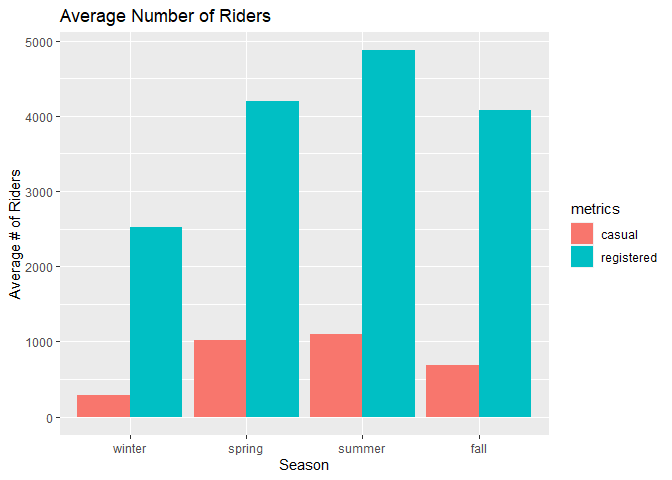

ST 558 Project 2
================
By David Arthur and James Carr
6/28/2021

-   [Friday](#friday)
-   [Introduction](#introduction)
-   [Data](#data)
-   [Summarizations](#summarizations)
-   [Modeling](#modeling)
    -   [First linear regression model](#first-linear-regression-model)
    -   [Second linear regression
        model](#second-linear-regression-model)
    -   [Random Forest Model](#random-forest-model)
    -   [Boosted Regression Tree](#boosted-regression-tree)
-   [Comparison of models](#comparison-of-models)

# Friday

# Introduction

The data set this program analyzes can be found
[here](https://archive.ics.uci.edu/ml/datasets/Bike+Sharing+Dataset).
The data describes its volume of riders by a few dimensions:

-   season
-   day of the week
-   year
-   month
-   holiday (y/n flag)
-   working day (y/n flag)
-   weather (good, fair, poor, bad)
-   temperature
-   humidity
-   wind

It is further broken down into three response variables:

-   Casual: non-registered riders who use the service casually
-   Registered: registered riders who use the service more regularly
-   Total: casual and registered combined

The split between casual and registered is important, because they
behave completely differently, use the service on different days, times,
holidays, etc. Often, their behavior is inverse of each other, though
the registered rider group is largest portion of riders and would be the
primary client of the business. Keeping in mind that the registered
client represents the largest portion of the clientele, this program
focuses on the registered metric and splits the behavior by each day of
the week.

# Data

We begin by reading in the data, changing the names of some factor
levels, and filtering by day of week

``` r
day <- readr::read_csv("day.csv", col_types = cols(
  season = col_factor(),
  yr = col_factor(),
  mnth = col_factor(),
  holiday = col_factor(),
  weekday = col_factor(),
  workingday = col_factor(),
  weathersit = col_factor()))

day <- day %>% mutate(season = fct_recode(season, winter = "1", spring = "2", summer = "3", fall = "4")) %>%
  mutate(yr = fct_recode(yr, "2011" = "0", "2012" = "1")) %>%
  mutate(weekday = fct_recode(weekday, Sunday = "0", Monday = "1", Tuesday = "2", Wednesday = "3", Thursday = "4", Friday = "5", Saturday = "6")) %>%
  mutate(weathersit = fct_recode(weathersit, clear = "1", mist = "2", lightRainOrSnow = "3", heavyRainOrSnow = "4")) %>%
  filter(weekday == params$dayOfWeek)

# read in version without factors for correlation plot
dayNF <- readr::read_csv("day.csv", col_types = cols(
  weekday = col_factor()))
```

Next, we partition the data into training and test sets

``` r
set.seed(21)
trainIndex <- createDataPartition(day$cnt, p = 0.7, list = FALSE)
dayTrain <- day[trainIndex, ]
dayTest <- day[-trainIndex, ]
```

# Summarizations

We begin our exploratory analysis of the data with a graphical overview
of the relationships between variables. Obvious patterns in the plots,
as well as high correlation values, indicate associations between
variables.

``` r
GGally::ggpairs(dayTrain %>% select(2:6, 8:9, atemp, windspeed, registered, casual))
```

<!-- -->

We will now look in more detail at relationships between time-related
variables and the `registered` response variable. When we do our linear
regression modeling we will need to decide which (if any) of these
predictors to use. For example, the date variable (`dteday`) and
`season` may not be useful in the presence of `weekday`, `mnth`, and
`yr` (or vice versa), as they provide largely redundant information.

``` r
g <- ggplot(data = dayTrain)
g + geom_point(aes(x = dteday, y = registered)) +
  labs(title = "Registered riders by date", x = "date", y = "# of registered riders")
```

<!-- -->

``` r
meanByMonthYr <- dayTrain %>% group_by(mnth, yr) %>%
  summarize(meanReg = mean(registered))
```

    ## `summarise()` has grouped output by 'mnth'. You can override using the `.groups` argument.

``` r
g2 <- ggplot(meanByMonthYr, aes(x = mnth))
g2 + geom_bar(aes(y = meanReg, fill = yr), position = "dodge", stat = "identity") +
  labs(title = "Mean daily registered riders by month, grouped by year", x = "month", y = "Mean daily registered riders", fill = "year")
```

<!-- -->

We will look next in more detail at the relationship between
quantitative weather variables and the `registered` response variable.
The appearance of nonlinear relationships in the scatter plots below may
indicate the need for quadratic terms in our linear regression models.
The adjusted temperature variable, `atemp`, seems particularly likely to
require a quadratic term, as both low and high temperatures can
discourage people from bicycling. Similarly, with humidity and
windspeed, low to moderate values may have no effect, but particularly
high values could have an effect, so those variables may also require
quadratic terms.

``` r
g + geom_point(aes(x = atemp, y = registered)) + facet_wrap(~ yr) + 
  labs(x = "adjusted temperature", y = "registered riders")
```

<!-- -->

``` r
g + geom_point(aes(x = hum, y = registered)) + facet_wrap(~ yr) + 
  labs(x = "humidity", y = "registered riders")
```

<!-- -->

``` r
g + geom_point(aes(x = windspeed, y = registered)) + facet_wrap(~ yr) + 
  labs(x = "wind speed", y = "registered riders")
```

<!-- -->

We now view a table displaying the mean number of `registered`,
`casual`, and total riders at each level of the categorical `weathersit`
variable. It seems plausible that in rain or snow, the number of casual
riders might decrease by a larger factor than would the number of
registered riders.

``` r
meanByWeather <- dayTrain %>% group_by(weathersit) %>%
  summarize(meanCas = mean(casual), meanReg = mean(registered), meanTotal = mean(cnt))
kable(meanByWeather, digits = 1, col.names = c("Weather", "Mean Casual Riders", "Mean Registered Riders", "Mean Total Riders"), caption = "Average # of riders by weather category")
```

| Weather | Mean Casual Riders | Mean Registered Riders | Mean Total Riders |
|:--------|-------------------:|-----------------------:|------------------:|
| mist    |              611.3 |                 3566.7 |            4178.0 |
| clear   |              870.9 |                 4118.7 |            4989.6 |

Average \# of riders by weather category

``` r
scatter_james <- ggplot(data=dayTrain, aes(x=temp, y=registered)) +
                 geom_point(aes(color=weathersit))
hist_james <- ggplot(data=dayTrain, aes(x=weathersit)) +
              geom_histogram(stat='count', aes(fill=workingday)) +
              ggtitle('Frequency of Weather') +
              xlab('Weather Type') + ylab('Count')

bar_james <- ggplot(data=dayTrain %>% 
                 select(season, casual, registered) %>%
                 pivot_longer(cols=c(casual, registered),
                              names_to = 'metrics',
                              values_to = 'riders') %>%
                 group_by(season, metrics) %>%
                 summarise(avg_riders = mean(riders)), 
            aes(x=season, y=avg_riders, fill=metrics)) +     
            geom_bar(stat='identity', position='dodge') +
            ggtitle('Average Number of Riders') +
              xlab('Season') + ylab('Average # of Riders')
  
box_james <- ggplot(data=dayTrain, aes(x=mnth, y=temp)) +
             geom_boxplot(aes(color=season))
```

Looking at the bar graph below, in all seasons the registered user base
far out-performs the casual base. This further confirms our plan of
analyzing the registered group as the priority.

<!-- -->

Since we don’t have a domain expert, we need to try to figure out what
variables are important and which we could exclude. We already know that
the two temperature variables have near perfect correlation, and clearly
date is redundant with mnth and yr. I would think season is as well
covered by mnth.

That leaves temperature, weather, and the working day flag as the most
likely to be relevant parameters. Looking at the plots below, I think we
can make a few obvious inferences:

-   looking at the scatter plot on the left, we can see that as the
    temperature goes up, the number of riders also goes up - at least up
    to a point. And even in the highest temperatures, ridership is way
    up over lowest temperatures.
-   the middle figure displays that temperature is highest in spring,
    summer, and early fall
-   looking at the figure on the right, there are very few days of
    extremely poor weather. Most days are clear, which are the best days
    for ridership.

<!-- -->

``` r
summ_james <- dayTrain %>% rename(total = cnt) %>%
              pivot_longer(cols=c(casual, registered, total),
                           names_to = 'metrics',
                           values_to = 'riders') %>%
              group_by(metrics) %>%
              summarise(min = min(riders),
                        lower25 = quantile(riders, 0.25),
                        median = median(riders),
                        mean = mean(riders),
                        upper75 = quantile(riders, 0.75),
                        max = max(riders))  %>%
              pivot_longer(cols=c(min, lower25, median,
                                  mean, upper75, max),
                           names_to = 'Summary',
                           values_to = 'stats') %>%
              pivot_wider(names_from = metrics, values_from = stats)

kable(summ_james, digits=0)
```

| Summary | casual | registered | total |
|:--------|-------:|-----------:|------:|
| min     |     38 |       1129 |  1167 |
| lower25 |    305 |       3023 |  3386 |
| median  |    748 |       3836 |  4602 |
| mean    |    768 |       3901 |  4669 |
| upper75 |   1061 |       5191 |  5883 |
| max     |   2469 |       6917 |  8362 |

``` r
pct_diff <- round((summ_james$registered[3] / summ_james$casual[3] - 1) 
                  * 100, 0)
pct_str <- paste0(pct_diff, '%')

inc_dec <- ''
if (pct_diff >= 0) {
  inc_dec <- 'greater'
} else {
  inc_dec <- 'less'
}
```

On the day of the week, Friday, ridership by registered users is greater
than casual users by 413%.

# Modeling

We will now fit two linear regression models, using differing
approaches, with the goal of creating a model that does a good job of
predicting the number of registered riders on any given day, based on
the values of the predictor variables in the data set. We will fit the
models using the training data set that we partitioned above, and then
test the accuracy of the models’ predictions using the test data set.

Linear regression estimates the effect of each predictor variable on the
mean value of the response variable, with the other predictor variables
held constant. A linear regression model can be expressed as  
*Y*<sub>*i*</sub> = *β*<sub>0</sub> + *β*<sub>1</sub>*X*<sub>*i*1</sub> + *β*<sub>2</sub>*X*<sub>*i*2</sub> + ... + *β*<sub>*p*</sub>*X*<sub>*i**p*</sub> + *E*<sub>*i*</sub>

where *Y*<sub>*i*</sub> is the response, *i* represents the observation
number, *X*<sub>*i**j*</sub> are the predictor variables, and
*E*<sub>*i*</sub> is the normally distributed random error. The
*β*<sub>*j*</sub> coefficients must be linear, but the predictor
variables can be higher order terms (e.g. *x*<sup>2</sup>) or
interaction terms (e.g. *x*<sub>1</sub>*x*<sub>2</sub>). Creating a
model to estimate the response using observed data, we have
$\\hat{y\_i} = \\hat\\beta\_0 + \\hat\\beta\_1x\_{i1} + \\hat\\beta\_2x\_{i2} + ... + \\hat\\beta\_px\_{ip}$

The *β̂*<sub>*j*</sub> coefficients (estimates for *β*<sub>*j*</sub>) are
calculated for each predictor variable to minimize the residual sum of
squares, using the observed values of *x*<sub>*i**j*</sub> and
*y*<sub>*i*</sub>  
$$min\_{\\beta\_0, \\beta\_1, ..., \\beta\_p}\\sum\_{i=1}^{n}(y\_i - \\beta\_0 - \\beta\_1x\_{i1} - \\beta\_2x\_{i2} - ... - \\beta\_px\_{ip})^2$$

The linear regression model can be used for inference, to understand the
relationships between the predictor variables and the response, as well
as for prediction of a mean response given new values of the predictor
variables. There are varying approaches to choosing which predictor
variables to include in a linear regression model. In both of our
models, our goal is accurate prediction when applied to new data. To
accomplish this we take two different approaches to choosing a subset of
predictor variables, in both cases using a combination of
criterion-based comparison and cross validation.

Criterion-based selection generally involves balancing bias and variance
by adding to the residual sum of squares some penalty that increases
with the number of predictors. This compensates for the fact that
including more predictors will always reduce the RSS for the training
set, but beyond a certain point overfitting becomes a risk, responding
too much to the noise in the training set, and reducing the accuracy of
the model when applied to new data.

Cross validation subdivides the training set into *k* folds, then fits a
model using *k* − 1 of those folds, and tests its accuracy predicting on
the *k*<sup>*t**h*</sup> fold. This is repeated *k* − 1 more times, so
that each fold gets a turn as the test set. The *k* results (residual
sum of squares, etc.) are then averaged.

### First linear regression model

I am starting with a best subsets approach, meaning we will look at all
of the predictors and use cross-validation to choose the one that has
the best prediction capability. Since the training set is only around 80
rows, I opted for four-fold cross validation to leave some data in each
fold.

``` r
library(leaps)

data <- dayTrain %>% 
               drop_na() %>%
               select(-instant,-dteday, -season, -holiday,
                    -weekday, -atemp, -casual, -cnt)

#this function converts new data to a model matrix
#so that a prediction can be run via matrix multiplication
#on a best subsets model
predict.regsubsets = function(object,newdata,id,...){
      form = as.formula(object$call[[2]]) 
      mat = model.matrix(form,newdata)    
      coefi = coef(object,id=id)          
      xvars = names(coefi)                
      mat[,xvars]%*%coefi               
}


#let's do cross validation with folds
k <- 4
set.seed(21)
folds <- sample(1:k, nrow(data), replace=T)

cv_errors = matrix(NA, k, 16, dimnames = list(NULL, paste(1:16)))

for (j in 1:k) {
  best <- regsubsets(registered ~ ., 
                     data=data[folds!=j,], nvmax=20)
  
  for (i in 1:16) {
    pred <- predict(best, data[folds==j,], id=i)
    
    
    cv_errors[j, i] <- mean((data$registered[folds==j]-pred)^2)
  }
}
```

    ## Reordering variables and trying again:

    ## Error in eval(x): object 'newX' not found

``` r
# Take the mean of over all folds for each model size
mean_cv_errors = apply(cv_errors, 2, mean)

# Find the model size with the smallest cross-validation error
min = which.min(mean_cv_errors)

#the model w/ 14 variables was best when using 4 fold cv.
#i did 4 fold because there are only about 80 rows of data per weekday

if(length(unique(dayTrain$workingday)) == 1){
  lm.fit1 <- lm(registered ~ yr + mnth + weathersit + temp + hum +
               windspeed, data=dayTrain)
}else{
  lm.fit1 <- lm(registered ~ yr + mnth + weathersit + temp + hum +
               windspeed +workingday, data=dayTrain)
}
```

Using best subsets, the following model was obtained: registered \~ yr +
mnth + weathersit + temp + hum + windspeed + workingday

### Second linear regression model

In this approach, we start with a full linear regression model that
includes all of the predictor variables. We will then reduce
collinearity (correlation among predictor variables) by removing
redundant predictors until we reach an optimal (lowest) AIC, which is
one of the criteria for predictor subset selection described above. We
will calculate the condition number (*κ*) for each of the candidate
models, which is a measure of collinearity. Roughly, *κ* &lt; 30 is
considered desirable. Finally, we will choose among several variations
of the optimal model (including various higher order terms) using cross
validation (described above).

We begin with the full model, which includes all of the predictors.
`holiday` and `workingday` are excluded for days of the week that
include only one level of `holiday` and `workingday`, respectively.

``` r
mlrFull <- lm(registered ~ dteday + season +  yr + mnth + weathersit + temp + 
                    atemp + hum + windspeed, dayTrain)
if(length(unique(dayTrain$workingday)) != 1){
  mlrFull <- update(mlrFull, . ~ . + workingday)
}
if(length(unique(dayTrain$holiday)) != 1){
  mlrFull <- update(mlrFull, . ~ . + holiday)
}

summary(mlrFull)
```

    ## 
    ## Call:
    ## lm(formula = registered ~ dteday + season + yr + mnth + weathersit + 
    ##     temp + atemp + hum + windspeed + workingday + holiday, data = dayTrain)
    ## 
    ## Residuals:
    ##      Min       1Q   Median       3Q      Max 
    ## -2414.85  -297.16    19.39   324.94   956.19 
    ## 
    ## Coefficients: (1 not defined because of singularities)
    ##                   Estimate Std. Error t value Pr(>|t|)   
    ## (Intercept)      85357.745 135721.602   0.629  0.53210   
    ## dteday              -5.596      9.061  -0.618  0.53953   
    ## seasonspring      1274.306    444.936   2.864  0.00598 **
    ## seasonsummer       370.934    622.738   0.596  0.55394   
    ## seasonfall        1153.720    512.253   2.252  0.02847 * 
    ## yr2012            3914.311   3328.081   1.176  0.24479   
    ## mnth2              218.086    490.061   0.445  0.65812   
    ## mnth3              477.742    652.265   0.732  0.46713   
    ## mnth4              -31.565    973.809  -0.032  0.97426   
    ## mnth5             1084.617   1163.790   0.932  0.35558   
    ## mnth6             1351.343   1476.763   0.915  0.36430   
    ## mnth7             1912.904   1885.226   1.015  0.31487   
    ## mnth8             2508.974   2109.381   1.189  0.23957   
    ## mnth9             3328.527   2304.637   1.444  0.15455   
    ## mnth10            2156.625   2579.860   0.836  0.40694   
    ## mnth11            1481.648   2834.976   0.523  0.60341   
    ## mnth12            2207.987   3084.198   0.716  0.47719   
    ## weathersitclear    256.607    203.308   1.262  0.21242   
    ## temp             -7435.732   7136.834  -1.042  0.30220   
    ## atemp            10353.747   7660.143   1.352  0.18223   
    ## hum              -1623.454    832.150  -1.951  0.05636 . 
    ## windspeed           58.024   1247.898   0.046  0.96309   
    ## workingday1        -41.407    498.913  -0.083  0.93417   
    ## holiday1                NA         NA      NA       NA   
    ## ---
    ## Signif. codes:  0 '***' 0.001 '**' 0.01 '*' 0.05 '.' 0.1 ' ' 1
    ## 
    ## Residual standard error: 632.2 on 53 degrees of freedom
    ## Multiple R-squared:   0.88,  Adjusted R-squared:  0.8302 
    ## F-statistic: 17.67 on 22 and 53 DF,  p-value: < 2.2e-16

``` r
AIC(mlrFull)
```

    ## [1] 1216.563

``` r
x <- model.matrix(mlrFull)[, -1]
e <- eigen(t(x) %*% x)
# e$val
# condition number
```

We see that *κ* = 4.0632348^{7}, which is a sign of high collinearity,
so we try removing some of the insignificant predictors, checking to
confirm that AIC declines, or at least that it increases only
marginally.

To help in consideration of which variables to remove, we view the
correlations. For days of the week that don’t include any holidays, `?`
will appear in the `holiday` and `workingday` rows and columns.

``` r
dayNFCor <- cor(as.matrix(dayNF %>%
                            mutate(weekday = fct_recode(weekday, Sunday = "0", Monday = "1", Tuesday = "2", Wednesday = "3", Thursday = "4", Friday = "5", Saturday = "6")) %>%
                            mutate(dteday = as.numeric(dteday)) %>%
                            filter(weekday == params$dayOfWeek) %>%
                            select(2:6, 8:13, registered)))
corrplot(dayNFCor, type = "upper", tl.pos = "lt")
corrplot(dayNFCor, type = "lower", method = "number", add = TRUE, diag = FALSE, tl.pos = "n")
```

<!-- -->

First, we remove `workingday`, as it is fully determined by the day of
the week and the `holiday` variable, so adds nothing to the model. We
also remove `temp`, as it is almost perfectly correlated with `atemp`,
and `dteday`, which adds little if any predictive value beyond `yr` plus
`mnth` plus `season`.

``` r
mlr2 <- update(mlrFull, . ~ . - workingday - temp - dteday)
summary(mlr2)
```

    ## 
    ## Call:
    ## lm(formula = registered ~ season + yr + mnth + weathersit + atemp + 
    ##     hum + windspeed + holiday, data = dayTrain)
    ## 
    ## Residuals:
    ##     Min      1Q  Median      3Q     Max 
    ## -2401.6  -259.2    78.7   288.4  1080.5 
    ## 
    ## Coefficients:
    ##                 Estimate Std. Error t value Pr(>|t|)    
    ## (Intercept)      1744.47     668.65   2.609  0.01167 *  
    ## seasonspring     1180.42     435.00   2.714  0.00887 ** 
    ## seasonsummer      352.11     618.46   0.569  0.57145    
    ## seasonfall       1244.13     503.92   2.469  0.01669 *  
    ## yr2012           1854.80     166.18  11.161 9.42e-16 ***
    ## mnth2              87.52     403.74   0.217  0.82920    
    ## mnth3             155.26     415.80   0.373  0.71029    
    ## mnth4            -471.71     606.63  -0.778  0.44014    
    ## mnth5             486.06     656.25   0.741  0.46205    
    ## mnth6             372.80     733.12   0.509  0.61313    
    ## mnth7             602.11     915.99   0.657  0.51370    
    ## mnth8            1080.40     852.79   1.267  0.21053    
    ## mnth9            1801.94     747.88   2.409  0.01935 *  
    ## mnth10            490.23     660.55   0.742  0.46115    
    ## mnth11           -297.75     605.02  -0.492  0.62458    
    ## mnth12            300.41     393.23   0.764  0.44817    
    ## weathersitclear   274.96     200.31   1.373  0.17542    
    ## atemp            2468.39    1317.08   1.874  0.06623 .  
    ## hum             -1734.04     819.93  -2.115  0.03899 *  
    ## windspeed        -410.60    1157.96  -0.355  0.72426    
    ## holiday1           14.92     492.83   0.030  0.97595    
    ## ---
    ## Signif. codes:  0 '***' 0.001 '**' 0.01 '*' 0.05 '.' 0.1 ' ' 1
    ## 
    ## Residual standard error: 628.9 on 55 degrees of freedom
    ## Multiple R-squared:  0.8768, Adjusted R-squared:  0.832 
    ## F-statistic: 19.57 on 20 and 55 DF,  p-value: < 2.2e-16

``` r
AIC(mlr2)
```

    ## [1] 1214.578

``` r
x <- model.matrix(mlr2)[, -1]
e <- eigen(t(x) %*% x)
# e$val
# condition number = sqrt(e$val[1]/min(e$val))
```

We see that AIC has changed little, and that *κ* = 36.19, which
indicates a large reduction in collinearity.

`mnth`, `weathersit` and `windspeed` appear to be marginally
significant, so we look at the effect of removing each of them from the
model:  
Remove `mnth`

``` r
mlr3 <- update(mlr2, . ~ . - mnth)
# summary(mlr3)
AIC(mlr3)
```

    ## [1] 1223.125

Remove `weathersit`

``` r
mlr4 <- update(mlr2, . ~ . - weathersit)
# summary(mlr4)
AIC(mlr4)
```

    ## [1] 1215.138

Remove `windspeed`

``` r
mlr5 <- update(mlr2, . ~ . - windspeed)
# summary(mlr5)
AIC(mlr5)
```

    ## [1] 1212.752

For `mnth`, `weathersit`, and `windspeed`, removal from the model
results in an increase or marginal decrease in AIC. If our main goal
were inference and understanding the relationships between the
variables, we might want to remove them from the model for the sake of
simplicity, interpretability, and more narrow confidence intervals.
Because our primary goal here is prediction, we will leave them in the
model, and choose mlr2 as our base linear regression model.

We will now do some diagnostic plots on our base model, and then
consider adding higher order terms to the model.

We can check for constant variance of our error term, an assumption of
our model, by looking at a plot of the model’s fitted values vs the
residuals (difference between fitted response and observed response). A
“megaphone” shape can indicate non-constant variance.

``` r
g <- ggplot(mlr2)
g + geom_point(aes(x = .fitted, y = .resid)) + labs (title = "Fitted (predicted) values vs residuals (difference between fitted and actual value)", x = "fitted (predicted) values", y = "residuals")
```

<!-- -->

Another way to assess constant variance is with the Box-Cox method,
which can suggest transformations of the response to address problems
with non-constant variance. If the maximum log-likelihood of *λ* close
to 1, as in this case, indicates that non-constant variance is not a
problem with the existing model.

``` r
MASS::boxcox(mlr2)
```

<!-- -->

We will also look at for signs of nonlinearity, which can indicate the
need for quadratic terms for some of the predictors. The partial
residual plots below plot the relationship between each predictor and
the response, with the effect of the other predictors removed.

``` r
termplot(mlr2, partial.resid = TRUE, terms = c("atemp", "windspeed", "hum"))
```

<!-- --><!-- --><!-- -->

For at least some days of the week there is a nonlinear pattern to the
plots, particularly for `atemp`, so we will try adding quadratic terms
for each of them to our base model.

Try adding *a**t**e**m**p*<sup>2</sup> to base model

``` r
mlr8 <- update(mlr2, . ~ . + I(atemp^2))
summary(mlr8)
```

    ## 
    ## Call:
    ## lm(formula = registered ~ season + yr + mnth + weathersit + atemp + 
    ##     hum + windspeed + holiday + I(atemp^2), data = dayTrain)
    ## 
    ## Residuals:
    ##     Min      1Q  Median      3Q     Max 
    ## -2464.1  -244.9    65.0   318.3  1016.9 
    ## 
    ## Coefficients:
    ##                  Estimate Std. Error t value Pr(>|t|)    
    ## (Intercept)        223.41     878.15   0.254  0.80014    
    ## seasonspring      1188.59     415.25   2.862  0.00597 ** 
    ## seasonsummer       691.17     605.48   1.142  0.25869    
    ## seasonfall        1366.64     483.47   2.827  0.00658 ** 
    ## yr2012            1828.58     158.97  11.503 3.83e-16 ***
    ## mnth2             -146.68     396.43  -0.370  0.71282    
    ## mnth3             -174.41     417.88  -0.417  0.67807    
    ## mnth4             -879.30     601.19  -1.463  0.14938    
    ## mnth5              128.24     642.30   0.200  0.84250    
    ## mnth6              320.26     700.12   0.457  0.64919    
    ## mnth7              583.29     874.40   0.667  0.50756    
    ## mnth8              915.89     816.65   1.122  0.26703    
    ## mnth9             1317.63     739.27   1.782  0.08032 .  
    ## mnth10             -17.07     661.85  -0.026  0.97952    
    ## mnth11            -789.77     609.59  -1.296  0.20063    
    ## mnth12             -10.05     395.04  -0.025  0.97979    
    ## weathersitclear    294.12     191.36   1.537  0.13013    
    ## atemp            12185.66    4052.96   3.007  0.00400 ** 
    ## hum              -1892.43     785.19  -2.410  0.01938 *  
    ## windspeed         -582.48    1107.45  -0.526  0.60107    
    ## holiday1            17.38     470.44   0.037  0.97066    
    ## I(atemp^2)      -11187.15    4435.86  -2.522  0.01465 *  
    ## ---
    ## Signif. codes:  0 '***' 0.001 '**' 0.01 '*' 0.05 '.' 0.1 ' ' 1
    ## 
    ## Residual standard error: 600.3 on 54 degrees of freedom
    ## Multiple R-squared:  0.8898, Adjusted R-squared:  0.8469 
    ## F-statistic: 20.75 on 21 and 54 DF,  p-value: < 2.2e-16

``` r
AIC(mlr8)
```

    ## [1] 1208.116

Reduced or similar AIC, so keep mlr8 as a candidate model to compare
using cross validation.

Try adding *a**t**e**m**p*<sup>2</sup> and *h**u**m*<sup>2</sup> to base
model

``` r
mlr9 <- update(mlr8, . ~ . + I(hum^2))
summary(mlr9)
```

    ## 
    ## Call:
    ## lm(formula = registered ~ season + yr + mnth + weathersit + atemp + 
    ##     hum + windspeed + holiday + I(atemp^2) + I(hum^2), data = dayTrain)
    ## 
    ## Residuals:
    ##      Min       1Q   Median       3Q      Max 
    ## -2481.36  -256.09    49.09   335.71   960.98 
    ## 
    ## Coefficients:
    ##                   Estimate Std. Error t value Pr(>|t|)    
    ## (Intercept)       -760.415   1704.195  -0.446  0.65727    
    ## seasonspring      1176.660    417.735   2.817  0.00680 ** 
    ## seasonsummer       691.150    608.556   1.136  0.26118    
    ## seasonfall        1363.212    485.956   2.805  0.00702 ** 
    ## yr2012            1817.167    160.672  11.310 9.56e-16 ***
    ## mnth2             -171.187    400.094  -0.428  0.67048    
    ## mnth3             -180.751    420.105  -0.430  0.66876    
    ## mnth4             -831.770    608.339  -1.367  0.17731    
    ## mnth5              172.886    648.944   0.266  0.79096    
    ## mnth6              346.831    704.773   0.492  0.62467    
    ## mnth7              606.188    879.498   0.689  0.49368    
    ## mnth8              915.108    820.803   1.115  0.26993    
    ## mnth9             1328.851    743.214   1.788  0.07950 .  
    ## mnth10             -34.150    665.691  -0.051  0.95928    
    ## mnth11            -801.579    612.939  -1.308  0.19660    
    ## mnth12             -45.897    400.582  -0.115  0.90921    
    ## weathersitclear    274.815    194.449   1.413  0.16341    
    ## atemp            12427.694   4089.313   3.039  0.00368 ** 
    ## hum               1406.781   4952.065   0.284  0.77746    
    ## windspeed         -537.547   1115.065  -0.482  0.63174    
    ## holiday1            -4.055    473.896  -0.009  0.99321    
    ## I(atemp^2)      -11477.602   4479.121  -2.562  0.01327 *  
    ## I(hum^2)         -2738.964   4058.601  -0.675  0.50270    
    ## ---
    ## Signif. codes:  0 '***' 0.001 '**' 0.01 '*' 0.05 '.' 0.1 ' ' 1
    ## 
    ## Residual standard error: 603.4 on 53 degrees of freedom
    ## Multiple R-squared:  0.8907, Adjusted R-squared:  0.8453 
    ## F-statistic: 19.63 on 22 and 53 DF,  p-value: < 2.2e-16

``` r
AIC(mlr9)
```

    ## [1] 1209.465

Similar AIC for most days of week, so keep mlr9 as a candidate model to
compare using cross validation.

Try adding *a**t**e**m**p*<sup>2</sup> and
*w**i**n**d**s**p**e**e**d*<sup>2</sup> to base model

``` r
mlr10 <- update(mlr8, . ~ . + I(windspeed^2))
summary(mlr10)
```

    ## 
    ## Call:
    ## lm(formula = registered ~ season + yr + mnth + weathersit + atemp + 
    ##     hum + windspeed + holiday + I(atemp^2) + I(windspeed^2), 
    ##     data = dayTrain)
    ## 
    ## Residuals:
    ##      Min       1Q   Median       3Q      Max 
    ## -2414.90  -206.01   -39.07   279.67  1061.51 
    ## 
    ## Coefficients:
    ##                  Estimate Std. Error t value Pr(>|t|)    
    ## (Intercept)        721.79     955.11   0.756  0.45317    
    ## seasonspring      1237.37     414.51   2.985  0.00428 ** 
    ## seasonsummer       697.57     601.87   1.159  0.25165    
    ## seasonfall        1372.98     480.60   2.857  0.00610 ** 
    ## yr2012            1821.87     158.11  11.523  4.7e-16 ***
    ## mnth2             -145.82     394.06  -0.370  0.71282    
    ## mnth3             -167.36     415.41  -0.403  0.68865    
    ## mnth4             -852.77     597.95  -1.426  0.15969    
    ## mnth5              182.15     639.83   0.285  0.77699    
    ## mnth6              378.10     697.38   0.542  0.58997    
    ## mnth7              614.56     869.51   0.707  0.48279    
    ## mnth8              952.24     812.26   1.172  0.24630    
    ## mnth9             1383.12     736.61   1.878  0.06593 .  
    ## mnth10              25.04     658.70   0.038  0.96981    
    ## mnth11            -755.68     606.52  -1.246  0.21827    
    ## mnth12             -20.71     392.76  -0.053  0.95815    
    ## weathersitclear    295.87     190.22   1.555  0.12580    
    ## atemp            11474.86    4066.46   2.822  0.00671 ** 
    ## hum              -1815.58     782.78  -2.319  0.02426 *  
    ## windspeed        -5372.78    3885.51  -1.383  0.17253    
    ## holiday1            19.40     467.62   0.041  0.96706    
    ## I(atemp^2)      -10476.92    4443.77  -2.358  0.02211 *  
    ## I(windspeed^2)   11396.70    8865.34   1.286  0.20419    
    ## ---
    ## Signif. codes:  0 '***' 0.001 '**' 0.01 '*' 0.05 '.' 0.1 ' ' 1
    ## 
    ## Residual standard error: 596.7 on 53 degrees of freedom
    ## Multiple R-squared:  0.8931, Adjusted R-squared:  0.8487 
    ## F-statistic: 20.12 on 22 and 53 DF,  p-value: < 2.2e-16

``` r
AIC(mlr10)
```

    ## [1] 1207.782

Similar AIC for most days of week, so keep mlr10 as a candidate model to
compare using cross validation.

Try including all 3 quadratic terms

``` r
mlr11 <- update(mlr8, . ~ . + I(hum^2) + I(windspeed^2))
summary(mlr11)
```

    ## 
    ## Call:
    ## lm(formula = registered ~ season + yr + mnth + weathersit + atemp + 
    ##     hum + windspeed + holiday + I(atemp^2) + I(hum^2) + I(windspeed^2), 
    ##     data = dayTrain)
    ## 
    ## Residuals:
    ##      Min       1Q   Median       3Q      Max 
    ## -2432.38  -245.47     7.98   251.25   990.62 
    ## 
    ## Coefficients:
    ##                   Estimate Std. Error t value Pr(>|t|)    
    ## (Intercept)       -561.984   1693.662  -0.332  0.74136    
    ## seasonspring      1227.201    415.266   2.955  0.00469 ** 
    ## seasonsummer       698.355    602.765   1.159  0.25192    
    ## seasonfall        1369.080    481.332   2.844  0.00635 ** 
    ## yr2012            1805.387    159.352  11.330 1.17e-15 ***
    ## mnth2             -179.253    396.313  -0.452  0.65293    
    ## mnth3             -175.158    416.111  -0.421  0.67553    
    ## mnth4             -784.362    603.448  -1.300  0.19940    
    ## mnth5              250.073    645.028   0.388  0.69983    
    ## mnth6              421.774    700.024   0.603  0.54945    
    ## mnth7              649.850    871.638   0.746  0.45930    
    ## mnth8              955.760    813.465   1.175  0.24538    
    ## mnth9             1406.754    738.146   1.906  0.06221 .  
    ## mnth10               6.988    659.966   0.011  0.99159    
    ## mnth11            -767.544    607.555  -1.263  0.21211    
    ## mnth12             -71.121    397.151  -0.179  0.85857    
    ## weathersitclear    269.666    192.626   1.400  0.16747    
    ## atemp            11716.386   4080.952   2.871  0.00591 ** 
    ## hum               2710.291   4989.485   0.543  0.58931    
    ## windspeed        -5916.334   3935.999  -1.503  0.13885    
    ## holiday1            -9.691    469.386  -0.021  0.98361    
    ## I(atemp^2)      -10784.800   4462.947  -2.417  0.01921 *  
    ## I(hum^2)         -3749.259   4081.988  -0.918  0.36260    
    ## I(windspeed^2)   12836.204   9015.712   1.424  0.16049    
    ## ---
    ## Signif. codes:  0 '***' 0.001 '**' 0.01 '*' 0.05 '.' 0.1 ' ' 1
    ## 
    ## Residual standard error: 597.6 on 52 degrees of freedom
    ## Multiple R-squared:  0.8948, Adjusted R-squared:  0.8483 
    ## F-statistic: 19.23 on 23 and 52 DF,  p-value: < 2.2e-16

``` r
AIC(mlr11)
```

    ## [1] 1208.559

Similar AIC for most days of week, so keep mlr11 as a candidate model to
compare using cross validation.

We will now compare the 4 candidate models using cross validation.
Several measures of the performance of the model are returned. We will
choose the best model in terms of lowest Root Mean Squared Error.

``` r
if(length(unique(dayTrain$holiday)) != 1){
  mlrFit8 <- train(registered ~ season + yr + mnth + holiday + weathersit + atemp + hum + windspeed + I(atemp^2), data = dayTrain,
      method = "lm",
      preProcess = c("center", "scale"),
      trControl = trainControl(method = "repeatedcv", number = 4, repeats = 3))
  
  mlrFit9 <- train(registered ~ season + yr + mnth + holiday + weathersit + atemp + hum + windspeed + I(atemp^2) + I(hum^2), data = dayTrain,
      method = "lm",
      preProcess = c("center", "scale"),
      trControl = trainControl(method = "repeatedcv", number = 4, repeats = 3))
  
  mlrFit10 <- train(registered ~ season + yr + mnth + holiday + weathersit + atemp + hum + windspeed + I(atemp^2) + I(windspeed^2), data = dayTrain,
      method = "lm",
      preProcess = c("center", "scale"),
      trControl = trainControl(method = "repeatedcv", number = 4, repeats = 3))
  
  mlrFit11 <- train(registered ~ season + yr + mnth + holiday + weathersit + atemp + hum + windspeed + I(atemp^2) + I(hum^2)+ I(windspeed^2), data = dayTrain,
      method = "lm",
      preProcess = c("center", "scale"),
      trControl = trainControl(method = "repeatedcv", number = 4, repeats = 3))
}else{
  mlrFit8 <- train(registered ~ season + yr + mnth + weathersit + atemp + hum + windspeed + I(atemp^2), data = dayTrain,
      method = "lm",
      preProcess = c("center", "scale"),
      trControl = trainControl(method = "repeatedcv", number = 4, repeats = 3))
  
  mlrFit9 <- train(registered ~ season + yr + mnth + weathersit + atemp + hum + windspeed + I(atemp^2) + I(hum^2), data = dayTrain,
      method = "lm",
      preProcess = c("center", "scale"),
      trControl = trainControl(method = "repeatedcv", number = 4, repeats = 3))
  
  mlrFit10 <- train(registered ~ season + yr + mnth + weathersit + atemp + hum + windspeed + I(atemp^2) + I(windspeed^2), data = dayTrain,
      method = "lm",
      preProcess = c("center", "scale"),
      trControl = trainControl(method = "repeatedcv", number = 4, repeats = 3))
  
  mlrFit11 <- train(registered ~ season + yr + mnth + weathersit + atemp + hum + windspeed + I(atemp^2) + I(hum^2)+ I(windspeed^2), data = dayTrain,
      method = "lm",
      preProcess = c("center", "scale"),
      trControl = trainControl(method = "repeatedcv", number = 4, repeats = 3))
}
comparison <- data.frame(t(mlrFit8$results), t(mlrFit9$results), t(mlrFit10$results), t(mlrFit11$results))
colnames(comparison) <- c("mlrFit8", "mlrFit9", "mlrFit10", "mlrFit11")
kable(comparison)
```

|            |     mlrFit8 |     mlrFit9 |    mlrFit10 |    mlrFit11 |
|:-----------|------------:|------------:|------------:|------------:|
| intercept  |   1.0000000 |   1.0000000 |   1.0000000 |   1.0000000 |
| RMSE       | 737.6305656 | 798.1714512 | 700.6696170 | 764.1839189 |
| Rsquared   |   0.7967779 |   0.7411012 |   0.7996442 |   0.7533367 |
| MAE        | 550.7370056 | 597.5181114 | 529.2784032 | 572.1962273 |
| RMSESD     | 177.0384027 | 123.1424207 | 156.9797577 | 163.7138563 |
| RsquaredSD |   0.0945487 |   0.0991870 |   0.0912906 |   0.1144566 |
| MAESD      | 111.4228611 |  91.5533180 | 106.9761575 | 113.6074662 |

Save the model with the lowest RMSE as our second linear regression
model.

``` r
candidates <- list(mlrFit8 = mlrFit8, mlrFit9 = mlrFit9, mlrFit10 = mlrFit10, mlrFit11 = mlrFit11)
indexLowestRMSE <- which.min(c(candidates[[1]][["results"]]["RMSE"], candidates[[2]][["results"]]["RMSE"], candidates[[3]][["results"]]["RMSE"], candidates[[4]][["results"]]["RMSE"]))
mlrFinal2 <- candidates[[indexLowestRMSE]]
mlrFinal2$call[[2]]
```

    ## registered ~ season + yr + mnth + holiday + weathersit + atemp + 
    ##     hum + windspeed + I(atemp^2) + I(windspeed^2)

The model with the lowest RMSE for Friday is mlrFit10, with a formula of
registered \~ season + yr + mnth + holiday + weathersit + atemp + hum +
windspeed + I(atemp^2) + I(windspeed^2)

### Random Forest Model

The random forest model is an improvement on the bagged tree model,
which is an improvement on the basic decision tree model. Decision trees
make predictions by dividing the predictor space into a number of
regions, and determining which region the predictor values of the new
observation fall into by applying a series of splits, each based on the
value of a single predictor. The response for the new observation is
then predicted to be the mean of the responses of the observations in
that region (for regression models; for classification models, the
prediction is the predominant class observed in the region). First a
large tree is grown, with the goal of minimizing the residual sum of
squares, resulting in a tree with many regions, each containing a small
number of observations. But this complex tree will generally be overfit,
with low bias and high variance, so it gets pruned back to an optimal
size, determined by cross validation, that will have higher bias but
lower variance, and ideally perform better when predicting on new data.

Bagged tree models improve on basic decision trees by using the
bootstrap to take many samples from the training data set and producing
an unpruned tree from each sample, then averaging the predictions of
those trees to get the bagged tree model. The averaging of hundreds of
high-variance trees results in a much lower variance model.

The random forest model is a further improvement on the bagged tree,
which works by decorrelating the trees that are generated and averaged
together. In a bagged tree model, many of the trees can end up being
similar, with the main splits dominated by the strongest predictor(s).
The correlation between these trees means that averaging them results in
a smaller reduction in variance than desired. To remedy this, random
forest models consider only a random subset of predictors for each
split, resulting in less correlation between trees, and lower variance
in the final model. The number of predictors considered for each split
is a tuning parameter, whose value can be chosen using cross validation.
…

``` r
rfFit <- train(registered ~ . - instant - casual - cnt, data = dayTrain,
               method = "rf",
               trControl = trainControl(method = "repeatedcv", number = 4, repeats = 3),
               preProcess = c("center", "scale"),
               tuneGrid = expand.grid(mtry = c(2, 7, 10:16, 20, 24)))
rfFit
```

    ## Random Forest 
    ## 
    ## 76 samples
    ## 15 predictors
    ## 
    ## Pre-processing: centered (30), scaled (30) 
    ## Resampling: Cross-Validated (4 fold, repeated 3 times) 
    ## Summary of sample sizes: 57, 58, 56, 57, 57, 57, ... 
    ## Resampling results across tuning parameters:
    ## 
    ##   mtry  RMSE       Rsquared   MAE     
    ##    2    1041.6017  0.7303204  837.2936
    ##    7     753.1916  0.7765166  602.5859
    ##   10     733.1846  0.7808311  577.3182
    ##   11     730.1191  0.7801274  573.2066
    ##   12     731.5063  0.7775613  572.8566
    ##   13     726.6143  0.7804443  566.7941
    ##   14     729.3071  0.7785403  566.6800
    ##   15     727.7288  0.7789531  564.9043
    ##   16     726.3864  0.7791692  564.3167
    ##   20     726.4052  0.7795556  556.6567
    ##   24     727.6004  0.7787834  552.9910
    ## 
    ## RMSE was used to select the optimal model using the smallest value.
    ## The final value used for the model was mtry = 16.

### Boosted Regression Tree

A boosted regression tree is similar to other tree-based regression
models, in that the regression is based on decision trees. Like other
decision-tree models, random samples are taken to build iterations of
the tree, but what makes boosted trees unique is that each iteration
attempts to build and improve on the last version and predictions are
updated as the trees are grown.

The predictions are initialized to 0 and residuals are created. A tree
is then fit to those residuals as a response. The predictions are then
updated again, the response becomes the new residuals, and the process
continues until a pre-determined number of **B** times has been reached.

There are four parameters that can be chosen using cross-validation to
create the best fit:

-   the shrinkage parameter: also known as the learning rate, this
    parameter determines how quickly the model learns. This parameter is
    between 0 and 1, and when tuning, 0.1 is usually a good place to
    start.
-   number of trees: this can lead to over-fitting if the number of
    trees is too large.
-   interaction depth: an interaction depth of 1 would be an additive
    model, while 2 would have two-way interactions. It is generally
    recommended to look at a interaction depth of something near 2 to 8.
-   min observations per node: default is 10, but this number can be
    dropped especially if data is sparse.

``` r
n.trees <- seq(5, 100, 5)
int.depth <- 1:10
shrinkage <- seq(0.05, 0.2, 0.05)
minobs <- seq(2, 12, 2)
grid <- expand.grid(n.trees = n.trees, 
                    interaction.depth = int.depth, 
                    shrinkage = shrinkage, 
                    n.minobsinnode = minobs)

trControl <- trainControl(method='repeatedcv', number=4, repeats=10)
set.seed(1)
fit_boost <- train(registered ~ ., 
                   data=dayTrain %>% 
                        drop_na() %>%
                        select(-instant, -casual, -cnt),
                   method='gbm',
                   tuneGrid = grid,
                   trControl=trControl, 
                   verbose=FALSE)
```

# Comparison of models

We will now compare the performance of the two linear regression models,
the random forest model, and the boosted tree model, by using each to
predict the `registered` response based on the values of the predictor
variables in the test data set that we partitioned at the beginning. We
will choose the best model on the basis of lowest Root Mean Squared
Error.

``` r
final4 <- list(first_linear_regression = lm.fit1, second_linear_regression = mlrFinal2, random_forest = rfFit, boosted_tree = fit_boost)
rmse <- numeric()
results <- list()
predFinal4 <- predict(final4, newdata = dayTest)
for(i in 1:length(final4)){
  results[[i]] <- postResample(predFinal4[[i]], dayTest$registered)
  rmse[i] <- postResample(predFinal4[[i]], dayTest$registered)["RMSE"]
}
resultsComparison <- data.frame(results)
colnames(resultsComparison) <- names(final4)
kable(t(resultsComparison), digits = 3)
```

|                            |    RMSE | Rsquared |     MAE |
|:---------------------------|--------:|---------:|--------:|
| first\_linear\_regression  | 767.436 |    0.707 | 563.945 |
| second\_linear\_regression | 758.039 |    0.707 | 542.659 |
| random\_forest             | 649.556 |    0.780 | 512.771 |
| boosted\_tree              | 630.056 |    0.795 | 476.441 |

``` r
winnerIndex <- which.min(rmse)
```

The best-performing model for Friday is boosted\_tree
