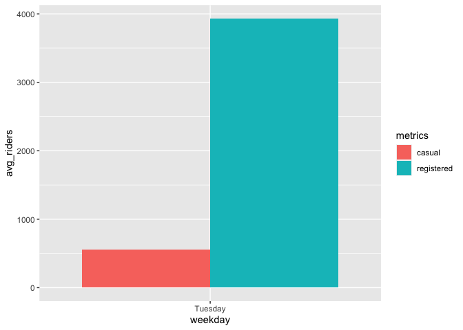

ST 558 Project 2
================
David Arthur
6/28/2021

Read in data, filter by day of week

``` r
day <- readr::read_csv("day.csv", col_types = cols(
  season = col_factor(),
  yr = col_factor(),
  mnth = col_factor(),
  holiday = col_factor(),
  weekday = col_factor(),
  workingday = col_factor(),
  weathersit = col_factor()))

day <- day %>% mutate(season = fct_recode(season, winter = "1", spring = "2", summer = "3", fall = "4")) %>%
  mutate(yr = fct_recode(yr, "2011" = "0", "2012" = "1")) %>%
  mutate(weekday = fct_recode(weekday, Sunday = "0", Monday = "1", Tuesday = "2", Wednesday = "3", Thursday = "4", Friday = "5", Saturday = "6")) %>%
  mutate(weathersit = fct_recode(weathersit, clear = "1", mist = "2", lightRainOrSnow = "3", heavyRainOrSnow = "4")) %>%
  filter(weekday == params$dayOfWeek)
```

    ## Warning: Unknown levels in `f`: 4

``` r
dayNF <- readr::read_csv("day.csv")
```

Partition data into training and test sets

``` r
set.seed(21)
trainIndex <- createDataPartition(day$cnt, p = 0.7, list = FALSE)
dayTrain <- day[trainIndex, ]
dayTest <- day[-trainIndex, ]
```

Exploratory data analysis and summary (David)

``` r
GGally::ggpairs(dayTrain %>% select(3:9, atemp, windspeed, casual, registered, cnt))
```

<!-- -->

``` r
# dayNFCor <- cor(as.matrix(dayNF %>% select(3:9, atemp, windspeed, casual, registered,cnt)))
# corrplot(dayNFCor, type = "upper", tl.pos = "lt")
# corrplot(dayNFCor, type = "lower", method = "number", add = TRUE, diag = FALSE, tl.pos = "n")
```

Exploration of individual predictors

``` r
g <- ggplot(data = dayTrain)
g + geom_point(aes(x = dteday, y = registered))
```

<!-- -->

``` r
meanByMonth <- dayTrain %>% group_by(mnth) %>%
  summarize(meanCas = mean(casual), meanReg = mean(registered), meanTotal = mean(cnt))
g2 <- ggplot(meanByMonth, aes(x = mnth))
g2 + geom_bar(aes(y = meanCas), stat = "identity")
```

<!-- -->

``` r
g2 + geom_bar(aes(y = meanReg), stat = "identity")
```

<!-- -->

``` r
g2 + geom_bar(aes(y = meanTotal), stat = "identity")
```

<!-- -->

``` r
meanByYear <- dayTrain %>% group_by(yr) %>%
  summarize(meanCas = mean(casual), meanReg = mean(registered), meanTotal = mean(cnt))
g2 <- ggplot(meanByYear, aes(x = yr))
g2 + geom_bar(aes(y = meanCas), stat = "identity")
```

<!-- -->

``` r
g2 + geom_bar(aes(y = meanReg), stat = "identity")
```

<!-- -->

``` r
g2 + geom_bar(aes(y = meanTotal), stat = "identity")
```

<!-- -->

``` r
meanByWeather <- dayTrain %>% group_by(weathersit) %>%
  summarize(meanCas = mean(casual), meanReg = mean(registered), meanTotal = mean(cnt))
kable(meanByWeather, digits = 1, col.names = c("Weather", "Mean Casual Riders", "Mean Registered Riders", "Mean Total Riders"), caption = "Average # of riders by weather category")
```

| Weather         | Mean Casual Riders | Mean Registered Riders | Mean Total Riders |
|:----------------|-------------------:|-----------------------:|------------------:|
| mist            |              421.1 |                 3171.0 |            3592.1 |
| clear           |              653.8 |                 4420.1 |            5073.9 |
| lightRainOrSnow |              220.5 |                 3396.0 |            3616.5 |

Average \# of riders by weather category

``` r
meanByHoliday <- dayTrain %>% filter(workingday == 0) %>%
  group_by(holiday) %>%
  summarize(meanCas = mean(casual), meanReg = mean(registered), meanTotal = mean(cnt))
kable(meanByHoliday, digits = 1, col.names = c("Holiday (0 = no, 1 = yes)", "Mean Casual Riders", "Mean Registered Riders", "Mean Total Riders"), caption = "Average # of riders on holidays vs. non-holiday non-workdays")
```

| Holiday (0 = no, 1 = yes) | Mean Casual Riders | Mean Registered Riders | Mean Total Riders |
|:--------------------------|-------------------:|-----------------------:|------------------:|
| 1                         |                440 |                    573 |              1013 |

Average \# of riders on holidays vs. non-holiday non-workdays

Exploratory data analysis and summary (James)

``` r
ggpairs(dayTrain %>% select(-instant,-dteday, -season, -yr, -cnt), 
        ggplot2::aes(colour=workingday))
```

    ## Warning: Groups with fewer than two data points have been dropped.

    ## Warning in max(ids, na.rm = TRUE): no non-missing arguments to max; returning
    ## -Inf

    ## Error in cor.test.default(x, y, method = method, use = use): not enough finite observations

<!-- --> Notes
from looking at ggpairs plots: Working days are the highest usage for
registered riders, but non-working days are the highest usage for casual
riders. Registered riders are the primary volume, so we definitely care
most about them but worth keeping in mind. There are two types of
non-working days: weekends and holidays, and there is a difference in
volume for each of those rider types depending on whether it is a
holiday or a weekend.

Air temperature and temperature are nearly 100% correlated. We should
probably figure out which one of them we want to use. Speaking of
correlated, can we drop the date and only use months? Unfortunately, it
looks like we need to keep the year field as well, since year 2 had
better performance than year 1. Do we want to keep season and month? I
lean towards keeping year and month, but dropping season and date. Let
me know what you think.

Looking at the scatter of casual vs registered, broken out by working
day, it’s crazy how separate the linear relationships look:

``` r
g <- ggplot(data=dayTrain, aes(x=registered, y=casual))
g + geom_point(aes(color=workingday))
```

<!-- --> On
working days, registered bikes are the main rider group. On non-working
days, it switches to casual. Looking at day of the week, we may be able
to exclude it since it will be covered by the working day flag and
holiday flag, but I guess we can check the models to see if it provides
anything extra.

``` r
g <- ggplot(data=dayTrain %>% 
                 select(weekday, casual, registered) %>%
                 pivot_longer(cols=c(casual, registered),
                              names_to = 'metrics',
                              values_to = 'riders') %>%
                 group_by(weekday, metrics) %>%
                 summarise(avg_riders = mean(riders)), 
            aes(x=weekday, y=avg_riders, fill=metrics))
```

    ## `summarise()` has grouped output by 'weekday'. You can override using the `.groups` argument.

``` r
g + geom_bar(stat='identity', position='dodge')
```

<!-- -->
Looking at this graph, weekday definitely seems relatively stable across
the days (working days for registered and non-working days for casual
are the jumps), but there may be enough variation to include it.

\#\#I like this graph. I thought about doing one like it, but wasn’t
sure how to code it. pivot\_longer hadn’t occurred to me.

\#\#About which variables to include, I agree with your comments. My
understanding is that each of us comes up with our own models (I do a
linear regression and a random forest, you do a linear regression and a
boosted tree), so you and I don’t need to include the same predictors.
We do need to agree ahead of time on which response we’re going to model
(casual, registered, or cnt), so that the results of the 4 models can be
compared to each other. I’m fine with any of the 3. Do you have a
preference?

Yeah, no preference here either. I guess we could just say registered
since it’s the highest volume customer, and if we were doing this
analysis for that company then registered users would be the most
important group.

\#\#Sounds good, we’ll go with registered.

``` r
library(leaps)

data <- dayTrain %>% 
               filter(weekday == params$dayOfWeek) %>% drop_na() %>%
               select(-instant,-dteday, -season, 
                    -weekday, -atemp, -casual, -cnt)

#this function converts new data to a model matrix
#so that a prediction can be run via matrix multiplication
#on a best subsets model
predict.regsubsets = function(object,newdata,id,...){
      form = as.formula(object$call[[2]]) 
      mat = model.matrix(form,newdata)    
      coefi = coef(object,id=id)          
      xvars = names(coefi)                
      mat[,xvars]%*%coefi               
}


#let's do cross validation with folds
k <- 4
set.seed(21)
folds <- sample(1:k, nrow(data), replace=T)

cv_errors = matrix(NA, k, 16, dimnames = list(NULL, paste(1:16)))

for (j in 1:k) {
  best <- regsubsets(registered ~ ., 
                     data=data[folds!=j,], nvmax=20)
  
  for (i in 1:16) {
    pred <- predict(best, data[folds==j,], id=i)
    
    
    cv_errors[j, i] <- mean((temp_data$registered[folds==j]-pred)^2)
  }
}
```

    ## Warning in leaps.setup(x, y, wt = wt, nbest = nbest, nvmax = nvmax, force.in =
    ## force.in, : 2 linear dependencies found

    ## Reordering variables and trying again:

    ## Error in mean((temp_data$registered[folds == j] - pred)^2): object 'temp_data' not found

``` r
# Take the mean of over all folds for each model size
mean_cv_errors = apply(cv_errors, 2, mean)

# Find the model size with the smallest cross-validation error
min = which.min(mean_cv_errors)

#the model w/ 14 variables was best when using 4 fold cv.
#i did 4 fold because there are only about 80 rows of data per weekday

best_full <- regsubsets(registered ~ ., 
                     data=temp_data[folds!=j,], nvmax=20)
```

    ## Error in is.data.frame(data): object 'temp_data' not found

``` r
fit <- lm(registered ~ temp*hum,
        data=dayTrain %>% 
             filter(weekday == params$dayOfWeek) %>% drop_na() %>%
             select(-instant,-dteday, -season, 
                    -weekday, -atemp, -casual, -cnt))
```

``` r
# GGally::ggpairs(dayTrain %>% select(3:9, atemp, windspeed, casual, registered, cnt))
dayNFCor <- cor(as.matrix(dayNF %>% select(3:13, registered)))
corrplot(dayNFCor, type = "upper", tl.pos = "lt")
corrplot(dayNFCor, type = "lower", method = "number", add = TRUE, diag = FALSE, tl.pos = "n")
```

<!-- -->

``` r
#JUST MONDAY DATA
dayTrain <- dayTrain %>% filter(weekday == "Monday") %>% select(-weekday)
mlrFull <- lm(registered ~ . - instant - casual - cnt, dayTrain)
```

    ## Error in `contrasts<-`(`*tmp*`, value = contr.funs[1 + isOF[nn]]): contrasts can be applied only to factors with 2 or more levels

``` r
summary(mlrFull)
```

    ## Error in summary(mlrFull): object 'mlrFull' not found

``` r
AIC(mlrFull)
```

    ## Error in AIC(mlrFull): object 'mlrFull' not found

``` r
x <- model.matrix(mlrFull)[, -1]
```

    ## Error in model.matrix(mlrFull): object 'mlrFull' not found

``` r
e <- eigen(t(x) %*% x)
```

    ## Error in t(x): object 'x' not found

``` r
e$val
```

    ## Error in eval(expr, envir, enclos): object 'e' not found

``` r
sqrt(e$val[1]/min(e$val))
```

    ## Error in eval(expr, envir, enclos): object 'e' not found

``` r
vif(x)
```

    ## Error in vif(x): object 'x' not found

``` r
#remove dteday (high collinearity, low p-value)
mlr2 <- update(mlrFull, . ~ . - dteday)
```

    ## Error in update(mlrFull, . ~ . - dteday): object 'mlrFull' not found

``` r
summary(mlr2)
```

    ## Error in summary(mlr2): object 'mlr2' not found

``` r
AIC(mlr2)
```

    ## Error in AIC(mlr2): object 'mlr2' not found

``` r
x <- model.matrix(mlr2)[, -1]
```

    ## Error in model.matrix(mlr2): object 'mlr2' not found

``` r
e <- eigen(t(x) %*% x)
```

    ## Error in t(x): object 'x' not found

``` r
e$val
```

    ## Error in eval(expr, envir, enclos): object 'e' not found

``` r
sqrt(e$val[1]/min(e$val))
```

    ## Error in eval(expr, envir, enclos): object 'e' not found

``` r
vif(x)
```

    ## Error in vif(x): object 'x' not found

``` r
#reduced AIC and condition number

#remove temp (high collinearity, low p-value)
mlr3 <- update(mlr2, . ~ . - temp)
```

    ## Error in update(mlr2, . ~ . - temp): object 'mlr2' not found

``` r
summary(mlr3)
```

    ## Error in summary(mlr3): object 'mlr3' not found

``` r
AIC(mlr3)
```

    ## Error in AIC(mlr3): object 'mlr3' not found

``` r
x <- model.matrix(mlr3)[, -1]
```

    ## Error in model.matrix(mlr3): object 'mlr3' not found

``` r
e <- eigen(t(x) %*% x)
```

    ## Error in t(x): object 'x' not found

``` r
e$val
```

    ## Error in eval(expr, envir, enclos): object 'e' not found

``` r
sqrt(e$val[1]/min(e$val))
```

    ## Error in eval(expr, envir, enclos): object 'e' not found

``` r
vif(x)
```

    ## Error in vif(x): object 'x' not found

``` r
#reduced AIC and condition number

#remove workingday (high collinearity, low p-value)
mlr4 <- update(mlr3, . ~ . - workingday)
```

    ## Error in update(mlr3, . ~ . - workingday): object 'mlr3' not found

``` r
summary(mlr4)
```

    ## Error in summary(mlr4): object 'mlr4' not found

``` r
AIC(mlr4)
```

    ## Error in AIC(mlr4): object 'mlr4' not found

``` r
x <- model.matrix(mlr4)[, -1]
```

    ## Error in model.matrix(mlr4): object 'mlr4' not found

``` r
e <- eigen(t(x) %*% x)
```

    ## Error in t(x): object 'x' not found

``` r
e$val
```

    ## Error in eval(expr, envir, enclos): object 'e' not found

``` r
sqrt(e$val[1]/min(e$val))
```

    ## Error in eval(expr, envir, enclos): object 'e' not found

``` r
vif(x)
```

    ## Error in vif(x): object 'x' not found

``` r
#reduced AIC and condition number

#remove season (high collinearity, low p-value)
mlr5 <- update(mlr4, . ~ . - season)
```

    ## Error in update(mlr4, . ~ . - season): object 'mlr4' not found

``` r
summary(mlr5)
```

    ## Error in summary(mlr5): object 'mlr5' not found

``` r
AIC(mlr5)
```

    ## Error in AIC(mlr5): object 'mlr5' not found

``` r
#don't remove season because AIC increased

#remove month (high collinearity, low p-value)
mlr6 <- update(mlr4, . ~ . - mnth)
```

    ## Error in update(mlr4, . ~ . - mnth): object 'mlr4' not found

``` r
summary(mlr6)
```

    ## Error in summary(mlr6): object 'mlr6' not found

``` r
AIC(mlr6)
```

    ## Error in AIC(mlr6): object 'mlr6' not found

``` r
x <- model.matrix(mlr6)[, -1]
```

    ## Error in model.matrix(mlr6): object 'mlr6' not found

``` r
e <- eigen(t(x) %*% x)
```

    ## Error in t(x): object 'x' not found

``` r
e$val
```

    ## Error in eval(expr, envir, enclos): object 'e' not found

``` r
sqrt(e$val[1]/min(e$val))
```

    ## Error in eval(expr, envir, enclos): object 'e' not found

``` r
vif(x)
```

    ## Error in vif(x): object 'x' not found

``` r
#reduced AIC and condition number

#remove year from full model instead of dteday (high collinearity)
mlr7 <- update(mlrFull, . ~ . - yr - workingday - temp, dayTrain)
```

    ## Error in update(mlrFull, . ~ . - yr - workingday - temp, dayTrain): object 'mlrFull' not found

``` r
summary(mlr7)
```

    ## Error in summary(mlr7): object 'mlr7' not found

``` r
AIC(mlr7)
```

    ## Error in AIC(mlr7): object 'mlr7' not found

``` r
x <- model.matrix(mlr7)[, -1]
```

    ## Error in model.matrix(mlr7): object 'mlr7' not found

``` r
e <- eigen(t(x) %*% x)
```

    ## Error in t(x): object 'x' not found

``` r
e$val
```

    ## Error in eval(expr, envir, enclos): object 'e' not found

``` r
sqrt(e$val[1]/min(e$val))
```

    ## Error in eval(expr, envir, enclos): object 'e' not found

``` r
vif(x)
```

    ## Error in vif(x): object 'x' not found

``` r
#higher AIC than mlr4

#compare to model chosen by leaps::step() function
mlrStep <- step(mlrFull)
```

    ## Error in terms(object): object 'mlrFull' not found

``` r
names(mlrStep)
```

    ## Error in eval(expr, envir, enclos): object 'mlrStep' not found

``` r
mlrStep$call
```

    ## Error in eval(expr, envir, enclos): object 'mlrStep' not found

``` r
mlr6$call
```

    ## Error in eval(expr, envir, enclos): object 'mlr6' not found

``` r
AIC(mlr6, mlrStep)
```

    ## Error in AIC(mlr6, mlrStep): object 'mlr6' not found

``` r
#my choice agrees with step() choice

#diagnostics plot
plot(mlr6$fitted, mlr6$residuals)
```

    ## Error in plot(mlr6$fitted, mlr6$residuals): object 'mlr6' not found

``` r
#indication of mild nonconstant variance
MASS::boxcox(mlr6)
```

    ## Error in MASS::boxcox(mlr6): object 'mlr6' not found

``` r
#Box-Cox lambda close to 1, so no need for transformation of response

#look for nonlinearity with partial residuals plots
termplot(mlr6, partial.resid = TRUE)
```

    ## Error in predict(model, type = "terms", se.fit = se): object 'mlr6' not found

``` r
#atemp, hum, and windspeed look somewhat nonlinear, so try quadratic terms for them
mlr8 <- update(mlr6, . ~ . + I(atemp^2))
```

    ## Error in update(mlr6, . ~ . + I(atemp^2)): object 'mlr6' not found

``` r
summary(mlr8)
```

    ## Error in summary(mlr8): object 'mlr8' not found

``` r
AIC(mlr8)
```

    ## Error in AIC(mlr8): object 'mlr8' not found

``` r
#improved AIC, so keep atemp^2 in model

mlr9 <- update(mlr8, . ~ . + I(hum^2))
```

    ## Error in update(mlr8, . ~ . + I(hum^2)): object 'mlr8' not found

``` r
summary(mlr9)
```

    ## Error in summary(mlr9): object 'mlr9' not found

``` r
AIC(mlr9)
```

    ## Error in AIC(mlr9): object 'mlr9' not found

``` r
#improved AIC, so keep hum^2 in model

mlr10 <- update(mlr9, . ~ . + I(windspeed^2))
```

    ## Error in update(mlr9, . ~ . + I(windspeed^2)): object 'mlr9' not found

``` r
summary(mlr10)
```

    ## Error in summary(mlr10): object 'mlr10' not found

``` r
AIC(mlr10)
```

    ## Error in AIC(mlr10): object 'mlr10' not found

``` r
#slightly improved AIC, compare using cross validation

#interaction of weather vars w/ holiday seems possible, so try adding to model
mlr11 <- update(mlr9, . ~ . + weathersit:holiday)
```

    ## Error in update(mlr9, . ~ . + weathersit:holiday): object 'mlr9' not found

``` r
summary(mlr11)
```

    ## Error in summary(mlr11): object 'mlr11' not found

``` r
AIC(mlr11)
```

    ## Error in AIC(mlr11): object 'mlr11' not found

``` r
#slightly worse AIC, compare using cross validation
mlr12 <- update(mlr9, . ~ . + atemp:holiday)
```

    ## Error in update(mlr9, . ~ . + atemp:holiday): object 'mlr9' not found

``` r
summary(mlr12)
```

    ## Error in summary(mlr12): object 'mlr12' not found

``` r
AIC(mlr12)
```

    ## Error in AIC(mlr12): object 'mlr12' not found

``` r
#marginal decrease in AIC, compare using cross validation

#fit best candidate models using cross validation w/ caret package
mlrFit9 <- train(registered ~ season + yr + holiday + weathersit + atemp + hum + windspeed + I(atemp^2) + I(hum^2), data = dayTrain,
    method = "lm",
    preProcess = c("center", "scale"),
    trControl = trainControl(method = "repeatedcv", number = 4, repeats = 3))
```

    ## Error: Every row has at least one missing value were found

``` r
mlrFit10 <- train(registered ~ season + yr + holiday + weathersit + atemp + hum + windspeed + I(atemp^2) + I(hum^2)+ I(windspeed^2), data = dayTrain,
    method = "lm",
    preProcess = c("center", "scale"),
    trControl = trainControl(method = "repeatedcv", number = 4, repeats = 3))
```

    ## Error: Every row has at least one missing value were found

``` r
mlrFit11 <- train(registered ~ season + yr + holiday + weathersit + atemp + hum + windspeed + I(atemp^2) + I(hum^2) + holiday:weathersit, data = dayTrain,
    method = "lm",
    preProcess = c("center", "scale"),
    trControl = trainControl(method = "repeatedcv", number = 4, repeats = 3))
```

    ## Error: Every row has at least one missing value were found

``` r
mlrFit12 <- train(registered ~ season + yr + holiday + weathersit + atemp + hum + windspeed + I(atemp^2) + I(hum^2) + holiday:atemp, data = dayTrain,
    method = "lm",
    preProcess = c("center", "scale"),
    trControl = trainControl(method = "repeatedcv", number = 4, repeats = 3))
```

    ## Error: Every row has at least one missing value were found

``` r
comparison <- data.frame(t(mlrFit9$results), t(mlrFit10$results), t(mlrFit11$results), t(mlrFit12$results))
```

    ## Error in t(mlrFit9$results): object 'mlrFit9' not found

``` r
colnames(comparison) <- c("mlrFit9", "mlrFit10", "mlrFit11", "mlrFit12")
```

    ## Error in colnames(comparison) <- c("mlrFit9", "mlrFit10", "mlrFit11", : object 'comparison' not found

``` r
comparison
```

    ## Error in eval(expr, envir, enclos): object 'comparison' not found

``` r
#The lowest RMSE out of the 4 candidate models varies each time I run cross validation, so I will choose the simplest of the 4, mlrFit9
mlrBest <- mlrFit9
```

    ## Error in eval(expr, envir, enclos): object 'mlrFit9' not found

``` r
# for potentially automating choice of model
# which.min(c(mlrFit9$results["RMSE"], mlrFit10$results["RMSE"], mlrFit11$results["RMSE"], mlrFit12$results["RMSE"]))
```

``` r
rfFit <- train(registered ~ . - instant - casual - cnt, data = dayTrain,
               method = "rf",
               trControl = trainControl(method = "repeatedcv", number = 4, repeats = 3),
               preProcess = c("center", "scale"),
               tuneGrid = expand.grid(mtry = c(2, 7, 10:16, 20, 24)))
```

    ## Error: Every row has at least one missing value were found

``` r
rfFit
```

    ## Error in eval(expr, envir, enclos): object 'rfFit' not found
