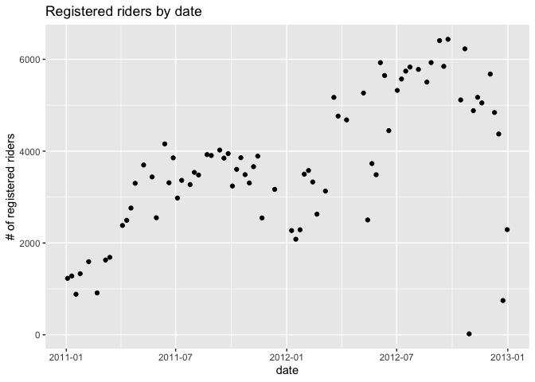
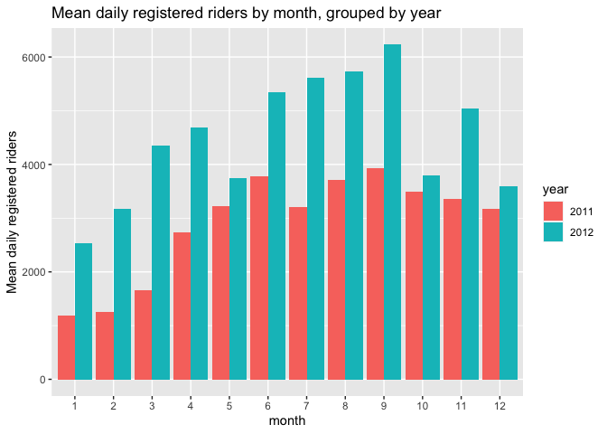
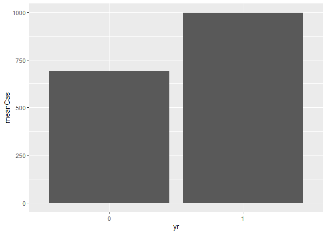

ST 558 Project 2
================
David Arthur
6/28/2021

Read in data

``` r
day <- readr::read_csv("day.csv", col_types = cols(
  season = col_factor(),
  yr = col_factor(),
  mnth = col_factor(),
  holiday = col_factor(),
  weekday = col_factor(),
  workingday = col_factor(),
  weathersit = col_factor()))

# dayNF <- readr::read_csv("day.csv")
```

Partition data into training and test sets

``` r
set.seed(21)
trainIndex <- createDataPartition(day$cnt, p = 0.7, list = FALSE)
dayTrain <- day[trainIndex, ]
dayTest <- day[-trainIndex, ]
```

Exploratory data analysis and summary (David)

``` r
GGally::ggpairs(dayTrain %>% select(3:9, atemp, windspeed, casual, registered, cnt))
```

<!-- -->

``` r
# dayNFCor <- cor(as.matrix(dayNF %>% select(3:9, atemp, windspeed, casual, registered,cnt)))
# corrplot(dayNFCor, type = "upper", tl.pos = "lt")
# corrplot(dayNFCor, type = "lower", method = "number", add = TRUE, diag = FALSE, tl.pos = "n")
```

Exploration of individual predictors

``` r
g <- ggplot(data = dayTrain)
g + geom_point(aes(x = weekday, y = casual))
```

<!-- -->

``` r
g + geom_point(aes(x = dteday, y = cnt))
```

<!-- -->

``` r
meanByWeekday <- dayTrain %>% group_by(weekday) %>%
  summarize(meanCas = mean(casual), meanReg = mean(registered), meanTotal = mean(cnt))
g2 <- ggplot(meanByWeekday, aes(x = weekday, y = meanCas))
g2 + geom_bar(aes(x = weekday, y = meanCas), stat = "identity")
```

<!-- -->

``` r
g2 + geom_bar(aes(y = meanReg), stat = "identity")
```

<!-- -->

``` r
g2 + geom_bar(aes(y = meanTotal), stat = "identity")
```

<!-- -->

``` r
meanBySeason <- dayTrain %>% group_by(season) %>%
  summarize(meanCas = mean(casual), meanReg = mean(registered), meanTotal = mean(cnt))
g2 <- ggplot(meanBySeason, aes(x = season))
g2 + geom_bar(aes(y = meanCas), stat = "identity")
```

<!-- -->

``` r
g2 + geom_bar(aes(y = meanReg), stat = "identity")
```

<!-- -->

``` r
g2 + geom_bar(aes(y = meanTotal), stat = "identity")
```

<!-- -->

``` r
meanByMonth <- dayTrain %>% group_by(mnth) %>%
  summarize(meanCas = mean(casual), meanReg = mean(registered), meanTotal = mean(cnt))
g2 <- ggplot(meanByMonth, aes(x = mnth))
g2 + geom_bar(aes(y = meanCas), stat = "identity")
```

<!-- -->

``` r
g2 + geom_bar(aes(y = meanReg), stat = "identity")
```

<!-- -->

``` r
g2 + geom_bar(aes(y = meanTotal), stat = "identity")
```

<!-- -->

``` r
meanByYear <- dayTrain %>% group_by(yr) %>%
  summarize(meanCas = mean(casual), meanReg = mean(registered), meanTotal = mean(cnt))
g2 <- ggplot(meanByYear, aes(x = yr))
g2 + geom_bar(aes(y = meanCas), stat = "identity")
```

<!-- -->

``` r
g2 + geom_bar(aes(y = meanReg), stat = "identity")
```

<!-- -->

``` r
g2 + geom_bar(aes(y = meanTotal), stat = "identity")
```

<!-- -->

Exploratory data analysis and summary (James)

``` r
ggpairs(dayTrain %>% select(-instant,-dteday, -season, -yr, -cnt), 
        ggplot2::aes(colour=workingday))
```

<!-- -->
