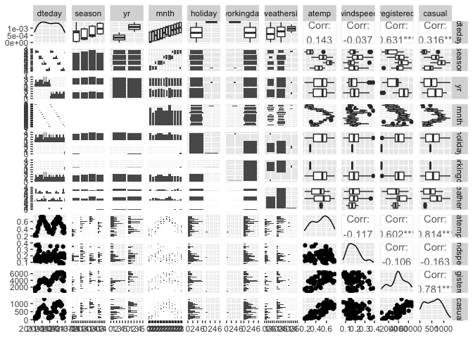
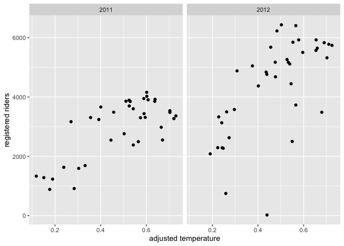
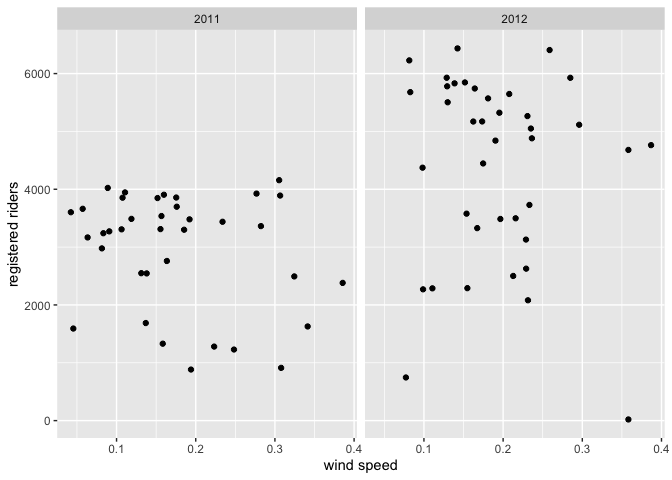
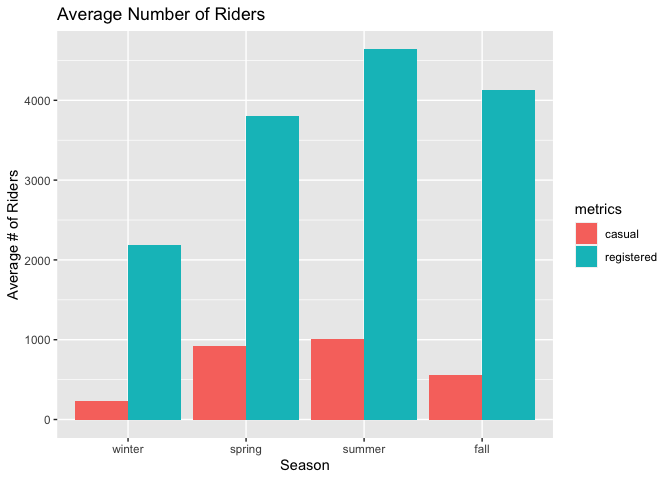
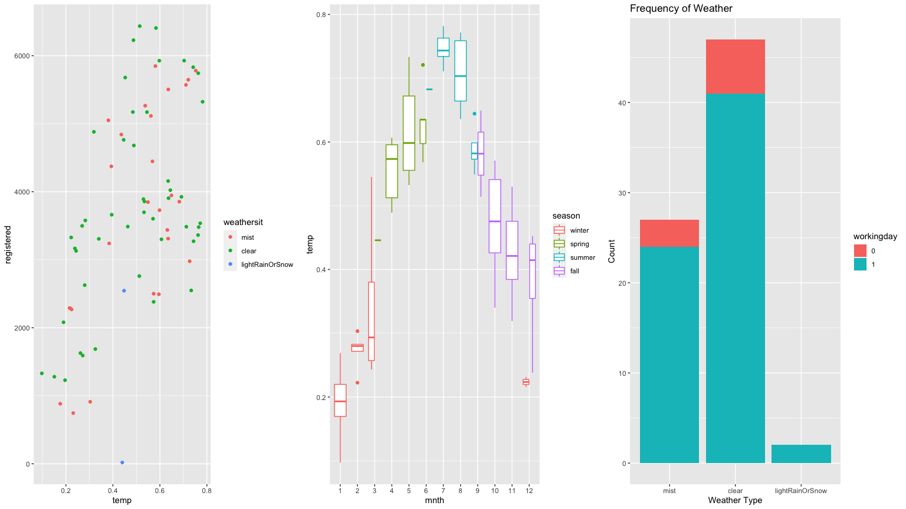
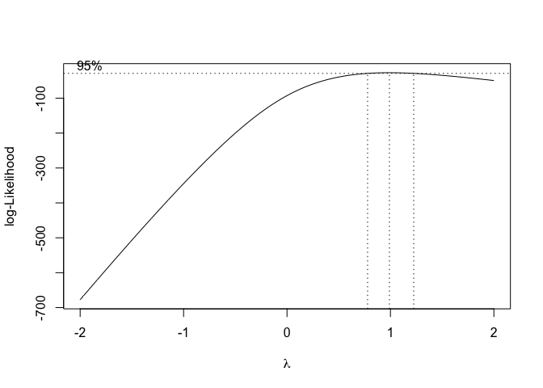
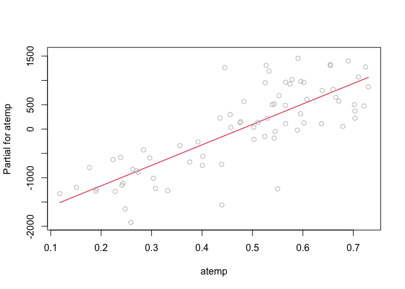

ST 558 Project 2
================
David Arthur
6/28/2021

-   [Introduction](#introduction)
-   [Packages](#packages)
-   [Data](#data)
-   [Summarizations](#summarizations)
-   [Modeling](#modeling)
    -   [First linear regression model](#first-linear-regression-model)
    -   [Second linear regression
        model](#second-linear-regression-model)
    -   [Random Forest Model](#random-forest-model)
    -   [Boosted](#boosted)
-   [Comparison of models](#comparison-of-models)

# Introduction

The data set this program analyzes can be found
[here](https://archive.ics.uci.edu/ml/datasets/Bike+Sharing+Dataset).
The data describes its volume of riders by a few dimensions:

-   season
-   day of the week
-   year
-   month
-   holiday (y/n flag)
-   working day (y/n flag)
-   weather (good, fair, poor, bad)
-   temperature
-   humidity
-   wind

It is further broken down into three response variables:

-   Casual: non-registered riders who use the service casually
-   Registered: registered riders who use the service more regularly
-   Total: casual and registered combined

The split between casual and registered is important, because they
behave completely differently, use the service on different days, times,
holidays, etc. Often, their behavior is inverse of each other, though
the registered rider group is largest portion of riders and would be the
primary client of the business. Keeping in mind that the registered
client represents the largest portion of the clientele, this program
focuses on the registered metric and splits the behavior by each day of
the week.

# Packages

The following packages are required to run this program:

-   tidyverse
-   caret
-   corrplot
-   GGally
-   knitr
-   faraway
-   leaps
-   gridExtra
-   leaps

# Data

We begin by reading in the data, changing the names of some factor
levels, and filtering by day of week

``` r
day <- readr::read_csv("day.csv", col_types = cols(
  season = col_factor(),
  yr = col_factor(),
  mnth = col_factor(),
  holiday = col_factor(),
  weekday = col_factor(),
  workingday = col_factor(),
  weathersit = col_factor()))

day <- day %>% mutate(season = fct_recode(season, winter = "1", spring = "2", summer = "3", fall = "4")) %>%
  mutate(yr = fct_recode(yr, "2011" = "0", "2012" = "1")) %>%
  mutate(weekday = fct_recode(weekday, Sunday = "0", Monday = "1", Tuesday = "2", Wednesday = "3", Thursday = "4", Friday = "5", Saturday = "6")) %>%
  mutate(weathersit = fct_recode(weathersit, clear = "1", mist = "2", lightRainOrSnow = "3", heavyRainOrSnow = "4")) %>%
  filter(weekday == params$dayOfWeek)

# read in version without factors for correlation plot
dayNF <- readr::read_csv("day.csv", col_types = cols(
  weekday = col_factor()))
```

Next, we partition the data into training and test sets

``` r
set.seed(21)
trainIndex <- createDataPartition(day$cnt, p = 0.7, list = FALSE)
dayTrain <- day[trainIndex, ]
dayTest <- day[-trainIndex, ]
```

# Summarizations

We begin our exploratory analysis of the data with a graphical overview
of the relationships between variables. Obvious patterns in the plots,
as well as high correlation values, indicate associations between
variables.

``` r
GGally::ggpairs(dayTrain %>% select(2:6, 8:9, atemp, windspeed, registered, casual))
```

<!-- -->

``` r
# dayNFCor <- cor(as.matrix(dayNF %>% select(3:9, atemp, windspeed, casual, registered,cnt)))
# corrplot(dayNFCor, type = "upper", tl.pos = "lt")
# corrplot(dayNFCor, type = "lower", method = "number", add = TRUE, diag = FALSE, tl.pos = "n")
```

We will now look in more detail at relationships between time-related
variables and the `registered` response variable. When we do our linear
regression modeling we will need to decide which (if any) of these
predictors to use. For example, the date variable (`dteday`) and
`season` may not be useful in the presence of `weekday`, `mnth`, and
`yr` (or vice versa), as they provide largely redundant information.

``` r
g <- ggplot(data = dayTrain)
g + geom_point(aes(x = dteday, y = registered))
```

<!-- -->

``` r
meanByMonthYr <- dayTrain %>% group_by(mnth, yr) %>%
  summarize(meanReg = mean(registered))
```

    ## `summarise()` has grouped output by 'mnth'. You can override using the `.groups` argument.

``` r
g2 <- ggplot(meanByMonthYr, aes(x = mnth))
g2 + geom_bar(aes(y = meanReg, fill = yr), position = "dodge", stat = "identity")
```

<!-- -->

We will look next in more detail at the relationship between
quantitative weather variables and the `registered` response variable.
The appearance of nonlinear relationships in the plots may indicate the
need for quadratic terms in our linear regression models. The adjusted
temperature variable, `atemp`, seems particularly likely to require a
quadratic term, as both low and high temperatures can discourage people
from bicycling. Similarly, with humidity and windspeed, low to moderate
values may have no effect, but particularly high values could have an
effect, so those variables may also require quadratic terms.

``` r
g + geom_point(aes(x = atemp, y = registered)) + facet_wrap(~ yr)
```

<!-- -->

``` r
g + geom_point(aes(x = hum, y = registered)) + facet_wrap(~ yr)
```

<!-- -->

``` r
g + geom_point(aes(x = windspeed, y = registered)) + facet_wrap(~ yr)
```

<!-- -->

We now view at a table displaying the mean number of `registered`,
`casual`, and total riders at each level of the categorical `weathersit`
variable. It seems plausible that in rain or snow, the number of casual
riders might decrease by a larger factor than would the number of
registered riders.

``` r
meanByWeather <- dayTrain %>% group_by(weathersit) %>%
  summarize(meanCas = mean(casual), meanReg = mean(registered), meanTotal = mean(cnt))
kable(meanByWeather, digits = 1, col.names = c("Weather", "Mean Casual Riders", "Mean Registered Riders", "Mean Total Riders"), caption = "Average # of riders by weather category")
```

| Weather         | Mean Casual Riders | Mean Registered Riders | Mean Total Riders |
|:----------------|-------------------:|-----------------------:|------------------:|
| mist            |              698.9 |                 3709.8 |            4408.7 |
| clear           |              691.3 |                 3786.5 |            4477.8 |
| lightRainOrSnow |              111.0 |                 1282.5 |            1393.5 |

Average \# of riders by weather category

Exploratory data analysis and summary (James)

``` r
scatter_james <- ggplot(data=dayTrain, aes(x=temp, y=registered)) +
                 geom_point(aes(color=weathersit))
hist_james <- ggplot(data=dayTrain, aes(x=weathersit)) +
              geom_histogram(stat='count', aes(fill=workingday)) +
              ggtitle('Frequency of Weather') +
              xlab('Weather Type') + ylab('Count')

bar_james <- ggplot(data=dayTrain %>% 
                 select(season, casual, registered) %>%
                 pivot_longer(cols=c(casual, registered),
                              names_to = 'metrics',
                              values_to = 'riders') %>%
                 group_by(season, metrics) %>%
                 summarise(avg_riders = mean(riders)), 
            aes(x=season, y=avg_riders, fill=metrics)) +     
            geom_bar(stat='identity', position='dodge') +
            ggtitle('Average Number of Riders') +
              xlab('Season') + ylab('Average # of Riders')
  
box_james <- ggplot(data=dayTrain, aes(x=mnth, y=temp)) +
             geom_boxplot(aes(color=season))
```

Looking at the bar graph below, in all seasons the registered user base
far out-performs the casual base. This further confirms our plan of
analyzing the registered group as the priority.

<!-- -->

Since we don’t have a domain expert, we need to try to figure out what
variables are important and which we could exclude. We already know that
the two temperature variables have near perfect correlation, and clearly
date is redundant with mnth and yr. I would think season is as well
covered by mnth.

That leaves temperature, weather, and the working day flag as the most
likely to be relevant parameters. Looking at the plots below, I think we
can make a few obvious inferences:

-   looking at the scatter plot on the left, we can see that as the
    temperature goes up, the number of riders also goes up - at least up
    to a point. And even in the highest temperatures, ridership is way
    up over lowest temperatures.
-   the middle figure displays that temperature is highest in spring,
    summer, and early fall
-   looking at the figure on the right, there are very few days of
    extremely poor weather. Most days are clear, which are the best days
    for ridership.

<!-- -->

``` r
summ_james <- dayTrain %>% rename(total = cnt) %>%
              pivot_longer(cols=c(casual, registered, total),
                           names_to = 'metrics',
                           values_to = 'riders') %>%
              group_by(metrics) %>%
              summarise(min = min(riders),
                        lower25 = quantile(riders, 0.25),
                        median = median(riders),
                        mean = mean(riders),
                        upper75 = quantile(riders, 0.75),
                        max = max(riders))  %>%
              pivot_longer(cols=c(min, lower25, median,
                                  mean, upper75, max),
                           names_to = 'Summary',
                           values_to = 'stats') %>%
              pivot_wider(names_from = metrics, values_from = stats)

kable(summ_james, digits=0)
```

| Summary | casual | registered | total |
|:--------|-------:|-----------:|------:|
| min     |      2 |         20 |    22 |
| lower25 |    308 |       2608 |  3327 |
| median  |    690 |       3590 |  4360 |
| mean    |    679 |       3693 |  4372 |
| upper75 |    904 |       4923 |  5917 |
| max     |   3065 |       6435 |  7525 |

``` r
pct_diff <- round((summ_james$registered[3] / summ_james$casual[3] - 1) 
                  * 100, 0)
pct_str <- paste0(pct_diff, '%')

inc_dec <- ''
if (pct_diff >= 0) {
  inc_dec <- 'increased'
} else {
  inc_dec <- 'decreased'
}
```

On the day of the week, Monday, ridership by registered users is
increased by 420%.

# Modeling

We will now fit two linear regression models, using differing
approaches, with the goal of creating a model that does a good job of
predicting the number of registered riders on any given day, based on
the values of the predictor variables in the data set. We will fit the
models using the training data set that we partitioned above, and then
test the accuracy of the models’ predictions using the test data set.

Linear regression estimates the effect of each predictor variable on the
mean value of the response variable, with the other predictor variables
held constant. A linear regression model can be expressed as  
*Y*<sub>*i*</sub> = *β*<sub>0</sub> + *β*<sub>1</sub>*X*<sub>*i*1</sub> + *β*<sub>2</sub>*X*<sub>*i*2</sub> + ... + *β*<sub>*p*</sub>*X*<sub>*i**p*</sub> + *E*<sub>*i*</sub>

where *Y*<sub>*i*</sub> is the response, *i* represents the observation
number, *X*<sub>*i**j*</sub> are the predictor variables, and
*E*<sub>*i*</sub> is the normally distributed random error. The
*β*<sub>*j*</sub> coefficients must be linear, but the predictor
variables can be higher order terms (e.g. *x*<sup>2</sup>) or
interaction terms (e.g. *x*<sub>1</sub>*x*<sub>2</sub>). Creating a
model to estimate the response using observed data, we have  
$\\hat{y\_i} = \\hat\\beta\_0 + \\hat\\beta\_1x\_{i1} + \\hat\\beta\_2x\_{i2} + ... + \\hat\\beta\_px\_{ip}$

The *β̂*<sub>*j*</sub> coefficients (estimates for *β*<sub>*j*</sub>) are
calculated for each predictor variable to minimize the residual sum of
squares, using the observed values of *x*<sub>*i**j*</sub> and
*y*<sub>*i*</sub>  
$min\_{\\beta\_0, \\beta\_1, ..., \\beta\_p}\\sum\_{i=1}^{n}(y\_i - \\beta\_0 - \\beta\_1x\_{i1} - \\beta\_2x\_{i2} - ... - \\beta\_px\_{ip})^2$

The linear regression model can be used for inference, to understand the
relationships between the predictor variables and the response, as well
as for prediction of a mean response given new values of the predictor
variables. There are varying approaches to choosing which predictor
variables to include in a linear regression model. For our first linear
regression model, we ….  
For our second linear regression model, we ….

### First linear regression model

I am starting with a best subsets approach, meaning we will look at all
of the predictors and use cross-validation to choose the one that has
the best prediction capability. Since the training set is only around 80
rows, I opted for four-fold cross validation to leave some data in each
fold.

``` r
library(leaps)

data <- dayTrain %>% 
               drop_na() %>%
               select(-instant,-dteday, -season, 
                    -weekday, -atemp, -casual, -cnt)

#this function converts new data to a model matrix
#so that a prediction can be run via matrix multiplication
#on a best subsets model
predict.regsubsets = function(object,newdata,id,...){
      form = as.formula(object$call[[2]]) 
      mat = model.matrix(form,newdata)    
      coefi = coef(object,id=id)          
      xvars = names(coefi)                
      mat[,xvars]%*%coefi               
}


#let's do cross validation with folds
k <- 4
set.seed(21)
folds <- sample(1:k, nrow(data), replace=T)

cv_errors = matrix(NA, k, 16, dimnames = list(NULL, paste(1:16)))

for (j in 1:k) {
  best <- regsubsets(registered ~ ., 
                     data=data[folds!=j,], nvmax=20)
  
  for (i in 1:16) {
    pred <- predict(best, data[folds==j,], id=i)
    
    
    cv_errors[j, i] <- mean((data$registered[folds==j]-pred)^2)
  }
}
```

    ## Reordering variables and trying again:
    ## Reordering variables and trying again:
    ## Reordering variables and trying again:
    ## Reordering variables and trying again:

``` r
# Take the mean of over all folds for each model size
mean_cv_errors = apply(cv_errors, 2, mean)

# Find the model size with the smallest cross-validation error
min = which.min(mean_cv_errors)

#the model w/ 14 variables was best when using 4 fold cv.
#i did 4 fold because there are only about 80 rows of data per weekday

best <- regsubsets(registered ~ ., 
                           data=data, nvmax=20)
```

    ## Reordering variables and trying again:

``` r
best
```

    ## Subset selection object
    ## Call: regsubsets.formula(registered ~ ., data = data, nvmax = 20)
    ## 19 Variables  (and intercept)
    ##                           Forced in Forced out
    ## yr2012                        FALSE      FALSE
    ## mnth2                         FALSE      FALSE
    ## mnth3                         FALSE      FALSE
    ## mnth4                         FALSE      FALSE
    ## mnth5                         FALSE      FALSE
    ## mnth6                         FALSE      FALSE
    ## mnth7                         FALSE      FALSE
    ## mnth8                         FALSE      FALSE
    ## mnth9                         FALSE      FALSE
    ## mnth10                        FALSE      FALSE
    ## mnth11                        FALSE      FALSE
    ## mnth12                        FALSE      FALSE
    ## holiday1                      FALSE      FALSE
    ## weathersitclear               FALSE      FALSE
    ## weathersitlightRainOrSnow     FALSE      FALSE
    ## temp                          FALSE      FALSE
    ## hum                           FALSE      FALSE
    ## windspeed                     FALSE      FALSE
    ## workingday1                   FALSE      FALSE
    ## 1 subsets of each size up to 18
    ## Selection Algorithm: exhaustive

``` r
lm.fit1$nbest
```

    ## Error in eval(expr, envir, enclos): object 'lm.fit1' not found

``` r
lm.fit1 <- lm(registered ~ yr + mnth + weathersit + temp + hum +
               windspeed +workingday, data=dayTrain)
coef(lm.fit1)
```

    ##               (Intercept)                    yr2012                     mnth2 
    ##                 451.99177                1622.21836                  23.36436 
    ##                     mnth3                     mnth4                     mnth5 
    ##                 117.72471                -305.19445                -449.15930 
    ##                     mnth6                     mnth7                     mnth8 
    ##                 235.04148                -516.89607                -223.46168 
    ##                     mnth9                    mnth10                    mnth11 
    ##                 930.42645                 766.20462                1578.19219 
    ##                    mnth12           weathersitclear weathersitlightRainOrSnow 
    ##                 378.45783                 292.32566               -2530.04236 
    ##                      temp                       hum                 windspeed 
    ##                5530.64950               -1488.74207               -2326.14680 
    ##               workingday1 
    ##                 832.62127

Using best subsets, the following model was obtained: 1047.9513607,
1583.4310196, -548.478257, -720.5805614, -174.4609742, -887.7506557,
-602.3925171, 611.0315934, 615.5440469, 1474.4444767, 285.1701316, 0,
-2529.562122, 6260.7394072, -2295.5544202, -2788.0792387, 895.5168211
451.9917701, 1622.2183602, 23.364355, 117.7247083, -305.19445,
-449.1592987, 235.0414807, -516.8960656, -223.4616839, 930.4264457,
766.2046235, 1578.1921891, 378.4578304, 292.3256572, -2530.0423627,
5530.6494986, -1488.7420743, -2326.1467953, 832.6212736

### Second linear regression model

In this approach, we start with a full linear regression model that
includes all of the predictor variables. We will then reduce
collinearity (correlation among predictor variables) by removing
redundant predictors until we reach an optimal (lowest) AIC. We will
calculate the condition number (*κ*) for each of the candidate models,
which is a measure of collinearity. Roughly, *κ* &lt; 30 is considered
desirable. Finally, we will choose among several variations of the
optimal model (including various higher order terms) using cross
validation (described below).

We begin with the full model, which includes all of the predictors.
`holiday` and `workingday` are excluded for days of the week that
include only one level of `holiday` and `workingday`, respectively.

``` r
mlrFull <- lm(registered ~ dteday + season +  yr + mnth + weathersit + temp + 
                    atemp + hum + windspeed, dayTrain)
if(length(unique(dayTrain$workingday)) != 1){
  mlrFull <- update(mlrFull, . ~ . + workingday)
}
if(length(unique(dayTrain$holiday)) != 1){
  mlrFull <- update(mlrFull, . ~ . + holiday)
}

summary(mlrFull)
```

    ## 
    ## Call:
    ## lm(formula = registered ~ dteday + season + yr + mnth + weathersit + 
    ##     temp + atemp + hum + windspeed + workingday + holiday, data = dayTrain)
    ## 
    ## Residuals:
    ##      Min       1Q   Median       3Q      Max 
    ## -1540.70  -319.12    26.43   373.50  1398.13 
    ## 
    ## Coefficients: (1 not defined because of singularities)
    ##                             Estimate Std. Error t value Pr(>|t|)    
    ## (Intercept)                27299.392 142681.262   0.191   0.8490    
    ## dteday                        -1.724      9.525  -0.181   0.8571    
    ## seasonspring                1612.503    647.957   2.489   0.0161 *  
    ## seasonsummer                2008.652    658.699   3.049   0.0036 ** 
    ## seasonfall                  2579.697    539.710   4.780 1.48e-05 ***
    ## yr2012                      2266.193   3493.561   0.649   0.5194    
    ## mnth2                        211.286    455.325   0.464   0.6446    
    ## mnth3                        339.353    708.660   0.479   0.6340    
    ## mnth4                      -1010.744   1189.185  -0.850   0.3993    
    ## mnth5                      -1041.008   1441.878  -0.722   0.4735    
    ## mnth6                       -358.600   1710.065  -0.210   0.8347    
    ## mnth7                      -1163.167   1978.074  -0.588   0.5591    
    ## mnth8                       -859.847   2279.174  -0.377   0.7075    
    ## mnth9                       -100.476   2522.655  -0.040   0.9684    
    ## mnth10                      -793.125   2756.383  -0.288   0.7747    
    ## mnth11                       -12.831   2985.169  -0.004   0.9966    
    ## mnth12                      -522.406   3255.093  -0.160   0.8731    
    ## weathersitclear               90.549    223.173   0.406   0.6866    
    ## weathersitlightRainOrSnow  -2440.911    544.317  -4.484 4.06e-05 ***
    ## temp                         241.879   6659.400   0.036   0.9712    
    ## atemp                       3928.361   7562.358   0.519   0.6056    
    ## hum                        -2228.487   1006.203  -2.215   0.0312 *  
    ## windspeed                  -3025.800   1319.639  -2.293   0.0259 *  
    ## workingday1                  685.359    269.367   2.544   0.0140 *  
    ## holiday1                          NA         NA      NA       NA    
    ## ---
    ## Signif. codes:  0 '***' 0.001 '**' 0.01 '*' 0.05 '.' 0.1 ' ' 1
    ## 
    ## Residual standard error: 627.9 on 52 degrees of freedom
    ## Multiple R-squared:  0.8806, Adjusted R-squared:  0.8278 
    ## F-statistic: 16.67 on 23 and 52 DF,  p-value: < 2.2e-16

``` r
AIC(mlrFull)
```

    ## [1] 1216.089

``` r
x <- model.matrix(mlrFull)[, -1]
e <- eigen(t(x) %*% x)
# e$val
# condition number = sqrt(e$val[1]/min(e$val))
```

We see that *κ* = 4.3021267^{7}, which is a sign of high collinearity,
so we begin removing insignificant predictors one at a time, each time
checking to confirm that AIC declines, or at least that it increases
only marginally.

To help in consideration of which variables to remove, we view the
correlations. For days of the week that don’t include any holidays, `?`
will appear in the `holiday` and `workingday` rows and columns.

``` r
dayNFCor <- cor(as.matrix(dayNF %>%
                            mutate(weekday = fct_recode(weekday, Sunday = "0", Monday = "1", Tuesday = "2", Wednesday = "3", Thursday = "4", Friday = "5", Saturday = "6")) %>%
                            mutate(dteday = as.numeric(dteday)) %>%
                            filter(weekday == params$dayOfWeek) %>%
                            select(2:6, 8:13, registered)))
corrplot(dayNFCor, type = "upper", tl.pos = "lt")
corrplot(dayNFCor, type = "lower", method = "number", add = TRUE, diag = FALSE, tl.pos = "n")
```

<!-- -->

First, we remove `workingday`, as it is fully determined by the day of
the week and the `holiday` variable, so adds nothing to the model. We
also remove `temp`, as it is almost perfectly correlated with `atemp`,
and `dteday`, which adds little if any predictive value beyond `yr` plus
`mnth` plus `season`.

``` r
mlr2 <- update(mlrFull, . ~ . - workingday - temp - dteday)
summary(mlr2)
```

    ## 
    ## Call:
    ## lm(formula = registered ~ season + yr + mnth + weathersit + atemp + 
    ##     hum + windspeed + holiday, data = dayTrain)
    ## 
    ## Residuals:
    ##      Min       1Q   Median       3Q      Max 
    ## -1532.28  -325.76    31.17   384.35  1399.94 
    ## 
    ## Coefficients:
    ##                           Estimate Std. Error t value Pr(>|t|)    
    ## (Intercept)                2161.05     757.53   2.853  0.00613 ** 
    ## seasonspring               1612.83     620.42   2.600  0.01201 *  
    ## seasonsummer               2016.78     635.44   3.174  0.00248 ** 
    ## seasonfall                 2593.36     523.88   4.950 7.64e-06 ***
    ## yr2012                     1633.36     155.66  10.493 1.21e-14 ***
    ## mnth2                       163.28     367.75   0.444  0.65882    
    ## mnth3                       239.74     428.51   0.559  0.57816    
    ## mnth4                     -1167.33     777.13  -1.502  0.13889    
    ## mnth5                     -1252.94     783.83  -1.598  0.11577    
    ## mnth6                      -623.54     804.89  -0.775  0.44190    
    ## mnth7                     -1478.51     848.18  -1.743  0.08700 .  
    ## mnth8                     -1234.78     829.29  -1.489  0.14232    
    ## mnth9                      -534.02     704.34  -0.758  0.45164    
    ## mnth10                    -1280.71     609.96  -2.100  0.04045 *  
    ## mnth11                     -542.93     606.45  -0.895  0.37462    
    ## mnth12                    -1106.99     488.94  -2.264  0.02761 *  
    ## weathersitclear              84.29     210.88   0.400  0.69097    
    ## weathersitlightRainOrSnow -2456.62     527.47  -4.657 2.13e-05 ***
    ## atemp                      4206.37    1464.75   2.872  0.00582 ** 
    ## hum                       -2269.12     951.14  -2.386  0.02058 *  
    ## windspeed                 -3020.52    1262.72  -2.392  0.02026 *  
    ## holiday1                   -687.67     247.39  -2.780  0.00747 ** 
    ## ---
    ## Signif. codes:  0 '***' 0.001 '**' 0.01 '*' 0.05 '.' 0.1 ' ' 1
    ## 
    ## Residual standard error: 616.4 on 54 degrees of freedom
    ## Multiple R-squared:  0.8805, Adjusted R-squared:  0.834 
    ## F-statistic: 18.95 on 21 and 54 DF,  p-value: < 2.2e-16

``` r
AIC(mlr2)
```

    ## [1] 1212.139

``` r
x <- model.matrix(mlr2)[, -1]
e <- eigen(t(x) %*% x)
# e$val
# condition number = sqrt(e$val[1]/min(e$val))
```

We see that AIC has changed little, and that *κ* = 39.08, which
indicates a large reduction in collinearity.

`mnth`, `weathersit` and `windspeed` appear to be marginally
significant, so we look at the effect of removing each of them from the
model:  
Remove `mnth`

``` r
mlr3 <- update(mlr2, . ~ . - mnth)
summary(mlr3)
```

    ## 
    ## Call:
    ## lm(formula = registered ~ season + yr + weathersit + atemp + 
    ##     hum + windspeed + holiday, data = dayTrain)
    ## 
    ## Residuals:
    ##     Min      1Q  Median      3Q     Max 
    ## -1931.9  -306.4    35.4   368.7  1849.6 
    ## 
    ## Coefficients:
    ##                           Estimate Std. Error t value Pr(>|t|)    
    ## (Intercept)                 2237.9      784.3   2.853  0.00580 ** 
    ## seasonspring                 836.6      435.8   1.920  0.05929 .  
    ## seasonsummer                1178.8      515.5   2.287  0.02547 *  
    ## seasonfall                  1835.3      315.5   5.818 1.99e-07 ***
    ## yr2012                      1619.7      162.1   9.993 9.17e-15 ***
    ## weathersitclear              132.8      211.0   0.629  0.53142    
    ## weathersitlightRainOrSnow  -2433.4      564.9  -4.308 5.69e-05 ***
    ## atemp                       3554.8     1163.1   3.056  0.00325 ** 
    ## hum                        -2432.9      946.5  -2.570  0.01246 *  
    ## windspeed                  -2263.9     1286.1  -1.760  0.08306 .  
    ## holiday1                    -709.8      251.1  -2.827  0.00623 ** 
    ## ---
    ## Signif. codes:  0 '***' 0.001 '**' 0.01 '*' 0.05 '.' 0.1 ' ' 1
    ## 
    ## Residual standard error: 683.2 on 65 degrees of freedom
    ## Multiple R-squared:  0.8233, Adjusted R-squared:  0.7961 
    ## F-statistic: 30.28 on 10 and 65 DF,  p-value: < 2.2e-16

``` r
AIC(mlr3)
```

    ## [1] 1219.873

``` r
x <- model.matrix(mlr3)[, -1]
e <- eigen(t(x) %*% x)
# e$val
# condition number = sqrt(e$val[1]/min(e$val))
```

Remove `weathersit`

``` r
mlr4 <- update(mlr2, . ~ . - weathersit)
# summary(mlr4)
AIC(mlr4)
```

    ## [1] 1233.915

``` r
x <- model.matrix(mlr4)[, -1]
e <- eigen(t(x) %*% x)
# e$val
# condition # =
# sqrt(e$val[1]/min(e$val))
```

Remove `windspeed`

``` r
mlr5 <- update(mlr2, . ~ . - windspeed)
# summary(mlr5)
AIC(mlr5)
```

    ## [1] 1217.793

``` r
x <- model.matrix(mlr5)[, -1]
e <- eigen(t(x) %*% x)
# e$val
# condition # =
# sqrt(e$val[1]/min(e$val))
```

For `mnth`, `weathersit`, and `windspeed`, removal from the model
results in only marginal change to AIC. If our main goal were inference
and understanding the relationships between the variables, we might want
to remove them from the model for the sake of simplicity,
interpretability, and more narrow confidence intervals. Because our
primary goal here is prediction, we will leave them in the model, and
choose mlr2 as our base linear regression model.

We will now do some diagnostic plots on our base model, and then
consider adding higher order terms to the model.

``` r
# compare to model chosen by leaps::step() function
mlrStep <- step(mlrFull)
```

    ## Start:  AIC=998.41
    ## registered ~ dteday + season + yr + mnth + weathersit + temp + 
    ##     atemp + hum + windspeed + workingday + holiday
    ## 
    ## 
    ## Step:  AIC=998.41
    ## registered ~ dteday + season + yr + mnth + weathersit + temp + 
    ##     atemp + hum + windspeed + workingday
    ## 
    ##              Df Sum of Sq      RSS     AIC
    ## - temp        1       520 20504451  996.41
    ## - dteday      1     12918 20516849  996.46
    ## - atemp       1    106400 20610331  996.80
    ## - yr          1    165917 20669847  997.02
    ## <none>                    20503930  998.41
    ## - hum         1   1934117 22438048 1003.26
    ## - windspeed   1   2073022 22576953 1003.73
    ## - mnth       11   8882048 29385978 1003.76
    ## - workingday  1   2552599 23056530 1005.33
    ## - weathersit  2   8023747 28527678 1019.51
    ## - season      3   9347959 29851889 1020.96
    ## 
    ## Step:  AIC=996.41
    ## registered ~ dteday + season + yr + mnth + weathersit + atemp + 
    ##     hum + windspeed + workingday
    ## 
    ##              Df Sum of Sq      RSS     AIC
    ## - dteday      1     13102 20517552  994.46
    ## - yr          1    166477 20670928  995.03
    ## <none>                    20504451  996.41
    ## - hum         1   2027047 22531498 1001.58
    ## - mnth       11   8896501 29400951 1001.80
    ## - windspeed   1   2165247 22669698 1002.04
    ## - workingday  1   2846360 23350810 1004.29
    ## - atemp       1   3117192 23621642 1005.17
    ## - weathersit  2   8042305 28546756 1017.56
    ## - season      3   9369419 29873870 1019.01
    ## 
    ## Step:  AIC=994.46
    ## registered ~ season + yr + mnth + weathersit + atemp + hum + 
    ##     windspeed + workingday
    ## 
    ##              Df Sum of Sq      RSS     AIC
    ## <none>                    20517552  994.46
    ## - hum         1   2162511 22680064 1000.08
    ## - windspeed   1   2174091 22691643 1000.11
    ## - mnth       11   9823764 30341317 1002.19
    ## - workingday  1   2935929 23453482 1002.62
    ## - atemp       1   3133407 23650959 1003.26
    ## - weathersit  2   8284279 28801832 1016.24
    ## - season      3   9658325 30175877 1017.78
    ## - yr          1  41837561 62355113 1076.94

``` r
names(mlrStep)
```

    ##  [1] "coefficients"  "residuals"     "effects"       "rank"         
    ##  [5] "fitted.values" "assign"        "qr"            "df.residual"  
    ##  [9] "contrasts"     "xlevels"       "call"          "terms"        
    ## [13] "model"         "anova"

``` r
mlrStep$call
```

    ## lm(formula = registered ~ season + yr + mnth + weathersit + atemp + 
    ##     hum + windspeed + workingday, data = dayTrain)

``` r
mlr2$call
```

    ## lm(formula = registered ~ season + yr + mnth + weathersit + atemp + 
    ##     hum + windspeed + holiday, data = dayTrain)

``` r
AIC(mlr2, mlrStep)
```

    ##         df      AIC
    ## mlr2    23 1212.139
    ## mlrStep 23 1212.139

``` r
# does mlr3  agrees with step() choice?
```

We can check for constant variance of our error term, an assumption of
our model, by looking at a plot of the model’s fitted values vs the
residuals (difference between fitted response and observed response). A
“megaphone” shape can indicate non-constant variance.

``` r
plot(mlr2$fitted, mlr3$residuals)
```

<!-- -->

Another way to assess constant variance is with the Box-Cox method,
which can suggest transformations of the response to address problems
with non-constant variance. If the maximum log-likelihood of *λ* close
to 1, as in this case, indicates that non-constant variance is not a
problem with the existing model.

``` r
MASS::boxcox(mlr2)
```

<!-- -->

We will also look at for signs of nonlinearity, which can indicate the
need for quadratic terms for some of the predictors. The partial
residual plots below plot the relationship between each predictor and
the response, with the effect of the other predictors removed.

``` r
termplot( mlr2, partial.resid = TRUE, terms = c("atemp", "windspeed", "hum"))
```

<!-- --><!-- --><!-- -->

For at least some days of the week there is a nonlinear pattern to the
plots, particularly for `atemp`, so we will try adding quadratic terms
for each of them to our base model.

Try adding *a**t**e**m**p*<sup>2</sup>

``` r
mlr8 <- update(mlr2, . ~ . + I(atemp^2))
summary(mlr8)
```

    ## 
    ## Call:
    ## lm(formula = registered ~ season + yr + mnth + weathersit + atemp + 
    ##     hum + windspeed + holiday + I(atemp^2), data = dayTrain)
    ## 
    ## Residuals:
    ##     Min      1Q  Median      3Q     Max 
    ## -1566.9  -365.9   -44.7   354.1  1391.6 
    ## 
    ## Coefficients:
    ##                           Estimate Std. Error t value Pr(>|t|)    
    ## (Intercept)                1177.55    1054.35   1.117  0.26910    
    ## seasonspring               1361.98     644.21   2.114  0.03922 *  
    ## seasonsummer               1819.47     648.12   2.807  0.00698 ** 
    ## seasonfall                 2354.13     550.35   4.278 7.93e-05 ***
    ## yr2012                     1582.76     159.16   9.945 1.02e-13 ***
    ## mnth2                       -98.89     414.88  -0.238  0.81251    
    ## mnth3                       -33.22     472.31  -0.070  0.94419    
    ## mnth4                     -1342.40     782.76  -1.715  0.09220 .  
    ## mnth5                     -1272.40     778.43  -1.635  0.10806    
    ## mnth6                      -626.72     799.20  -0.784  0.43642    
    ## mnth7                     -1255.14     858.74  -1.462  0.14975    
    ## mnth8                     -1140.40     826.48  -1.380  0.17343    
    ## mnth9                      -656.68     705.40  -0.931  0.35611    
    ## mnth10                    -1459.79     620.41  -2.353  0.02237 *  
    ## mnth11                     -719.61     616.62  -1.167  0.24843    
    ## mnth12                    -1200.59     490.55  -2.447  0.01773 *  
    ## weathersitclear             128.85     212.05   0.608  0.54603    
    ## weathersitlightRainOrSnow -2447.59     523.79  -4.673 2.08e-05 ***
    ## atemp                     10740.87    5119.87   2.098  0.04070 *  
    ## hum                       -2352.26     946.48  -2.485  0.01614 *  
    ## windspeed                 -2866.23    1259.14  -2.276  0.02689 *  
    ## holiday1                   -639.96     248.24  -2.578  0.01275 *  
    ## I(atemp^2)                -7346.30    5518.80  -1.331  0.18884    
    ## ---
    ## Signif. codes:  0 '***' 0.001 '**' 0.01 '*' 0.05 '.' 0.1 ' ' 1
    ## 
    ## Residual standard error: 612 on 53 degrees of freedom
    ## Multiple R-squared:  0.8844, Adjusted R-squared:  0.8364 
    ## F-statistic: 18.43 on 22 and 53 DF,  p-value: < 2.2e-16

``` r
AIC(mlr8)
```

    ## [1] 1211.64

Reduced or similar AIC, so keep mlr8 as new base model.

Try adding *h**u**m*<sup>2</sup>

``` r
mlr9 <- update(mlr8, . ~ . + I(hum^2))
summary(mlr9)
```

    ## 
    ## Call:
    ## lm(formula = registered ~ season + yr + mnth + weathersit + atemp + 
    ##     hum + windspeed + holiday + I(atemp^2) + I(hum^2), data = dayTrain)
    ## 
    ## Residuals:
    ##      Min       1Q   Median       3Q      Max 
    ## -1558.86  -348.74   -13.89   355.57  1436.26 
    ## 
    ## Coefficients:
    ##                           Estimate Std. Error t value Pr(>|t|)    
    ## (Intercept)                 -187.3     2162.8  -0.087 0.931322    
    ## seasonspring                1354.6      647.2   2.093 0.041241 *  
    ## seasonsummer                1804.9      651.4   2.771 0.007736 ** 
    ## seasonfall                  2423.9      561.2   4.319 7.06e-05 ***
    ## yr2012                      1601.1      161.9   9.891 1.52e-13 ***
    ## mnth2                       -171.7      428.7  -0.400 0.690443    
    ## mnth3                       -134.3      494.6  -0.271 0.787095    
    ## mnth4                      -1375.1      787.6  -1.746 0.086728 .  
    ## mnth5                      -1356.3      790.5  -1.716 0.092155 .  
    ## mnth6                       -714.2      811.9  -0.880 0.383071    
    ## mnth7                      -1316.4      866.8  -1.519 0.134886    
    ## mnth8                      -1214.2      836.4  -1.452 0.152621    
    ## mnth9                       -759.0      722.6  -1.050 0.298388    
    ## mnth10                     -1647.4      675.0  -2.441 0.018102 *  
    ## mnth11                      -900.2      667.8  -1.348 0.183484    
    ## mnth12                     -1275.9      503.6  -2.533 0.014351 *  
    ## weathersitclear              135.4      213.2   0.635 0.528258    
    ## weathersitlightRainOrSnow  -2279.0      575.4  -3.960 0.000229 ***
    ## atemp                      11444.1     5234.0   2.186 0.033303 *  
    ## hum                         1814.0     5834.3   0.311 0.757105    
    ## windspeed                  -2740.1     1276.8  -2.146 0.036557 *  
    ## holiday1                    -670.9      253.0  -2.652 0.010589 *  
    ## I(atemp^2)                 -8134.5     5649.7  -1.440 0.155917    
    ## I(hum^2)                   -3264.4     4510.3  -0.724 0.472450    
    ## ---
    ## Signif. codes:  0 '***' 0.001 '**' 0.01 '*' 0.05 '.' 0.1 ' ' 1
    ## 
    ## Residual standard error: 614.8 on 52 degrees of freedom
    ## Multiple R-squared:  0.8855, Adjusted R-squared:  0.8349 
    ## F-statistic: 17.49 on 23 and 52 DF,  p-value: < 2.2e-16

``` r
AIC(mlr9)
```

    ## [1] 1212.878

Similar AIC for most days of week, so keep mlr9 as a candidate model to
compare using cross validation.

Try adding *w**i**n**d**s**p**e**e**d*<sup>2</sup>

``` r
mlr10 <- update(mlr8, . ~ . + I(windspeed^2))
summary(mlr10)
```

    ## 
    ## Call:
    ## lm(formula = registered ~ season + yr + mnth + weathersit + atemp + 
    ##     hum + windspeed + holiday + I(atemp^2) + I(windspeed^2), 
    ##     data = dayTrain)
    ## 
    ## Residuals:
    ##      Min       1Q   Median       3Q      Max 
    ## -1562.15  -273.65   -42.55   367.68  1190.22 
    ## 
    ## Coefficients:
    ##                            Estimate Std. Error t value Pr(>|t|)    
    ## (Intercept)                  126.90    1111.62   0.114  0.90955    
    ## seasonspring                1793.59     647.16   2.771  0.00772 ** 
    ## seasonsummer                2103.70     635.33   3.311  0.00169 ** 
    ## seasonfall                  2503.13     533.16   4.695 1.98e-05 ***
    ## yr2012                      1497.79     157.43   9.514 5.64e-13 ***
    ## mnth2                         -9.64     400.83  -0.024  0.98090    
    ## mnth3                         73.27     456.53   0.160  0.87311    
    ## mnth4                      -1546.26     757.90  -2.040  0.04643 *  
    ## mnth5                      -1766.20     778.60  -2.268  0.02748 *  
    ## mnth6                       -994.75     784.94  -1.267  0.21069    
    ## mnth7                      -1435.77     829.50  -1.731  0.08940 .  
    ## mnth8                      -1395.82     802.45  -1.739  0.08787 .  
    ## mnth9                       -856.46     683.85  -1.252  0.21602    
    ## mnth10                     -1436.66     596.69  -2.408  0.01964 *  
    ## mnth11                      -854.54     595.84  -1.434  0.15751    
    ## mnth12                     -1120.84     472.99  -2.370  0.02155 *  
    ## weathersitclear              136.34     203.94   0.669  0.50676    
    ## weathersitlightRainOrSnow  -2322.03     506.62  -4.583 2.90e-05 ***
    ## atemp                      11616.48    4938.04   2.352  0.02247 *  
    ## hum                        -2320.98     910.26  -2.550  0.01377 *  
    ## windspeed                   7029.36    4460.15   1.576  0.12108    
    ## holiday1                    -600.70     239.32  -2.510  0.01522 *  
    ## I(atemp^2)                 -8401.32    5326.73  -1.577  0.12081    
    ## I(windspeed^2)            -24290.00   10536.85  -2.305  0.02518 *  
    ## ---
    ## Signif. codes:  0 '***' 0.001 '**' 0.01 '*' 0.05 '.' 0.1 ' ' 1
    ## 
    ## Residual standard error: 588.6 on 52 degrees of freedom
    ## Multiple R-squared:  0.8951, Adjusted R-squared:  0.8487 
    ## F-statistic: 19.29 on 23 and 52 DF,  p-value: < 2.2e-16

``` r
AIC(mlr10)
```

    ## [1] 1206.245

Similar AIC for most days of week, so keep mlr10 as a candidate model to
compare using cross validation.

Try including all 3 quadratic terms

``` r
mlr11 <- update(mlr8, . ~ . + I(hum^2) + I(windspeed^2))
summary(mlr11)
```

    ## 
    ## Call:
    ## lm(formula = registered ~ season + yr + mnth + weathersit + atemp + 
    ##     hum + windspeed + holiday + I(atemp^2) + I(hum^2) + I(windspeed^2), 
    ##     data = dayTrain)
    ## 
    ## Residuals:
    ##     Min      1Q  Median      3Q     Max 
    ## -1556.3  -270.8   -34.3   349.7  1227.3 
    ## 
    ## Coefficients:
    ##                             Estimate Std. Error t value Pr(>|t|)    
    ## (Intercept)                 -848.790   2105.533  -0.403 0.688542    
    ## seasonspring                1778.884    652.123   2.728 0.008722 ** 
    ## seasonsummer                2086.873    640.395   3.259 0.001995 ** 
    ## seasonfall                  2550.941    543.856   4.690 2.08e-05 ***
    ## yr2012                      1513.062    160.940   9.401 1.01e-12 ***
    ## mnth2                        -64.821    415.974  -0.156 0.876783    
    ## mnth3                         -2.943    480.289  -0.006 0.995135    
    ## mnth4                      -1565.775    763.894  -2.050 0.045550 *  
    ## mnth5                      -1816.930    789.367  -2.302 0.025468 *  
    ## mnth6                      -1050.789    796.891  -1.319 0.193190    
    ## mnth7                      -1476.673    838.481  -1.761 0.084211 .  
    ## mnth8                      -1444.273    812.751  -1.777 0.081529 .  
    ## mnth9                       -926.974    700.465  -1.323 0.191615    
    ## mnth10                     -1574.406    651.379  -2.417 0.019263 *  
    ## mnth11                      -983.727    644.700  -1.526 0.133221    
    ## mnth12                     -1177.652    487.406  -2.416 0.019304 *  
    ## weathersitclear              140.944    205.498   0.686 0.495905    
    ## weathersitlightRainOrSnow  -2201.386    555.701  -3.961 0.000232 ***
    ## atemp                      12112.009   5053.487   2.397 0.020244 *  
    ## hum                          725.935   5644.311   0.129 0.898169    
    ## windspeed                   6907.974   4495.983   1.536 0.130603    
    ## holiday1                    -624.171    244.738  -2.550 0.013807 *  
    ## I(atemp^2)                 -8955.067   5457.667  -1.641 0.106988    
    ## I(hum^2)                   -2387.880   4364.770  -0.547 0.586710    
    ## I(windspeed^2)            -23765.494  10651.805  -2.231 0.030097 *  
    ## ---
    ## Signif. codes:  0 '***' 0.001 '**' 0.01 '*' 0.05 '.' 0.1 ' ' 1
    ## 
    ## Residual standard error: 592.6 on 51 degrees of freedom
    ## Multiple R-squared:  0.8957, Adjusted R-squared:  0.8466 
    ## F-statistic: 18.25 on 24 and 51 DF,  p-value: < 2.2e-16

``` r
AIC(mlr11)
```

    ## [1] 1207.8

Similar AIC for most days of week, so keep mlr11 as a candidate model to
compare using cross validation.

We will now compare the 4 candidate models using cross validation. Cross
validation subdivides the training set into *k* folds, then fits a model
using *k* − 1 of those folds, and tests its accuracy predicting on the
*k*<sup>*t**h*</sup> fold. This is repeated *k* − 1 more times, so that
each fold gets a turn as the test set. Several measures of the
performance of the model are returned. We will choose the best model in
terms of lowest Root Mean Squared Error.

``` r
if(length(unique(dayTrain$holiday)) != 1){
  mlrFit8 <- train(registered ~ season + yr + mnth + holiday + weathersit + atemp + hum + windspeed + I(atemp^2), data = dayTrain,
      method = "lm",
      preProcess = c("center", "scale"),
      trControl = trainControl(method = "repeatedcv", number = 4, repeats = 3))
  
  mlrFit9 <- train(registered ~ season + yr + mnth + holiday + weathersit + atemp + hum + windspeed + I(atemp^2) + I(hum^2), data = dayTrain,
      method = "lm",
      preProcess = c("center", "scale"),
      trControl = trainControl(method = "repeatedcv", number = 4, repeats = 3))
  
  mlrFit10 <- train(registered ~ season + yr + mnth + holiday + weathersit + atemp + hum + windspeed + I(atemp^2) + I(windspeed^2), data = dayTrain,
      method = "lm",
      preProcess = c("center", "scale"),
      trControl = trainControl(method = "repeatedcv", number = 4, repeats = 3))
  
  mlrFit11 <- train(registered ~ season + yr + mnth + holiday + weathersit + atemp + hum + windspeed + I(atemp^2) + I(hum^2)+ I(windspeed^2), data = dayTrain,
      method = "lm",
      preProcess = c("center", "scale"),
      trControl = trainControl(method = "repeatedcv", number = 4, repeats = 3))
}else{
  mlrFit8 <- train(registered ~ season + yr + mnth + weathersit + atemp + hum + windspeed + I(atemp^2), data = dayTrain,
      method = "lm",
      preProcess = c("center", "scale"),
      trControl = trainControl(method = "repeatedcv", number = 4, repeats = 3))
  
  mlrFit9 <- train(registered ~ season + yr + mnth + weathersit + atemp + hum + windspeed + I(atemp^2) + I(hum^2), data = dayTrain,
      method = "lm",
      preProcess = c("center", "scale"),
      trControl = trainControl(method = "repeatedcv", number = 4, repeats = 3))
  
  mlrFit10 <- train(registered ~ season + yr + mnth + weathersit + atemp + hum + windspeed + I(atemp^2) + I(windspeed^2), data = dayTrain,
      method = "lm",
      preProcess = c("center", "scale"),
      trControl = trainControl(method = "repeatedcv", number = 4, repeats = 3))
  
  mlrFit11 <- train(registered ~ season + yr + mnth + weathersit + atemp + hum + windspeed + I(atemp^2) + I(hum^2)+ I(windspeed^2), data = dayTrain,
      method = "lm",
      preProcess = c("center", "scale"),
      trControl = trainControl(method = "repeatedcv", number = 4, repeats = 3))
}
comparison <- data.frame(t(mlrFit8$results), t(mlrFit9$results), t(mlrFit10$results), t(mlrFit11$results))
colnames(comparison) <- c("mlrFit8", "mlrFit9", "mlrFit10", "mlrFit11")
kable(comparison)
```

|            |     mlrFit8 |     mlrFit9 |    mlrFit10 |    mlrFit11 |
|:-----------|------------:|------------:|------------:|------------:|
| intercept  |   1.0000000 |   1.0000000 |   1.0000000 |   1.0000000 |
| RMSE       | 967.7509391 | 992.0796232 | 909.0834247 | 974.5677765 |
| Rsquared   |   0.6543021 |   0.6711969 |   0.6943449 |   0.6680313 |
| MAE        | 679.3410058 | 666.6009513 | 638.1652157 | 684.1711530 |
| RMSESD     | 277.0909062 | 213.3720900 | 198.7022294 | 244.8240444 |
| RsquaredSD |   0.1684956 |   0.1008620 |   0.1156767 |   0.1315776 |
| MAESD      | 128.9866589 |  91.5171889 |  86.3073220 | 148.9167606 |

Save the model with the lowest RMSE as our second linear regression
model.

``` r
candidates <- list(mlrFit8 = mlrFit8, mlrFit9 = mlrFit9, mlrFit10 = mlrFit10, mlrFit11 = mlrFit11)
indexLowestRMSE <- which.min(c(candidates[[1]][["results"]]["RMSE"], candidates[[2]][["results"]]["RMSE"], candidates[[3]][["results"]]["RMSE"], candidates[[4]][["results"]]["RMSE"]))
mlrFinal2 <- candidates[[1]]
mlrFinal2$call
```

    ## train.formula(form = registered ~ season + yr + mnth + holiday + 
    ##     weathersit + atemp + hum + windspeed + I(atemp^2), data = dayTrain, 
    ##     method = "lm", preProcess = c("center", "scale"), trControl = trainControl(method = "repeatedcv", 
    ##         number = 4, repeats = 3))

The model with the lowest RMSE for Monday is mlrFit10

### Random Forest Model

Intro to Random Forest …

``` r
rfFit <- train(registered ~ . - instant - casual - cnt, data = dayTrain,
               method = "rf",
               trControl = trainControl(method = "repeatedcv", number = 4, repeats = 3),
               preProcess = c("center", "scale"),
               tuneGrid = expand.grid(mtry = c(2, 7, 10:16, 20, 24)))
rfFit
```

    ## Random Forest 
    ## 
    ## 76 samples
    ## 15 predictors
    ## 
    ## Pre-processing: centered (30), scaled (30) 
    ## Resampling: Cross-Validated (4 fold, repeated 3 times) 
    ## Summary of sample sizes: 57, 58, 56, 57, 57, 57, ... 
    ## Resampling results across tuning parameters:
    ## 
    ##   mtry  RMSE       Rsquared   MAE     
    ##    2    1099.2526  0.6221036  864.0146
    ##    7     880.1548  0.6740248  622.4924
    ##   10     876.5366  0.6707949  609.1736
    ##   11     873.3618  0.6696950  603.6382
    ##   12     878.0892  0.6668264  603.1467
    ##   13     880.5348  0.6621370  606.6115
    ##   14     880.5196  0.6619755  605.2640
    ##   15     875.7190  0.6662638  602.5553
    ##   16     880.9798  0.6602715  606.9192
    ##   20     894.0914  0.6511083  613.9828
    ##   24     901.2209  0.6448321  616.6264
    ## 
    ## RMSE was used to select the optimal model using the smallest value.
    ## The final value used for the model was mtry = 11.

### Boosted

``` r
n.trees <- seq(5, 100, 5)
int.depth <- 1:10
shrinkage <- seq(0.05, 0.2, 0.05)
minobs <- seq(2, 12, 2)
grid <- expand.grid(n.trees = n.trees, 
                    interaction.depth = int.depth, 
                    shrinkage = shrinkage, 
                    n.minobsinnode = minobs)

trControl <- trainControl(method='repeatedcv', number=4, repeats=10)
set.seed(1)
fit_boost <- train(registered ~ ., 
                   data=dayTrain %>% 
                        drop_na() %>%
                        select(-instant,-dteday, -season, 
                               -weekday, -atemp, -casual, -cnt),
                   method='gbm',
                   tuneGrid = grid,
                   trControl=trControl, 
                   verbose=FALSE)
```

# Comparison of models

Discussion …

``` r
# declaration of "winner" needs to be automated
mlrFinal1Pred <- predict(lm.fit1, newdata=dayTest)
mlrFinal2Pred <- predict(mlrFinal2, newdata = dayTest)
rfFitPred <- predict(rfFit, newdata = dayTest)
boostPred <- predict(fit_boost, newdata=dayTest)
postResample(mlrFinal1Pred, dayTest$registered)
```

    ##      RMSE  Rsquared       MAE 
    ## 777.90576   0.73285 668.08870

``` r
postResample(mlrFinal2Pred, dayTest$registered)
```

    ##        RMSE    Rsquared         MAE 
    ## 737.1913258   0.7569418 593.3913248

``` r
postResample(rfFitPred, dayTest$registered)
```

    ##        RMSE    Rsquared         MAE 
    ## 669.1504546   0.8261894 482.5267613

``` r
postResample(boostPred, dayTest$registered)
```

    ##        RMSE    Rsquared         MAE 
    ## 533.5113721   0.8831697 405.6234559

I added an initial version of my MLR and random forest models, and wrote
a separate R script (ST558RenderProject2.r) to automate the reports for
each day of the week. There’s still plenty of clean-up to do with the
output, but the automation generally seems to be working. Since the
dataset now includes only one weekday at a time, some of our graphs,
tables, etc. that included weekday don’t make as much sense. I still
have some questions about whether we’re supposed to do any initial data
exploration with the full training set, or if we only work with one day
at a time. I might post a question on the discussion board or go to
Wednesday office hours unless it’s clear to you.
