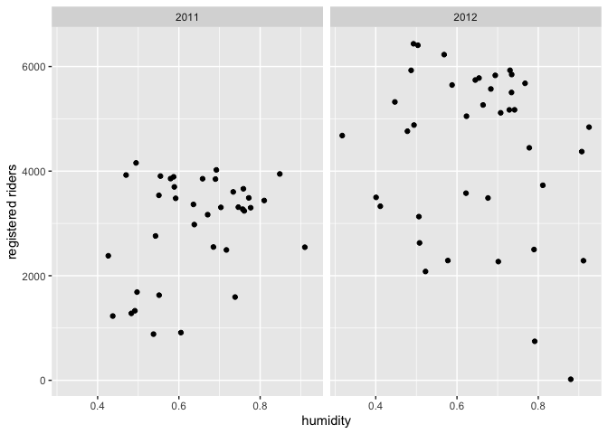
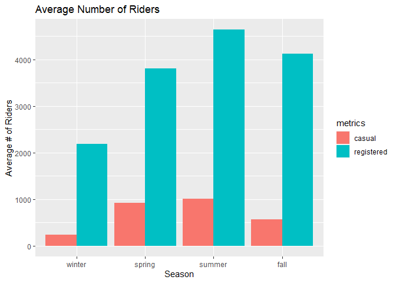
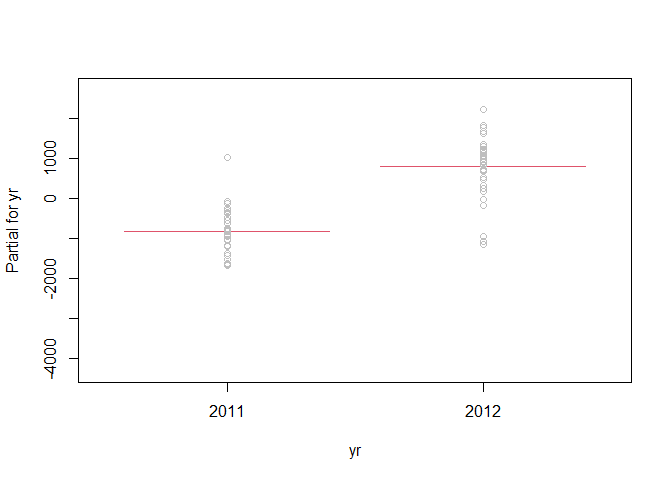

ST 558 Project 2
================
David Arthur
6/28/2021

-   [Introduction](#introduction)
-   [Summarizations](#summarizations)
-   [Modeling](#modeling)
    -   [Second linear regression
        model](#second-linear-regression-model)

# Introduction

The data set this program analyzes can be found
[here](https://archive.ics.uci.edu/ml/datasets/Bike+Sharing+Dataset).
The data describes its volume of riders by a few dimensions:

-   season
-   day of the week
-   year
-   month
-   holiday (y/n flag)
-   working day (y/n flag)
-   weather (good, fair, poor, bad)
-   temperature
-   humidity
-   wind

It is further broken down into three response variables:

-   Casual: non-registered riders who use the service casually
-   Registered: registered riders who use the service more regularly
-   Total: casual and registered combined

The split between casual and registered is important, because they
behave completely differently, use the service on different days, times,
holidays, etc. Often, their behavior is inverse of each other, though
the registered rider group is largest portion of riders and would be the
primary client of the business. Keeping in mind that the registered
client represents the largest portion of the clientele, this program
focuses on the registered metric and splits the behavior by each day of
the week.

We begin by reading in the data, changing the names of some factor
levels, and filtering by day of week

``` r
day <- readr::read_csv("day.csv", col_types = cols(
  season = col_factor(),
  yr = col_factor(),
  mnth = col_factor(),
  holiday = col_factor(),
  weekday = col_factor(),
  workingday = col_factor(),
  weathersit = col_factor()))

day <- day %>% mutate(season = fct_recode(season, winter = "1", spring = "2", summer = "3", fall = "4")) %>%
  mutate(yr = fct_recode(yr, "2011" = "0", "2012" = "1")) %>%
  mutate(weekday = fct_recode(weekday, Sunday = "0", Monday = "1", Tuesday = "2", Wednesday = "3", Thursday = "4", Friday = "5", Saturday = "6")) %>%
  mutate(weathersit = fct_recode(weathersit, clear = "1", mist = "2", lightRainOrSnow = "3", heavyRainOrSnow = "4")) %>%
  filter(weekday == params$dayOfWeek)

# read in version without factors for correlation plot
dayNF <- readr::read_csv("day.csv", col_types = cols(
  weekday = col_factor()))
```

Next, we partition the data into training and test sets

``` r
set.seed(21)
trainIndex <- createDataPartition(day$cnt, p = 0.7, list = FALSE)
dayTrain <- day[trainIndex, ]
dayTest <- day[-trainIndex, ]
```

# Summarizations

We begin our exploratory analysis of the data with a graphical overview
of the relationships between variables. Obvious patterns in the plots,
as well as high correlation values, indicate associations between
variables.

``` r
GGally::ggpairs(dayTrain %>% select(2:6, 8:9, atemp, windspeed, registered, casual))
```

<!-- -->

``` r
# dayNFCor <- cor(as.matrix(dayNF %>% select(3:9, atemp, windspeed, casual, registered,cnt)))
# corrplot(dayNFCor, type = "upper", tl.pos = "lt")
# corrplot(dayNFCor, type = "lower", method = "number", add = TRUE, diag = FALSE, tl.pos = "n")
```

We will now look in more detail at relationships between time-related
variables and the `registered` response variable. When we do our linear
regression modeling we will need to decide which (if any) of these
predictors to use. For example, the date variable (`dteday`) and
`season` may not be useful in the presence of `weekday`, `mnth`, and
`yr` (or vice versa), as they provide largely redundant information.

``` r
g <- ggplot(data = dayTrain)
g + geom_point(aes(x = dteday, y = registered))
```

<!-- -->

``` r
meanByMonthYr <- dayTrain %>% group_by(mnth, yr) %>%
  summarize(meanReg = mean(registered))
```

    ## `summarise()` has grouped output by 'mnth'. You can override using the `.groups` argument.

``` r
g2 <- ggplot(meanByMonthYr, aes(x = mnth))
g2 + geom_bar(aes(y = meanReg, fill = yr), position = "dodge", stat = "identity")
```

<!-- -->

We will look next in more detail at the relationship between
quantitative weather variables and the `registered` response variable.
The appearance of nonlinear relationships in the plots may indicate the
need for quadratic terms in our linear regression models. The adjusted
temperature variable, `atemp`, seems particularly likely to require a
quadratic term, as both low and high temperatures can discourage people
from bicycling. Similarly, with humidity and windspeed, low to moderate
values may have no effect, but particularly high values could have an
effect, so those variables may also require quadratic terms.

``` r
g + geom_point(aes(x = atemp, y = registered)) + facet_wrap(~ yr)
```

<!-- -->

``` r
g + geom_point(aes(x = hum, y = registered)) + facet_wrap(~ yr)
```

<!-- -->

``` r
g + geom_point(aes(x = windspeed, y = registered)) + facet_wrap(~ yr)
```

<!-- -->

We now view at a table displaying the mean number of `registered`,
`casual`, and total riders at each level of the categorical `weathersit`
variable. It seems plausible that in rain or snow, the number of casual
riders might decrease by a larger factor than would the number of
registered riders.

``` r
meanByWeather <- dayTrain %>% group_by(weathersit) %>%
  summarize(meanCas = mean(casual), meanReg = mean(registered), meanTotal = mean(cnt))
kable(meanByWeather, digits = 1, col.names = c("Weather", "Mean Casual Riders", "Mean Registered Riders", "Mean Total Riders"), caption = "Average # of riders by weather category")
```

| Weather         | Mean Casual Riders | Mean Registered Riders | Mean Total Riders |
|:----------------|-------------------:|-----------------------:|------------------:|
| mist            |              698.9 |                 3709.8 |            4408.7 |
| clear           |              691.3 |                 3786.5 |            4477.8 |
| lightRainOrSnow |              111.0 |                 1282.5 |            1393.5 |

Average \# of riders by weather category

Exploratory data analysis and summary (James)

``` r
scatter_james <- ggplot(data=dayTrain, aes(x=temp, y=registered)) +
                 geom_point(aes(color=weathersit))
hist_james <- ggplot(data=dayTrain, aes(x=weathersit)) +
              geom_histogram(stat='count', aes(fill=workingday)) +
              ggtitle('Frequency of Weather') +
              xlab('Weather Type') + ylab('Count')

bar_james <- ggplot(data=dayTrain %>% 
                 select(season, casual, registered) %>%
                 pivot_longer(cols=c(casual, registered),
                              names_to = 'metrics',
                              values_to = 'riders') %>%
                 group_by(season, metrics) %>%
                 summarise(avg_riders = mean(riders)), 
            aes(x=season, y=avg_riders, fill=metrics)) +     
            geom_bar(stat='identity', position='dodge') +
            ggtitle('Average Number of Riders') +
              xlab('Season') + ylab('Average # of Riders')
  
box_james <- ggplot(data=dayTrain, aes(x=season, y=temp)) +
             geom_boxplot(aes(color=season))
box_james
```

<!-- -->

``` r
bar_james
```

<!-- -->

``` r
scatter_james
```

<!-- -->

``` r
hist_james
```

<!-- -->

``` r
summ_james <- dayTrain %>% 
              pivot_longer(cols=c(casual, registered, cnt),
                           names_to = 'metrics',
                           values_to = 'riders') %>%
              group_by(metrics) %>%
              summarise(min = min(riders),
                        lower25 = quantile(riders, 0.25),
                        median = median(riders),
                        mean = mean(riders),
                        upper75 = quantile(riders, 0.75),
                        max = max(riders))  %>%
              pivot_longer(cols=c(min, lower25, median,
                                  mean, upper75, max),
                           names_to = 'Summary',
                           values_to = 'stats') %>%
              pivot_wider(names_from = metrics, values_from = stats)
```

# Modeling

We will now fit two linear regression models, using differing
approaches, with the goal of creating a model that does a good job of
predicting the number of registered riders on any given day, based on
the values of the predictor variables in the data set. We will fit the
models using the training data set that we partitioned above, and then
test the accuracy of the models’ predictions using the test data set.

Linear regression estimates the effect of each predictor variable on the
mean value of the response variable, with the other predictor variables
held constant. A linear regression model can be expressed as
*Y*<sub>*i*</sub> = *β*<sub>0</sub> + *β*<sub>1</sub>*X*<sub>*i*1</sub> + *β*<sub>2</sub>*X*<sub>*i*2</sub> + ... + *β*<sub>*p*</sub>*X*<sub>*i**p*</sub> + *E*<sub>*i*</sub>

where *Y*<sub>*i*</sub> is the response, *i* represents the observation
number, *X*<sub>*i**j*</sub> are the predictor variables, and
*E*<sub>*i*</sub> is the normally distributed random error. The
*β*<sub>*j*</sub> coefficents must be linear, but the predictor
variables can be higher order terms (e.g. *x*<sup>2</sup>) or
interaction terms (e.g. *x*<sub>1</sub>*x*<sub>2</sub>). Creating a
model to estimate the response using observed data, we have
$$\\hat{y\_i} = \\hat\\beta\_0 + \\hat\\beta\_1x\_{i1} + \\hat\\beta\_2x\_{i2} + ... + \\hat\\beta\_px\_{ip}$$

The *β̂*<sub>*j*</sub> coefficients (estimates for *β*<sub>*j*</sub>) are
calculated for each predictor variable to minimize the residual sum of
squares, using the observed values of *x*<sub>*i**j*</sub> and
*y*<sub>*i*</sub>
$$min\_{\\beta\_0, \\beta\_1, ..., \\beta\_p}\\sum\_{i=1}^{n}(y\_i - \\beta\_0 - \\beta\_1x\_{i1} - \\beta\_2x\_{i2} - ... - \\beta\_px\_{ip})^2$$

The linear regression model can be used for inference, to understand the
relationships between the predictor variables and the response, as well
as for prediction of a mean response given new values of the predictor
variables. There are varying approaches to choosing which predictor
variables to include in a linear regression model. For our first linear
regression model, we …. For our second linear regression model, we ….

\#\#\#First linear regression model

``` r
library(leaps)

data <- dayTrain %>% 
               filter(weekday == params$dayOfWeek) %>% drop_na() %>%
               select(-instant,-dteday, -season, 
                    -weekday, -atemp, -casual, -cnt)

#this function converts new data to a model matrix
#so that a prediction can be run via matrix multiplication
#on a best subsets model
predict.regsubsets = function(object,newdata,id,...){
      form = as.formula(object$call[[2]]) 
      mat = model.matrix(form,newdata)    
      coefi = coef(object,id=id)          
      xvars = names(coefi)                
      mat[,xvars]%*%coefi               
}


#let's do cross validation with folds
k <- 4
set.seed(21)
folds <- sample(1:k, nrow(data), replace=T)

cv_errors = matrix(NA, k, 16, dimnames = list(NULL, paste(1:16)))

for (j in 1:k) {
  best <- regsubsets(registered ~ ., 
                     data=data[folds!=j,], nvmax=20)
  
  for (i in 1:16) {
    pred <- predict(best, data[folds==j,], id=i)
    
    
    cv_errors[j, i] <- mean((data$registered[folds==j]-pred)^2)
  }
}
```

    ## Warning in leaps.setup(x, y, wt = wt, nbest = nbest, nvmax = nvmax, force.in =
    ## force.in, : 1 linear dependencies found

    ## Reordering variables and trying again:

    ## Warning in leaps.setup(x, y, wt = wt, nbest = nbest, nvmax = nvmax, force.in =
    ## force.in, : 1 linear dependencies found

    ## Reordering variables and trying again:

    ## Warning in leaps.setup(x, y, wt = wt, nbest = nbest, nvmax = nvmax, force.in =
    ## force.in, : 1 linear dependencies found

    ## Reordering variables and trying again:

    ## Warning in leaps.setup(x, y, wt = wt, nbest = nbest, nvmax = nvmax, force.in =
    ## force.in, : 1 linear dependencies found

    ## Reordering variables and trying again:

``` r
# Take the mean of over all folds for each model size
mean_cv_errors = apply(cv_errors, 2, mean)

# Find the model size with the smallest cross-validation error
min = which.min(mean_cv_errors)

#the model w/ 14 variables was best when using 4 fold cv.
#i did 4 fold because there are only about 80 rows of data per weekday

best <- regsubsets(registered ~ ., 
                     data=data, nvmax=20)
```

    ## Warning in leaps.setup(x, y, wt = wt, nbest = nbest, nvmax = nvmax, force.in =
    ## force.in, : 1 linear dependencies found

    ## Reordering variables and trying again:

``` r
coef(best, min)
```

    ##               (Intercept)                    yr2012                     mnth4 
    ##                 1047.9514                 1583.4310                 -548.4783 
    ##                     mnth5                     mnth6                     mnth7 
    ##                 -720.5806                 -174.4610                 -887.7507 
    ##                     mnth8                     mnth9                    mnth10 
    ##                 -602.3925                  611.0316                  615.5440 
    ##                    mnth11                    mnth12                  holiday1 
    ##                 1474.4445                  285.1701                    0.0000 
    ## weathersitlightRainOrSnow                      temp                       hum 
    ##                -2529.5621                 6260.7394                -2295.5544 
    ##                 windspeed               workingday1 
    ##                -2788.0792                  895.5168

``` r
coef(best, 16)
```

    ##               (Intercept)                    yr2012                     mnth4 
    ##                 1047.9514                 1583.4310                 -548.4783 
    ##                     mnth5                     mnth6                     mnth7 
    ##                 -720.5806                 -174.4610                 -887.7507 
    ##                     mnth8                     mnth9                    mnth10 
    ##                 -602.3925                  611.0316                  615.5440 
    ##                    mnth11                    mnth12                  holiday1 
    ##                 1474.4445                  285.1701                    0.0000 
    ## weathersitlightRainOrSnow                      temp                       hum 
    ##                -2529.5621                 6260.7394                -2295.5544 
    ##                 windspeed               workingday1 
    ##                -2788.0792                  895.5168

``` r
fit <- lm(registered ~ temp*hum,
        data=dayTrain %>% 
             filter(weekday == params$dayOfWeek) %>% drop_na() %>%
             select(-instant,-dteday, -season, 
                    -weekday, -atemp, -casual, -cnt))
```

``` r
names(dayTrain)
```

    ##  [1] "instant"    "dteday"     "season"     "yr"         "mnth"      
    ##  [6] "holiday"    "weekday"    "workingday" "weathersit" "temp"      
    ## [11] "atemp"      "hum"        "windspeed"  "casual"     "registered"
    ## [16] "cnt"

### Second linear regression model

In this approach, we start with a full linear regression model that
includes all of the predictor variables. We will then reduce
collinearity (correlation among predictor variables) by removing
redundant predictors until we reach an optimal (lowest) AIC. We will
calculate the condition number (*κ*) for each of the candidate models,
which is a measure of collinearity. Roughly, *κ* &lt; 30 is considered
desirable. Finally, we will choose among several variations of the
optimal model (including various higher order terms) using cross
validation. Cross validation subdivides the training set into 4 (in this
case) folds, then fits a model using 3 of those folds, and tests its
accuracy predicting on the 4th fold. This is repeated 3 more times, so
that each fold gets a turn as the test set. Several measures of the
performance of the model are returned. We will choose the best model in
terms of lowest Root Mean Squared Error.

First, we view the correlations between the variables. For days of the
week that don’t include any holidays, `?` will appear.

``` r
dayNFCor <- cor(as.matrix(dayNF %>%
                            mutate(weekday = fct_recode(weekday, Sunday = "0", Monday = "1", Tuesday = "2", Wednesday = "3", Thursday = "4", Friday = "5", Saturday = "6")) %>%
                            mutate(dteday = as.numeric(dteday)) %>%
                            filter(weekday == params$dayOfWeek) %>%
                            select(2:6, 8:13, registered)))
corrplot(dayNFCor, type = "upper", tl.pos = "lt")
corrplot(dayNFCor, type = "lower", method = "number", add = TRUE, diag = FALSE, tl.pos = "n")
```

<!-- -->

``` r
mlrFull <- lm(registered ~ dteday + season +  yr + mnth + holiday + workingday + 
                weathersit + temp + atemp + hum + windspeed, dayTrain)
sumary(mlrFull)
```

    ## 
    ## Coefficients: (1 not defined because of singularities)
    ##                              Estimate  Std. Error t value  Pr(>|t|)
    ## (Intercept)                27984.7514 142647.6883  0.1962  0.845233
    ## dteday                        -1.7240      9.5245 -0.1810  0.857070
    ## seasonspring                1612.5032    647.9568  2.4886  0.016065
    ## seasonsummer                2008.6517    658.6991  3.0494  0.003602
    ## seasonfall                  2579.6971    539.7103  4.7798 1.481e-05
    ## yr2012                      2266.1935   3493.5612  0.6487  0.519402
    ## mnth2                        211.2864    455.3251  0.4640  0.644560
    ## mnth3                        339.3532    708.6595  0.4789  0.634041
    ## mnth4                      -1010.7443   1189.1848 -0.8499  0.399251
    ## mnth5                      -1041.0079   1441.8775 -0.7220  0.473541
    ## mnth6                       -358.5997   1710.0647 -0.2097  0.834722
    ## mnth7                      -1163.1674   1978.0744 -0.5880  0.559057
    ## mnth8                       -859.8471   2279.1743 -0.3773  0.707514
    ## mnth9                       -100.4758   2522.6547 -0.0398  0.968382
    ## mnth10                      -793.1254   2756.3829 -0.2877  0.774688
    ## mnth11                       -12.8309   2985.1692 -0.0043  0.996587
    ## mnth12                      -522.4058   3255.0926 -0.1605  0.873118
    ## holiday1                    -685.3591    269.3666 -2.5443  0.013958
    ## weathersitclear               90.5486    223.1729  0.4057  0.686604
    ## weathersitlightRainOrSnow  -2440.9111    544.3170 -4.4844 4.061e-05
    ## temp                         241.8792   6659.4005  0.0363  0.971165
    ## atemp                       3928.3607   7562.3580  0.5195  0.605643
    ## hum                        -2228.4866   1006.2028 -2.2147  0.031183
    ## windspeed                  -3025.8000   1319.6390 -2.2929  0.025929
    ## 
    ## n = 76, p = 24, Residual SE = 627.93818, R-Squared = 0.88

``` r
AIC(mlrFull)
```

    ## [1] 1216.089

``` r
x <- model.matrix(mlrFull)[, -1]
e <- eigen(t(x) %*% x)
# e$val
# condition number =
sqrt(e$val[1]/min(e$val))
```

    ## [1] 43021267

``` r
#remove dteday (high collinearity, low p-value)
mlr2 <- update(mlrFull, . ~ . - dteday)
summary(mlr2)
```

    ## 
    ## Call:
    ## lm(formula = registered ~ season + yr + mnth + holiday + workingday + 
    ##     weathersit + temp + atemp + hum + windspeed, data = dayTrain)
    ## 
    ## Residuals:
    ##      Min       1Q   Median       3Q      Max 
    ## -1532.63  -324.75    30.09   383.68  1398.89 
    ## 
    ## Coefficients: (1 not defined because of singularities)
    ##                           Estimate Std. Error t value Pr(>|t|)    
    ## (Intercept)                2165.60     772.06   2.805  0.00702 ** 
    ## seasonspring               1618.69     641.12   2.525  0.01461 *  
    ## seasonsummer               2021.04     649.13   3.113  0.00298 ** 
    ## seasonfall                 2594.00     529.00   4.904 9.31e-06 ***
    ## yr2012                     1634.52     159.48  10.249 3.53e-14 ***
    ## mnth2                       165.09     373.61   0.442  0.66038    
    ## mnth3                       238.46     433.56   0.550  0.58463    
    ## mnth4                     -1170.71     788.39  -1.485  0.14349    
    ## mnth5                     -1257.45     798.24  -1.575  0.12114    
    ## mnth6                      -629.16     823.03  -0.764  0.44800    
    ## mnth7                     -1484.29     866.79  -1.712  0.09267 .  
    ## mnth8                     -1241.81     853.16  -1.456  0.15142    
    ## mnth9                      -537.91     716.77  -0.750  0.45630    
    ## mnth10                    -1279.15     616.77  -2.074  0.04296 *  
    ## mnth11                     -541.41     613.17  -0.883  0.38124    
    ## mnth12                    -1104.55     496.83  -2.223  0.03049 *  
    ## holiday1                   -691.43     264.82  -2.611  0.01172 *  
    ## workingday1                     NA         NA      NA       NA    
    ## weathersitclear              86.67     220.11   0.394  0.69532    
    ## weathersitlightRainOrSnow -2454.98     533.80  -4.599 2.67e-05 ***
    ## temp                        281.19    6594.84   0.043  0.96615    
    ## atemp                      3893.26    7490.57   0.520  0.60540    
    ## hum                       -2260.42     981.54  -2.303  0.02524 *  
    ## windspeed                 -3032.85    1306.97  -2.321  0.02419 *  
    ## ---
    ## Signif. codes:  0 '***' 0.001 '**' 0.01 '*' 0.05 '.' 0.1 ' ' 1
    ## 
    ## Residual standard error: 622.2 on 53 degrees of freedom
    ## Multiple R-squared:  0.8805, Adjusted R-squared:  0.8309 
    ## F-statistic: 17.75 on 22 and 53 DF,  p-value: < 2.2e-16

``` r
AIC(mlr2)
```

    ## [1] 1214.136

``` r
x <- model.matrix(mlr2)[, -1]
e <- eigen(t(x) %*% x)
# e$val
sqrt(e$val[1]/min(e$val))
```

    ## [1] 230.0339

``` r
#reduced AIC and condition number

#remove temp (high collinearity, low p-value)
mlr3 <- update(mlr2, . ~ . - temp)
summary(mlr3)
```

    ## 
    ## Call:
    ## lm(formula = registered ~ season + yr + mnth + holiday + workingday + 
    ##     weathersit + atemp + hum + windspeed, data = dayTrain)
    ## 
    ## Residuals:
    ##      Min       1Q   Median       3Q      Max 
    ## -1532.28  -325.76    31.17   384.35  1399.94 
    ## 
    ## Coefficients: (1 not defined because of singularities)
    ##                           Estimate Std. Error t value Pr(>|t|)    
    ## (Intercept)                2161.05     757.53   2.853  0.00613 ** 
    ## seasonspring               1612.83     620.42   2.600  0.01201 *  
    ## seasonsummer               2016.78     635.44   3.174  0.00248 ** 
    ## seasonfall                 2593.36     523.88   4.950 7.64e-06 ***
    ## yr2012                     1633.36     155.66  10.493 1.21e-14 ***
    ## mnth2                       163.28     367.75   0.444  0.65882    
    ## mnth3                       239.74     428.51   0.559  0.57816    
    ## mnth4                     -1167.33     777.13  -1.502  0.13889    
    ## mnth5                     -1252.94     783.83  -1.598  0.11577    
    ## mnth6                      -623.54     804.89  -0.775  0.44190    
    ## mnth7                     -1478.51     848.18  -1.743  0.08700 .  
    ## mnth8                     -1234.78     829.29  -1.489  0.14232    
    ## mnth9                      -534.02     704.34  -0.758  0.45164    
    ## mnth10                    -1280.71     609.96  -2.100  0.04045 *  
    ## mnth11                     -542.93     606.45  -0.895  0.37462    
    ## mnth12                    -1106.99     488.94  -2.264  0.02761 *  
    ## holiday1                   -687.67     247.39  -2.780  0.00747 ** 
    ## workingday1                     NA         NA      NA       NA    
    ## weathersitclear              84.29     210.88   0.400  0.69097    
    ## weathersitlightRainOrSnow -2456.62     527.47  -4.657 2.13e-05 ***
    ## atemp                      4206.37    1464.75   2.872  0.00582 ** 
    ## hum                       -2269.12     951.14  -2.386  0.02058 *  
    ## windspeed                 -3020.52    1262.72  -2.392  0.02026 *  
    ## ---
    ## Signif. codes:  0 '***' 0.001 '**' 0.01 '*' 0.05 '.' 0.1 ' ' 1
    ## 
    ## Residual standard error: 616.4 on 54 degrees of freedom
    ## Multiple R-squared:  0.8805, Adjusted R-squared:  0.834 
    ## F-statistic: 18.95 on 21 and 54 DF,  p-value: < 2.2e-16

``` r
AIC(mlr3)
```

    ## [1] 1212.139

``` r
x <- model.matrix(mlr3)[, -1]
e <- eigen(t(x) %*% x)
# e$val
sqrt(e$val[1]/min(e$val))
```

    ## [1] 49.64706

``` r
#reduced AIC and condition number

#remove workingday (high collinearity, low p-value)
mlr4 <- update(mlr3, . ~ . - workingday)
summary(mlr4)
```

    ## 
    ## Call:
    ## lm(formula = registered ~ season + yr + mnth + holiday + weathersit + 
    ##     atemp + hum + windspeed, data = dayTrain)
    ## 
    ## Residuals:
    ##      Min       1Q   Median       3Q      Max 
    ## -1532.28  -325.76    31.17   384.35  1399.94 
    ## 
    ## Coefficients:
    ##                           Estimate Std. Error t value Pr(>|t|)    
    ## (Intercept)                2161.05     757.53   2.853  0.00613 ** 
    ## seasonspring               1612.83     620.42   2.600  0.01201 *  
    ## seasonsummer               2016.78     635.44   3.174  0.00248 ** 
    ## seasonfall                 2593.36     523.88   4.950 7.64e-06 ***
    ## yr2012                     1633.36     155.66  10.493 1.21e-14 ***
    ## mnth2                       163.28     367.75   0.444  0.65882    
    ## mnth3                       239.74     428.51   0.559  0.57816    
    ## mnth4                     -1167.33     777.13  -1.502  0.13889    
    ## mnth5                     -1252.94     783.83  -1.598  0.11577    
    ## mnth6                      -623.54     804.89  -0.775  0.44190    
    ## mnth7                     -1478.51     848.18  -1.743  0.08700 .  
    ## mnth8                     -1234.78     829.29  -1.489  0.14232    
    ## mnth9                      -534.02     704.34  -0.758  0.45164    
    ## mnth10                    -1280.71     609.96  -2.100  0.04045 *  
    ## mnth11                     -542.93     606.45  -0.895  0.37462    
    ## mnth12                    -1106.99     488.94  -2.264  0.02761 *  
    ## holiday1                   -687.67     247.39  -2.780  0.00747 ** 
    ## weathersitclear              84.29     210.88   0.400  0.69097    
    ## weathersitlightRainOrSnow -2456.62     527.47  -4.657 2.13e-05 ***
    ## atemp                      4206.37    1464.75   2.872  0.00582 ** 
    ## hum                       -2269.12     951.14  -2.386  0.02058 *  
    ## windspeed                 -3020.52    1262.72  -2.392  0.02026 *  
    ## ---
    ## Signif. codes:  0 '***' 0.001 '**' 0.01 '*' 0.05 '.' 0.1 ' ' 1
    ## 
    ## Residual standard error: 616.4 on 54 degrees of freedom
    ## Multiple R-squared:  0.8805, Adjusted R-squared:  0.834 
    ## F-statistic: 18.95 on 21 and 54 DF,  p-value: < 2.2e-16

``` r
AIC(mlr4)
```

    ## [1] 1212.139

``` r
x <- model.matrix(mlr4)[, -1]
e <- eigen(t(x) %*% x)
# e$val
sqrt(e$val[1]/min(e$val))
```

    ## [1] 39.07681

``` r
#reduced AIC and condition number

#remove season (high collinearity, low p-value)
mlr5 <- update(mlr4, . ~ . - season)
summary(mlr5)
```

    ## 
    ## Call:
    ## lm(formula = registered ~ yr + mnth + holiday + weathersit + 
    ##     atemp + hum + windspeed, data = dayTrain)
    ## 
    ## Residuals:
    ##      Min       1Q   Median       3Q      Max 
    ## -2476.78  -258.52    41.16   356.10  1413.49 
    ## 
    ## Coefficients:
    ##                           Estimate Std. Error t value Pr(>|t|)    
    ## (Intercept)                1234.87     856.27   1.442 0.154732    
    ## yr2012                     1594.11     181.43   8.786 3.45e-12 ***
    ## mnth2                       -25.79     431.59  -0.060 0.952555    
    ## mnth3                        91.08     497.32   0.183 0.855330    
    ## mnth4                      -427.41     695.76  -0.614 0.541454    
    ## mnth5                      -557.05     693.04  -0.804 0.424859    
    ## mnth6                       136.86     776.92   0.176 0.860792    
    ## mnth7                      -604.11     868.75  -0.695 0.489641    
    ## mnth8                      -281.00     835.95  -0.336 0.737995    
    ## mnth9                       859.41     701.09   1.226 0.225311    
    ## mnth10                      664.37     548.20   1.212 0.230543    
    ## mnth11                     1490.01     522.27   2.853 0.006026 ** 
    ## mnth12                      292.98     471.45   0.621 0.536781    
    ## holiday1                   -769.49     291.07  -2.644 0.010574 *  
    ## weathersitclear             229.07     244.51   0.937 0.352781    
    ## weathersitlightRainOrSnow -2544.77     621.26  -4.096 0.000134 ***
    ## atemp                      6403.77    1626.88   3.936 0.000228 ***
    ## hum                       -1753.73    1109.36  -1.581 0.119446    
    ## windspeed                 -2193.24    1423.26  -1.541 0.128853    
    ## ---
    ## Signif. codes:  0 '***' 0.001 '**' 0.01 '*' 0.05 '.' 0.1 ' ' 1
    ## 
    ## Residual standard error: 727.6 on 57 degrees of freedom
    ## Multiple R-squared:  0.8243, Adjusted R-squared:  0.7688 
    ## F-statistic: 14.85 on 18 and 57 DF,  p-value: 2.33e-15

``` r
AIC(mlr5)
```

    ## [1] 1235.457

``` r
#don't remove season because AIC increased

#remove month (high collinearity, low p-value)
mlr6 <- update(mlr4, . ~ . - mnth)
summary(mlr6)
```

    ## 
    ## Call:
    ## lm(formula = registered ~ season + yr + holiday + weathersit + 
    ##     atemp + hum + windspeed, data = dayTrain)
    ## 
    ## Residuals:
    ##     Min      1Q  Median      3Q     Max 
    ## -1931.9  -306.4    35.4   368.7  1849.6 
    ## 
    ## Coefficients:
    ##                           Estimate Std. Error t value Pr(>|t|)    
    ## (Intercept)                 2237.9      784.3   2.853  0.00580 ** 
    ## seasonspring                 836.6      435.8   1.920  0.05929 .  
    ## seasonsummer                1178.8      515.5   2.287  0.02547 *  
    ## seasonfall                  1835.3      315.5   5.818 1.99e-07 ***
    ## yr2012                      1619.7      162.1   9.993 9.17e-15 ***
    ## holiday1                    -709.8      251.1  -2.827  0.00623 ** 
    ## weathersitclear              132.8      211.0   0.629  0.53142    
    ## weathersitlightRainOrSnow  -2433.4      564.9  -4.308 5.69e-05 ***
    ## atemp                       3554.8     1163.1   3.056  0.00325 ** 
    ## hum                        -2432.9      946.5  -2.570  0.01246 *  
    ## windspeed                  -2263.9     1286.1  -1.760  0.08306 .  
    ## ---
    ## Signif. codes:  0 '***' 0.001 '**' 0.01 '*' 0.05 '.' 0.1 ' ' 1
    ## 
    ## Residual standard error: 683.2 on 65 degrees of freedom
    ## Multiple R-squared:  0.8233, Adjusted R-squared:  0.7961 
    ## F-statistic: 30.28 on 10 and 65 DF,  p-value: < 2.2e-16

``` r
AIC(mlr6)
```

    ## [1] 1219.873

``` r
x <- model.matrix(mlr6)[, -1]
e <- eigen(t(x) %*% x)
# e$val
sqrt(e$val[1]/min(e$val))
```

    ## [1] 22.28375

``` r
#reduced AIC and condition number

#remove year from full model instead of dteday (high collinearity)
mlr7 <- update(mlrFull, . ~ . - yr - workingday - temp, dayTrain)
summary(mlr7)
```

    ## 
    ## Call:
    ## lm(formula = registered ~ dteday + season + mnth + holiday + 
    ##     weathersit + atemp + hum + windspeed, data = dayTrain)
    ## 
    ## Residuals:
    ##      Min       1Q   Median       3Q      Max 
    ## -1509.70  -334.08     3.95   380.11  1399.99 
    ## 
    ## Coefficients:
    ##                             Estimate Std. Error t value Pr(>|t|)    
    ## (Intercept)               -6.439e+04  6.523e+03  -9.872 1.08e-13 ***
    ## dteday                     4.444e+00  4.258e-01  10.435 1.48e-14 ***
    ## seasonspring               1.628e+03  6.227e+02   2.614 0.011564 *  
    ## seasonsummer               2.046e+03  6.381e+02   3.206 0.002263 ** 
    ## seasonfall                 2.629e+03  5.261e+02   4.997 6.49e-06 ***
    ## mnth2                      4.392e+01  3.697e+02   0.119 0.905864    
    ## mnth3                     -2.059e+01  4.295e+02  -0.048 0.961933    
    ## mnth4                     -1.583e+03  7.728e+02  -2.049 0.045345 *  
    ## mnth5                     -1.812e+03  7.819e+02  -2.318 0.024293 *  
    ## mnth6                     -1.322e+03  8.010e+02  -1.651 0.104532    
    ## mnth7                     -2.305e+03  8.529e+02  -2.702 0.009185 ** 
    ## mnth8                     -2.218e+03  8.327e+02  -2.664 0.010164 *  
    ## mnth9                     -1.661e+03  7.122e+02  -2.332 0.023472 *  
    ## mnth10                    -2.535e+03  6.208e+02  -4.083 0.000148 ***
    ## mnth11                    -1.906e+03  6.243e+02  -3.052 0.003517 ** 
    ## mnth12                    -2.607e+03  5.285e+02  -4.932 8.14e-06 ***
    ## holiday1                  -7.027e+02  2.482e+02  -2.832 0.006494 ** 
    ## weathersitclear            7.225e+01  2.115e+02   0.342 0.733941    
    ## weathersitlightRainOrSnow -2.494e+03  5.294e+02  -4.711 1.77e-05 ***
    ## atemp                      4.235e+03  1.470e+03   2.881 0.005676 ** 
    ## hum                       -2.357e+03  9.539e+02  -2.471 0.016645 *  
    ## windspeed                 -3.031e+03  1.268e+03  -2.391 0.020320 *  
    ## ---
    ## Signif. codes:  0 '***' 0.001 '**' 0.01 '*' 0.05 '.' 0.1 ' ' 1
    ## 
    ## Residual standard error: 618.7 on 54 degrees of freedom
    ## Multiple R-squared:  0.8796, Adjusted R-squared:  0.8328 
    ## F-statistic: 18.79 on 21 and 54 DF,  p-value: < 2.2e-16

``` r
AIC(mlr7)
```

    ## [1] 1212.705

``` r
x <- model.matrix(mlr7)[, -1]
e <- eigen(t(x) %*% x)
# e$val
sqrt(e$val[1]/min(e$val))
```

    ## [1] 475392.2

``` r
#higher AIC than mlr4

#compare to model chosen by leaps::step() function
mlrStep <- step(mlrFull)
```

    ## Start:  AIC=998.41
    ## registered ~ dteday + season + yr + mnth + holiday + workingday + 
    ##     weathersit + temp + atemp + hum + windspeed
    ## 
    ## 
    ## Step:  AIC=998.41
    ## registered ~ dteday + season + yr + mnth + holiday + weathersit + 
    ##     temp + atemp + hum + windspeed
    ## 
    ##              Df Sum of Sq      RSS     AIC
    ## - temp        1       520 20504451  996.41
    ## - dteday      1     12918 20516849  996.46
    ## - atemp       1    106400 20610331  996.80
    ## - yr          1    165917 20669847  997.02
    ## <none>                    20503930  998.41
    ## - hum         1   1934117 22438048 1003.26
    ## - windspeed   1   2073022 22576953 1003.73
    ## - mnth       11   8882048 29385978 1003.76
    ## - holiday     1   2552599 23056530 1005.33
    ## - weathersit  2   8023747 28527678 1019.51
    ## - season      3   9347959 29851889 1020.96
    ## 
    ## Step:  AIC=996.41
    ## registered ~ dteday + season + yr + mnth + holiday + weathersit + 
    ##     atemp + hum + windspeed
    ## 
    ##              Df Sum of Sq      RSS     AIC
    ## - dteday      1     13102 20517552  994.46
    ## - yr          1    166477 20670928  995.03
    ## <none>                    20504451  996.41
    ## - hum         1   2027047 22531498 1001.58
    ## - mnth       11   8896501 29400951 1001.80
    ## - windspeed   1   2165247 22669698 1002.04
    ## - holiday     1   2846360 23350810 1004.29
    ## - atemp       1   3117192 23621642 1005.17
    ## - weathersit  2   8042305 28546756 1017.56
    ## - season      3   9369419 29873870 1019.01
    ## 
    ## Step:  AIC=994.46
    ## registered ~ season + yr + mnth + holiday + weathersit + atemp + 
    ##     hum + windspeed
    ## 
    ##              Df Sum of Sq      RSS     AIC
    ## <none>                    20517552  994.46
    ## - hum         1   2162511 22680064 1000.08
    ## - windspeed   1   2174091 22691643 1000.11
    ## - mnth       11   9823764 30341317 1002.19
    ## - holiday     1   2935929 23453482 1002.62
    ## - atemp       1   3133407 23650959 1003.26
    ## - weathersit  2   8284279 28801832 1016.24
    ## - season      3   9658325 30175877 1017.78
    ## - yr          1  41837561 62355113 1076.94

``` r
names(mlrStep)
```

    ##  [1] "coefficients"  "residuals"     "effects"       "rank"         
    ##  [5] "fitted.values" "assign"        "qr"            "df.residual"  
    ##  [9] "contrasts"     "xlevels"       "call"          "terms"        
    ## [13] "model"         "anova"

``` r
mlrStep$call
```

    ## lm(formula = registered ~ season + yr + mnth + holiday + weathersit + 
    ##     atemp + hum + windspeed, data = dayTrain)

``` r
mlr6$call
```

    ## lm(formula = registered ~ season + yr + holiday + weathersit + 
    ##     atemp + hum + windspeed, data = dayTrain)

``` r
AIC(mlr6, mlrStep)
```

    ##         df      AIC
    ## mlr6    12 1219.873
    ## mlrStep 23 1212.139

``` r
#my choice agrees with step() choice

#diagnostics plot
plot(mlr6$fitted, mlr6$residuals)
```

<!-- -->

``` r
#indication of mild nonconstant variance
MASS::boxcox(mlr6)
```

<!-- -->

``` r
#Box-Cox lambda close to 1, so no need for transformation of response

#look for nonlinearity with partial residuals plots
termplot(mlr6, partial.resid = TRUE)
```

<!-- --><!-- --><!-- --><!-- --><!-- --><!-- --><!-- -->

``` r
#atemp, hum, and windspeed look somewhat nonlinear, so try quadratic terms for them
mlr8 <- update(mlr6, . ~ . + I(atemp^2))
summary(mlr8)
```

    ## 
    ## Call:
    ## lm(formula = registered ~ season + yr + holiday + weathersit + 
    ##     atemp + hum + windspeed + I(atemp^2), data = dayTrain)
    ## 
    ## Residuals:
    ##     Min      1Q  Median      3Q     Max 
    ## -1949.9  -276.2    -5.7   317.2  1811.6 
    ## 
    ## Coefficients:
    ##                           Estimate Std. Error t value Pr(>|t|)    
    ## (Intercept)                  853.5      958.9   0.890  0.37677    
    ## seasonspring                 564.8      436.8   1.293  0.20067    
    ## seasonsummer                1156.4      498.4   2.320  0.02352 *  
    ## seasonfall                  1468.0      342.4   4.287 6.23e-05 ***
    ## yr2012                      1573.1      157.9   9.961 1.23e-14 ***
    ## holiday1                    -616.9      245.9  -2.509  0.01465 *  
    ## weathersitclear              148.2      204.1   0.726  0.47054    
    ## weathersitlightRainOrSnow  -2423.3      546.1  -4.438 3.66e-05 ***
    ## atemp                      12337.8     3890.6   3.171  0.00233 ** 
    ## hum                        -2638.9      919.1  -2.871  0.00554 ** 
    ## windspeed                  -2420.5     1245.0  -1.944  0.05628 .  
    ## I(atemp^2)                 -9694.0     4111.0  -2.358  0.02144 *  
    ## ---
    ## Signif. codes:  0 '***' 0.001 '**' 0.01 '*' 0.05 '.' 0.1 ' ' 1
    ## 
    ## Residual standard error: 660.4 on 64 degrees of freedom
    ## Multiple R-squared:  0.8374, Adjusted R-squared:  0.8095 
    ## F-statistic: 29.97 on 11 and 64 DF,  p-value: < 2.2e-16

``` r
AIC(mlr8)
```

    ## [1] 1215.541

``` r
#improved AIC, so keep atemp^2 in model

mlr9 <- update(mlr8, . ~ . + I(hum^2))
summary(mlr9)
```

    ## 
    ## Call:
    ## lm(formula = registered ~ season + yr + holiday + weathersit + 
    ##     atemp + hum + windspeed + I(atemp^2) + I(hum^2), data = dayTrain)
    ## 
    ## Residuals:
    ##     Min      1Q  Median      3Q     Max 
    ## -1951.2  -260.3     6.1   327.4  1848.1 
    ## 
    ## Coefficients:
    ##                           Estimate Std. Error t value Pr(>|t|)    
    ## (Intercept)                 -105.3     1909.1  -0.055 0.956202    
    ## seasonspring                 585.2      440.5   1.329 0.188763    
    ## seasonsummer                1160.4      501.0   2.316 0.023822 *  
    ## seasonfall                  1478.6      344.7   4.289 6.27e-05 ***
    ## yr2012                      1589.9      161.4   9.853 2.22e-14 ***
    ## holiday1                    -644.9      251.8  -2.561 0.012841 *  
    ## weathersitclear              152.5      205.3   0.743 0.460328    
    ## weathersitlightRainOrSnow  -2324.6      574.6  -4.046 0.000145 ***
    ## atemp                      12274.4     3912.4   3.137 0.002593 ** 
    ## hum                          491.0     5458.7   0.090 0.928616    
    ## windspeed                  -2333.4     1260.4  -1.851 0.068820 .  
    ## I(atemp^2)                 -9730.3     4132.9  -2.354 0.021685 *  
    ## I(hum^2)                   -2429.8     4176.5  -0.582 0.562797    
    ## ---
    ## Signif. codes:  0 '***' 0.001 '**' 0.01 '*' 0.05 '.' 0.1 ' ' 1
    ## 
    ## Residual standard error: 663.9 on 63 degrees of freedom
    ## Multiple R-squared:  0.8383, Adjusted R-squared:  0.8075 
    ## F-statistic: 27.22 on 12 and 63 DF,  p-value: < 2.2e-16

``` r
AIC(mlr9)
```

    ## [1] 1217.133

``` r
#improved AIC, so keep hum^2 in model

mlr10 <- update(mlr9, . ~ . + I(windspeed^2))
summary(mlr10)
```

    ## 
    ## Call:
    ## lm(formula = registered ~ season + yr + holiday + weathersit + 
    ##     atemp + hum + windspeed + I(atemp^2) + I(hum^2) + I(windspeed^2), 
    ##     data = dayTrain)
    ## 
    ## Residuals:
    ##      Min       1Q   Median       3Q      Max 
    ## -1883.10  -304.93    19.99   325.77  1602.96 
    ## 
    ## Coefficients:
    ##                           Estimate Std. Error t value Pr(>|t|)    
    ## (Intercept)                 -953.5     1884.6  -0.506 0.614699    
    ## seasonspring                 630.4      426.8   1.477 0.144750    
    ## seasonsummer                1257.6      486.8   2.583 0.012152 *  
    ## seasonfall                  1529.8      334.4   4.575 2.34e-05 ***
    ## yr2012                      1507.0      160.3   9.400 1.54e-13 ***
    ## holiday1                    -617.1      244.0  -2.529 0.014002 *  
    ## weathersitclear              213.4      200.5   1.065 0.291163    
    ## weathersitlightRainOrSnow  -2296.7      556.3  -4.129 0.000111 ***
    ## atemp                      13885.8     3851.7   3.605 0.000623 ***
    ## hum                         -572.2     5303.9  -0.108 0.914431    
    ## windspeed                   7289.1     4374.5   1.666 0.100705    
    ## I(atemp^2)                -11817.2     4102.7  -2.880 0.005448 ** 
    ## I(hum^2)                   -1479.2     4063.7  -0.364 0.717100    
    ## I(windspeed^2)            -22955.9    10022.0  -2.291 0.025403 *  
    ## ---
    ## Signif. codes:  0 '***' 0.001 '**' 0.01 '*' 0.05 '.' 0.1 ' ' 1
    ## 
    ## Residual standard error: 642.6 on 62 degrees of freedom
    ## Multiple R-squared:  0.8509, Adjusted R-squared:  0.8196 
    ## F-statistic: 27.22 on 13 and 62 DF,  p-value: < 2.2e-16

``` r
AIC(mlr10)
```

    ## [1] 1212.96

``` r
#slightly improved AIC, compare using cross validation

#interaction of weather vars w/ holiday seems possible, so try adding to model
mlr11 <- update(mlr9, . ~ . + weathersit:holiday)
summary(mlr11)
```

    ## 
    ## Call:
    ## lm(formula = registered ~ season + yr + holiday + weathersit + 
    ##     atemp + hum + windspeed + I(atemp^2) + I(hum^2) + holiday:weathersit, 
    ##     data = dayTrain)
    ## 
    ## Residuals:
    ##      Min       1Q   Median       3Q      Max 
    ## -1937.41  -275.59    45.81   320.27  1861.91 
    ## 
    ## Coefficients: (1 not defined because of singularities)
    ##                                    Estimate Std. Error t value Pr(>|t|)    
    ## (Intercept)                          -245.7     1929.7  -0.127 0.899092    
    ## seasonspring                          622.9      446.2   1.396 0.167678    
    ## seasonsummer                         1154.2      503.4   2.293 0.025263 *  
    ## seasonfall                           1497.9      347.5   4.310 5.94e-05 ***
    ## yr2012                               1630.7      173.6   9.393 1.58e-13 ***
    ## holiday1                             -392.0      461.1  -0.850 0.398511    
    ## weathersitclear                       226.4      235.0   0.964 0.339029    
    ## weathersitlightRainOrSnow           -2310.1      577.6  -3.999 0.000172 ***
    ## atemp                               12070.3     3942.5   3.062 0.003253 ** 
    ## hum                                   671.7     5490.5   0.122 0.903022    
    ## windspeed                           -2375.2     1267.8  -1.874 0.065705 .  
    ## I(atemp^2)                          -9488.4     4168.0  -2.276 0.026283 *  
    ## I(hum^2)                            -2457.4     4195.7  -0.586 0.560212    
    ## holiday1:weathersitclear             -380.2      579.4  -0.656 0.514194    
    ## holiday1:weathersitlightRainOrSnow       NA         NA      NA       NA    
    ## ---
    ## Signif. codes:  0 '***' 0.001 '**' 0.01 '*' 0.05 '.' 0.1 ' ' 1
    ## 
    ## Residual standard error: 666.9 on 62 degrees of freedom
    ## Multiple R-squared:  0.8394, Adjusted R-squared:  0.8057 
    ## F-statistic: 24.93 on 13 and 62 DF,  p-value: < 2.2e-16

``` r
AIC(mlr11)
```

    ## [1] 1218.608

``` r
#slightly worse AIC, compare using cross validation
mlr12 <- update(mlr9, . ~ . + atemp:holiday)
summary(mlr12)
```

    ## 
    ## Call:
    ## lm(formula = registered ~ season + yr + holiday + weathersit + 
    ##     atemp + hum + windspeed + I(atemp^2) + I(hum^2) + holiday:atemp, 
    ##     data = dayTrain)
    ## 
    ## Residuals:
    ##      Min       1Q   Median       3Q      Max 
    ## -1890.80  -304.27    67.07   282.85  1786.88 
    ## 
    ## Coefficients:
    ##                           Estimate Std. Error t value Pr(>|t|)    
    ## (Intercept)                  14.98    1890.25   0.008 0.993704    
    ## seasonspring                649.55     437.74   1.484 0.142905    
    ## seasonsummer               1105.44     496.92   2.225 0.029758 *  
    ## seasonfall                 1506.94     341.51   4.413 4.15e-05 ***
    ## yr2012                     1595.44     159.67   9.992 1.54e-14 ***
    ## holiday1                    247.58     630.39   0.393 0.695855    
    ## weathersitclear             185.91     204.24   0.910 0.366212    
    ## weathersitlightRainOrSnow -2266.10     569.66  -3.978 0.000184 ***
    ## atemp                     12245.56    3870.44   3.164 0.002412 ** 
    ## hum                         -14.82    5410.07  -0.003 0.997823    
    ## windspeed                 -2883.18    1296.91  -2.223 0.029863 *  
    ## I(atemp^2)                -9236.40    4101.04  -2.252 0.027860 *  
    ## I(hum^2)                  -2060.93    4138.56  -0.498 0.620258    
    ## holiday1:atemp            -2018.37    1309.66  -1.541 0.128370    
    ## ---
    ## Signif. codes:  0 '***' 0.001 '**' 0.01 '*' 0.05 '.' 0.1 ' ' 1
    ## 
    ## Residual standard error: 656.8 on 62 degrees of freedom
    ## Multiple R-squared:  0.8443, Adjusted R-squared:  0.8116 
    ## F-statistic: 25.85 on 13 and 62 DF,  p-value: < 2.2e-16

``` r
AIC(mlr12)
```

    ## [1] 1216.276

``` r
#marginal decrease in AIC, compare using cross validation

#fit best candidate models using cross validation w/ caret package
mlrFit9 <- train(registered ~ season + yr + holiday + weathersit + atemp + hum + windspeed + I(atemp^2) + I(hum^2), data = dayTrain,
    method = "lm",
    preProcess = c("center", "scale"),
    trControl = trainControl(method = "repeatedcv", number = 4, repeats = 3))
```

    ## Warning in preProcess.default(thresh = 0.95, k = 5, freqCut = 19, uniqueCut =
    ## 10, : These variables have zero variances: weathersitlightRainOrSnow

    ## Warning in predict.lm(modelFit, newdata): prediction from a rank-deficient fit
    ## may be misleading

``` r
mlrFit10 <- train(registered ~ season + yr + holiday + weathersit + atemp + hum + windspeed + I(atemp^2) + I(hum^2)+ I(windspeed^2), data = dayTrain,
    method = "lm",
    preProcess = c("center", "scale"),
    trControl = trainControl(method = "repeatedcv", number = 4, repeats = 3))

mlrFit11 <- train(registered ~ season + yr + holiday + weathersit + atemp + hum + windspeed + I(atemp^2) + I(hum^2) + holiday:weathersit, data = dayTrain,
    method = "lm",
    preProcess = c("center", "scale"),
    trControl = trainControl(method = "repeatedcv", number = 4, repeats = 3))
```

    ## Warning in preProcess.default(thresh = 0.95, k = 5, freqCut = 19, uniqueCut =
    ## 10, : These variables have zero variances: holiday1:weathersitlightRainOrSnow

    ## Warning in preProcess.default(thresh = 0.95, k = 5, freqCut = 19, uniqueCut =
    ## 10, : prediction from a rank-deficient fit may be misleading

    ## Warning in preProcess.default(thresh = 0.95, k = 5, freqCut = 19, uniqueCut =
    ## 10, : These variables have zero variances: holiday1:weathersitlightRainOrSnow

    ## Warning in predict.lm(modelFit, newdata): prediction from a rank-deficient fit
    ## may be misleading

    ## Warning in preProcess.default(thresh = 0.95, k = 5, freqCut = 19, uniqueCut =
    ## 10, : These variables have zero variances: holiday1:weathersitlightRainOrSnow

    ## Warning in predict.lm(modelFit, newdata): prediction from a rank-deficient fit
    ## may be misleading

    ## Warning in preProcess.default(thresh = 0.95, k = 5, freqCut = 19, uniqueCut =
    ## 10, : These variables have zero variances: holiday1:weathersitlightRainOrSnow

    ## Warning in predict.lm(modelFit, newdata): prediction from a rank-deficient fit
    ## may be misleading

    ## Warning in preProcess.default(thresh = 0.95, k = 5, freqCut = 19, uniqueCut =
    ## 10, : These variables have zero variances: holiday1:weathersitlightRainOrSnow

    ## Warning in predict.lm(modelFit, newdata): prediction from a rank-deficient fit
    ## may be misleading

    ## Warning in preProcess.default(thresh = 0.95, k = 5, freqCut = 19, uniqueCut =
    ## 10, : These variables have zero variances: holiday1:weathersitlightRainOrSnow

    ## Warning in predict.lm(modelFit, newdata): prediction from a rank-deficient fit
    ## may be misleading

    ## Warning in preProcess.default(thresh = 0.95, k = 5, freqCut = 19, uniqueCut =
    ## 10, : These variables have zero variances: holiday1:weathersitlightRainOrSnow

    ## Warning in predict.lm(modelFit, newdata): prediction from a rank-deficient fit
    ## may be misleading

    ## Warning in preProcess.default(thresh = 0.95, k = 5, freqCut = 19, uniqueCut =
    ## 10, : These variables have zero variances: holiday1:weathersitlightRainOrSnow

    ## Warning in predict.lm(modelFit, newdata): prediction from a rank-deficient fit
    ## may be misleading

    ## Warning in preProcess.default(thresh = 0.95, k = 5, freqCut = 19, uniqueCut =
    ## 10, : These variables have zero variances: holiday1:weathersitlightRainOrSnow

    ## Warning in predict.lm(modelFit, newdata): prediction from a rank-deficient fit
    ## may be misleading

    ## Warning in preProcess.default(thresh = 0.95, k = 5, freqCut = 19, uniqueCut =
    ## 10, : These variables have zero variances: holiday1:weathersitlightRainOrSnow

    ## Warning in predict.lm(modelFit, newdata): prediction from a rank-deficient fit
    ## may be misleading

    ## Warning in preProcess.default(thresh = 0.95, k = 5, freqCut = 19, uniqueCut =
    ## 10, : These variables have zero variances: holiday1:weathersitlightRainOrSnow

    ## Warning in predict.lm(modelFit, newdata): prediction from a rank-deficient fit
    ## may be misleading

    ## Warning in preProcess.default(thresh = 0.95, k = 5, freqCut = 19, uniqueCut =
    ## 10, : These variables have zero variances: holiday1:weathersitlightRainOrSnow

    ## Warning in predict.lm(modelFit, newdata): prediction from a rank-deficient fit
    ## may be misleading

    ## Warning in preProcess.default(thresh = 0.95, k = 5, freqCut = 19, uniqueCut =
    ## 10, : These variables have zero variances: holiday1:weathersitlightRainOrSnow

``` r
mlrFit12 <- train(registered ~ season + yr + holiday + weathersit + atemp + hum + windspeed + I(atemp^2) + I(hum^2) + holiday:atemp, data = dayTrain,
    method = "lm",
    preProcess = c("center", "scale"),
    trControl = trainControl(method = "repeatedcv", number = 4, repeats = 3))

names(mlrFit9)
```

    ##  [1] "method"       "modelInfo"    "modelType"    "results"      "pred"        
    ##  [6] "bestTune"     "call"         "dots"         "metric"       "control"     
    ## [11] "finalModel"   "preProcess"   "trainingData" "resample"     "resampledCM" 
    ## [16] "perfNames"    "maximize"     "yLimits"      "times"        "levels"      
    ## [21] "terms"        "coefnames"    "contrasts"    "xlevels"

``` r
comparison <- data.frame(t(mlrFit9$results), t(mlrFit10$results), t(mlrFit11$results), t(mlrFit12$results))
colnames(comparison) <- c("mlrFit9", "mlrFit10", "mlrFit11", "mlrFit12")
comparison
```

    ##                mlrFit9    mlrFit10    mlrFit11    mlrFit12
    ## intercept    1.0000000   1.0000000   1.0000000   1.0000000
    ## RMSE       857.7504619 848.8801212 890.7345533 890.7813917
    ## Rsquared     0.7145164   0.7389530   0.7090528   0.7149872
    ## MAE        591.2907856 577.5115609 567.5280094 591.7658085
    ## RMSESD     324.8448291 268.3623130 239.9205792 258.7536934
    ## RsquaredSD   0.1805778   0.1161142   0.1316394   0.1411582
    ## MAESD      179.7396175 142.0120525 100.3282972 131.7287453

``` r
#The lowest RMSE out of the 4 candidate models varies each time I run cross validation, so I will choose the simplest of the 4, mlrFit9
mlrBest <- mlrFit9

# for potentially automating choice of model
# which.min(c(mlrFit9$results["RMSE"], mlrFit10$results["RMSE"], mlrFit11$results["RMSE"], mlrFit12$results["RMSE"]))
```

``` r
rfFit <- train(registered ~ . - instant - casual - cnt, data = dayTrain,
               method = "rf",
               trControl = trainControl(method = "repeatedcv", number = 4, repeats = 3),
               preProcess = c("center", "scale"),
               tuneGrid = expand.grid(mtry = c(2, 7, 10:16, 20, 24)))
rfFit
```

    ## Random Forest 
    ## 
    ## 76 samples
    ## 15 predictors
    ## 
    ## Pre-processing: centered (30), scaled (30) 
    ## Resampling: Cross-Validated (4 fold, repeated 3 times) 
    ## Summary of sample sizes: 57, 58, 56, 57, 57, 57, ... 
    ## Resampling results across tuning parameters:
    ## 
    ##   mtry  RMSE       Rsquared   MAE     
    ##    2    1099.2526  0.6221036  864.0146
    ##    7     880.1548  0.6740248  622.4924
    ##   10     876.5366  0.6707949  609.1736
    ##   11     873.3618  0.6696950  603.6382
    ##   12     878.0892  0.6668264  603.1467
    ##   13     880.5348  0.6621370  606.6115
    ##   14     880.5196  0.6619755  605.2640
    ##   15     875.7190  0.6662638  602.5553
    ##   16     880.9798  0.6602715  606.9192
    ##   20     894.0914  0.6511083  613.9828
    ##   24     901.2209  0.6448321  616.6264
    ## 
    ## RMSE was used to select the optimal model using the smallest value.
    ## The final value used for the model was mtry = 11.

I added an initial version of my MLR and random forest models, and wrote
a separate R script (ST558RenderProject2.r) to automate the reports for
each day of the week. There’s still plenty of clean-up to do with the
output, but the automation generally seems to be working. Since the
dataset now includes only one weekday at a time, some of our graphs,
tables, etc. that included weekday don’t make as much sense. I still
have some questions about whether we’re supposed to do any initial data
exploration with the full training set, or if we only work with one day
at a time. I might post a question on the discussion board or go to
Wednesday office hours unless it’s clear to you.
