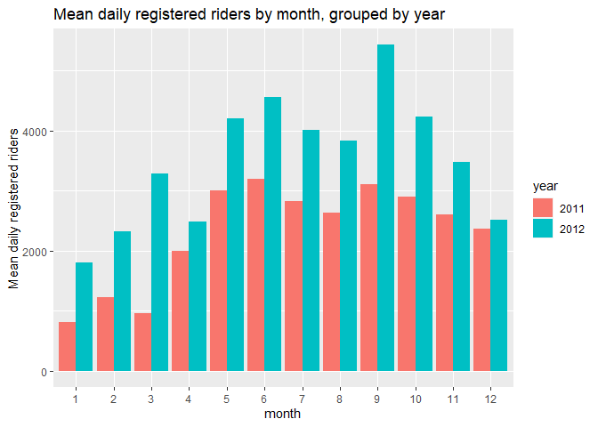
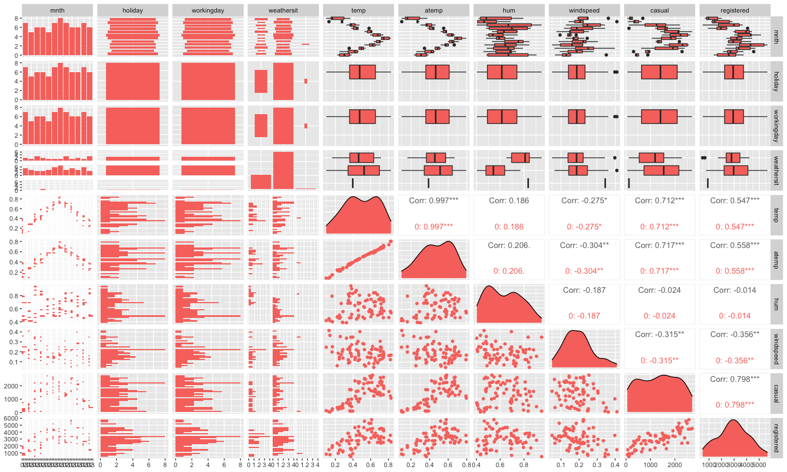
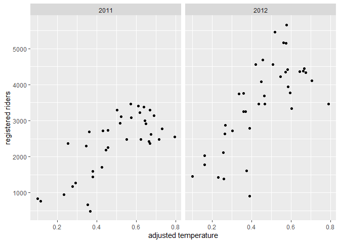

ST 558 Project 2
================
David Arthur
6/28/2021

Read in data, filter by day of week

``` r
day <- readr::read_csv("day.csv", col_types = cols(
  season = col_factor(),
  yr = col_factor(),
  mnth = col_factor(),
  holiday = col_factor(),
  weekday = col_factor(),
  workingday = col_factor(),
  weathersit = col_factor()))

day <- day %>% mutate(season = fct_recode(season, winter = "1", spring = "2", summer = "3", fall = "4")) %>%
  mutate(yr = fct_recode(yr, "2011" = "0", "2012" = "1")) %>%
  mutate(weekday = fct_recode(weekday, Sunday = "0", Monday = "1", Tuesday = "2", Wednesday = "3", Thursday = "4", Friday = "5", Saturday = "6")) %>%
  mutate(weathersit = fct_recode(weathersit, clear = "1", mist = "2", lightRainOrSnow = "3", heavyRainOrSnow = "4")) %>%
  filter(weekday == params$dayOfWeek)
```

    ## Warning: Unknown levels in `f`: 4

``` r
dayNF <- readr::read_csv("day.csv")
```

Partition data into training and test sets

``` r
set.seed(21)
trainIndex <- createDataPartition(day$cnt, p = 0.7, list = FALSE)
dayTrain <- day[trainIndex, ]
dayTest <- day[-trainIndex, ]
```

Exploratory data analysis and summary (David)

``` r
GGally::ggpairs(dayTrain %>% select(3:9, atemp, windspeed, casual, registered, cnt))
```

<!-- -->

``` r
# dayNFCor <- cor(as.matrix(dayNF %>% select(3:9, atemp, windspeed, casual, registered,cnt)))
# corrplot(dayNFCor, type = "upper", tl.pos = "lt")
# corrplot(dayNFCor, type = "lower", method = "number", add = TRUE, diag = FALSE, tl.pos = "n")
```

Exploration of individual predictors

``` r
g <- ggplot(data = dayTrain)
g + geom_point(aes(x = dteday, y = registered))
```

<!-- -->

``` r
meanByMonth <- dayTrain %>% group_by(mnth) %>%
  summarize(meanCas = mean(casual), meanReg = mean(registered), meanTotal = mean(cnt))
g2 <- ggplot(meanByMonth, aes(x = mnth))
g2 + geom_bar(aes(y = meanCas), stat = "identity")
```

<!-- -->

``` r
g2 + geom_bar(aes(y = meanReg), stat = "identity")
```

<!-- -->

``` r
g2 + geom_bar(aes(y = meanTotal), stat = "identity")
```

<!-- -->

``` r
meanByYear <- dayTrain %>% group_by(yr) %>%
  summarize(meanCas = mean(casual), meanReg = mean(registered), meanTotal = mean(cnt))
g2 <- ggplot(meanByYear, aes(x = yr))
g2 + geom_bar(aes(y = meanCas), stat = "identity")
```

<!-- -->

``` r
g2 + geom_bar(aes(y = meanReg), stat = "identity")
```

<!-- -->

``` r
g2 + geom_bar(aes(y = meanTotal), stat = "identity")
```

<!-- -->

``` r
meanByWeather <- dayTrain %>% group_by(weathersit) %>%
  summarize(meanCas = mean(casual), meanReg = mean(registered), meanTotal = mean(cnt))
kable(meanByWeather, digits = 1, col.names = c("Weather", "Mean Casual Riders", "Mean Registered Riders", "Mean Total Riders"), caption = "Average # of riders by weather category")
```

| Weather         | Mean Casual Riders | Mean Registered Riders | Mean Total Riders |
|:----------------|-------------------:|-----------------------:|------------------:|
| mist            |             1111.6 |                 2765.2 |            3876.8 |
| clear           |             1441.1 |                 3044.8 |            4485.8 |
| lightRainOrSnow |              120.0 |                  907.0 |            1027.0 |

Average \# of riders by weather category

``` r
meanByHoliday <- dayTrain %>% filter(workingday == 0) %>%
  group_by(holiday) %>%
  summarize(meanCas = mean(casual), meanReg = mean(registered), meanTotal = mean(cnt))
kable(meanByHoliday, digits = 1, col.names = c("Holiday (0 = no, 1 = yes)", "Mean Casual Riders", "Mean Registered Riders", "Mean Total Riders"), caption = "Average # of riders on holidays vs. non-holiday non-workdays")
```

| Holiday (0 = no, 1 = yes) | Mean Casual Riders | Mean Registered Riders | Mean Total Riders |
|:--------------------------|-------------------:|-----------------------:|------------------:|
| 0                         |             1332.6 |                 2939.4 |              4272 |

Average \# of riders on holidays vs. non-holiday non-workdays

Exploratory data analysis and summary (James)

``` r
ggpairs(dayTrain %>% select(-instant,-dteday, -season, -yr, -cnt), 
        ggplot2::aes(colour=workingday))
```

<!-- --> Notes from
looking at ggpairs plots: Working days are the highest usage for
registered riders, but non-working days are the highest usage for casual
riders. Registered riders are the primary volume, so we definitely care
most about them but worth keeping in mind. There are two types of
non-working days: weekends and holidays, and there is a difference in
volume for each of those rider types depending on whether it is a
holiday or a weekend.

Air temperature and temperature are nearly 100% correlated. We should
probably figure out which one of them we want to use. Speaking of
correlated, can we drop the date and only use months? Unfortunately, it
looks like we need to keep the year field as well, since year 2 had
better performance than year 1. Do we want to keep season and month? I
lean towards keeping year and month, but dropping season and date. Let
me know what you think.

Looking at the scatter of casual vs registered, broken out by working
day, it’s crazy how separate the linear relationships look:

``` r
g <- ggplot(data=dayTrain, aes(x=registered, y=casual))
g + geom_point(aes(color=workingday))
```

<!-- --> On working
days, registered bikes are the main rider group. On non-working days, it
switches to casual. Looking at day of the week, we may be able to
exclude it since it will be covered by the working day flag and holiday
flag, but I guess we can check the models to see if it provides anything
extra.

``` r
g <- ggplot(data=dayTrain %>% 
                 select(weekday, casual, registered) %>%
                 pivot_longer(cols=c(casual, registered),
                              names_to = 'metrics',
                              values_to = 'riders') %>%
                 group_by(weekday, metrics) %>%
                 summarise(avg_riders = mean(riders)), 
            aes(x=weekday, y=avg_riders, fill=metrics))
```

    ## `summarise()` has grouped output by 'weekday'. You can override using the `.groups` argument.

``` r
g + geom_bar(stat='identity', position='dodge')
```

<!-- --> Looking at
this graph, weekday definitely seems relatively stable across the days
(working days for registered and non-working days for casual are the
jumps), but there may be enough variation to include it.

\#\#I like this graph. I thought about doing one like it, but wasn’t
sure how to code it. pivot\_longer hadn’t occurred to me.

\#\#About which variables to include, I agree with your comments. My
understanding is that each of us comes up with our own models (I do a
linear regression and a random forest, you do a linear regression and a
boosted tree), so you and I don’t need to include the same predictors.
We do need to agree ahead of time on which response we’re going to model
(casual, registered, or cnt), so that the results of the 4 models can be
compared to each other. I’m fine with any of the 3. Do you have a
preference?

Yeah, no preference here either. I guess we could just say registered
since it’s the highest volume customer, and if we were doing this
analysis for that company then registered users would be the most
important group.

\#\#Sounds good, we’ll go with registered.

``` r
library(leaps)

data <- dayTrain %>% 
               filter(weekday == params$dayOfWeek) %>% drop_na() %>%
               select(-instant,-dteday, -season, 
                    -weekday, -atemp, -casual, -cnt)

#this function converts new data to a model matrix
#so that a prediction can be run via matrix multiplication
#on a best subsets model
predict.regsubsets = function(object,newdata,id,...){
      form = as.formula(object$call[[2]]) 
      mat = model.matrix(form,newdata)    
      coefi = coef(object,id=id)          
      xvars = names(coefi)                
      mat[,xvars]%*%coefi               
}


#let's do cross validation with folds
k <- 4
set.seed(21)
folds <- sample(1:k, nrow(data), replace=T)

cv_errors = matrix(NA, k, 16, dimnames = list(NULL, paste(1:16)))

for (j in 1:k) {
  best <- regsubsets(registered ~ ., 
                     data=data[folds!=j,], nvmax=20)
  
  for (i in 1:16) {
    pred <- predict(best, data[folds==j,], id=i)
    
    
    cv_errors[j, i] <- mean((temp_data$registered[folds==j]-pred)^2)
  }
}
```

    ## Warning in leaps.setup(x, y, wt = wt, nbest = nbest, nvmax = nvmax, force.in = force.in, : 2 linear
    ## dependencies found

    ## Reordering variables and trying again:

    ## Error in eval(x): object 'newX' not found

``` r
# Take the mean of over all folds for each model size
mean_cv_errors = apply(cv_errors, 2, mean)

# Find the model size with the smallest cross-validation error
min = which.min(mean_cv_errors)

#the model w/ 14 variables was best when using 4 fold cv.
#i did 4 fold because there are only about 80 rows of data per weekday

best_full <- regsubsets(registered ~ ., 
                     data=temp_data[folds!=j,], nvmax=20)
```

    ## Error in is.data.frame(data): object 'temp_data' not found

``` r
fit <- lm(registered ~ temp*hum,
        data=dayTrain %>% 
             filter(weekday == params$dayOfWeek) %>% drop_na() %>%
             select(-instant,-dteday, -season, 
                    -weekday, -atemp, -casual, -cnt))
```

``` r
names(dayTrain)
```

    ##  [1] "instant"    "dteday"     "season"     "yr"         "mnth"       "holiday"    "weekday"   
    ##  [8] "workingday" "weathersit" "temp"       "atemp"      "hum"        "windspeed"  "casual"    
    ## [15] "registered" "cnt"

``` r
# GGally::ggpairs(dayTrain %>% select(3:9, atemp, windspeed, casual, registered, cnt))
dayNFCor <- cor(as.matrix(dayNF %>% select(3:13, registered)))
corrplot(dayNFCor, type = "upper", tl.pos = "lt")
corrplot(dayNFCor, type = "lower", method = "number", add = TRUE, diag = FALSE, tl.pos = "n")
```

<!-- -->

``` r
mlrFull <- lm(registered ~ dteday + season +  yr + mnth + holiday + workingday + weathersit + temp + atemp + hum + windspeed, dayTrain)
```

    ## Error in `contrasts<-`(`*tmp*`, value = contr.funs[1 + isOF[nn]]): contrasts can be applied only to factors with 2 or more levels

``` r
summary(mlrFull)
```

    ## 
    ## Call:
    ## lm(formula = registered ~ dteday + season + yr + mnth + holiday + 
    ##     workingday + weathersit + temp + atemp + hum + windspeed, 
    ##     data = dayTrain)
    ## 
    ## Residuals:
    ##      Min       1Q   Median       3Q      Max 
    ## -2584.98  -244.20    14.41   333.84  1066.53 
    ## 
    ## Coefficients: (1 not defined because of singularities)
    ##                            Estimate Std. Error t value Pr(>|t|)   
    ## (Intercept)               157430.63  130182.48   1.209  0.23201   
    ## dteday                       -10.41       8.69  -1.198  0.23651   
    ## seasonspring                 234.94     484.44   0.485  0.62974   
    ## seasonsummer                 526.13     601.16   0.875  0.38549   
    ## seasonfall                  1302.77     584.87   2.227  0.03027 * 
    ## yr2012                      5583.40    3193.92   1.748  0.08634 . 
    ## mnth2                        407.71     508.51   0.802  0.42633   
    ## mnth3                        559.85     686.69   0.815  0.41863   
    ## mnth4                       1121.13    1043.22   1.075  0.28748   
    ## mnth5                       1785.78    1276.20   1.399  0.16766   
    ## mnth6                       2293.46    1499.76   1.529  0.13227   
    ## mnth7                       1900.57    1774.22   1.071  0.28902   
    ## mnth8                       2600.71    1994.80   1.304  0.19806   
    ## mnth9                       3241.48    2181.09   1.486  0.14327   
    ## mnth10                      2552.12    2407.57   1.060  0.29403   
    ## mnth11                      3127.87    2680.06   1.167  0.24850   
    ## mnth12                      3448.50    2911.49   1.184  0.24162   
    ## holiday1                   -2361.94     837.74  -2.819  0.00679 **
    ## workingday1                      NA         NA      NA       NA   
    ## weathersitclear              277.73     232.53   1.194  0.23775   
    ## weathersitlightRainOrSnow   -421.90     554.77  -0.760  0.45039   
    ## temp                      -13434.39    7072.37  -1.900  0.06304 . 
    ## atemp                      19216.70    7704.11   2.494  0.01584 * 
    ## hum                        -2253.51     889.01  -2.535  0.01430 * 
    ## windspeed                  -1389.15    1216.32  -1.142  0.25865   
    ## ---
    ## Signif. codes:  0 '***' 0.001 '**' 0.01 '*' 0.05 '.' 0.1 ' ' 1
    ## 
    ## Residual standard error: 623.8 on 52 degrees of freedom
    ## Multiple R-squared:  0.889,  Adjusted R-squared:   0.84 
    ## F-statistic: 18.12 on 23 and 52 DF,  p-value: < 2.2e-16

``` r
AIC(mlrFull)
```

    ## [1] 1215.092

``` r
x <- model.matrix(mlrFull)[, -1]
e <- eigen(t(x) %*% x)
e$val
```

    ##  [1] 1.787359e+10 3.234387e+01 2.483854e+01 1.980414e+01 1.418305e+01 9.517426e+00 7.076373e+00
    ##  [8] 6.838232e+00 6.463140e+00 6.131431e+00 6.004953e+00 5.843168e+00 5.622162e+00 2.154234e+00
    ## [15] 1.603564e+00 1.364901e+00 1.128569e+00 7.812890e-01 5.912435e-01 3.450232e-01 2.737427e-01
    ## [22] 9.780692e-02 3.567441e-03 1.145522e-05

``` r
sqrt(e$val[1]/min(e$val))
```

    ## [1] 39500638

``` r
vif(x)
```

    ##                    dteday              seasonspring              seasonsummer                seasonfall 
    ##                661.508610                  8.593190                 14.112575                 12.074596 
    ##                    yr2012                     mnth2                     mnth3                     mnth4 
    ##                497.693378                  3.103636                  6.696069                 17.772522 
    ##                     mnth5                     mnth6                     mnth7                     mnth8 
    ##                 26.596775                 31.940471                 44.700438                 73.188536 
    ##                     mnth9                    mnth10                    mnth11                    mnth12 
    ##                 67.552729                 82.310431                101.996520                120.372289 
    ##                  holiday1               workingday1           weathersitclear weathersitlightRainOrSnow 
    ##                       Inf                       Inf                  2.522861                  1.540057 
    ##                      temp                     atemp                       hum                 windspeed 
    ##                311.389470                284.518298                  2.809295                  1.446132

``` r
#remove dteday (high collinearity, low p-value)
mlr2 <- update(mlrFull, . ~ . - dteday)
```

    ## Error in `contrasts<-`(`*tmp*`, value = contr.funs[1 + isOF[nn]]): contrasts can be applied only to factors with 2 or more levels

``` r
summary(mlr2)
```

    ## 
    ## Call:
    ## lm(formula = registered ~ season + yr + mnth + holiday + workingday + 
    ##     weathersit + temp + atemp + hum + windspeed, data = dayTrain)
    ## 
    ## Residuals:
    ##      Min       1Q   Median       3Q      Max 
    ## -2706.16  -241.64    17.59   320.06  1044.81 
    ## 
    ## Coefficients: (1 not defined because of singularities)
    ##                            Estimate Std. Error t value Pr(>|t|)    
    ## (Intercept)                 1530.92     803.00   1.907  0.06201 .  
    ## seasonspring                 214.20     486.11   0.441  0.66126    
    ## seasonsummer                 431.74     598.41   0.721  0.47378    
    ## seasonfall                  1203.30     581.31   2.070  0.04334 *  
    ## yr2012                      1762.77     152.30  11.575 3.96e-16 ***
    ## mnth2                         39.50     406.68   0.097  0.92300    
    ## mnth3                        -84.92     427.97  -0.198  0.84347    
    ## mnth4                        151.59     660.62   0.229  0.81939    
    ## mnth5                        518.80     716.63   0.724  0.47229    
    ## mnth6                        728.70     739.26   0.986  0.32875    
    ## mnth7                         44.33     866.87   0.051  0.95941    
    ## mnth8                        417.03     812.22   0.513  0.60977    
    ## mnth9                        777.81     727.52   1.069  0.28986    
    ## mnth10                      -204.94     707.32  -0.290  0.77315    
    ## mnth11                        30.09     703.99   0.043  0.96607    
    ## mnth12                        32.83     587.11   0.056  0.95562    
    ## holiday1                   -2517.39     831.01  -3.029  0.00378 ** 
    ## workingday1                      NA         NA      NA       NA    
    ## weathersitclear              271.54     233.43   1.163  0.24993    
    ## weathersitlightRainOrSnow   -260.90     540.44  -0.483  0.63125    
    ## temp                      -13427.45    7101.28  -1.891  0.06412 .  
    ## atemp                      19275.07    7735.45   2.492  0.01587 *  
    ## hum                        -2422.32     881.35  -2.748  0.00817 ** 
    ## windspeed                  -1307.54    1219.38  -1.072  0.28844    
    ## ---
    ## Signif. codes:  0 '***' 0.001 '**' 0.01 '*' 0.05 '.' 0.1 ' ' 1
    ## 
    ## Residual standard error: 626.4 on 53 degrees of freedom
    ## Multiple R-squared:  0.886,  Adjusted R-squared:  0.8387 
    ## F-statistic: 18.72 on 22 and 53 DF,  p-value: < 2.2e-16

``` r
AIC(mlr2)
```

    ## [1] 1215.16

``` r
x <- model.matrix(mlr2)[, -1]
e <- eigen(t(x) %*% x)
e$val
```

    ##  [1] 2.205763e+02 2.987881e+01 2.482202e+01 1.882898e+01 1.411994e+01 7.388300e+00 7.041635e+00
    ##  [8] 6.603752e+00 6.386751e+00 6.128097e+00 5.976690e+00 5.700467e+00 5.597535e+00 1.846244e+00
    ## [15] 1.505574e+00 1.350117e+00 1.118837e+00 7.541956e-01 3.521307e-01 2.811978e-01 2.223491e-01
    ## [22] 9.445127e-02 3.560045e-03

``` r
sqrt(e$val[1]/min(e$val))
```

    ## [1] 248.9154

``` r
vif(x)
```

    ##              seasonspring              seasonsummer                seasonfall                    yr2012 
    ##                  8.582215                 13.869985                 11.831045                  1.122387 
    ##                     mnth2                     mnth3                     mnth4                     mnth5 
    ##                  1.968946                  2.579797                  7.069026                  8.318467 
    ##                     mnth6                     mnth7                     mnth8                     mnth9 
    ##                  7.697362                 10.584262                 12.035167                  7.455009 
    ##                    mnth10                    mnth11                    mnth12                  holiday1 
    ##                  7.046631                  6.980449                  4.855004                       Inf 
    ##               workingday1           weathersitclear weathersitlightRainOrSnow                      temp 
    ##                       Inf                  2.521612                  1.449621                311.389261 
    ##                     atemp                       hum                 windspeed 
    ##                284.506910                  2.738667                  1.441593

``` r
#reduced AIC and condition number

#remove temp (high collinearity, low p-value)
mlr3 <- update(mlr2, . ~ . - temp)
```

    ## Error in `contrasts<-`(`*tmp*`, value = contr.funs[1 + isOF[nn]]): contrasts can be applied only to factors with 2 or more levels

``` r
summary(mlr3)
```

    ## 
    ## Call:
    ## lm(formula = registered ~ season + yr + mnth + holiday + workingday + 
    ##     weathersit + atemp + hum + windspeed, data = dayTrain)
    ## 
    ## Residuals:
    ##      Min       1Q   Median       3Q      Max 
    ## -2729.14  -268.55    19.15   312.92  1105.72 
    ## 
    ## Coefficients: (1 not defined because of singularities)
    ##                           Estimate Std. Error t value Pr(>|t|)    
    ## (Intercept)                2197.36     738.52   2.975 0.004370 ** 
    ## seasonspring                247.20     497.24   0.497 0.621109    
    ## seasonsummer                483.43     611.87   0.790 0.432930    
    ## seasonfall                 1272.63     593.83   2.143 0.036629 *  
    ## yr2012                     1758.24     155.87  11.280  8.1e-16 ***
    ## mnth2                      -125.61     406.55  -0.309 0.758536    
    ## mnth3                      -219.49     431.96  -0.508 0.613437    
    ## mnth4                        36.10     673.30   0.054 0.957441    
    ## mnth5                       246.55     718.56   0.343 0.732846    
    ## mnth6                       351.00     728.53   0.482 0.631899    
    ## mnth7                      -524.11     832.23  -0.630 0.531507    
    ## mnth8                      -123.54     778.16  -0.159 0.874451    
    ## mnth9                       435.23     721.21   0.603 0.548719    
    ## mnth10                     -401.84     716.10  -0.561 0.577018    
    ## mnth11                     -150.56     713.91  -0.211 0.833763    
    ## mnth12                       44.75     600.91   0.074 0.940907    
    ## holiday1                  -2588.86     849.71  -3.047 0.003575 ** 
    ## workingday1                     NA         NA      NA       NA    
    ## weathersitclear             278.05     238.90   1.164 0.249590    
    ## weathersitlightRainOrSnow  -462.61     542.29  -0.853 0.397392    
    ## atemp                      4823.95    1222.71   3.945 0.000232 ***
    ## hum                       -2628.98     895.16  -2.937 0.004864 ** 
    ## windspeed                 -1939.45    1200.32  -1.616 0.111972    
    ## ---
    ## Signif. codes:  0 '***' 0.001 '**' 0.01 '*' 0.05 '.' 0.1 ' ' 1
    ## 
    ## Residual standard error: 641.1 on 54 degrees of freedom
    ## Multiple R-squared:  0.8783, Adjusted R-squared:  0.831 
    ## F-statistic: 18.56 on 21 and 54 DF,  p-value: < 2.2e-16

``` r
AIC(mlr3)
```

    ## [1] 1218.121

``` r
x <- model.matrix(mlr3)[, -1]
e <- eigen(t(x) %*% x)
e$val
```

    ##  [1] 199.79060410  29.78677374  24.79802777  18.25611174  13.74401059   7.36430522   7.02042362
    ##  [8]   6.53738489   6.38182746   6.11409094   5.97479966   5.69317501   5.58037863   1.80810751
    ## [15]   1.47264824   1.34647725   1.10288363   0.63406588   0.28794668   0.26721013   0.20467838
    ## [22]   0.09182081

``` r
sqrt(e$val[1]/min(e$val))
```

    ## [1] 46.64627

``` r
vif(x)
```

    ##              seasonspring              seasonsummer                seasonfall                    yr2012 
    ##                  8.571154                 13.841036                 11.783977                  1.122109 
    ##                     mnth2                     mnth3                     mnth4                     mnth5 
    ##                  1.878174                  2.508461                  7.008601                  7.982680 
    ##                     mnth6                     mnth7                     mnth8                     mnth9 
    ##                  7.135367                  9.311325                 10.544110                  6.992672 
    ##                    mnth10                    mnth11                    mnth12                  holiday1 
    ##                  6.893899                  6.851889                  4.854443                       Inf 
    ##               workingday1           weathersitclear weathersitlightRainOrSnow                     atemp 
    ##                       Inf                  2.521062                  1.393142                  6.784766 
    ##                       hum                 windspeed 
    ##                  2.696550                  1.333312

``` r
#reduced AIC and condition number

#remove workingday (high collinearity, low p-value)
mlr4 <- update(mlr3, . ~ . - workingday)
```

    ## Error in `contrasts<-`(`*tmp*`, value = contr.funs[1 + isOF[nn]]): contrasts can be applied only to factors with 2 or more levels

``` r
summary(mlr4)
```

    ## 
    ## Call:
    ## lm(formula = registered ~ season + yr + mnth + holiday + weathersit + 
    ##     atemp + hum + windspeed, data = dayTrain)
    ## 
    ## Residuals:
    ##      Min       1Q   Median       3Q      Max 
    ## -2729.14  -268.55    19.15   312.92  1105.72 
    ## 
    ## Coefficients:
    ##                           Estimate Std. Error t value Pr(>|t|)    
    ## (Intercept)                2197.36     738.52   2.975 0.004370 ** 
    ## seasonspring                247.20     497.24   0.497 0.621109    
    ## seasonsummer                483.43     611.87   0.790 0.432930    
    ## seasonfall                 1272.63     593.83   2.143 0.036629 *  
    ## yr2012                     1758.24     155.87  11.280  8.1e-16 ***
    ## mnth2                      -125.61     406.55  -0.309 0.758536    
    ## mnth3                      -219.49     431.96  -0.508 0.613437    
    ## mnth4                        36.10     673.30   0.054 0.957441    
    ## mnth5                       246.55     718.56   0.343 0.732846    
    ## mnth6                       351.00     728.53   0.482 0.631899    
    ## mnth7                      -524.11     832.23  -0.630 0.531507    
    ## mnth8                      -123.54     778.16  -0.159 0.874451    
    ## mnth9                       435.23     721.21   0.603 0.548719    
    ## mnth10                     -401.84     716.10  -0.561 0.577018    
    ## mnth11                     -150.56     713.91  -0.211 0.833763    
    ## mnth12                       44.75     600.91   0.074 0.940907    
    ## holiday1                  -2588.86     849.71  -3.047 0.003575 ** 
    ## weathersitclear             278.05     238.90   1.164 0.249590    
    ## weathersitlightRainOrSnow  -462.61     542.29  -0.853 0.397392    
    ## atemp                      4823.95    1222.71   3.945 0.000232 ***
    ## hum                       -2628.98     895.16  -2.937 0.004864 ** 
    ## windspeed                 -1939.45    1200.32  -1.616 0.111972    
    ## ---
    ## Signif. codes:  0 '***' 0.001 '**' 0.01 '*' 0.05 '.' 0.1 ' ' 1
    ## 
    ## Residual standard error: 641.1 on 54 degrees of freedom
    ## Multiple R-squared:  0.8783, Adjusted R-squared:  0.831 
    ## F-statistic: 18.56 on 21 and 54 DF,  p-value: < 2.2e-16

``` r
AIC(mlr4)
```

    ## [1] 1218.121

``` r
x <- model.matrix(mlr4)[, -1]
e <- eigen(t(x) %*% x)
e$val
```

    ##  [1] 129.08455678  29.01496664  24.79724365  16.78696501  13.72781505   7.13527177   6.92031410
    ##  [8]   6.38273531   6.20493355   6.10493162   5.96024546   5.65112556   4.96526000   1.79374032
    ## [15]   1.41827981   1.20965152   0.91326148   0.56011382   0.28781344   0.24423194   0.09429506

``` r
sqrt(e$val[1]/min(e$val))
```

    ## [1] 36.99923

``` r
vif(x)
```

    ##              seasonspring              seasonsummer                seasonfall                    yr2012 
    ##                  8.571154                 13.841036                 11.783977                  1.122109 
    ##                     mnth2                     mnth3                     mnth4                     mnth5 
    ##                  1.878174                  2.508461                  7.008601                  7.982680 
    ##                     mnth6                     mnth7                     mnth8                     mnth9 
    ##                  7.135367                  9.311325                 10.544110                  6.992672 
    ##                    mnth10                    mnth11                    mnth12                  holiday1 
    ##                  6.893899                  6.851889                  4.854443                  1.733305 
    ##           weathersitclear weathersitlightRainOrSnow                     atemp                       hum 
    ##                  2.521062                  1.393142                  6.784766                  2.696550 
    ##                 windspeed 
    ##                  1.333312

``` r
#reduced AIC and condition number

#remove season (high collinearity, low p-value)
mlr5 <- update(mlr4, . ~ . - season)
```

    ## Error in `contrasts<-`(`*tmp*`, value = contr.funs[1 + isOF[nn]]): contrasts can be applied only to factors with 2 or more levels

``` r
summary(mlr5)
```

    ## 
    ## Call:
    ## lm(formula = registered ~ yr + mnth + holiday + weathersit + 
    ##     atemp + hum + windspeed, data = dayTrain)
    ## 
    ## Residuals:
    ##     Min      1Q  Median      3Q     Max 
    ## -2679.7  -299.9    43.3   314.9  1085.2 
    ## 
    ## Coefficients:
    ##                           Estimate Std. Error t value Pr(>|t|)    
    ## (Intercept)                2140.65     752.90   2.843 0.006189 ** 
    ## yr2012                     1766.63     158.06  11.177 5.45e-16 ***
    ## mnth2                      -174.89     413.05  -0.423 0.673594    
    ## mnth3                      -174.84     412.55  -0.424 0.673293    
    ## mnth4                       243.61     481.67   0.506 0.614970    
    ## mnth5                       471.96     543.16   0.869 0.388541    
    ## mnth6                       685.90     575.90   1.191 0.238591    
    ## mnth7                       -87.34     649.10  -0.135 0.893438    
    ## mnth8                       305.27     578.37   0.528 0.599687    
    ## mnth9                      1153.77     514.89   2.241 0.028952 *  
    ## mnth10                      837.12     441.85   1.895 0.063226 .  
    ## mnth11                     1126.01     406.04   2.773 0.007489 ** 
    ## mnth12                     1005.80     415.51   2.421 0.018700 *  
    ## holiday1                  -3527.94     749.08  -4.710 1.63e-05 ***
    ## weathersitclear             339.49     240.43   1.412 0.163381    
    ## weathersitlightRainOrSnow  -269.86     544.46  -0.496 0.622050    
    ## atemp                      4873.77    1238.56   3.935 0.000228 ***
    ## hum                       -2652.45     910.29  -2.914 0.005092 ** 
    ## windspeed                 -1768.17    1221.57  -1.447 0.153247    
    ## ---
    ## Signif. codes:  0 '***' 0.001 '**' 0.01 '*' 0.05 '.' 0.1 ' ' 1
    ## 
    ## Residual standard error: 654 on 57 degrees of freedom
    ## Multiple R-squared:  0.8663, Adjusted R-squared:  0.8241 
    ## F-statistic: 20.52 on 18 and 57 DF,  p-value: < 2.2e-16

``` r
AIC(mlr5)
```

    ## [1] 1219.25

``` r
#don't remove season because AIC increased

#remove month (high collinearity, low p-value)
mlr6 <- update(mlr4, . ~ . - mnth)
```

    ## Error in `contrasts<-`(`*tmp*`, value = contr.funs[1 + isOF[nn]]): contrasts can be applied only to factors with 2 or more levels

``` r
summary(mlr6)
```

    ## 
    ## Call:
    ## lm(formula = registered ~ season + yr + holiday + weathersit + 
    ##     atemp + hum + windspeed, data = dayTrain)
    ## 
    ## Residuals:
    ##      Min       1Q   Median       3Q      Max 
    ## -3091.48  -240.11    24.19   339.63  1216.41 
    ## 
    ## Coefficients:
    ##                           Estimate Std. Error t value Pr(>|t|)    
    ## (Intercept)                 1668.0      644.7   2.587 0.011922 *  
    ## seasonspring                 511.1      314.9   1.623 0.109399    
    ## seasonsummer                 570.7      382.1   1.494 0.140092    
    ## seasonfall                  1211.8      258.0   4.697 1.41e-05 ***
    ## yr2012                      1751.5      152.1  11.516  < 2e-16 ***
    ## holiday1                   -2496.6      674.2  -3.703 0.000441 ***
    ## weathersitclear              334.8      210.2   1.593 0.116048    
    ## weathersitlightRainOrSnow   -619.4      496.3  -1.248 0.216471    
    ## atemp                       4633.4      917.0   5.053 3.78e-06 ***
    ## hum                        -1933.0      788.3  -2.452 0.016897 *  
    ## windspeed                  -1742.0     1110.8  -1.568 0.121691    
    ## ---
    ## Signif. codes:  0 '***' 0.001 '**' 0.01 '*' 0.05 '.' 0.1 ' ' 1
    ## 
    ## Residual standard error: 638.6 on 65 degrees of freedom
    ## Multiple R-squared:  0.8546, Adjusted R-squared:  0.8323 
    ## F-statistic: 38.22 on 10 and 65 DF,  p-value: < 2.2e-16

``` r
AIC(mlr6)
```

    ## [1] 1209.614

``` r
x <- model.matrix(mlr6)[, -1]
e <- eigen(t(x) %*% x)
e$val
```

    ##  [1] 123.3110027  23.9736280  18.9908847  15.7158323  11.6215424   3.3201339   1.7024724   0.8802962
    ##  [9]   0.4092040   0.3327552

``` r
sqrt(e$val[1]/min(e$val))
```

    ## [1] 19.25034

``` r
vif(x)
```

    ##              seasonspring              seasonsummer                seasonfall                    yr2012 
    ##                  3.464621                  5.439323                  2.241363                  1.076928 
    ##                  holiday1           weathersitclear weathersitlightRainOrSnow                     atemp 
    ##                  1.099748                  1.966875                  1.176019                  3.846298 
    ##                       hum                 windspeed 
    ##                  2.107624                  1.150941

``` r
#reduced AIC and condition number

#remove year from full model instead of dteday (high collinearity)
mlr7 <- update(mlrFull, . ~ . - yr - workingday - temp, dayTrain)
```

    ## Error in `contrasts<-`(`*tmp*`, value = contr.funs[1 + isOF[nn]]): contrasts can be applied only to factors with 2 or more levels

``` r
summary(mlr7)
```

    ## 
    ## Call:
    ## lm(formula = registered ~ dteday + season + mnth + holiday + 
    ##     weathersit + atemp + hum + windspeed, data = dayTrain)
    ## 
    ## Residuals:
    ##      Min       1Q   Median       3Q      Max 
    ## -2776.29  -259.36    16.46   298.99  1099.56 
    ## 
    ## Coefficients:
    ##                             Estimate Std. Error t value Pr(>|t|)    
    ## (Intercept)               -6.902e+04  6.612e+03 -10.439 1.46e-14 ***
    ## dteday                     4.755e+00  4.301e-01  11.057 1.73e-15 ***
    ## seasonspring               2.386e+02  5.043e+02   0.473 0.637963    
    ## seasonsummer               4.374e+02  6.203e+02   0.705 0.483712    
    ## seasonfall                 1.227e+03  6.022e+02   2.038 0.046506 *  
    ## mnth2                     -2.949e+02  4.120e+02  -0.716 0.477198    
    ## mnth3                     -5.166e+02  4.369e+02  -1.182 0.242217    
    ## mnth4                     -4.109e+02  6.810e+02  -0.603 0.548772    
    ## mnth5                     -3.347e+02  7.284e+02  -0.459 0.647758    
    ## mnth6                     -3.642e+02  7.413e+02  -0.491 0.625216    
    ## mnth7                     -1.369e+03  8.509e+02  -1.609 0.113470    
    ## mnth8                     -1.122e+03  7.929e+02  -1.415 0.162738    
    ## mnth9                     -6.884e+02  7.418e+02  -0.928 0.357514    
    ## mnth10                    -1.661e+03  7.362e+02  -2.256 0.028129 *  
    ## mnth11                    -1.565e+03  7.373e+02  -2.123 0.038383 *  
    ## mnth12                    -1.517e+03  6.218e+02  -2.440 0.017991 *  
    ## holiday1                  -2.651e+03  8.625e+02  -3.073 0.003319 ** 
    ## weathersitclear            2.766e+02  2.423e+02   1.142 0.258684    
    ## weathersitlightRainOrSnow -3.853e+02  5.494e+02  -0.701 0.486084    
    ## atemp                      4.857e+03  1.240e+03   3.917 0.000254 ***
    ## hum                       -2.717e+03  9.067e+02  -2.997 0.004116 ** 
    ## windspeed                 -1.893e+03  1.217e+03  -1.556 0.125640    
    ## ---
    ## Signif. codes:  0 '***' 0.001 '**' 0.01 '*' 0.05 '.' 0.1 ' ' 1
    ## 
    ## Residual standard error: 650.2 on 54 degrees of freedom
    ## Multiple R-squared:  0.8748, Adjusted R-squared:  0.8262 
    ## F-statistic: 17.97 on 21 and 54 DF,  p-value: < 2.2e-16

``` r
AIC(mlr7)
```

    ## [1] 1220.243

``` r
x <- model.matrix(mlr7)[, -1]
e <- eigen(t(x) %*% x)
e$val
```

    ##  [1] 1.787359e+10 3.159034e+01 2.479663e+01 1.462312e+01 8.790193e+00 7.050498e+00 6.933415e+00
    ##  [8] 6.305894e+00 6.106294e+00 6.032855e+00 5.855129e+00 5.611120e+00 1.967727e+00 1.420803e+00
    ## [15] 1.212998e+00 9.405377e-01 5.988407e-01 5.611129e-01 2.842043e-01 2.453262e-01 9.358634e-02

``` r
sqrt(e$val[1]/min(e$val))
```

    ## [1] 437018.4

``` r
vif(x)
```

    ##                    dteday              seasonspring              seasonsummer                seasonfall 
    ##                  1.491453                  8.571827                 13.831305                 11.783903 
    ##                     mnth2                     mnth3                     mnth4                     mnth5 
    ##                  1.875996                  2.495463                  6.971715                  7.976817 
    ##                     mnth6                     mnth7                     mnth8                     mnth9 
    ##                  7.183385                  9.465743                 10.645092                  7.193409 
    ##                    mnth10                    mnth11                    mnth12                  holiday1 
    ##                  7.084997                  7.106173                  5.053941                  1.736853 
    ##           weathersitclear weathersitlightRainOrSnow                     atemp                       hum 
    ##                  2.521410                  1.390493                  6.783930                  2.690251 
    ##                 windspeed 
    ##                  1.332606

``` r
#higher AIC than mlr4

#compare to model chosen by leaps::step() function
mlrStep <- step(mlrFull)
```

    ## Start:  AIC=997.41
    ## registered ~ dteday + season + yr + mnth + holiday + workingday + 
    ##     weathersit + temp + atemp + hum + windspeed

    ## Error in `contrasts<-`(`*tmp*`, value = contr.funs[1 + isOF[nn]]): contrasts can be applied only to factors with 2 or more levels

``` r
names(mlrStep)
```

    ##  [1] "coefficients"  "residuals"     "effects"       "rank"          "fitted.values" "assign"       
    ##  [7] "qr"            "df.residual"   "contrasts"     "xlevels"       "call"          "terms"        
    ## [13] "model"         "anova"

``` r
mlrStep$call
```

    ## lm(formula = registered ~ season + yr + holiday + temp + atemp + 
    ##     hum, data = dayTrain)

``` r
mlr6$call
```

    ## lm(formula = registered ~ season + yr + holiday + weathersit + 
    ##     atemp + hum + windspeed, data = dayTrain)

``` r
AIC(mlr6, mlrStep)
```

    ##         df      AIC
    ## mlr6    12 1209.614
    ## mlrStep 10 1205.461

``` r
#my choice agrees with step() choice

#diagnostics plot
plot(mlr6$fitted, mlr6$residuals)
```

<!-- -->

``` r
#indication of mild nonconstant variance
MASS::boxcox(mlr6)
```

<!-- -->

``` r
#Box-Cox lambda close to 1, so no need for transformation of response

#look for nonlinearity with partial residuals plots
termplot(mlr6, partial.resid = TRUE)
```

<!-- --><!-- --><!-- --><!-- --><!-- --><!-- --><!-- -->

``` r
#atemp, hum, and windspeed look somewhat nonlinear, so try quadratic terms for them
mlr8 <- update(mlr6, . ~ . + I(atemp^2))
```

    ## Error in `contrasts<-`(`*tmp*`, value = contr.funs[1 + isOF[nn]]): contrasts can be applied only to factors with 2 or more levels

``` r
summary(mlr8)
```

    ## 
    ## Call:
    ## lm(formula = registered ~ season + yr + holiday + weathersit + 
    ##     atemp + hum + windspeed + I(atemp^2), data = dayTrain)
    ## 
    ## Residuals:
    ##      Min       1Q   Median       3Q      Max 
    ## -2783.07  -268.72     7.91   280.47  1147.78 
    ## 
    ## Coefficients:
    ##                           Estimate Std. Error t value Pr(>|t|)    
    ## (Intercept)                 -812.6      872.0  -0.932 0.354932    
    ## seasonspring                 202.9      297.1   0.683 0.497106    
    ## seasonsummer                 547.5      347.2   1.577 0.119729    
    ## seasonfall                   845.6      253.0   3.342 0.001392 ** 
    ## yr2012                      1654.3      140.5  11.776  < 2e-16 ***
    ## holiday1                   -2492.3      612.5  -4.069 0.000132 ***
    ## weathersitclear              406.3      191.9   2.117 0.038110 *  
    ## weathersitlightRainOrSnow   -683.9      451.2  -1.516 0.134530    
    ## atemp                      17576.2     3472.3   5.062 3.75e-06 ***
    ## hum                        -1956.3      716.2  -2.731 0.008140 ** 
    ## windspeed                  -1910.8     1010.2  -1.891 0.063086 .  
    ## I(atemp^2)                -13748.5     3580.7  -3.840 0.000285 ***
    ## ---
    ## Signif. codes:  0 '***' 0.001 '**' 0.01 '*' 0.05 '.' 0.1 ' ' 1
    ## 
    ## Residual standard error: 580.2 on 64 degrees of freedom
    ## Multiple R-squared:  0.8819, Adjusted R-squared:  0.8616 
    ## F-statistic: 43.43 on 11 and 64 DF,  p-value: < 2.2e-16

``` r
AIC(mlr8)
```

    ## [1] 1195.859

``` r
#improved AIC, so keep atemp^2 in model

mlr9 <- update(mlr8, . ~ . + I(hum^2))
```

    ## Error in `contrasts<-`(`*tmp*`, value = contr.funs[1 + isOF[nn]]): contrasts can be applied only to factors with 2 or more levels

``` r
summary(mlr9)
```

    ## 
    ## Call:
    ## lm(formula = registered ~ season + yr + holiday + weathersit + 
    ##     atemp + hum + windspeed + I(atemp^2) + I(hum^2), data = dayTrain)
    ## 
    ## Residuals:
    ##      Min       1Q   Median       3Q      Max 
    ## -2731.79  -277.57    19.08   285.86  1072.20 
    ## 
    ## Coefficients:
    ##                           Estimate Std. Error t value Pr(>|t|)    
    ## (Intercept)                -1841.0     1505.0  -1.223 0.225784    
    ## seasonspring                 234.6      300.2   0.782 0.437394    
    ## seasonsummer                 590.7      351.8   1.679 0.098043 .  
    ## seasonfall                   851.0      253.7   3.354 0.001351 ** 
    ## yr2012                      1662.5      141.1  11.778  < 2e-16 ***
    ## holiday1                   -2517.3      614.7  -4.095 0.000122 ***
    ## weathersitclear              391.4      193.1   2.027 0.046909 *  
    ## weathersitlightRainOrSnow   -492.9      506.3  -0.974 0.333983    
    ## atemp                      17861.0     3496.8   5.108 3.25e-06 ***
    ## hum                         1419.0     4084.6   0.347 0.729444    
    ## windspeed                  -1927.4     1012.7  -1.903 0.061588 .  
    ## I(atemp^2)                -14193.2     3627.8  -3.912 0.000227 ***
    ## I(hum^2)                   -2736.5     3260.0  -0.839 0.404408    
    ## ---
    ## Signif. codes:  0 '***' 0.001 '**' 0.01 '*' 0.05 '.' 0.1 ' ' 1
    ## 
    ## Residual standard error: 581.6 on 63 degrees of freedom
    ## Multiple R-squared:  0.8832, Adjusted R-squared:  0.8609 
    ## F-statistic: 39.69 on 12 and 63 DF,  p-value: < 2.2e-16

``` r
AIC(mlr9)
```

    ## [1] 1197.013

``` r
#improved AIC, so keep hum^2 in model

mlr10 <- update(mlr9, . ~ . + I(windspeed^2))
```

    ## Error in `contrasts<-`(`*tmp*`, value = contr.funs[1 + isOF[nn]]): contrasts can be applied only to factors with 2 or more levels

``` r
summary(mlr10)
```

    ## 
    ## Call:
    ## lm(formula = registered ~ season + yr + holiday + weathersit + 
    ##     atemp + hum + windspeed + I(atemp^2) + I(hum^2) + I(windspeed^2), 
    ##     data = dayTrain)
    ## 
    ## Residuals:
    ##      Min       1Q   Median       3Q      Max 
    ## -2707.68  -298.17    23.29   288.25  1109.90 
    ## 
    ## Coefficients:
    ##                           Estimate Std. Error t value Pr(>|t|)    
    ## (Intercept)                -1612.0     1624.9  -0.992 0.325031    
    ## seasonspring                 227.1      302.9   0.750 0.456142    
    ## seasonsummer                 573.6      356.9   1.607 0.113073    
    ## seasonfall                   849.3      255.5   3.325 0.001489 ** 
    ## yr2012                      1664.1      142.2  11.705  < 2e-16 ***
    ## holiday1                   -2498.3      620.7  -4.025 0.000158 ***
    ## weathersitclear              406.6      198.3   2.051 0.044535 *  
    ## weathersitlightRainOrSnow   -514.3      512.7  -1.003 0.319660    
    ## atemp                      17883.6     3521.1   5.079 3.73e-06 ***
    ## hum                         1207.9     4147.8   0.291 0.771863    
    ## windspeed                  -3894.0     5142.3  -0.757 0.451774    
    ## I(atemp^2)                -14187.4     3652.5  -3.884 0.000252 ***
    ## I(hum^2)                   -2544.1     3319.0  -0.767 0.446280    
    ## I(windspeed^2)              4440.2    11380.3   0.390 0.697749    
    ## ---
    ## Signif. codes:  0 '***' 0.001 '**' 0.01 '*' 0.05 '.' 0.1 ' ' 1
    ## 
    ## Residual standard error: 585.5 on 62 degrees of freedom
    ## Multiple R-squared:  0.8835, Adjusted R-squared:  0.859 
    ## F-statistic: 36.15 on 13 and 62 DF,  p-value: < 2.2e-16

``` r
AIC(mlr10)
```

    ## [1] 1198.827

``` r
#slightly improved AIC, compare using cross validation

#interaction of weather vars w/ holiday seems possible, so try adding to model
mlr11 <- update(mlr9, . ~ . + weathersit:holiday)
```

    ## Error in `contrasts<-`(`*tmp*`, value = contr.funs[1 + isOF[nn]]): contrasts can be applied only to factors with 2 or more levels

``` r
summary(mlr11)
```

    ## 
    ## Call:
    ## lm(formula = registered ~ season + yr + holiday + weathersit + 
    ##     atemp + hum + windspeed + I(atemp^2) + I(hum^2) + holiday:weathersit, 
    ##     data = dayTrain)
    ## 
    ## Residuals:
    ##      Min       1Q   Median       3Q      Max 
    ## -2731.79  -277.57    19.08   285.86  1072.20 
    ## 
    ## Coefficients: (2 not defined because of singularities)
    ##                                    Estimate Std. Error t value Pr(>|t|)    
    ## (Intercept)                         -1841.0     1505.0  -1.223 0.225784    
    ## seasonspring                          234.6      300.2   0.782 0.437394    
    ## seasonsummer                          590.7      351.8   1.679 0.098043 .  
    ## seasonfall                            851.0      253.7   3.354 0.001351 ** 
    ## yr2012                               1662.5      141.1  11.778  < 2e-16 ***
    ## holiday1                            -2517.3      614.7  -4.095 0.000122 ***
    ## weathersitclear                       391.4      193.1   2.027 0.046909 *  
    ## weathersitlightRainOrSnow            -492.9      506.3  -0.974 0.333983    
    ## atemp                               17861.0     3496.8   5.108 3.25e-06 ***
    ## hum                                  1419.0     4084.6   0.347 0.729444    
    ## windspeed                           -1927.4     1012.7  -1.903 0.061588 .  
    ## I(atemp^2)                         -14193.2     3627.8  -3.912 0.000227 ***
    ## I(hum^2)                            -2736.5     3260.0  -0.839 0.404408    
    ## holiday1:weathersitclear                 NA         NA      NA       NA    
    ## holiday1:weathersitlightRainOrSnow       NA         NA      NA       NA    
    ## ---
    ## Signif. codes:  0 '***' 0.001 '**' 0.01 '*' 0.05 '.' 0.1 ' ' 1
    ## 
    ## Residual standard error: 581.6 on 63 degrees of freedom
    ## Multiple R-squared:  0.8832, Adjusted R-squared:  0.8609 
    ## F-statistic: 39.69 on 12 and 63 DF,  p-value: < 2.2e-16

``` r
AIC(mlr11)
```

    ## [1] 1197.013

``` r
#slightly worse AIC, compare using cross validation
mlr12 <- update(mlr9, . ~ . + atemp:holiday)
```

    ## Error in `contrasts<-`(`*tmp*`, value = contr.funs[1 + isOF[nn]]): contrasts can be applied only to factors with 2 or more levels

``` r
summary(mlr12)
```

    ## 
    ## Call:
    ## lm(formula = registered ~ season + yr + holiday + weathersit + 
    ##     atemp + hum + windspeed + I(atemp^2) + I(hum^2) + holiday:atemp, 
    ##     data = dayTrain)
    ## 
    ## Residuals:
    ##      Min       1Q   Median       3Q      Max 
    ## -2731.79  -277.57    19.08   285.86  1072.20 
    ## 
    ## Coefficients: (1 not defined because of singularities)
    ##                           Estimate Std. Error t value Pr(>|t|)    
    ## (Intercept)                -1841.0     1505.0  -1.223 0.225784    
    ## seasonspring                 234.6      300.2   0.782 0.437394    
    ## seasonsummer                 590.7      351.8   1.679 0.098043 .  
    ## seasonfall                   851.0      253.7   3.354 0.001351 ** 
    ## yr2012                      1662.5      141.1  11.778  < 2e-16 ***
    ## holiday1                   -2517.3      614.7  -4.095 0.000122 ***
    ## weathersitclear              391.4      193.1   2.027 0.046909 *  
    ## weathersitlightRainOrSnow   -492.9      506.3  -0.974 0.333983    
    ## atemp                      17861.0     3496.8   5.108 3.25e-06 ***
    ## hum                         1419.0     4084.6   0.347 0.729444    
    ## windspeed                  -1927.4     1012.7  -1.903 0.061588 .  
    ## I(atemp^2)                -14193.2     3627.8  -3.912 0.000227 ***
    ## I(hum^2)                   -2736.5     3260.0  -0.839 0.404408    
    ## holiday1:atemp                  NA         NA      NA       NA    
    ## ---
    ## Signif. codes:  0 '***' 0.001 '**' 0.01 '*' 0.05 '.' 0.1 ' ' 1
    ## 
    ## Residual standard error: 581.6 on 63 degrees of freedom
    ## Multiple R-squared:  0.8832, Adjusted R-squared:  0.8609 
    ## F-statistic: 39.69 on 12 and 63 DF,  p-value: < 2.2e-16

``` r
AIC(mlr12)
```

    ## [1] 1197.013

``` r
#marginal decrease in AIC, compare using cross validation

#fit best candidate models using cross validation w/ caret package
mlrFit9 <- train(registered ~ season + yr + holiday + weathersit + atemp + hum + windspeed + I(atemp^2) + I(hum^2), data = dayTrain,
    method = "lm",
    preProcess = c("center", "scale"),
    trControl = trainControl(method = "repeatedcv", number = 4, repeats = 3))

mlrFit10 <- train(registered ~ season + yr + holiday + weathersit + atemp + hum + windspeed + I(atemp^2) + I(hum^2)+ I(windspeed^2), data = dayTrain,
    method = "lm",
    preProcess = c("center", "scale"),
    trControl = trainControl(method = "repeatedcv", number = 4, repeats = 3))

mlrFit11 <- train(registered ~ season + yr + holiday + weathersit + atemp + hum + windspeed + I(atemp^2) + I(hum^2) + holiday:weathersit, data = dayTrain,
    method = "lm",
    preProcess = c("center", "scale"),
    trControl = trainControl(method = "repeatedcv", number = 4, repeats = 3))

mlrFit12 <- train(registered ~ season + yr + holiday + weathersit + atemp + hum + windspeed + I(atemp^2) + I(hum^2) + holiday:atemp, data = dayTrain,
    method = "lm",
    preProcess = c("center", "scale"),
    trControl = trainControl(method = "repeatedcv", number = 4, repeats = 3))

comparison <- data.frame(t(mlrFit9$results), t(mlrFit10$results), t(mlrFit11$results), t(mlrFit12$results))
colnames(comparison) <- c("mlrFit9", "mlrFit10", "mlrFit11", "mlrFit12")
comparison
```

    ##                mlrFit9    mlrFit10    mlrFit11    mlrFit12
    ## intercept    1.0000000   1.0000000   1.0000000   1.0000000
    ## RMSE       615.3902077 669.3090426 641.4502147 634.8992424
    ## Rsquared     0.7454840   0.7063132   0.7228236   0.7449267
    ## MAE        448.2563297 489.9345395 466.5012785 484.4635349
    ## RMSESD     136.3698073 109.4369285 106.6241441 143.7486115
    ## RsquaredSD   0.1096024   0.1403383   0.1021724   0.1061477
    ## MAESD      109.8903687  81.6344621  77.5282974  97.7211503

``` r
#The lowest RMSE out of the 4 candidate models varies each time I run cross validation, so I will choose the simplest of the 4, mlrFit9
mlrBest <- mlrFit9

# for potentially automating choice of model
# which.min(c(mlrFit9$results["RMSE"], mlrFit10$results["RMSE"], mlrFit11$results["RMSE"], mlrFit12$results["RMSE"]))
```

``` r
rfFit <- train(registered ~ . - instant - casual - cnt, data = dayTrain,
               method = "rf",
               trControl = trainControl(method = "repeatedcv", number = 4, repeats = 3),
               preProcess = c("center", "scale"),
               tuneGrid = expand.grid(mtry = c(2, 7, 10:16, 20, 24)))
```

    ## Warning in preProcess.default(thresh = 0.95, k = 5, freqCut = 19, uniqueCut = 10, : These variables have
    ## zero variances: holiday1, weekdaySunday, weekdayMonday, weekdayTuesday, weekdayWednesday, weekdayThursday,
    ## weekdayFriday, workingday1

    ## Warning in preProcess.default(thresh = 0.95, k = 5, freqCut = 19, uniqueCut = 10, : These variables have
    ## zero variances: holiday1, weekdaySunday, weekdayMonday, weekdayTuesday, weekdayWednesday, weekdayThursday,
    ## weekdayFriday, workingday1

    ## Warning in preProcess.default(thresh = 0.95, k = 5, freqCut = 19, uniqueCut = 10, : These variables have
    ## zero variances: holiday1, weekdaySunday, weekdayMonday, weekdayTuesday, weekdayWednesday, weekdayThursday,
    ## weekdayFriday, workingday1

    ## Warning in preProcess.default(thresh = 0.95, k = 5, freqCut = 19, uniqueCut = 10, : These variables have
    ## zero variances: holiday1, weekdaySunday, weekdayMonday, weekdayTuesday, weekdayWednesday, weekdayThursday,
    ## weekdayFriday, workingday1

    ## Warning in preProcess.default(thresh = 0.95, k = 5, freqCut = 19, uniqueCut = 10, : These variables have
    ## zero variances: holiday1, weekdaySunday, weekdayMonday, weekdayTuesday, weekdayWednesday, weekdayThursday,
    ## weekdayFriday, workingday1

    ## Warning in preProcess.default(thresh = 0.95, k = 5, freqCut = 19, uniqueCut = 10, : These variables have
    ## zero variances: holiday1, weekdaySunday, weekdayMonday, weekdayTuesday, weekdayWednesday, weekdayThursday,
    ## weekdayFriday, workingday1

    ## Warning in preProcess.default(thresh = 0.95, k = 5, freqCut = 19, uniqueCut = 10, : These variables have
    ## zero variances: holiday1, weekdaySunday, weekdayMonday, weekdayTuesday, weekdayWednesday, weekdayThursday,
    ## weekdayFriday, workingday1

    ## Warning in preProcess.default(thresh = 0.95, k = 5, freqCut = 19, uniqueCut = 10, : These variables have
    ## zero variances: holiday1, weekdaySunday, weekdayMonday, weekdayTuesday, weekdayWednesday, weekdayThursday,
    ## weekdayFriday, workingday1

    ## Warning in preProcess.default(thresh = 0.95, k = 5, freqCut = 19, uniqueCut = 10, : These variables have
    ## zero variances: holiday1, weekdaySunday, weekdayMonday, weekdayTuesday, weekdayWednesday, weekdayThursday,
    ## weekdayFriday, workingday1

    ## Warning in preProcess.default(thresh = 0.95, k = 5, freqCut = 19, uniqueCut = 10, : These variables have
    ## zero variances: holiday1, weekdaySunday, weekdayMonday, weekdayTuesday, weekdayWednesday, weekdayThursday,
    ## weekdayFriday, workingday1

    ## Warning in preProcess.default(thresh = 0.95, k = 5, freqCut = 19, uniqueCut = 10, : These variables have
    ## zero variances: holiday1, weekdaySunday, weekdayMonday, weekdayTuesday, weekdayWednesday, weekdayThursday,
    ## weekdayFriday, workingday1

    ## Warning in preProcess.default(thresh = 0.95, k = 5, freqCut = 19, uniqueCut = 10, : These variables have
    ## zero variances: holiday1, weekdaySunday, weekdayMonday, weekdayTuesday, weekdayWednesday, weekdayThursday,
    ## weekdayFriday, workingday1

    ## Warning in preProcess.default(thresh = 0.95, k = 5, freqCut = 19, uniqueCut = 10, : These variables have
    ## zero variances: holiday1, weekdaySunday, weekdayMonday, weekdayTuesday, weekdayWednesday, weekdayThursday,
    ## weekdayFriday, workingday1

    ## Warning in preProcess.default(thresh = 0.95, k = 5, freqCut = 19, uniqueCut = 10, : These variables have
    ## zero variances: holiday1, weekdaySunday, weekdayMonday, weekdayTuesday, weekdayWednesday, weekdayThursday,
    ## weekdayFriday, workingday1

    ## Warning in preProcess.default(thresh = 0.95, k = 5, freqCut = 19, uniqueCut = 10, : These variables have
    ## zero variances: holiday1, weekdaySunday, weekdayMonday, weekdayTuesday, weekdayWednesday, weekdayThursday,
    ## weekdayFriday, workingday1

    ## Warning in preProcess.default(thresh = 0.95, k = 5, freqCut = 19, uniqueCut = 10, : These variables have
    ## zero variances: holiday1, weekdaySunday, weekdayMonday, weekdayTuesday, weekdayWednesday, weekdayThursday,
    ## weekdayFriday, workingday1

    ## Warning in preProcess.default(thresh = 0.95, k = 5, freqCut = 19, uniqueCut = 10, : These variables have
    ## zero variances: holiday1, weekdaySunday, weekdayMonday, weekdayTuesday, weekdayWednesday, weekdayThursday,
    ## weekdayFriday, workingday1

    ## Warning in preProcess.default(thresh = 0.95, k = 5, freqCut = 19, uniqueCut = 10, : These variables have
    ## zero variances: holiday1, weekdaySunday, weekdayMonday, weekdayTuesday, weekdayWednesday, weekdayThursday,
    ## weekdayFriday, workingday1

    ## Warning in preProcess.default(thresh = 0.95, k = 5, freqCut = 19, uniqueCut = 10, : These variables have
    ## zero variances: holiday1, weekdaySunday, weekdayMonday, weekdayTuesday, weekdayWednesday, weekdayThursday,
    ## weekdayFriday, workingday1

    ## Warning in preProcess.default(thresh = 0.95, k = 5, freqCut = 19, uniqueCut = 10, : These variables have
    ## zero variances: holiday1, weekdaySunday, weekdayMonday, weekdayTuesday, weekdayWednesday, weekdayThursday,
    ## weekdayFriday, workingday1

    ## Warning in preProcess.default(thresh = 0.95, k = 5, freqCut = 19, uniqueCut = 10, : These variables have
    ## zero variances: holiday1, weekdaySunday, weekdayMonday, weekdayTuesday, weekdayWednesday, weekdayThursday,
    ## weekdayFriday, workingday1

    ## Warning in preProcess.default(thresh = 0.95, k = 5, freqCut = 19, uniqueCut = 10, : These variables have
    ## zero variances: holiday1, weekdaySunday, weekdayMonday, weekdayTuesday, weekdayWednesday, weekdayThursday,
    ## weekdayFriday, workingday1

    ## Warning in preProcess.default(thresh = 0.95, k = 5, freqCut = 19, uniqueCut = 10, : These variables have
    ## zero variances: holiday1, weekdaySunday, weekdayMonday, weekdayTuesday, weekdayWednesday, weekdayThursday,
    ## weekdayFriday, workingday1

    ## Warning in preProcess.default(thresh = 0.95, k = 5, freqCut = 19, uniqueCut = 10, : These variables have
    ## zero variances: holiday1, weekdaySunday, weekdayMonday, weekdayTuesday, weekdayWednesday, weekdayThursday,
    ## weekdayFriday, workingday1

    ## Warning in preProcess.default(thresh = 0.95, k = 5, freqCut = 19, uniqueCut = 10, : These variables have
    ## zero variances: holiday1, weekdaySunday, weekdayMonday, weekdayTuesday, weekdayWednesday, weekdayThursday,
    ## weekdayFriday, workingday1

    ## Warning in preProcess.default(thresh = 0.95, k = 5, freqCut = 19, uniqueCut = 10, : These variables have
    ## zero variances: holiday1, weekdaySunday, weekdayMonday, weekdayTuesday, weekdayWednesday, weekdayThursday,
    ## weekdayFriday, workingday1

    ## Warning in preProcess.default(thresh = 0.95, k = 5, freqCut = 19, uniqueCut = 10, : These variables have
    ## zero variances: holiday1, weekdaySunday, weekdayMonday, weekdayTuesday, weekdayWednesday, weekdayThursday,
    ## weekdayFriday, workingday1

    ## Warning in preProcess.default(thresh = 0.95, k = 5, freqCut = 19, uniqueCut = 10, : These variables have
    ## zero variances: holiday1, weekdaySunday, weekdayMonday, weekdayTuesday, weekdayWednesday, weekdayThursday,
    ## weekdayFriday, workingday1

    ## Warning in preProcess.default(thresh = 0.95, k = 5, freqCut = 19, uniqueCut = 10, : These variables have
    ## zero variances: holiday1, weekdaySunday, weekdayMonday, weekdayTuesday, weekdayWednesday, weekdayThursday,
    ## weekdayFriday, workingday1

    ## Warning in preProcess.default(thresh = 0.95, k = 5, freqCut = 19, uniqueCut = 10, : These variables have
    ## zero variances: holiday1, weekdaySunday, weekdayMonday, weekdayTuesday, weekdayWednesday, weekdayThursday,
    ## weekdayFriday, workingday1

    ## Warning in preProcess.default(thresh = 0.95, k = 5, freqCut = 19, uniqueCut = 10, : These variables have
    ## zero variances: holiday1, weekdaySunday, weekdayMonday, weekdayTuesday, weekdayWednesday, weekdayThursday,
    ## weekdayFriday, workingday1

    ## Warning in preProcess.default(thresh = 0.95, k = 5, freqCut = 19, uniqueCut = 10, : These variables have
    ## zero variances: holiday1, weekdaySunday, weekdayMonday, weekdayTuesday, weekdayWednesday, weekdayThursday,
    ## weekdayFriday, workingday1

    ## Warning in preProcess.default(thresh = 0.95, k = 5, freqCut = 19, uniqueCut = 10, : These variables have
    ## zero variances: holiday1, weekdaySunday, weekdayMonday, weekdayTuesday, weekdayWednesday, weekdayThursday,
    ## weekdayFriday, workingday1

    ## Warning in preProcess.default(thresh = 0.95, k = 5, freqCut = 19, uniqueCut = 10, : These variables have
    ## zero variances: holiday1, weekdaySunday, weekdayMonday, weekdayTuesday, weekdayWednesday, weekdayThursday,
    ## weekdayFriday, workingday1, weathersitlightRainOrSnow

    ## Warning in preProcess.default(thresh = 0.95, k = 5, freqCut = 19, uniqueCut = 10, : These variables have
    ## zero variances: holiday1, weekdaySunday, weekdayMonday, weekdayTuesday, weekdayWednesday, weekdayThursday,
    ## weekdayFriday, workingday1, weathersitlightRainOrSnow

    ## Warning in preProcess.default(thresh = 0.95, k = 5, freqCut = 19, uniqueCut = 10, : These variables have
    ## zero variances: holiday1, weekdaySunday, weekdayMonday, weekdayTuesday, weekdayWednesday, weekdayThursday,
    ## weekdayFriday, workingday1, weathersitlightRainOrSnow

    ## Warning in preProcess.default(thresh = 0.95, k = 5, freqCut = 19, uniqueCut = 10, : These variables have
    ## zero variances: holiday1, weekdaySunday, weekdayMonday, weekdayTuesday, weekdayWednesday, weekdayThursday,
    ## weekdayFriday, workingday1, weathersitlightRainOrSnow

    ## Warning in preProcess.default(thresh = 0.95, k = 5, freqCut = 19, uniqueCut = 10, : These variables have
    ## zero variances: holiday1, weekdaySunday, weekdayMonday, weekdayTuesday, weekdayWednesday, weekdayThursday,
    ## weekdayFriday, workingday1, weathersitlightRainOrSnow

    ## Warning in preProcess.default(thresh = 0.95, k = 5, freqCut = 19, uniqueCut = 10, : These variables have
    ## zero variances: holiday1, weekdaySunday, weekdayMonday, weekdayTuesday, weekdayWednesday, weekdayThursday,
    ## weekdayFriday, workingday1, weathersitlightRainOrSnow

    ## Warning in preProcess.default(thresh = 0.95, k = 5, freqCut = 19, uniqueCut = 10, : These variables have
    ## zero variances: holiday1, weekdaySunday, weekdayMonday, weekdayTuesday, weekdayWednesday, weekdayThursday,
    ## weekdayFriday, workingday1, weathersitlightRainOrSnow

    ## Warning in preProcess.default(thresh = 0.95, k = 5, freqCut = 19, uniqueCut = 10, : These variables have
    ## zero variances: holiday1, weekdaySunday, weekdayMonday, weekdayTuesday, weekdayWednesday, weekdayThursday,
    ## weekdayFriday, workingday1, weathersitlightRainOrSnow

    ## Warning in preProcess.default(thresh = 0.95, k = 5, freqCut = 19, uniqueCut = 10, : These variables have
    ## zero variances: holiday1, weekdaySunday, weekdayMonday, weekdayTuesday, weekdayWednesday, weekdayThursday,
    ## weekdayFriday, workingday1, weathersitlightRainOrSnow

    ## Warning in preProcess.default(thresh = 0.95, k = 5, freqCut = 19, uniqueCut = 10, : These variables have
    ## zero variances: holiday1, weekdaySunday, weekdayMonday, weekdayTuesday, weekdayWednesday, weekdayThursday,
    ## weekdayFriday, workingday1, weathersitlightRainOrSnow

    ## Warning in preProcess.default(thresh = 0.95, k = 5, freqCut = 19, uniqueCut = 10, : These variables have
    ## zero variances: holiday1, weekdaySunday, weekdayMonday, weekdayTuesday, weekdayWednesday, weekdayThursday,
    ## weekdayFriday, workingday1, weathersitlightRainOrSnow

    ## Warning in preProcess.default(thresh = 0.95, k = 5, freqCut = 19, uniqueCut = 10, : These variables have
    ## zero variances: holiday1, weekdaySunday, weekdayMonday, weekdayTuesday, weekdayWednesday, weekdayThursday,
    ## weekdayFriday, workingday1, weathersitlightRainOrSnow

    ## Warning in preProcess.default(thresh = 0.95, k = 5, freqCut = 19, uniqueCut = 10, : These variables have
    ## zero variances: holiday1, weekdaySunday, weekdayMonday, weekdayTuesday, weekdayWednesday, weekdayThursday,
    ## weekdayFriday, workingday1, weathersitlightRainOrSnow

    ## Warning in preProcess.default(thresh = 0.95, k = 5, freqCut = 19, uniqueCut = 10, : These variables have
    ## zero variances: holiday1, weekdaySunday, weekdayMonday, weekdayTuesday, weekdayWednesday, weekdayThursday,
    ## weekdayFriday, workingday1, weathersitlightRainOrSnow

    ## Warning in preProcess.default(thresh = 0.95, k = 5, freqCut = 19, uniqueCut = 10, : These variables have
    ## zero variances: holiday1, weekdaySunday, weekdayMonday, weekdayTuesday, weekdayWednesday, weekdayThursday,
    ## weekdayFriday, workingday1, weathersitlightRainOrSnow

    ## Warning in preProcess.default(thresh = 0.95, k = 5, freqCut = 19, uniqueCut = 10, : These variables have
    ## zero variances: holiday1, weekdaySunday, weekdayMonday, weekdayTuesday, weekdayWednesday, weekdayThursday,
    ## weekdayFriday, workingday1, weathersitlightRainOrSnow

    ## Warning in preProcess.default(thresh = 0.95, k = 5, freqCut = 19, uniqueCut = 10, : These variables have
    ## zero variances: holiday1, weekdaySunday, weekdayMonday, weekdayTuesday, weekdayWednesday, weekdayThursday,
    ## weekdayFriday, workingday1, weathersitlightRainOrSnow

    ## Warning in preProcess.default(thresh = 0.95, k = 5, freqCut = 19, uniqueCut = 10, : These variables have
    ## zero variances: holiday1, weekdaySunday, weekdayMonday, weekdayTuesday, weekdayWednesday, weekdayThursday,
    ## weekdayFriday, workingday1, weathersitlightRainOrSnow

    ## Warning in preProcess.default(thresh = 0.95, k = 5, freqCut = 19, uniqueCut = 10, : These variables have
    ## zero variances: holiday1, weekdaySunday, weekdayMonday, weekdayTuesday, weekdayWednesday, weekdayThursday,
    ## weekdayFriday, workingday1, weathersitlightRainOrSnow

    ## Warning in preProcess.default(thresh = 0.95, k = 5, freqCut = 19, uniqueCut = 10, : These variables have
    ## zero variances: holiday1, weekdaySunday, weekdayMonday, weekdayTuesday, weekdayWednesday, weekdayThursday,
    ## weekdayFriday, workingday1, weathersitlightRainOrSnow

    ## Warning in preProcess.default(thresh = 0.95, k = 5, freqCut = 19, uniqueCut = 10, : These variables have
    ## zero variances: holiday1, weekdaySunday, weekdayMonday, weekdayTuesday, weekdayWednesday, weekdayThursday,
    ## weekdayFriday, workingday1, weathersitlightRainOrSnow

    ## Warning in preProcess.default(thresh = 0.95, k = 5, freqCut = 19, uniqueCut = 10, : These variables have
    ## zero variances: holiday1, weekdaySunday, weekdayMonday, weekdayTuesday, weekdayWednesday, weekdayThursday,
    ## weekdayFriday, workingday1, weathersitlightRainOrSnow

    ## Warning in preProcess.default(thresh = 0.95, k = 5, freqCut = 19, uniqueCut = 10, : These variables have
    ## zero variances: holiday1, weekdaySunday, weekdayMonday, weekdayTuesday, weekdayWednesday, weekdayThursday,
    ## weekdayFriday, workingday1

    ## Warning in preProcess.default(thresh = 0.95, k = 5, freqCut = 19, uniqueCut = 10, : These variables have
    ## zero variances: holiday1, weekdaySunday, weekdayMonday, weekdayTuesday, weekdayWednesday, weekdayThursday,
    ## weekdayFriday, workingday1

    ## Warning in preProcess.default(thresh = 0.95, k = 5, freqCut = 19, uniqueCut = 10, : These variables have
    ## zero variances: holiday1, weekdaySunday, weekdayMonday, weekdayTuesday, weekdayWednesday, weekdayThursday,
    ## weekdayFriday, workingday1

    ## Warning in preProcess.default(thresh = 0.95, k = 5, freqCut = 19, uniqueCut = 10, : These variables have
    ## zero variances: holiday1, weekdaySunday, weekdayMonday, weekdayTuesday, weekdayWednesday, weekdayThursday,
    ## weekdayFriday, workingday1

    ## Warning in preProcess.default(thresh = 0.95, k = 5, freqCut = 19, uniqueCut = 10, : These variables have
    ## zero variances: holiday1, weekdaySunday, weekdayMonday, weekdayTuesday, weekdayWednesday, weekdayThursday,
    ## weekdayFriday, workingday1

    ## Warning in preProcess.default(thresh = 0.95, k = 5, freqCut = 19, uniqueCut = 10, : These variables have
    ## zero variances: holiday1, weekdaySunday, weekdayMonday, weekdayTuesday, weekdayWednesday, weekdayThursday,
    ## weekdayFriday, workingday1

    ## Warning in preProcess.default(thresh = 0.95, k = 5, freqCut = 19, uniqueCut = 10, : These variables have
    ## zero variances: holiday1, weekdaySunday, weekdayMonday, weekdayTuesday, weekdayWednesday, weekdayThursday,
    ## weekdayFriday, workingday1

    ## Warning in preProcess.default(thresh = 0.95, k = 5, freqCut = 19, uniqueCut = 10, : These variables have
    ## zero variances: holiday1, weekdaySunday, weekdayMonday, weekdayTuesday, weekdayWednesday, weekdayThursday,
    ## weekdayFriday, workingday1

    ## Warning in preProcess.default(thresh = 0.95, k = 5, freqCut = 19, uniqueCut = 10, : These variables have
    ## zero variances: holiday1, weekdaySunday, weekdayMonday, weekdayTuesday, weekdayWednesday, weekdayThursday,
    ## weekdayFriday, workingday1

    ## Warning in preProcess.default(thresh = 0.95, k = 5, freqCut = 19, uniqueCut = 10, : These variables have
    ## zero variances: holiday1, weekdaySunday, weekdayMonday, weekdayTuesday, weekdayWednesday, weekdayThursday,
    ## weekdayFriday, workingday1

    ## Warning in preProcess.default(thresh = 0.95, k = 5, freqCut = 19, uniqueCut = 10, : These variables have
    ## zero variances: holiday1, weekdaySunday, weekdayMonday, weekdayTuesday, weekdayWednesday, weekdayThursday,
    ## weekdayFriday, workingday1

    ## Warning in preProcess.default(thresh = 0.95, k = 5, freqCut = 19, uniqueCut = 10, : These variables have
    ## zero variances: holiday1, weekdaySunday, weekdayMonday, weekdayTuesday, weekdayWednesday, weekdayThursday,
    ## weekdayFriday, workingday1

    ## Warning in preProcess.default(thresh = 0.95, k = 5, freqCut = 19, uniqueCut = 10, : These variables have
    ## zero variances: holiday1, weekdaySunday, weekdayMonday, weekdayTuesday, weekdayWednesday, weekdayThursday,
    ## weekdayFriday, workingday1

    ## Warning in preProcess.default(thresh = 0.95, k = 5, freqCut = 19, uniqueCut = 10, : These variables have
    ## zero variances: holiday1, weekdaySunday, weekdayMonday, weekdayTuesday, weekdayWednesday, weekdayThursday,
    ## weekdayFriday, workingday1

    ## Warning in preProcess.default(thresh = 0.95, k = 5, freqCut = 19, uniqueCut = 10, : These variables have
    ## zero variances: holiday1, weekdaySunday, weekdayMonday, weekdayTuesday, weekdayWednesday, weekdayThursday,
    ## weekdayFriday, workingday1

    ## Warning in preProcess.default(thresh = 0.95, k = 5, freqCut = 19, uniqueCut = 10, : These variables have
    ## zero variances: holiday1, weekdaySunday, weekdayMonday, weekdayTuesday, weekdayWednesday, weekdayThursday,
    ## weekdayFriday, workingday1

    ## Warning in preProcess.default(thresh = 0.95, k = 5, freqCut = 19, uniqueCut = 10, : These variables have
    ## zero variances: holiday1, weekdaySunday, weekdayMonday, weekdayTuesday, weekdayWednesday, weekdayThursday,
    ## weekdayFriday, workingday1

    ## Warning in preProcess.default(thresh = 0.95, k = 5, freqCut = 19, uniqueCut = 10, : These variables have
    ## zero variances: holiday1, weekdaySunday, weekdayMonday, weekdayTuesday, weekdayWednesday, weekdayThursday,
    ## weekdayFriday, workingday1

    ## Warning in preProcess.default(thresh = 0.95, k = 5, freqCut = 19, uniqueCut = 10, : These variables have
    ## zero variances: holiday1, weekdaySunday, weekdayMonday, weekdayTuesday, weekdayWednesday, weekdayThursday,
    ## weekdayFriday, workingday1

    ## Warning in preProcess.default(thresh = 0.95, k = 5, freqCut = 19, uniqueCut = 10, : These variables have
    ## zero variances: holiday1, weekdaySunday, weekdayMonday, weekdayTuesday, weekdayWednesday, weekdayThursday,
    ## weekdayFriday, workingday1

    ## Warning in preProcess.default(thresh = 0.95, k = 5, freqCut = 19, uniqueCut = 10, : These variables have
    ## zero variances: holiday1, weekdaySunday, weekdayMonday, weekdayTuesday, weekdayWednesday, weekdayThursday,
    ## weekdayFriday, workingday1

    ## Warning in preProcess.default(thresh = 0.95, k = 5, freqCut = 19, uniqueCut = 10, : These variables have
    ## zero variances: holiday1, weekdaySunday, weekdayMonday, weekdayTuesday, weekdayWednesday, weekdayThursday,
    ## weekdayFriday, workingday1

    ## Warning in preProcess.default(thresh = 0.95, k = 5, freqCut = 19, uniqueCut = 10, : These variables have
    ## zero variances: holiday1, weekdaySunday, weekdayMonday, weekdayTuesday, weekdayWednesday, weekdayThursday,
    ## weekdayFriday, workingday1

    ## Warning in preProcess.default(thresh = 0.95, k = 5, freqCut = 19, uniqueCut = 10, : These variables have
    ## zero variances: holiday1, weekdaySunday, weekdayMonday, weekdayTuesday, weekdayWednesday, weekdayThursday,
    ## weekdayFriday, workingday1

    ## Warning in preProcess.default(thresh = 0.95, k = 5, freqCut = 19, uniqueCut = 10, : These variables have
    ## zero variances: holiday1, weekdaySunday, weekdayMonday, weekdayTuesday, weekdayWednesday, weekdayThursday,
    ## weekdayFriday, workingday1

    ## Warning in preProcess.default(thresh = 0.95, k = 5, freqCut = 19, uniqueCut = 10, : These variables have
    ## zero variances: holiday1, weekdaySunday, weekdayMonday, weekdayTuesday, weekdayWednesday, weekdayThursday,
    ## weekdayFriday, workingday1

    ## Warning in preProcess.default(thresh = 0.95, k = 5, freqCut = 19, uniqueCut = 10, : These variables have
    ## zero variances: holiday1, weekdaySunday, weekdayMonday, weekdayTuesday, weekdayWednesday, weekdayThursday,
    ## weekdayFriday, workingday1

    ## Warning in preProcess.default(thresh = 0.95, k = 5, freqCut = 19, uniqueCut = 10, : These variables have
    ## zero variances: holiday1, weekdaySunday, weekdayMonday, weekdayTuesday, weekdayWednesday, weekdayThursday,
    ## weekdayFriday, workingday1

    ## Warning in preProcess.default(thresh = 0.95, k = 5, freqCut = 19, uniqueCut = 10, : These variables have
    ## zero variances: holiday1, weekdaySunday, weekdayMonday, weekdayTuesday, weekdayWednesday, weekdayThursday,
    ## weekdayFriday, workingday1

    ## Warning in preProcess.default(thresh = 0.95, k = 5, freqCut = 19, uniqueCut = 10, : These variables have
    ## zero variances: holiday1, weekdaySunday, weekdayMonday, weekdayTuesday, weekdayWednesday, weekdayThursday,
    ## weekdayFriday, workingday1

    ## Warning in preProcess.default(thresh = 0.95, k = 5, freqCut = 19, uniqueCut = 10, : These variables have
    ## zero variances: holiday1, weekdaySunday, weekdayMonday, weekdayTuesday, weekdayWednesday, weekdayThursday,
    ## weekdayFriday, workingday1

    ## Warning in preProcess.default(thresh = 0.95, k = 5, freqCut = 19, uniqueCut = 10, : These variables have
    ## zero variances: holiday1, weekdaySunday, weekdayMonday, weekdayTuesday, weekdayWednesday, weekdayThursday,
    ## weekdayFriday, workingday1

    ## Warning in preProcess.default(thresh = 0.95, k = 5, freqCut = 19, uniqueCut = 10, : These variables have
    ## zero variances: holiday1, weekdaySunday, weekdayMonday, weekdayTuesday, weekdayWednesday, weekdayThursday,
    ## weekdayFriday, workingday1

    ## Warning in preProcess.default(thresh = 0.95, k = 5, freqCut = 19, uniqueCut = 10, : These variables have
    ## zero variances: holiday1, weekdaySunday, weekdayMonday, weekdayTuesday, weekdayWednesday, weekdayThursday,
    ## weekdayFriday, workingday1

    ## Warning in preProcess.default(thresh = 0.95, k = 5, freqCut = 19, uniqueCut = 10, : These variables have
    ## zero variances: holiday1, weekdaySunday, weekdayMonday, weekdayTuesday, weekdayWednesday, weekdayThursday,
    ## weekdayFriday, workingday1

    ## Warning in preProcess.default(thresh = 0.95, k = 5, freqCut = 19, uniqueCut = 10, : These variables have
    ## zero variances: holiday1, weekdaySunday, weekdayMonday, weekdayTuesday, weekdayWednesday, weekdayThursday,
    ## weekdayFriday, workingday1

    ## Warning in preProcess.default(thresh = 0.95, k = 5, freqCut = 19, uniqueCut = 10, : These variables have
    ## zero variances: holiday1, weekdaySunday, weekdayMonday, weekdayTuesday, weekdayWednesday, weekdayThursday,
    ## weekdayFriday, workingday1

    ## Warning in preProcess.default(thresh = 0.95, k = 5, freqCut = 19, uniqueCut = 10, : These variables have
    ## zero variances: holiday1, weekdaySunday, weekdayMonday, weekdayTuesday, weekdayWednesday, weekdayThursday,
    ## weekdayFriday, workingday1

    ## Warning in preProcess.default(thresh = 0.95, k = 5, freqCut = 19, uniqueCut = 10, : These variables have
    ## zero variances: holiday1, weekdaySunday, weekdayMonday, weekdayTuesday, weekdayWednesday, weekdayThursday,
    ## weekdayFriday, workingday1

    ## Warning in preProcess.default(thresh = 0.95, k = 5, freqCut = 19, uniqueCut = 10, : These variables have
    ## zero variances: holiday1, weekdaySunday, weekdayMonday, weekdayTuesday, weekdayWednesday, weekdayThursday,
    ## weekdayFriday, workingday1

    ## Warning in preProcess.default(thresh = 0.95, k = 5, freqCut = 19, uniqueCut = 10, : These variables have
    ## zero variances: holiday1, weekdaySunday, weekdayMonday, weekdayTuesday, weekdayWednesday, weekdayThursday,
    ## weekdayFriday, workingday1

    ## Warning in preProcess.default(thresh = 0.95, k = 5, freqCut = 19, uniqueCut = 10, : These variables have
    ## zero variances: holiday1, weekdaySunday, weekdayMonday, weekdayTuesday, weekdayWednesday, weekdayThursday,
    ## weekdayFriday, workingday1

    ## Warning in preProcess.default(thresh = 0.95, k = 5, freqCut = 19, uniqueCut = 10, : These variables have
    ## zero variances: holiday1, weekdaySunday, weekdayMonday, weekdayTuesday, weekdayWednesday, weekdayThursday,
    ## weekdayFriday, workingday1

    ## Warning in preProcess.default(thresh = 0.95, k = 5, freqCut = 19, uniqueCut = 10, : These variables have
    ## zero variances: holiday1, weekdaySunday, weekdayMonday, weekdayTuesday, weekdayWednesday, weekdayThursday,
    ## weekdayFriday, workingday1

    ## Warning in preProcess.default(thresh = 0.95, k = 5, freqCut = 19, uniqueCut = 10, : These variables have
    ## zero variances: holiday1, weekdaySunday, weekdayMonday, weekdayTuesday, weekdayWednesday, weekdayThursday,
    ## weekdayFriday, workingday1

    ## Warning in preProcess.default(thresh = 0.95, k = 5, freqCut = 19, uniqueCut = 10, : These variables have
    ## zero variances: holiday1, weekdaySunday, weekdayMonday, weekdayTuesday, weekdayWednesday, weekdayThursday,
    ## weekdayFriday, workingday1

    ## Warning in preProcess.default(thresh = 0.95, k = 5, freqCut = 19, uniqueCut = 10, : These variables have
    ## zero variances: holiday1, weekdaySunday, weekdayMonday, weekdayTuesday, weekdayWednesday, weekdayThursday,
    ## weekdayFriday, workingday1

    ## Warning in preProcess.default(thresh = 0.95, k = 5, freqCut = 19, uniqueCut = 10, : These variables have
    ## zero variances: holiday1, weekdaySunday, weekdayMonday, weekdayTuesday, weekdayWednesday, weekdayThursday,
    ## weekdayFriday, workingday1

    ## Warning in preProcess.default(thresh = 0.95, k = 5, freqCut = 19, uniqueCut = 10, : These variables have
    ## zero variances: holiday1, weekdaySunday, weekdayMonday, weekdayTuesday, weekdayWednesday, weekdayThursday,
    ## weekdayFriday, workingday1

    ## Warning in preProcess.default(thresh = 0.95, k = 5, freqCut = 19, uniqueCut = 10, : These variables have
    ## zero variances: holiday1, weekdaySunday, weekdayMonday, weekdayTuesday, weekdayWednesday, weekdayThursday,
    ## weekdayFriday, workingday1

    ## Warning in preProcess.default(thresh = 0.95, k = 5, freqCut = 19, uniqueCut = 10, : These variables have
    ## zero variances: holiday1, weekdaySunday, weekdayMonday, weekdayTuesday, weekdayWednesday, weekdayThursday,
    ## weekdayFriday, workingday1

    ## Warning in preProcess.default(thresh = 0.95, k = 5, freqCut = 19, uniqueCut = 10, : These variables have
    ## zero variances: holiday1, weekdaySunday, weekdayMonday, weekdayTuesday, weekdayWednesday, weekdayThursday,
    ## weekdayFriday, workingday1

    ## Warning in preProcess.default(thresh = 0.95, k = 5, freqCut = 19, uniqueCut = 10, : These variables have
    ## zero variances: holiday1, weekdaySunday, weekdayMonday, weekdayTuesday, weekdayWednesday, weekdayThursday,
    ## weekdayFriday, workingday1

    ## Warning in preProcess.default(thresh = 0.95, k = 5, freqCut = 19, uniqueCut = 10, : These variables have
    ## zero variances: holiday1, weekdaySunday, weekdayMonday, weekdayTuesday, weekdayWednesday, weekdayThursday,
    ## weekdayFriday, workingday1

    ## Warning in preProcess.default(thresh = 0.95, k = 5, freqCut = 19, uniqueCut = 10, : These variables have
    ## zero variances: holiday1, weekdaySunday, weekdayMonday, weekdayTuesday, weekdayWednesday, weekdayThursday,
    ## weekdayFriday, workingday1

    ## Warning in preProcess.default(thresh = 0.95, k = 5, freqCut = 19, uniqueCut = 10, : These variables have
    ## zero variances: holiday1, weekdaySunday, weekdayMonday, weekdayTuesday, weekdayWednesday, weekdayThursday,
    ## weekdayFriday, workingday1, weathersitlightRainOrSnow

    ## Warning in preProcess.default(thresh = 0.95, k = 5, freqCut = 19, uniqueCut = 10, : These variables have
    ## zero variances: holiday1, weekdaySunday, weekdayMonday, weekdayTuesday, weekdayWednesday, weekdayThursday,
    ## weekdayFriday, workingday1, weathersitlightRainOrSnow

    ## Warning in preProcess.default(thresh = 0.95, k = 5, freqCut = 19, uniqueCut = 10, : These variables have
    ## zero variances: holiday1, weekdaySunday, weekdayMonday, weekdayTuesday, weekdayWednesday, weekdayThursday,
    ## weekdayFriday, workingday1, weathersitlightRainOrSnow

    ## Warning in preProcess.default(thresh = 0.95, k = 5, freqCut = 19, uniqueCut = 10, : These variables have
    ## zero variances: holiday1, weekdaySunday, weekdayMonday, weekdayTuesday, weekdayWednesday, weekdayThursday,
    ## weekdayFriday, workingday1, weathersitlightRainOrSnow

    ## Warning in preProcess.default(thresh = 0.95, k = 5, freqCut = 19, uniqueCut = 10, : These variables have
    ## zero variances: holiday1, weekdaySunday, weekdayMonday, weekdayTuesday, weekdayWednesday, weekdayThursday,
    ## weekdayFriday, workingday1, weathersitlightRainOrSnow

    ## Warning in preProcess.default(thresh = 0.95, k = 5, freqCut = 19, uniqueCut = 10, : These variables have
    ## zero variances: holiday1, weekdaySunday, weekdayMonday, weekdayTuesday, weekdayWednesday, weekdayThursday,
    ## weekdayFriday, workingday1, weathersitlightRainOrSnow

    ## Warning in preProcess.default(thresh = 0.95, k = 5, freqCut = 19, uniqueCut = 10, : These variables have
    ## zero variances: holiday1, weekdaySunday, weekdayMonday, weekdayTuesday, weekdayWednesday, weekdayThursday,
    ## weekdayFriday, workingday1, weathersitlightRainOrSnow

    ## Warning in preProcess.default(thresh = 0.95, k = 5, freqCut = 19, uniqueCut = 10, : These variables have
    ## zero variances: holiday1, weekdaySunday, weekdayMonday, weekdayTuesday, weekdayWednesday, weekdayThursday,
    ## weekdayFriday, workingday1, weathersitlightRainOrSnow

    ## Warning in preProcess.default(thresh = 0.95, k = 5, freqCut = 19, uniqueCut = 10, : These variables have
    ## zero variances: holiday1, weekdaySunday, weekdayMonday, weekdayTuesday, weekdayWednesday, weekdayThursday,
    ## weekdayFriday, workingday1, weathersitlightRainOrSnow

    ## Warning in preProcess.default(thresh = 0.95, k = 5, freqCut = 19, uniqueCut = 10, : These variables have
    ## zero variances: holiday1, weekdaySunday, weekdayMonday, weekdayTuesday, weekdayWednesday, weekdayThursday,
    ## weekdayFriday, workingday1, weathersitlightRainOrSnow

    ## Warning in preProcess.default(thresh = 0.95, k = 5, freqCut = 19, uniqueCut = 10, : These variables have
    ## zero variances: holiday1, weekdaySunday, weekdayMonday, weekdayTuesday, weekdayWednesday, weekdayThursday,
    ## weekdayFriday, workingday1, weathersitlightRainOrSnow

    ## Warning in preProcess.default(thresh = 0.95, k = 5, freqCut = 19, uniqueCut = 10, : These variables have
    ## zero variances: holiday1, weekdaySunday, weekdayMonday, weekdayTuesday, weekdayWednesday, weekdayThursday,
    ## weekdayFriday, workingday1

    ## Warning in preProcess.default(thresh = 0.95, k = 5, freqCut = 19, uniqueCut = 10, : These variables have
    ## zero variances: holiday1, weekdaySunday, weekdayMonday, weekdayTuesday, weekdayWednesday, weekdayThursday,
    ## weekdayFriday, workingday1

    ## Warning in preProcess.default(thresh = 0.95, k = 5, freqCut = 19, uniqueCut = 10, : These variables have
    ## zero variances: holiday1, weekdaySunday, weekdayMonday, weekdayTuesday, weekdayWednesday, weekdayThursday,
    ## weekdayFriday, workingday1

    ## Warning in preProcess.default(thresh = 0.95, k = 5, freqCut = 19, uniqueCut = 10, : These variables have
    ## zero variances: holiday1, weekdaySunday, weekdayMonday, weekdayTuesday, weekdayWednesday, weekdayThursday,
    ## weekdayFriday, workingday1

    ## Warning in preProcess.default(thresh = 0.95, k = 5, freqCut = 19, uniqueCut = 10, : These variables have
    ## zero variances: holiday1, weekdaySunday, weekdayMonday, weekdayTuesday, weekdayWednesday, weekdayThursday,
    ## weekdayFriday, workingday1

    ## Warning in preProcess.default(thresh = 0.95, k = 5, freqCut = 19, uniqueCut = 10, : These variables have
    ## zero variances: holiday1, weekdaySunday, weekdayMonday, weekdayTuesday, weekdayWednesday, weekdayThursday,
    ## weekdayFriday, workingday1

    ## Warning in preProcess.default(thresh = 0.95, k = 5, freqCut = 19, uniqueCut = 10, : These variables have
    ## zero variances: holiday1, weekdaySunday, weekdayMonday, weekdayTuesday, weekdayWednesday, weekdayThursday,
    ## weekdayFriday, workingday1

    ## Warning in preProcess.default(thresh = 0.95, k = 5, freqCut = 19, uniqueCut = 10, : These variables have
    ## zero variances: holiday1, weekdaySunday, weekdayMonday, weekdayTuesday, weekdayWednesday, weekdayThursday,
    ## weekdayFriday, workingday1

    ## Warning in preProcess.default(thresh = 0.95, k = 5, freqCut = 19, uniqueCut = 10, : These variables have
    ## zero variances: holiday1, weekdaySunday, weekdayMonday, weekdayTuesday, weekdayWednesday, weekdayThursday,
    ## weekdayFriday, workingday1

    ## Warning in preProcess.default(thresh = 0.95, k = 5, freqCut = 19, uniqueCut = 10, : These variables have
    ## zero variances: holiday1, weekdaySunday, weekdayMonday, weekdayTuesday, weekdayWednesday, weekdayThursday,
    ## weekdayFriday, workingday1

    ## Warning in preProcess.default(thresh = 0.95, k = 5, freqCut = 19, uniqueCut = 10, : These variables have
    ## zero variances: holiday1, weekdaySunday, weekdayMonday, weekdayTuesday, weekdayWednesday, weekdayThursday,
    ## weekdayFriday, workingday1

    ## Warning in preProcess.default(thresh = 0.95, k = 5, freqCut = 19, uniqueCut = 10, : These variables have
    ## zero variances: holiday1, weekdaySunday, weekdayMonday, weekdayTuesday, weekdayWednesday, weekdayThursday,
    ## weekdayFriday, workingday1

``` r
rfFit
```

    ## Random Forest 
    ## 
    ## 76 samples
    ## 15 predictors
    ## 
    ## Pre-processing: centered (30), scaled (30) 
    ## Resampling: Cross-Validated (4 fold, repeated 3 times) 
    ## Summary of sample sizes: 57, 58, 56, 57, 57, 57, ... 
    ## Resampling results across tuning parameters:
    ## 
    ##   mtry  RMSE      Rsquared   MAE     
    ##    2    844.3006  0.7126450  685.7087
    ##    7    591.8746  0.7942838  470.8939
    ##   10    559.3407  0.8082543  440.8554
    ##   11    561.7518  0.8013550  438.2368
    ##   12    557.4349  0.8039915  432.9133
    ##   13    550.1264  0.8082367  424.7765
    ##   14    552.2727  0.8050016  426.6464
    ##   15    553.1003  0.8048563  426.6679
    ##   16    556.0060  0.7995008  425.8662
    ##   20    554.5109  0.7997206  421.4100
    ##   24    565.3686  0.7874888  424.1280
    ## 
    ## RMSE was used to select the optimal model using the smallest value.
    ## The final value used for the model was mtry = 13.
