ST 558 Project 2
================
David Arthur
6/28/2021

Read in data, filter by day of week

``` r
day <- readr::read_csv("day.csv", col_types = cols(
  season = col_factor(),
  yr = col_factor(),
  mnth = col_factor(),
  holiday = col_factor(),
  weekday = col_factor(),
  workingday = col_factor(),
  weathersit = col_factor()))

day <- day %>% mutate(season = fct_recode(season, winter = "1", spring = "2", summer = "3", fall = "4")) %>%
  mutate(yr = fct_recode(yr, "2011" = "0", "2012" = "1")) %>%
  mutate(weekday = fct_recode(weekday, Sunday = "0", Monday = "1", Tuesday = "2", Wednesday = "3", Thursday = "4", Friday = "5", Saturday = "6")) %>%
  mutate(weathersit = fct_recode(weathersit, clear = "1", mist = "2", lightRainOrSnow = "3", heavyRainOrSnow = "4")) %>%
  filter(weekday == params$dayOfWeek)
```

    ## Warning: Unknown levels in `f`: 4

``` r
dayNF <- readr::read_csv("day.csv")
```

Partition data into training and test sets

``` r
set.seed(21)
trainIndex <- createDataPartition(day$cnt, p = 0.7, list = FALSE)
dayTrain <- day[trainIndex, ]
dayTest <- day[-trainIndex, ]
```

Exploratory data analysis and summary (David)

``` r
GGally::ggpairs(dayTrain %>% select(3:9, atemp, windspeed, casual, registered, cnt))
```

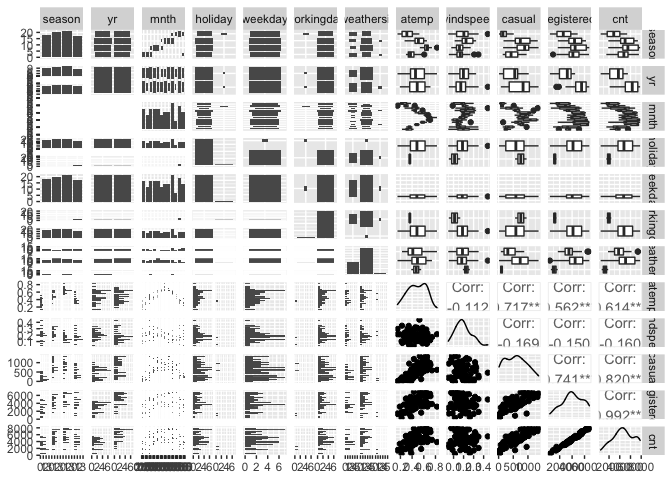<!-- -->

``` r
# dayNFCor <- cor(as.matrix(dayNF %>% select(3:9, atemp, windspeed, casual, registered,cnt)))
# corrplot(dayNFCor, type = "upper", tl.pos = "lt")
# corrplot(dayNFCor, type = "lower", method = "number", add = TRUE, diag = FALSE, tl.pos = "n")
```

Exploration of individual predictors

``` r
g <- ggplot(data = dayTrain)
g + geom_point(aes(x = dteday, y = registered))
```

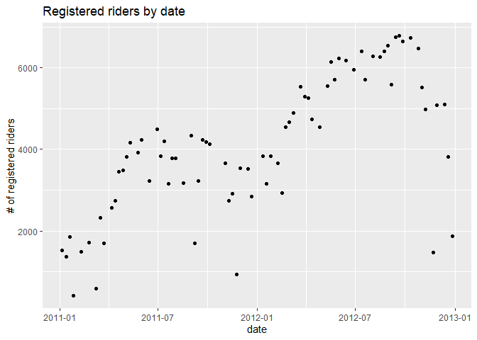<!-- -->

``` r
meanByMonth <- dayTrain %>% group_by(mnth) %>%
  summarize(meanCas = mean(casual), meanReg = mean(registered), meanTotal = mean(cnt))
g2 <- ggplot(meanByMonth, aes(x = mnth))
g2 + geom_bar(aes(y = meanCas), stat = "identity")
```

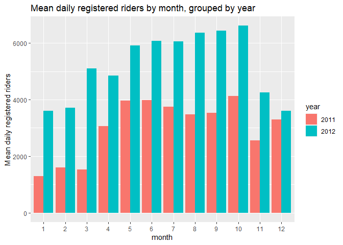<!-- -->

``` r
g2 + geom_bar(aes(y = meanReg), stat = "identity")
```

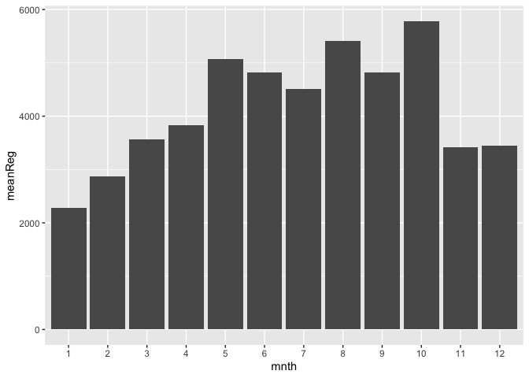<!-- -->

``` r
g2 + geom_bar(aes(y = meanTotal), stat = "identity")
```

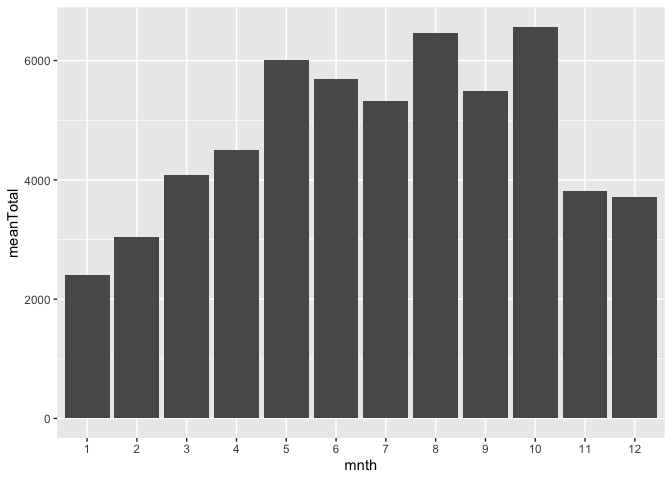<!-- -->

``` r
meanByYear <- dayTrain %>% group_by(yr) %>%
  summarize(meanCas = mean(casual), meanReg = mean(registered), meanTotal = mean(cnt))
g2 <- ggplot(meanByYear, aes(x = yr))
g2 + geom_bar(aes(y = meanCas), stat = "identity")
```

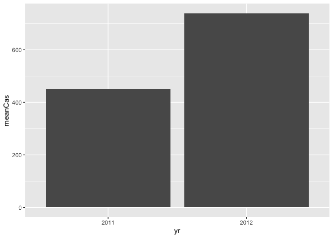<!-- -->

``` r
g2 + geom_bar(aes(y = meanReg), stat = "identity")
```

<!-- -->

``` r
g2 + geom_bar(aes(y = meanTotal), stat = "identity")
```

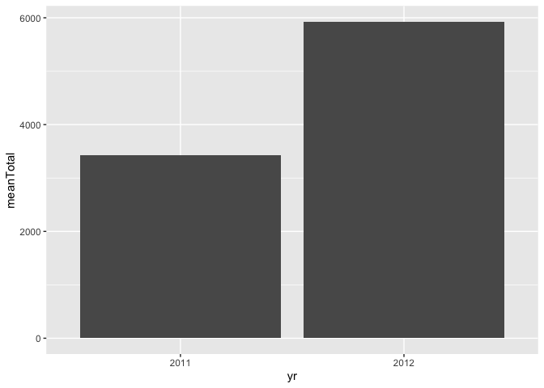<!-- -->

``` r
meanByWeather <- dayTrain %>% group_by(weathersit) %>%
  summarize(meanCas = mean(casual), meanReg = mean(registered), meanTotal = mean(cnt))
kable(meanByWeather, digits = 1, col.names = c("Weather", "Mean Casual Riders", "Mean Registered Riders", "Mean Total Riders"), caption = "Average # of riders by weather category")
```

| Weather         | Mean Casual Riders | Mean Registered Riders | Mean Total Riders |
|:----------------|-------------------:|-----------------------:|------------------:|
| mist            |              388.7 |                 3628.1 |            4016.8 |
| clear           |              706.8 |                 4398.5 |            5105.2 |
| lightRainOrSnow |               99.5 |                 1133.0 |            1232.5 |

Average \# of riders by weather category

``` r
meanByHoliday <- dayTrain %>% filter(workingday == 0) %>%
  group_by(holiday) %>%
  summarize(meanCas = mean(casual), meanReg = mean(registered), meanTotal = mean(cnt))
kable(meanByHoliday, digits = 1, col.names = c("Holiday (0 = no, 1 = yes)", "Mean Casual Riders", "Mean Registered Riders", "Mean Total Riders"), caption = "Average # of riders on holidays vs. non-holiday non-workdays")
```

| Holiday (0 = no, 1 = yes) | Mean Casual Riders | Mean Registered Riders | Mean Total Riders |
|:--------------------------|-------------------:|-----------------------:|------------------:|
| 1                         |              757.5 |                 1202.5 |              1960 |

Average \# of riders on holidays vs. non-holiday non-workdays

Exploratory data analysis and summary (James)

``` r
ggpairs(dayTrain %>% select(-instant,-dteday, -season, -yr, -cnt), 
        ggplot2::aes(colour=workingday))
```

    ## Error in cor.test.default(x, y, method = method, use = use): not enough finite observations

<!-- --> Notes from
looking at ggpairs plots: Working days are the highest usage for
registered riders, but non-working days are the highest usage for casual
riders. Registered riders are the primary volume, so we definitely care
most about them but worth keeping in mind. There are two types of
non-working days: weekends and holidays, and there is a difference in
volume for each of those rider types depending on whether it is a
holiday or a weekend.

Air temperature and temperature are nearly 100% correlated. We should
probably figure out which one of them we want to use. Speaking of
correlated, can we drop the date and only use months? Unfortunately, it
looks like we need to keep the year field as well, since year 2 had
better performance than year 1. Do we want to keep season and month? I
lean towards keeping year and month, but dropping season and date. Let
me know what you think.

Looking at the scatter of casual vs registered, broken out by working
day, it’s crazy how separate the linear relationships look:

``` r
g <- ggplot(data=dayTrain, aes(x=registered, y=casual))
g + geom_point(aes(color=workingday))
```

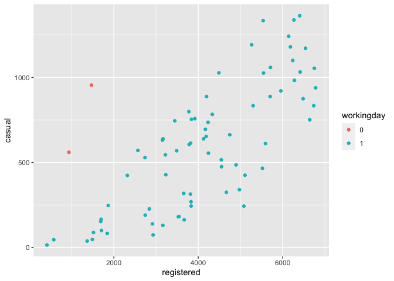<!-- --> On working
days, registered bikes are the main rider group. On non-working days, it
switches to casual. Looking at day of the week, we may be able to
exclude it since it will be covered by the working day flag and holiday
flag, but I guess we can check the models to see if it provides anything
extra.

``` r
g <- ggplot(data=dayTrain %>% 
                 select(weekday, casual, registered) %>%
                 pivot_longer(cols=c(casual, registered),
                              names_to = 'metrics',
                              values_to = 'riders') %>%
                 group_by(weekday, metrics) %>%
                 summarise(avg_riders = mean(riders)), 
            aes(x=weekday, y=avg_riders, fill=metrics))
```

    ## `summarise()` has grouped output by 'weekday'. You can override using the `.groups` argument.

``` r
g + geom_bar(stat='identity', position='dodge')
```

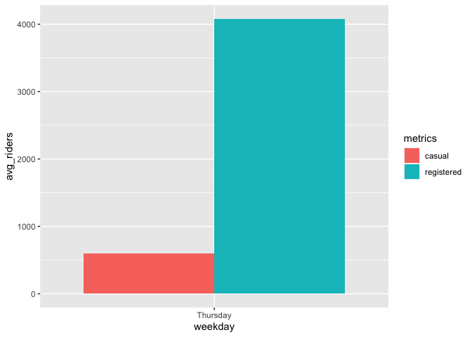<!-- --> Looking at
this graph, weekday definitely seems relatively stable across the days
(working days for registered and non-working days for casual are the
jumps), but there may be enough variation to include it.

\#\#I like this graph. I thought about doing one like it, but wasn’t
sure how to code it. pivot\_longer hadn’t occurred to me.

\#\#About which variables to include, I agree with your comments. My
understanding is that each of us comes up with our own models (I do a
linear regression and a random forest, you do a linear regression and a
boosted tree), so you and I don’t need to include the same predictors.
We do need to agree ahead of time on which response we’re going to model
(casual, registered, or cnt), so that the results of the 4 models can be
compared to each other. I’m fine with any of the 3. Do you have a
preference?

Yeah, no preference here either. I guess we could just say registered
since it’s the highest volume customer, and if we were doing this
analysis for that company then registered users would be the most
important group.

\#\#Sounds good, we’ll go with registered.

``` r
library(leaps)

data <- dayTrain %>% 
               filter(weekday == params$dayOfWeek) %>% drop_na() %>%
               select(-instant,-dteday, -season, 
                    -weekday, -atemp, -casual, -cnt)

#this function converts new data to a model matrix
#so that a prediction can be run via matrix multiplication
#on a best subsets model
predict.regsubsets = function(object,newdata,id,...){
      form = as.formula(object$call[[2]]) 
      mat = model.matrix(form,newdata)    
      coefi = coef(object,id=id)          
      xvars = names(coefi)                
      mat[,xvars]%*%coefi               
}


#let's do cross validation with folds
k <- 4
set.seed(21)
folds <- sample(1:k, nrow(data), replace=T)

cv_errors = matrix(NA, k, 16, dimnames = list(NULL, paste(1:16)))

for (j in 1:k) {
  best <- regsubsets(registered ~ ., 
                     data=data[folds!=j,], nvmax=20)
  
  for (i in 1:16) {
    pred <- predict(best, data[folds==j,], id=i)
    
    
    cv_errors[j, i] <- mean((temp_data$registered[folds==j]-pred)^2)
  }
}
```

    ## Warning in leaps.setup(x, y, wt = wt, nbest = nbest, nvmax = nvmax, force.in = force.in, : 1 linear
    ## dependencies found

    ## Reordering variables and trying again:

    ## Error in eval(x): object 'newX' not found

``` r
# Take the mean of over all folds for each model size
mean_cv_errors = apply(cv_errors, 2, mean)

# Find the model size with the smallest cross-validation error
min = which.min(mean_cv_errors)

#the model w/ 14 variables was best when using 4 fold cv.
#i did 4 fold because there are only about 80 rows of data per weekday

best_full <- regsubsets(registered ~ ., 
                     data=temp_data[folds!=j,], nvmax=20)
```

    ## Error in is.data.frame(data): object 'temp_data' not found

``` r
fit <- lm(registered ~ temp*hum,
        data=dayTrain %>% 
             filter(weekday == params$dayOfWeek) %>% drop_na() %>%
             select(-instant,-dteday, -season, 
                    -weekday, -atemp, -casual, -cnt))
```

``` r
names(dayTrain)
```

    ##  [1] "instant"    "dteday"     "season"     "yr"         "mnth"       "holiday"    "weekday"   
    ##  [8] "workingday" "weathersit" "temp"       "atemp"      "hum"        "windspeed"  "casual"    
    ## [15] "registered" "cnt"

``` r
# GGally::ggpairs(dayTrain %>% select(3:9, atemp, windspeed, casual, registered, cnt))
dayNFCor <- cor(as.matrix(dayNF %>% select(3:13, registered)))
corrplot(dayNFCor, type = "upper", tl.pos = "lt")
corrplot(dayNFCor, type = "lower", method = "number", add = TRUE, diag = FALSE, tl.pos = "n")
```

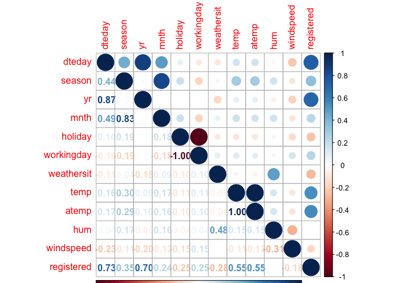<!-- -->

``` r
mlrFull <- lm(registered ~ dteday + season +  yr + mnth + holiday + workingday + weathersit + temp + atemp + hum + windspeed, dayTrain)
summary(mlrFull)
```

    ## 
    ## Call:
    ## lm(formula = registered ~ dteday + season + yr + mnth + holiday + 
    ##     workingday + weathersit + temp + atemp + hum + windspeed, 
    ##     data = dayTrain)
    ## 
    ## Residuals:
    ##    Min     1Q Median     3Q    Max 
    ## -958.8 -250.6   51.0  305.7  794.6 
    ## 
    ## Coefficients: (1 not defined because of singularities)
    ##                             Estimate Std. Error t value Pr(>|t|)    
    ## (Intercept)               123609.009 106544.104   1.160  0.25128    
    ## dteday                        -8.143      7.104  -1.146  0.25693    
    ## seasonspring                 766.418    349.363   2.194  0.03275 *  
    ## seasonsummer                 743.338    415.673   1.788  0.07956 .  
    ## seasonfall                  1106.582    368.539   3.003  0.00411 ** 
    ## yr2012                      4882.019   2614.710   1.867  0.06752 .  
    ## mnth2                        286.875    353.938   0.811  0.42133    
    ## mnth3                        543.556    578.222   0.940  0.35154    
    ## mnth4                        397.178    815.996   0.487  0.62849    
    ## mnth5                       1061.870   1026.923   1.034  0.30591    
    ## mnth6                        748.282   1222.554   0.612  0.54316    
    ## mnth7                        647.571   1417.651   0.457  0.64972    
    ## mnth8                       1304.566   1573.292   0.829  0.41078    
    ## mnth9                       2295.231   1748.390   1.313  0.19503    
    ## mnth10                      2937.633   1937.159   1.516  0.13546    
    ## mnth11                      2595.863   2131.314   1.218  0.22874    
    ## mnth12                      2680.140   2358.867   1.136  0.26108    
    ## holiday1                   -3172.224    419.199  -7.567 6.18e-10 ***
    ## workingday1                       NA         NA      NA       NA    
    ## weathersitclear              212.561    169.538   1.254  0.21553    
    ## weathersitlightRainOrSnow  -2286.597    443.234  -5.159 3.94e-06 ***
    ## temp                        6354.174   4078.506   1.558  0.12531    
    ## atemp                      -1689.596   4271.818  -0.396  0.69408    
    ## hum                        -1707.626    595.705  -2.867  0.00598 ** 
    ## windspeed                  -1724.172    956.500  -1.803  0.07725 .  
    ## ---
    ## Signif. codes:  0 '***' 0.001 '**' 0.01 '*' 0.05 '.' 0.1 ' ' 1
    ## 
    ## Residual standard error: 482.8 on 52 degrees of freedom
    ## Multiple R-squared:  0.9418, Adjusted R-squared:  0.9161 
    ## F-statistic: 36.61 on 23 and 52 DF,  p-value: < 2.2e-16

``` r
AIC(mlrFull)
```

    ## [1] 1176.133

``` r
x <- model.matrix(mlrFull)[, -1]
e <- eigen(t(x) %*% x)
e$val
```

    ##  [1] 1.788472e+10 2.760987e+01 2.686190e+01 2.027376e+01 1.562548e+01 9.881436e+00 7.597682e+00
    ##  [8] 7.035282e+00 6.708632e+00 6.201279e+00 5.854714e+00 5.320927e+00 4.185074e+00 2.595491e+00
    ## [15] 2.292680e+00 1.928540e+00 1.085631e+00 8.714965e-01 7.657593e-01 4.147777e-01 2.514482e-01
    ## [22] 8.868215e-02 7.041800e-03 1.024397e-05

``` r
sqrt(e$val[1]/min(e$val))
```

    ## [1] 41783708

``` r
vif(x)
```

    ##                    dteday              seasonspring              seasonsummer                seasonfall 
    ##                743.791453                  7.716982                 11.265750                  7.690314 
    ##                    yr2012                     mnth2                     mnth3                     mnth4 
    ##                557.300672                  2.510482                  9.116165                 18.155088 
    ##                     mnth5                     mnth6                     mnth7                     mnth8 
    ##                 28.753999                 29.952952                 47.650041                 58.687222 
    ##                     mnth9                    mnth10                    mnth11                    mnth12 
    ##                104.056519                 46.392757                139.498307                131.926336 
    ##                  holiday1               workingday1           weathersitclear weathersitlightRainOrSnow 
    ##                       Inf                       Inf                  2.068797                  1.641356 
    ##                      temp                     atemp                       hum                 windspeed 
    ##                166.656236                144.740504                  2.503377                  1.780274

``` r
#remove dteday (high collinearity, low p-value)
mlr2 <- update(mlrFull, . ~ . - dteday)
summary(mlr2)
```

    ## 
    ## Call:
    ## lm(formula = registered ~ season + yr + mnth + holiday + workingday + 
    ##     weathersit + temp + atemp + hum + windspeed, data = dayTrain)
    ## 
    ## Residuals:
    ##     Min      1Q  Median      3Q     Max 
    ## -1056.4  -289.4    62.9   321.8   750.1 
    ## 
    ## Coefficients: (1 not defined because of singularities)
    ##                           Estimate Std. Error t value Pr(>|t|)    
    ## (Intercept)                1482.32     589.27   2.516  0.01495 *  
    ## seasonspring                764.56     350.39   2.182  0.03356 *  
    ## seasonsummer                735.99     416.85   1.766  0.08322 .  
    ## seasonfall                 1072.03     368.39   2.910  0.00527 ** 
    ## yr2012                     1888.00     120.24  15.701  < 2e-16 ***
    ## mnth2                        50.82     288.71   0.176  0.86095    
    ## mnth3                        64.88     401.13   0.162  0.87212    
    ## mnth4                      -316.94     528.56  -0.600  0.55131    
    ## mnth5                       101.06     595.04   0.170  0.86578    
    ## mnth6                      -432.87     659.87  -0.656  0.51467    
    ## mnth7                      -769.54     695.84  -1.106  0.27376    
    ## mnth8                      -334.47     658.21  -0.508  0.61346    
    ## mnth9                       396.86     562.12   0.706  0.48328    
    ## mnth10                      803.07     535.33   1.500  0.13951    
    ## mnth11                      211.59     466.15   0.454  0.65174    
    ## mnth12                       10.60     375.99   0.028  0.97761    
    ## holiday1                  -3278.19     410.09  -7.994 1.14e-10 ***
    ## workingday1                     NA         NA      NA       NA    
    ## weathersitclear             253.64     166.20   1.526  0.13291    
    ## weathersitlightRainOrSnow -2195.80     437.39  -5.020 6.18e-06 ***
    ## temp                       5392.45    4003.08   1.347  0.18369    
    ## atemp                      -760.21    4206.57  -0.181  0.85728    
    ## hum                       -1699.14     597.42  -2.844  0.00631 ** 
    ## windspeed                 -1560.50     948.58  -1.645  0.10587    
    ## ---
    ## Signif. codes:  0 '***' 0.001 '**' 0.01 '*' 0.05 '.' 0.1 ' ' 1
    ## 
    ## Residual standard error: 484.2 on 53 degrees of freedom
    ## Multiple R-squared:  0.9404, Adjusted R-squared:  0.9156 
    ## F-statistic: 37.99 on 22 and 53 DF,  p-value: < 2.2e-16

``` r
AIC(mlr2)
```

    ## [1] 1176.029

``` r
x <- model.matrix(mlr2)[, -1]
e <- eigen(t(x) %*% x)
e$val
```

    ##  [1] 2.213676e+02 2.760295e+01 2.501325e+01 1.717583e+01 1.550916e+01 9.196077e+00 7.577487e+00
    ##  [8] 6.975416e+00 6.708483e+00 5.859952e+00 5.851261e+00 5.319962e+00 4.005045e+00 2.501128e+00
    ## [15] 1.928555e+00 1.624727e+00 1.065934e+00 8.713103e-01 4.863056e-01 3.817440e-01 1.791845e-01
    ## [22] 8.772341e-02 7.018964e-03

``` r
sqrt(e$val[1]/min(e$val))
```

    ## [1] 177.5908

``` r
vif(x)
```

    ##              seasonspring              seasonsummer                seasonfall                    yr2012 
    ##                  7.716816                 11.263072                  7.638869                  1.171686 
    ##                     mnth2                     mnth3                     mnth4                     mnth5 
    ##                  1.660595                  4.361446                  7.572723                  9.597257 
    ##                     mnth6                     mnth7                     mnth8                     mnth9 
    ##                  8.674651                 11.412595                 10.211405                 10.692715 
    ##                    mnth10                    mnth11                    mnth12                  holiday1 
    ##                  3.522056                  6.633776                  3.332063                       Inf 
    ##               workingday1           weathersitclear weathersitlightRainOrSnow                      temp 
    ##                       Inf                  1.976345                  1.588941                159.603750 
    ##                     atemp                       hum                 windspeed 
    ##                139.526385                  2.502990                  1.740600

``` r
#reduced AIC and condition number

#remove temp (high collinearity, low p-value)
mlr3 <- update(mlr2, . ~ . - temp)
summary(mlr3)
```

    ## 
    ## Call:
    ## lm(formula = registered ~ season + yr + mnth + holiday + workingday + 
    ##     weathersit + atemp + hum + windspeed, data = dayTrain)
    ## 
    ## Residuals:
    ##     Min      1Q  Median      3Q     Max 
    ## -955.44 -226.30   66.09  290.61  751.01 
    ## 
    ## Coefficients: (1 not defined because of singularities)
    ##                           Estimate Std. Error t value Pr(>|t|)    
    ## (Intercept)                1257.08     569.30   2.208  0.03150 *  
    ## seasonspring                780.55     352.82   2.212  0.03120 *  
    ## seasonsummer                818.73     415.40   1.971  0.05387 .  
    ## seasonfall                 1105.77     370.30   2.986  0.00424 ** 
    ## yr2012                     1895.55     121.02  15.664  < 2e-16 ***
    ## mnth2                        76.26     290.26   0.263  0.79376    
    ## mnth3                        85.92     403.84   0.213  0.83233    
    ## mnth4                      -268.66     531.31  -0.506  0.61515    
    ## mnth5                       227.18     592.04   0.384  0.70269    
    ## mnth6                      -199.22     641.45  -0.311  0.75732    
    ## mnth7                      -643.14     694.67  -0.926  0.35866    
    ## mnth8                      -143.00     647.51  -0.221  0.82604    
    ## mnth9                       533.42     557.06   0.958  0.34255    
    ## mnth10                      849.90     538.21   1.579  0.12015    
    ## mnth11                      209.82     469.65   0.447  0.65684    
    ## mnth12                       45.60     377.91   0.121  0.90440    
    ## holiday1                  -3297.68     412.91  -7.986 1.04e-10 ***
    ## workingday1                     NA         NA      NA       NA    
    ## weathersitclear             279.85     166.29   1.683  0.09818 .  
    ## weathersitlightRainOrSnow -2059.04     428.64  -4.804 1.28e-05 ***
    ## atemp                      4734.69    1035.30   4.573 2.84e-05 ***
    ## hum                       -1545.64     590.86  -2.616  0.01151 *  
    ## windspeed                 -1256.83     928.33  -1.354  0.18142    
    ## ---
    ## Signif. codes:  0 '***' 0.001 '**' 0.01 '*' 0.05 '.' 0.1 ' ' 1
    ## 
    ## Residual standard error: 487.9 on 54 degrees of freedom
    ## Multiple R-squared:  0.9383, Adjusted R-squared:  0.9143 
    ## F-statistic: 39.13 on 21 and 54 DF,  p-value: < 2.2e-16

``` r
AIC(mlr3)
```

    ## [1] 1176.588

``` r
x <- model.matrix(mlr3)[, -1]
e <- eigen(t(x) %*% x)
e$val
```

    ##  [1] 201.61686240  27.20903644  24.75067069  16.99754067  15.49412154   9.04383103   7.54696486
    ##  [8]   6.97262597   6.53578894   5.85891129   5.84309427   5.29255191   3.97214399   2.41394048
    ## [15]   1.89762273   1.62425834   1.02762049   0.77924396   0.48621064   0.30376660   0.17819925
    ## [22]   0.07873073

``` r
sqrt(e$val[1]/min(e$val))
```

    ## [1] 50.60475

``` r
vif(x)
```

    ##              seasonspring              seasonsummer                seasonfall                    yr2012 
    ##                  7.707962                 11.018554                  7.603565                  1.169138 
    ##                     mnth2                     mnth3                     mnth4                     mnth5 
    ##                  1.653489                  4.354838                  7.537914                  9.359660 
    ##                     mnth6                     mnth7                     mnth8                     mnth9 
    ##                  8.075292                 11.205063                  9.735252                 10.344956 
    ##                    mnth10                    mnth11                    mnth12                  holiday1 
    ##                  3.507204                  6.633722                  3.316151                       Inf 
    ##               workingday1           weathersitclear weathersitlightRainOrSnow                     atemp 
    ##                       Inf                  1.949269                  1.503333                  8.325896 
    ##                       hum                 windspeed 
    ##                  2.411935                  1.642295

``` r
#reduced AIC and condition number

#remove workingday (high collinearity, low p-value)
mlr4 <- update(mlr3, . ~ . - workingday)
summary(mlr4)
```

    ## 
    ## Call:
    ## lm(formula = registered ~ season + yr + mnth + holiday + weathersit + 
    ##     atemp + hum + windspeed, data = dayTrain)
    ## 
    ## Residuals:
    ##     Min      1Q  Median      3Q     Max 
    ## -955.44 -226.30   66.09  290.61  751.01 
    ## 
    ## Coefficients:
    ##                           Estimate Std. Error t value Pr(>|t|)    
    ## (Intercept)                1257.08     569.30   2.208  0.03150 *  
    ## seasonspring                780.55     352.82   2.212  0.03120 *  
    ## seasonsummer                818.73     415.40   1.971  0.05387 .  
    ## seasonfall                 1105.77     370.30   2.986  0.00424 ** 
    ## yr2012                     1895.55     121.02  15.664  < 2e-16 ***
    ## mnth2                        76.26     290.26   0.263  0.79376    
    ## mnth3                        85.92     403.84   0.213  0.83233    
    ## mnth4                      -268.66     531.31  -0.506  0.61515    
    ## mnth5                       227.18     592.04   0.384  0.70269    
    ## mnth6                      -199.22     641.45  -0.311  0.75732    
    ## mnth7                      -643.14     694.67  -0.926  0.35866    
    ## mnth8                      -143.00     647.51  -0.221  0.82604    
    ## mnth9                       533.42     557.06   0.958  0.34255    
    ## mnth10                      849.90     538.21   1.579  0.12015    
    ## mnth11                      209.82     469.65   0.447  0.65684    
    ## mnth12                       45.60     377.91   0.121  0.90440    
    ## holiday1                  -3297.68     412.91  -7.986 1.04e-10 ***
    ## weathersitclear             279.85     166.29   1.683  0.09818 .  
    ## weathersitlightRainOrSnow -2059.04     428.64  -4.804 1.28e-05 ***
    ## atemp                      4734.69    1035.30   4.573 2.84e-05 ***
    ## hum                       -1545.64     590.86  -2.616  0.01151 *  
    ## windspeed                 -1256.83     928.33  -1.354  0.18142    
    ## ---
    ## Signif. codes:  0 '***' 0.001 '**' 0.01 '*' 0.05 '.' 0.1 ' ' 1
    ## 
    ## Residual standard error: 487.9 on 54 degrees of freedom
    ## Multiple R-squared:  0.9383, Adjusted R-squared:  0.9143 
    ## F-statistic: 39.13 on 21 and 54 DF,  p-value: < 2.2e-16

``` r
AIC(mlr4)
```

    ## [1] 1176.588

``` r
x <- model.matrix(mlr4)[, -1]
e <- eigen(t(x) %*% x)
e$val
```

    ##  [1] 133.32822434  27.16984201  24.75048851  16.16155212  13.61788750   7.81745860   7.34130856
    ##  [8]   6.91081509   6.50241541   5.85558900   5.67381434   5.27590097   3.93857589   1.90440201
    ## [15]   1.62876315   1.41861290   1.02647288   0.77924327   0.44313765   0.29636582   0.08286722

``` r
sqrt(e$val[1]/min(e$val))
```

    ## [1] 40.11157

``` r
vif(x)
```

    ##              seasonspring              seasonsummer                seasonfall                    yr2012 
    ##                  7.707962                 11.018554                  7.603565                  1.169138 
    ##                     mnth2                     mnth3                     mnth4                     mnth5 
    ##                  1.653489                  4.354838                  7.537914                  9.359660 
    ##                     mnth6                     mnth7                     mnth8                     mnth9 
    ##                  8.075292                 11.205063                  9.735252                 10.344956 
    ##                    mnth10                    mnth11                    mnth12                  holiday1 
    ##                  3.507204                  6.633722                  3.316151                  1.395033 
    ##           weathersitclear weathersitlightRainOrSnow                     atemp                       hum 
    ##                  1.949269                  1.503333                  8.325896                  2.411935 
    ##                 windspeed 
    ##                  1.642295

``` r
#reduced AIC and condition number

#remove season (high collinearity, low p-value)
mlr5 <- update(mlr4, . ~ . - season)
summary(mlr5)
```

    ## 
    ## Call:
    ## lm(formula = registered ~ yr + mnth + holiday + weathersit + 
    ##     atemp + hum + windspeed, data = dayTrain)
    ## 
    ## Residuals:
    ##     Min      1Q  Median      3Q     Max 
    ## -1667.2  -295.6    46.1   316.9   886.2 
    ## 
    ## Coefficients:
    ##                           Estimate Std. Error t value Pr(>|t|)    
    ## (Intercept)                1242.39     606.04   2.050  0.04497 *  
    ## yr2012                     1894.45     129.17  14.666  < 2e-16 ***
    ## mnth2                        84.65     310.43   0.273  0.78608    
    ## mnth3                       484.01     375.05   1.291  0.20208    
    ## mnth4                       545.94     373.13   1.463  0.14892    
    ## mnth5                      1038.13     455.24   2.280  0.02634 *  
    ## mnth6                       651.48     537.75   1.212  0.23070    
    ## mnth7                       222.61     582.94   0.382  0.70398    
    ## mnth8                       706.56     526.51   1.342  0.18493    
    ## mnth9                      1466.49     435.73   3.366  0.00137 ** 
    ## mnth10                     1973.22     432.01   4.568 2.69e-05 ***
    ## mnth11                     1338.34     312.65   4.281 7.22e-05 ***
    ## mnth12                      806.03     304.87   2.644  0.01057 *  
    ## holiday1                  -3331.23     441.17  -7.551 3.84e-10 ***
    ## weathersitclear             319.72     176.77   1.809  0.07578 .  
    ## weathersitlightRainOrSnow -2245.87     451.88  -4.970 6.46e-06 ***
    ## atemp                      4619.00    1080.22   4.276 7.33e-05 ***
    ## hum                       -1462.29     605.22  -2.416  0.01891 *  
    ## windspeed                 -1430.28     987.20  -1.449  0.15286    
    ## ---
    ## Signif. codes:  0 '***' 0.001 '**' 0.01 '*' 0.05 '.' 0.1 ' ' 1
    ## 
    ## Residual standard error: 522 on 57 degrees of freedom
    ## Multiple R-squared:  0.9255, Adjusted R-squared:  0.9019 
    ## F-statistic: 39.32 on 18 and 57 DF,  p-value: < 2.2e-16

``` r
AIC(mlr5)
```

    ## [1] 1184.981

``` r
#don't remove season because AIC increased

#remove month (high collinearity, low p-value)
mlr6 <- update(mlr4, . ~ . - mnth)
summary(mlr6)
```

    ## 
    ## Call:
    ## lm(formula = registered ~ season + yr + holiday + weathersit + 
    ##     atemp + hum + windspeed, data = dayTrain)
    ## 
    ## Residuals:
    ##      Min       1Q   Median       3Q      Max 
    ## -1282.13  -204.62    44.06   264.43  1128.14 
    ## 
    ## Coefficients:
    ##                           Estimate Std. Error t value Pr(>|t|)    
    ## (Intercept)                  725.9      558.3   1.300 0.198155    
    ## seasonspring                 758.5      224.1   3.385 0.001213 ** 
    ## seasonsummer                 731.7      283.2   2.584 0.012027 *  
    ## seasonfall                  1428.8      197.6   7.231 6.77e-10 ***
    ## yr2012                      1974.4      127.8  15.446  < 2e-16 ***
    ## holiday1                   -3440.5      414.8  -8.293 8.79e-12 ***
    ## weathersitclear              389.0      169.5   2.295 0.024977 *  
    ## weathersitlightRainOrSnow  -1481.8      426.1  -3.478 0.000907 ***
    ## atemp                       4479.4      670.7   6.679 6.38e-09 ***
    ## hum                         -663.2      561.1  -1.182 0.241511    
    ## windspeed                  -1200.7      958.2  -1.253 0.214670    
    ## ---
    ## Signif. codes:  0 '***' 0.001 '**' 0.01 '*' 0.05 '.' 0.1 ' ' 1
    ## 
    ## Residual standard error: 534.8 on 65 degrees of freedom
    ## Multiple R-squared:  0.9108, Adjusted R-squared:  0.8971 
    ## F-statistic: 66.37 on 10 and 65 DF,  p-value: < 2.2e-16

``` r
AIC(mlr6)
```

    ## [1] 1182.636

``` r
x <- model.matrix(mlr6)[, -1]
e <- eigen(t(x) %*% x)
e$val
```

    ##  [1] 127.4153888  21.2069869  19.5647469  14.9126519  11.8868316   3.2212978   1.9266724   1.7175576
    ##  [9]   0.6406577   0.4309456

``` r
sqrt(e$val[1]/min(e$val))
```

    ## [1] 17.1949

``` r
vif(x)
```

    ##              seasonspring              seasonsummer                seasonfall                    yr2012 
    ##                  2.588232                  4.261313                  1.801624                  1.085616 
    ##                  holiday1           weathersitclear weathersitlightRainOrSnow                     atemp 
    ##                  1.171877                  1.685423                  1.236223                  2.907664 
    ##                       hum                 windspeed 
    ##                  1.810274                  1.456245

``` r
#reduced AIC and condition number

#remove year from full model instead of dteday (high collinearity)
mlr7 <- update(mlrFull, . ~ . - yr - workingday - temp, dayTrain)
summary(mlr7)
```

    ## 
    ## Call:
    ## lm(formula = registered ~ dteday + season + mnth + holiday + 
    ##     weathersit + atemp + hum + windspeed, data = dayTrain)
    ## 
    ## Residuals:
    ##      Min       1Q   Median       3Q      Max 
    ## -1020.53  -252.68    74.11   283.26   742.42 
    ## 
    ## Coefficients:
    ##                             Estimate Std. Error t value Pr(>|t|)    
    ## (Intercept)               -7.563e+04  5.127e+03 -14.753  < 2e-16 ***
    ## dteday                     5.129e+00  3.339e-01  15.359  < 2e-16 ***
    ## seasonspring               7.789e+02  3.585e+02   2.172 0.034228 *  
    ## seasonsummer               8.050e+02  4.221e+02   1.907 0.061827 .  
    ## seasonfall                 1.079e+03  3.762e+02   2.869 0.005867 ** 
    ## mnth2                     -7.417e+01  2.956e+02  -0.251 0.802853    
    ## mnth3                     -2.185e+02  4.104e+02  -0.532 0.596582    
    ## mnth4                     -7.279e+02  5.376e+02  -1.354 0.181389    
    ## mnth5                     -3.961e+02  5.993e+02  -0.661 0.511399    
    ## mnth6                     -9.763e+02  6.463e+02  -1.511 0.136737    
    ## mnth7                     -1.557e+03  6.996e+02  -2.226 0.030187 *  
    ## mnth8                     -1.201e+03  6.557e+02  -1.832 0.072532 .  
    ## mnth9                     -6.807e+02  5.657e+02  -1.203 0.234143    
    ## mnth10                    -5.002e+02  5.532e+02  -0.904 0.369879    
    ## mnth11                    -1.291e+03  4.885e+02  -2.643 0.010721 *  
    ## mnth12                    -1.639e+03  4.017e+02  -4.081 0.000149 ***
    ## holiday1                  -3.364e+03  4.194e+02  -8.021 9.12e-11 ***
    ## weathersitclear            3.032e+02  1.689e+02   1.795 0.078331 .  
    ## weathersitlightRainOrSnow -2.023e+03  4.360e+02  -4.639 2.27e-05 ***
    ## atemp                      4.717e+03  1.052e+03   4.482 3.89e-05 ***
    ## hum                       -1.565e+03  6.003e+02  -2.607 0.011783 *  
    ## windspeed                 -1.199e+03  9.440e+02  -1.270 0.209469    
    ## ---
    ## Signif. codes:  0 '***' 0.001 '**' 0.01 '*' 0.05 '.' 0.1 ' ' 1
    ## 
    ## Residual standard error: 495.7 on 54 degrees of freedom
    ## Multiple R-squared:  0.9363, Adjusted R-squared:  0.9116 
    ## F-statistic: 37.81 on 21 and 54 DF,  p-value: < 2.2e-16

``` r
AIC(mlr7)
```

    ## [1] 1179.023

``` r
x <- model.matrix(mlr7)[, -1]
e <- eigen(t(x) %*% x)
e$val
```

    ##  [1] 1.788472e+10 2.725763e+01 2.574657e+01 1.684971e+01 9.488500e+00 7.600940e+00 6.948504e+00
    ##  [8] 6.516024e+00 6.089029e+00 5.997150e+00 5.308369e+00 3.960150e+00 2.219264e+00 1.904366e+00
    ## [15] 1.467059e+00 1.056462e+00 8.296829e-01 6.755225e-01 3.324570e-01 2.736884e-01 8.092849e-02

``` r
sqrt(e$val[1]/min(e$val))
```

    ## [1] 470100.1

``` r
vif(x)
```

    ##                    dteday              seasonspring              seasonsummer                seasonfall 
    ##                  1.558832                  7.708342                 11.018960                  7.601559 
    ##                     mnth2                     mnth3                     mnth4                     mnth5 
    ##                  1.661117                  4.356471                  7.474792                  9.287051 
    ##                     mnth6                     mnth7                     mnth8                     mnth9 
    ##                  7.940625                 11.005633                  9.667930                 10.332316 
    ##                    mnth10                    mnth11                    mnth12                  holiday1 
    ##                  3.587912                  6.950395                  3.628661                  1.393650 
    ##           weathersitclear weathersitlightRainOrSnow                     atemp                       hum 
    ##                  1.948341                  1.506459                  8.331386                  2.410737 
    ##                 windspeed 
    ##                  1.644816

``` r
#higher AIC than mlr4

#compare to model chosen by leaps::step() function
mlrStep <- step(mlrFull)
```

    ## Start:  AIC=958.45
    ## registered ~ dteday + season + yr + mnth + holiday + workingday + 
    ##     weathersit + temp + atemp + hum + windspeed
    ## 
    ## 
    ## Step:  AIC=958.45
    ## registered ~ dteday + season + yr + mnth + holiday + weathersit + 
    ##     temp + atemp + hum + windspeed
    ## 
    ##              Df Sum of Sq      RSS     AIC
    ## - atemp       1     36463 12156791  956.68
    ## - dteday      1    306257 12426586  958.35
    ## <none>                    12120328  958.45
    ## - temp        1    565753 12686082  959.92
    ## - windspeed   1    757360 12877688  961.06
    ## - yr          1    812574 12932902  961.39
    ## - mnth       11   5736690 17857019  965.91
    ## - hum         1   1915287 14035616  967.60
    ## - season      3   2702401 14822729  967.75
    ## - weathersit  2   9590194 21710523  998.76
    ## - holiday     1  13347463 25467791 1012.89
    ## 
    ## Step:  AIC=956.68
    ## registered ~ dteday + season + yr + mnth + holiday + weathersit + 
    ##     temp + hum + windspeed
    ## 
    ##              Df Sum of Sq      RSS     AIC
    ## - dteday      1    277452 12434243  956.40
    ## <none>                    12156791  956.68
    ## - windspeed   1    723485 12880276  959.08
    ## - yr          1    776528 12933319  959.39
    ## - mnth       11   5767275 17924066  964.19
    ## - hum         1   1879062 14035854  965.61
    ## - season      3   2723921 14880712  966.05
    ## - temp        1   5574962 17731753  983.37
    ## - weathersit  2   9681853 21838644  997.20
    ## - holiday     1  13556095 25712886 1011.61
    ## 
    ## Step:  AIC=956.4
    ## registered ~ season + yr + mnth + holiday + weathersit + temp + 
    ##     hum + windspeed
    ## 
    ##              Df Sum of Sq      RSS     AIC
    ## <none>                    12434243  956.40
    ## - windspeed   1    641115 13075358  958.22
    ## - mnth       11   5507203 17941446  962.26
    ## - season      3   2604144 15038388  964.85
    ## - hum         1   1896659 14330902  965.19
    ## - temp        1   5395495 17829739  981.79
    ## - weathersit  2   9606266 22040509  995.90
    ## - holiday     1  15039183 27473426 1014.65
    ## - yr          1  57802538 70236781 1085.99

``` r
names(mlrStep)
```

    ##  [1] "coefficients"  "residuals"     "effects"       "rank"          "fitted.values" "assign"       
    ##  [7] "qr"            "df.residual"   "contrasts"     "xlevels"       "call"          "terms"        
    ## [13] "model"         "anova"

``` r
mlrStep$call
```

    ## lm(formula = registered ~ season + yr + mnth + holiday + weathersit + 
    ##     temp + hum + windspeed, data = dayTrain)

``` r
mlr6$call
```

    ## lm(formula = registered ~ season + yr + holiday + weathersit + 
    ##     atemp + hum + windspeed, data = dayTrain)

``` r
AIC(mlr6, mlrStep)
```

    ##         df      AIC
    ## mlr6    12 1182.636
    ## mlrStep 23 1174.076

``` r
#my choice agrees with step() choice

#diagnostics plot
plot(mlr6$fitted, mlr6$residuals)
```

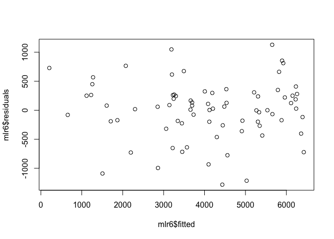<!-- -->

``` r
#indication of mild nonconstant variance
MASS::boxcox(mlr6)
```

<!-- -->

``` r
#Box-Cox lambda close to 1, so no need for transformation of response

#look for nonlinearity with partial residuals plots
termplot(mlr6, partial.resid = TRUE)
```

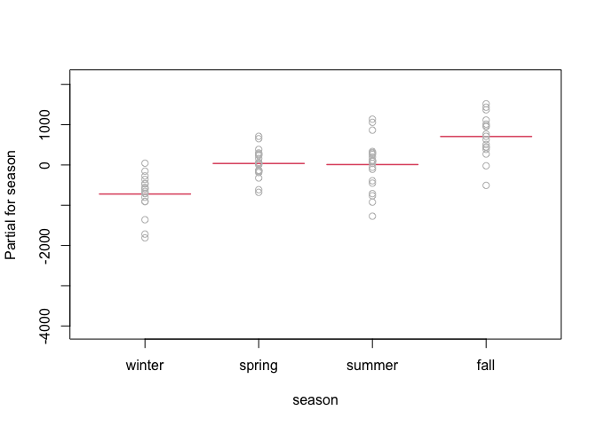<!-- -->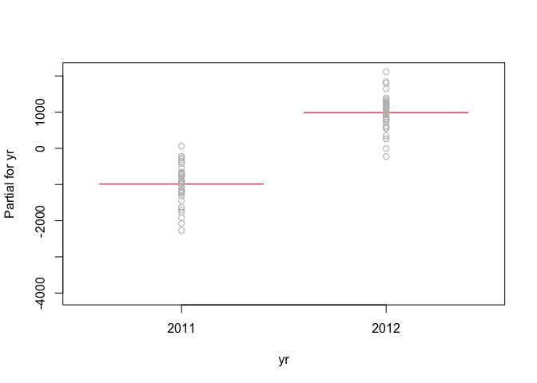<!-- -->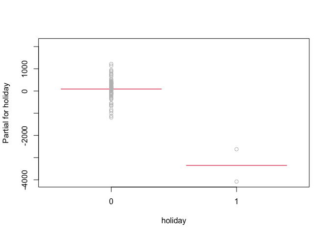<!-- -->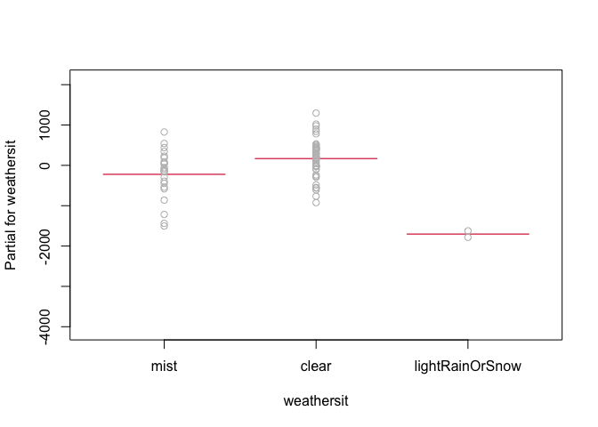<!-- -->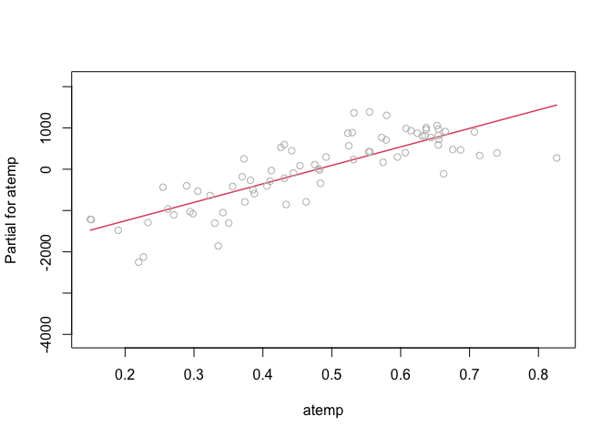<!-- -->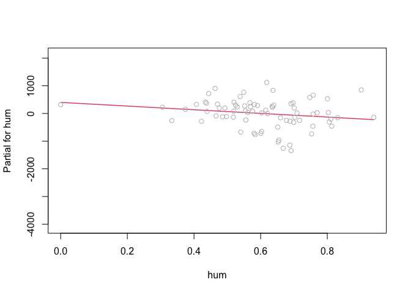<!-- -->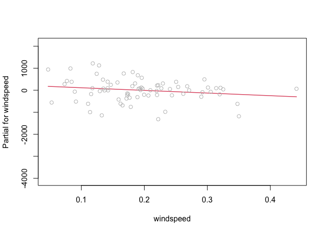<!-- -->

``` r
#atemp, hum, and windspeed look somewhat nonlinear, so try quadratic terms for them
mlr8 <- update(mlr6, . ~ . + I(atemp^2))
summary(mlr8)
```

    ## 
    ## Call:
    ## lm(formula = registered ~ season + yr + holiday + weathersit + 
    ##     atemp + hum + windspeed + I(atemp^2), data = dayTrain)
    ## 
    ## Residuals:
    ##      Min       1Q   Median       3Q      Max 
    ## -1134.51  -253.26    31.25   280.12   808.81 
    ## 
    ## Coefficients:
    ##                           Estimate Std. Error t value Pr(>|t|)    
    ## (Intercept)                 -925.4      637.3  -1.452  0.15141    
    ## seasonspring                 548.9      206.6   2.657  0.00994 ** 
    ## seasonsummer                 876.7      255.5   3.431  0.00106 ** 
    ## seasonfall                  1220.0      183.6   6.646 7.76e-09 ***
    ## yr2012                      1896.1      115.8  16.374  < 2e-16 ***
    ## holiday1                   -3472.0      370.9  -9.361 1.33e-13 ***
    ## weathersitclear              380.3      151.5   2.510  0.01463 *  
    ## weathersitlightRainOrSnow  -1901.4      394.0  -4.827 8.99e-06 ***
    ## atemp                      14043.3     2372.9   5.918 1.40e-07 ***
    ## hum                         -942.1      506.0  -1.862  0.06721 .  
    ## windspeed                  -1012.2      857.7  -1.180  0.24235    
    ## I(atemp^2)                -10558.3     2534.7  -4.166 9.48e-05 ***
    ## ---
    ## Signif. codes:  0 '***' 0.001 '**' 0.01 '*' 0.05 '.' 0.1 ' ' 1
    ## 
    ## Residual standard error: 478 on 64 degrees of freedom
    ## Multiple R-squared:  0.9298, Adjusted R-squared:  0.9178 
    ## F-statistic: 77.09 on 11 and 64 DF,  p-value: < 2.2e-16

``` r
AIC(mlr8)
```

    ## [1] 1166.404

``` r
#improved AIC, so keep atemp^2 in model

mlr9 <- update(mlr8, . ~ . + I(hum^2))
summary(mlr9)
```

    ## 
    ## Call:
    ## lm(formula = registered ~ season + yr + holiday + weathersit + 
    ##     atemp + hum + windspeed + I(atemp^2) + I(hum^2), data = dayTrain)
    ## 
    ## Residuals:
    ##      Min       1Q   Median       3Q      Max 
    ## -1116.40  -256.61    14.53   286.44   798.83 
    ## 
    ## Coefficients:
    ##                           Estimate Std. Error t value Pr(>|t|)    
    ## (Intercept)                 -680.8      901.2  -0.755 0.452810    
    ## seasonspring                 545.3      208.1   2.620 0.011015 *  
    ## seasonsummer                 882.6      257.7   3.425 0.001085 ** 
    ## seasonfall                  1227.9      185.9   6.604 9.75e-09 ***
    ## yr2012                      1899.8      117.0  16.241  < 2e-16 ***
    ## holiday1                   -3462.3      374.2  -9.252 2.38e-13 ***
    ## weathersitclear              408.4      169.0   2.416 0.018599 *  
    ## weathersitlightRainOrSnow  -2070.9      591.3  -3.502 0.000854 ***
    ## atemp                      13906.9     2414.8   5.759 2.71e-07 ***
    ## hum                        -1942.1     2637.3  -0.736 0.464228    
    ## windspeed                   -951.7      877.6  -1.084 0.282294    
    ## I(atemp^2)                -10427.6     2574.0  -4.051 0.000142 ***
    ## I(hum^2)                     933.9     2416.9   0.386 0.700483    
    ## ---
    ## Signif. codes:  0 '***' 0.001 '**' 0.01 '*' 0.05 '.' 0.1 ' ' 1
    ## 
    ## Residual standard error: 481.2 on 63 degrees of freedom
    ## Multiple R-squared:   0.93,  Adjusted R-squared:  0.9167 
    ## F-statistic: 69.74 on 12 and 63 DF,  p-value: < 2.2e-16

``` r
AIC(mlr9)
```

    ## [1] 1168.224

``` r
#improved AIC, so keep hum^2 in model

mlr10 <- update(mlr9, . ~ . + I(windspeed^2))
summary(mlr10)
```

    ## 
    ## Call:
    ## lm(formula = registered ~ season + yr + holiday + weathersit + 
    ##     atemp + hum + windspeed + I(atemp^2) + I(hum^2) + I(windspeed^2), 
    ##     data = dayTrain)
    ## 
    ## Residuals:
    ##      Min       1Q   Median       3Q      Max 
    ## -1111.04  -276.98    14.53   303.08   790.57 
    ## 
    ## Coefficients:
    ##                           Estimate Std. Error t value Pr(>|t|)    
    ## (Intercept)                 -878.2     1003.6  -0.875 0.384928    
    ## seasonspring                 516.2      218.8   2.359 0.021515 *  
    ## seasonsummer                 867.3      261.4   3.318 0.001522 ** 
    ## seasonfall                  1205.7      193.3   6.239 4.38e-08 ***
    ## yr2012                      1911.7      120.5  15.862  < 2e-16 ***
    ## holiday1                   -3427.5      384.1  -8.923 1.01e-12 ***
    ## weathersitclear              412.2      170.3   2.420 0.018447 *  
    ## weathersitlightRainOrSnow  -2102.0      598.9  -3.510 0.000841 ***
    ## atemp                      14182.0     2502.8   5.667 4.04e-07 ***
    ## hum                        -1971.5     2654.7  -0.743 0.460509    
    ## windspeed                    591.8     3474.7   0.170 0.865321    
    ## I(atemp^2)                -10713.8     2664.2  -4.021 0.000159 ***
    ## I(hum^2)                     974.8     2433.8   0.401 0.690143    
    ## I(windspeed^2)             -3459.3     7532.0  -0.459 0.647640    
    ## ---
    ## Signif. codes:  0 '***' 0.001 '**' 0.01 '*' 0.05 '.' 0.1 ' ' 1
    ## 
    ## Residual standard error: 484.3 on 62 degrees of freedom
    ## Multiple R-squared:  0.9302, Adjusted R-squared:  0.9156 
    ## F-statistic: 63.59 on 13 and 62 DF,  p-value: < 2.2e-16

``` r
AIC(mlr10)
```

    ## [1] 1169.966

``` r
#slightly improved AIC, compare using cross validation

#interaction of weather vars w/ holiday seems possible, so try adding to model
mlr11 <- update(mlr9, . ~ . + weathersit:holiday)
summary(mlr11)
```

    ## 
    ## Call:
    ## lm(formula = registered ~ season + yr + holiday + weathersit + 
    ##     atemp + hum + windspeed + I(atemp^2) + I(hum^2) + holiday:weathersit, 
    ##     data = dayTrain)
    ## 
    ## Residuals:
    ##      Min       1Q   Median       3Q      Max 
    ## -1116.40  -256.61    14.53   286.44   798.83 
    ## 
    ## Coefficients: (2 not defined because of singularities)
    ##                                    Estimate Std. Error t value Pr(>|t|)    
    ## (Intercept)                          -680.8      901.2  -0.755 0.452810    
    ## seasonspring                          545.3      208.1   2.620 0.011015 *  
    ## seasonsummer                          882.6      257.7   3.425 0.001085 ** 
    ## seasonfall                           1227.9      185.9   6.604 9.75e-09 ***
    ## yr2012                               1899.8      117.0  16.241  < 2e-16 ***
    ## holiday1                            -3462.3      374.2  -9.252 2.38e-13 ***
    ## weathersitclear                       408.4      169.0   2.416 0.018599 *  
    ## weathersitlightRainOrSnow           -2070.9      591.3  -3.502 0.000854 ***
    ## atemp                               13906.9     2414.8   5.759 2.71e-07 ***
    ## hum                                 -1942.1     2637.3  -0.736 0.464228    
    ## windspeed                            -951.7      877.6  -1.084 0.282294    
    ## I(atemp^2)                         -10427.6     2574.0  -4.051 0.000142 ***
    ## I(hum^2)                              933.9     2416.9   0.386 0.700483    
    ## holiday1:weathersitclear                 NA         NA      NA       NA    
    ## holiday1:weathersitlightRainOrSnow       NA         NA      NA       NA    
    ## ---
    ## Signif. codes:  0 '***' 0.001 '**' 0.01 '*' 0.05 '.' 0.1 ' ' 1
    ## 
    ## Residual standard error: 481.2 on 63 degrees of freedom
    ## Multiple R-squared:   0.93,  Adjusted R-squared:  0.9167 
    ## F-statistic: 69.74 on 12 and 63 DF,  p-value: < 2.2e-16

``` r
AIC(mlr11)
```

    ## [1] 1168.224

``` r
#slightly worse AIC, compare using cross validation
mlr12 <- update(mlr9, . ~ . + atemp:holiday)
summary(mlr12)
```

    ## 
    ## Call:
    ## lm(formula = registered ~ season + yr + holiday + weathersit + 
    ##     atemp + hum + windspeed + I(atemp^2) + I(hum^2) + holiday:atemp, 
    ##     data = dayTrain)
    ## 
    ## Residuals:
    ##      Min       1Q   Median       3Q      Max 
    ## -1150.85  -232.99    -3.59   267.15   799.17 
    ## 
    ## Coefficients:
    ##                           Estimate Std. Error t value Pr(>|t|)    
    ## (Intercept)                 -590.4      881.4  -0.670 0.505454    
    ## seasonspring                 567.9      203.6   2.789 0.007015 ** 
    ## seasonsummer                 889.6      251.7   3.534 0.000780 ***
    ## seasonfall                  1234.3      181.6   6.795 4.86e-09 ***
    ## yr2012                      1936.1      115.7  16.737  < 2e-16 ***
    ## holiday1                  -25797.4    11129.3  -2.318 0.023765 *  
    ## weathersitclear              400.5      165.2   2.425 0.018233 *  
    ## weathersitlightRainOrSnow  -2040.6      577.7  -3.532 0.000785 ***
    ## atemp                      13613.8     2363.2   5.761 2.81e-07 ***
    ## hum                        -1944.1     2576.0  -0.755 0.453305    
    ## windspeed                  -1142.1      862.4  -1.324 0.190250    
    ## I(atemp^2)                -10154.0     2517.9  -4.033 0.000154 ***
    ## I(hum^2)                     923.5     2360.8   0.391 0.696991    
    ## holiday1:atemp             61766.0    30760.6   2.008 0.049010 *  
    ## ---
    ## Signif. codes:  0 '***' 0.001 '**' 0.01 '*' 0.05 '.' 0.1 ' ' 1
    ## 
    ## Residual standard error: 470 on 62 degrees of freedom
    ## Multiple R-squared:  0.9343, Adjusted R-squared:  0.9205 
    ## F-statistic: 67.79 on 13 and 62 DF,  p-value: < 2.2e-16

``` r
AIC(mlr12)
```

    ## [1] 1165.436

``` r
#marginal decrease in AIC, compare using cross validation

#fit best candidate models using cross validation w/ caret package
mlrFit9 <- train(registered ~ season + yr + holiday + weathersit + atemp + hum + windspeed + I(atemp^2) + I(hum^2), data = dayTrain,
    method = "lm",
    preProcess = c("center", "scale"),
    trControl = trainControl(method = "repeatedcv", number = 4, repeats = 3))

mlrFit10 <- train(registered ~ season + yr + holiday + weathersit + atemp + hum + windspeed + I(atemp^2) + I(hum^2)+ I(windspeed^2), data = dayTrain,
    method = "lm",
    preProcess = c("center", "scale"),
    trControl = trainControl(method = "repeatedcv", number = 4, repeats = 3))

mlrFit11 <- train(registered ~ season + yr + holiday + weathersit + atemp + hum + windspeed + I(atemp^2) + I(hum^2) + holiday:weathersit, data = dayTrain,
    method = "lm",
    preProcess = c("center", "scale"),
    trControl = trainControl(method = "repeatedcv", number = 4, repeats = 3))

mlrFit12 <- train(registered ~ season + yr + holiday + weathersit + atemp + hum + windspeed + I(atemp^2) + I(hum^2) + holiday:atemp, data = dayTrain,
    method = "lm",
    preProcess = c("center", "scale"),
    trControl = trainControl(method = "repeatedcv", number = 4, repeats = 3))

comparison <- data.frame(t(mlrFit9$results), t(mlrFit10$results), t(mlrFit11$results), t(mlrFit12$results))
colnames(comparison) <- c("mlrFit9", "mlrFit10", "mlrFit11", "mlrFit12")
comparison
```

    ##                mlrFit9    mlrFit10    mlrFit11    mlrFit12
    ## intercept    1.0000000   1.0000000   1.0000000   1.0000000
    ## RMSE       636.5554048 810.4511287 682.6274040 720.7574802
    ## Rsquared     0.8683205   0.7644714   0.8548151   0.8065505
    ## MAE        466.8125403 548.5186040 488.8586525 500.9591062
    ## RMSESD     196.5630601 318.4012437 244.0813844 286.6360695
    ## RsquaredSD   0.1041567   0.1736387   0.1121956   0.1703805
    ## MAESD       95.9986375 141.3768499 121.2371368 123.4261982

``` r
#The lowest RMSE out of the 4 candidate models varies each time I run cross validation, so I will choose the simplest of the 4, mlrFit9
mlrBest <- mlrFit9

# for potentially automating choice of model
# which.min(c(mlrFit9$results["RMSE"], mlrFit10$results["RMSE"], mlrFit11$results["RMSE"], mlrFit12$results["RMSE"]))
```

``` r
rfFit <- train(registered ~ . - instant - casual - cnt, data = dayTrain,
               method = "rf",
               trControl = trainControl(method = "repeatedcv", number = 4, repeats = 3),
               preProcess = c("center", "scale"),
               tuneGrid = expand.grid(mtry = c(2, 7, 10:16, 20, 24)))
```

    ## Warning in preProcess.default(thresh = 0.95, k = 5, freqCut = 19, uniqueCut = 10, : These variables
    ## have zero variances: weekdaySunday, weekdayMonday, weekdayTuesday, weekdayWednesday, weekdayThursday,
    ## weekdayFriday

    ## Warning in preProcess.default(thresh = 0.95, k = 5, freqCut = 19, uniqueCut = 10, : These variables
    ## have zero variances: weekdaySunday, weekdayMonday, weekdayTuesday, weekdayWednesday, weekdayThursday,
    ## weekdayFriday

    ## Warning in preProcess.default(thresh = 0.95, k = 5, freqCut = 19, uniqueCut = 10, : These variables
    ## have zero variances: weekdaySunday, weekdayMonday, weekdayTuesday, weekdayWednesday, weekdayThursday,
    ## weekdayFriday

    ## Warning in preProcess.default(thresh = 0.95, k = 5, freqCut = 19, uniqueCut = 10, : These variables
    ## have zero variances: weekdaySunday, weekdayMonday, weekdayTuesday, weekdayWednesday, weekdayThursday,
    ## weekdayFriday

    ## Warning in preProcess.default(thresh = 0.95, k = 5, freqCut = 19, uniqueCut = 10, : These variables
    ## have zero variances: weekdaySunday, weekdayMonday, weekdayTuesday, weekdayWednesday, weekdayThursday,
    ## weekdayFriday

    ## Warning in preProcess.default(thresh = 0.95, k = 5, freqCut = 19, uniqueCut = 10, : These variables
    ## have zero variances: weekdaySunday, weekdayMonday, weekdayTuesday, weekdayWednesday, weekdayThursday,
    ## weekdayFriday

    ## Warning in preProcess.default(thresh = 0.95, k = 5, freqCut = 19, uniqueCut = 10, : These variables
    ## have zero variances: weekdaySunday, weekdayMonday, weekdayTuesday, weekdayWednesday, weekdayThursday,
    ## weekdayFriday

    ## Warning in preProcess.default(thresh = 0.95, k = 5, freqCut = 19, uniqueCut = 10, : These variables
    ## have zero variances: weekdaySunday, weekdayMonday, weekdayTuesday, weekdayWednesday, weekdayThursday,
    ## weekdayFriday

    ## Warning in preProcess.default(thresh = 0.95, k = 5, freqCut = 19, uniqueCut = 10, : These variables
    ## have zero variances: weekdaySunday, weekdayMonday, weekdayTuesday, weekdayWednesday, weekdayThursday,
    ## weekdayFriday

    ## Warning in preProcess.default(thresh = 0.95, k = 5, freqCut = 19, uniqueCut = 10, : These variables
    ## have zero variances: weekdaySunday, weekdayMonday, weekdayTuesday, weekdayWednesday, weekdayThursday,
    ## weekdayFriday

    ## Warning in preProcess.default(thresh = 0.95, k = 5, freqCut = 19, uniqueCut = 10, : These variables
    ## have zero variances: weekdaySunday, weekdayMonday, weekdayTuesday, weekdayWednesday, weekdayThursday,
    ## weekdayFriday

    ## Warning in preProcess.default(thresh = 0.95, k = 5, freqCut = 19, uniqueCut = 10, : These variables
    ## have zero variances: weekdaySunday, weekdayMonday, weekdayTuesday, weekdayWednesday, weekdayThursday,
    ## weekdayFriday

    ## Warning in preProcess.default(thresh = 0.95, k = 5, freqCut = 19, uniqueCut = 10, : These variables
    ## have zero variances: weekdaySunday, weekdayMonday, weekdayTuesday, weekdayWednesday, weekdayThursday,
    ## weekdayFriday

    ## Warning in preProcess.default(thresh = 0.95, k = 5, freqCut = 19, uniqueCut = 10, : These variables
    ## have zero variances: weekdaySunday, weekdayMonday, weekdayTuesday, weekdayWednesday, weekdayThursday,
    ## weekdayFriday

    ## Warning in preProcess.default(thresh = 0.95, k = 5, freqCut = 19, uniqueCut = 10, : These variables
    ## have zero variances: weekdaySunday, weekdayMonday, weekdayTuesday, weekdayWednesday, weekdayThursday,
    ## weekdayFriday

    ## Warning in preProcess.default(thresh = 0.95, k = 5, freqCut = 19, uniqueCut = 10, : These variables
    ## have zero variances: weekdaySunday, weekdayMonday, weekdayTuesday, weekdayWednesday, weekdayThursday,
    ## weekdayFriday

    ## Warning in preProcess.default(thresh = 0.95, k = 5, freqCut = 19, uniqueCut = 10, : These variables
    ## have zero variances: weekdaySunday, weekdayMonday, weekdayTuesday, weekdayWednesday, weekdayThursday,
    ## weekdayFriday

    ## Warning in preProcess.default(thresh = 0.95, k = 5, freqCut = 19, uniqueCut = 10, : These variables
    ## have zero variances: weekdaySunday, weekdayMonday, weekdayTuesday, weekdayWednesday, weekdayThursday,
    ## weekdayFriday

    ## Warning in preProcess.default(thresh = 0.95, k = 5, freqCut = 19, uniqueCut = 10, : These variables
    ## have zero variances: weekdaySunday, weekdayMonday, weekdayTuesday, weekdayWednesday, weekdayThursday,
    ## weekdayFriday

    ## Warning in preProcess.default(thresh = 0.95, k = 5, freqCut = 19, uniqueCut = 10, : These variables
    ## have zero variances: weekdaySunday, weekdayMonday, weekdayTuesday, weekdayWednesday, weekdayThursday,
    ## weekdayFriday

    ## Warning in preProcess.default(thresh = 0.95, k = 5, freqCut = 19, uniqueCut = 10, : These variables
    ## have zero variances: weekdaySunday, weekdayMonday, weekdayTuesday, weekdayWednesday, weekdayThursday,
    ## weekdayFriday

    ## Warning in preProcess.default(thresh = 0.95, k = 5, freqCut = 19, uniqueCut = 10, : These variables
    ## have zero variances: weekdaySunday, weekdayMonday, weekdayTuesday, weekdayWednesday, weekdayThursday,
    ## weekdayFriday

    ## Warning in preProcess.default(thresh = 0.95, k = 5, freqCut = 19, uniqueCut = 10, : These variables
    ## have zero variances: weekdaySunday, weekdayMonday, weekdayTuesday, weekdayWednesday, weekdayThursday,
    ## weekdayFriday

    ## Warning in preProcess.default(thresh = 0.95, k = 5, freqCut = 19, uniqueCut = 10, : These variables
    ## have zero variances: weekdaySunday, weekdayMonday, weekdayTuesday, weekdayWednesday, weekdayThursday,
    ## weekdayFriday

    ## Warning in preProcess.default(thresh = 0.95, k = 5, freqCut = 19, uniqueCut = 10, : These variables
    ## have zero variances: weekdaySunday, weekdayMonday, weekdayTuesday, weekdayWednesday, weekdayThursday,
    ## weekdayFriday

    ## Warning in preProcess.default(thresh = 0.95, k = 5, freqCut = 19, uniqueCut = 10, : These variables
    ## have zero variances: weekdaySunday, weekdayMonday, weekdayTuesday, weekdayWednesday, weekdayThursday,
    ## weekdayFriday

    ## Warning in preProcess.default(thresh = 0.95, k = 5, freqCut = 19, uniqueCut = 10, : These variables
    ## have zero variances: weekdaySunday, weekdayMonday, weekdayTuesday, weekdayWednesday, weekdayThursday,
    ## weekdayFriday

    ## Warning in preProcess.default(thresh = 0.95, k = 5, freqCut = 19, uniqueCut = 10, : These variables
    ## have zero variances: weekdaySunday, weekdayMonday, weekdayTuesday, weekdayWednesday, weekdayThursday,
    ## weekdayFriday

    ## Warning in preProcess.default(thresh = 0.95, k = 5, freqCut = 19, uniqueCut = 10, : These variables
    ## have zero variances: weekdaySunday, weekdayMonday, weekdayTuesday, weekdayWednesday, weekdayThursday,
    ## weekdayFriday

    ## Warning in preProcess.default(thresh = 0.95, k = 5, freqCut = 19, uniqueCut = 10, : These variables
    ## have zero variances: weekdaySunday, weekdayMonday, weekdayTuesday, weekdayWednesday, weekdayThursday,
    ## weekdayFriday

    ## Warning in preProcess.default(thresh = 0.95, k = 5, freqCut = 19, uniqueCut = 10, : These variables
    ## have zero variances: weekdaySunday, weekdayMonday, weekdayTuesday, weekdayWednesday, weekdayThursday,
    ## weekdayFriday

    ## Warning in preProcess.default(thresh = 0.95, k = 5, freqCut = 19, uniqueCut = 10, : These variables
    ## have zero variances: weekdaySunday, weekdayMonday, weekdayTuesday, weekdayWednesday, weekdayThursday,
    ## weekdayFriday

    ## Warning in preProcess.default(thresh = 0.95, k = 5, freqCut = 19, uniqueCut = 10, : These variables
    ## have zero variances: weekdaySunday, weekdayMonday, weekdayTuesday, weekdayWednesday, weekdayThursday,
    ## weekdayFriday

    ## Warning in preProcess.default(thresh = 0.95, k = 5, freqCut = 19, uniqueCut = 10, : These variables have
    ## zero variances: holiday1, weekdaySunday, weekdayMonday, weekdayTuesday, weekdayWednesday, weekdayThursday,
    ## weekdayFriday, workingday1

    ## Warning in preProcess.default(thresh = 0.95, k = 5, freqCut = 19, uniqueCut = 10, : These variables have
    ## zero variances: holiday1, weekdaySunday, weekdayMonday, weekdayTuesday, weekdayWednesday, weekdayThursday,
    ## weekdayFriday, workingday1

    ## Warning in preProcess.default(thresh = 0.95, k = 5, freqCut = 19, uniqueCut = 10, : These variables have
    ## zero variances: holiday1, weekdaySunday, weekdayMonday, weekdayTuesday, weekdayWednesday, weekdayThursday,
    ## weekdayFriday, workingday1

    ## Warning in preProcess.default(thresh = 0.95, k = 5, freqCut = 19, uniqueCut = 10, : These variables have
    ## zero variances: holiday1, weekdaySunday, weekdayMonday, weekdayTuesday, weekdayWednesday, weekdayThursday,
    ## weekdayFriday, workingday1

    ## Warning in preProcess.default(thresh = 0.95, k = 5, freqCut = 19, uniqueCut = 10, : These variables have
    ## zero variances: holiday1, weekdaySunday, weekdayMonday, weekdayTuesday, weekdayWednesday, weekdayThursday,
    ## weekdayFriday, workingday1

    ## Warning in preProcess.default(thresh = 0.95, k = 5, freqCut = 19, uniqueCut = 10, : These variables have
    ## zero variances: holiday1, weekdaySunday, weekdayMonday, weekdayTuesday, weekdayWednesday, weekdayThursday,
    ## weekdayFriday, workingday1

    ## Warning in preProcess.default(thresh = 0.95, k = 5, freqCut = 19, uniqueCut = 10, : These variables have
    ## zero variances: holiday1, weekdaySunday, weekdayMonday, weekdayTuesday, weekdayWednesday, weekdayThursday,
    ## weekdayFriday, workingday1

    ## Warning in preProcess.default(thresh = 0.95, k = 5, freqCut = 19, uniqueCut = 10, : These variables have
    ## zero variances: holiday1, weekdaySunday, weekdayMonday, weekdayTuesday, weekdayWednesday, weekdayThursday,
    ## weekdayFriday, workingday1

    ## Warning in preProcess.default(thresh = 0.95, k = 5, freqCut = 19, uniqueCut = 10, : These variables have
    ## zero variances: holiday1, weekdaySunday, weekdayMonday, weekdayTuesday, weekdayWednesday, weekdayThursday,
    ## weekdayFriday, workingday1

    ## Warning in preProcess.default(thresh = 0.95, k = 5, freqCut = 19, uniqueCut = 10, : These variables have
    ## zero variances: holiday1, weekdaySunday, weekdayMonday, weekdayTuesday, weekdayWednesday, weekdayThursday,
    ## weekdayFriday, workingday1

    ## Warning in preProcess.default(thresh = 0.95, k = 5, freqCut = 19, uniqueCut = 10, : These variables have
    ## zero variances: holiday1, weekdaySunday, weekdayMonday, weekdayTuesday, weekdayWednesday, weekdayThursday,
    ## weekdayFriday, workingday1

    ## Warning in preProcess.default(thresh = 0.95, k = 5, freqCut = 19, uniqueCut = 10, : These variables
    ## have zero variances: weekdaySunday, weekdayMonday, weekdayTuesday, weekdayWednesday, weekdayThursday,
    ## weekdayFriday

    ## Warning in preProcess.default(thresh = 0.95, k = 5, freqCut = 19, uniqueCut = 10, : These variables
    ## have zero variances: weekdaySunday, weekdayMonday, weekdayTuesday, weekdayWednesday, weekdayThursday,
    ## weekdayFriday

    ## Warning in preProcess.default(thresh = 0.95, k = 5, freqCut = 19, uniqueCut = 10, : These variables
    ## have zero variances: weekdaySunday, weekdayMonday, weekdayTuesday, weekdayWednesday, weekdayThursday,
    ## weekdayFriday

    ## Warning in preProcess.default(thresh = 0.95, k = 5, freqCut = 19, uniqueCut = 10, : These variables
    ## have zero variances: weekdaySunday, weekdayMonday, weekdayTuesday, weekdayWednesday, weekdayThursday,
    ## weekdayFriday

    ## Warning in preProcess.default(thresh = 0.95, k = 5, freqCut = 19, uniqueCut = 10, : These variables
    ## have zero variances: weekdaySunday, weekdayMonday, weekdayTuesday, weekdayWednesday, weekdayThursday,
    ## weekdayFriday

    ## Warning in preProcess.default(thresh = 0.95, k = 5, freqCut = 19, uniqueCut = 10, : These variables
    ## have zero variances: weekdaySunday, weekdayMonday, weekdayTuesday, weekdayWednesday, weekdayThursday,
    ## weekdayFriday

    ## Warning in preProcess.default(thresh = 0.95, k = 5, freqCut = 19, uniqueCut = 10, : These variables
    ## have zero variances: weekdaySunday, weekdayMonday, weekdayTuesday, weekdayWednesday, weekdayThursday,
    ## weekdayFriday

    ## Warning in preProcess.default(thresh = 0.95, k = 5, freqCut = 19, uniqueCut = 10, : These variables
    ## have zero variances: weekdaySunday, weekdayMonday, weekdayTuesday, weekdayWednesday, weekdayThursday,
    ## weekdayFriday

    ## Warning in preProcess.default(thresh = 0.95, k = 5, freqCut = 19, uniqueCut = 10, : These variables
    ## have zero variances: weekdaySunday, weekdayMonday, weekdayTuesday, weekdayWednesday, weekdayThursday,
    ## weekdayFriday

    ## Warning in preProcess.default(thresh = 0.95, k = 5, freqCut = 19, uniqueCut = 10, : These variables
    ## have zero variances: weekdaySunday, weekdayMonday, weekdayTuesday, weekdayWednesday, weekdayThursday,
    ## weekdayFriday

    ## Warning in preProcess.default(thresh = 0.95, k = 5, freqCut = 19, uniqueCut = 10, : These variables
    ## have zero variances: weekdaySunday, weekdayMonday, weekdayTuesday, weekdayWednesday, weekdayThursday,
    ## weekdayFriday

    ## Warning in preProcess.default(thresh = 0.95, k = 5, freqCut = 19, uniqueCut = 10, : These variables
    ## have zero variances: weekdaySunday, weekdayMonday, weekdayTuesday, weekdayWednesday, weekdayThursday,
    ## weekdayFriday

    ## Warning in preProcess.default(thresh = 0.95, k = 5, freqCut = 19, uniqueCut = 10, : These variables
    ## have zero variances: weekdaySunday, weekdayMonday, weekdayTuesday, weekdayWednesday, weekdayThursday,
    ## weekdayFriday

    ## Warning in preProcess.default(thresh = 0.95, k = 5, freqCut = 19, uniqueCut = 10, : These variables
    ## have zero variances: weekdaySunday, weekdayMonday, weekdayTuesday, weekdayWednesday, weekdayThursday,
    ## weekdayFriday

    ## Warning in preProcess.default(thresh = 0.95, k = 5, freqCut = 19, uniqueCut = 10, : These variables
    ## have zero variances: weekdaySunday, weekdayMonday, weekdayTuesday, weekdayWednesday, weekdayThursday,
    ## weekdayFriday

    ## Warning in preProcess.default(thresh = 0.95, k = 5, freqCut = 19, uniqueCut = 10, : These variables
    ## have zero variances: weekdaySunday, weekdayMonday, weekdayTuesday, weekdayWednesday, weekdayThursday,
    ## weekdayFriday

    ## Warning in preProcess.default(thresh = 0.95, k = 5, freqCut = 19, uniqueCut = 10, : These variables
    ## have zero variances: weekdaySunday, weekdayMonday, weekdayTuesday, weekdayWednesday, weekdayThursday,
    ## weekdayFriday

    ## Warning in preProcess.default(thresh = 0.95, k = 5, freqCut = 19, uniqueCut = 10, : These variables
    ## have zero variances: weekdaySunday, weekdayMonday, weekdayTuesday, weekdayWednesday, weekdayThursday,
    ## weekdayFriday

    ## Warning in preProcess.default(thresh = 0.95, k = 5, freqCut = 19, uniqueCut = 10, : These variables
    ## have zero variances: weekdaySunday, weekdayMonday, weekdayTuesday, weekdayWednesday, weekdayThursday,
    ## weekdayFriday

    ## Warning in preProcess.default(thresh = 0.95, k = 5, freqCut = 19, uniqueCut = 10, : These variables
    ## have zero variances: weekdaySunday, weekdayMonday, weekdayTuesday, weekdayWednesday, weekdayThursday,
    ## weekdayFriday

    ## Warning in preProcess.default(thresh = 0.95, k = 5, freqCut = 19, uniqueCut = 10, : These variables
    ## have zero variances: weekdaySunday, weekdayMonday, weekdayTuesday, weekdayWednesday, weekdayThursday,
    ## weekdayFriday

    ## Warning in preProcess.default(thresh = 0.95, k = 5, freqCut = 19, uniqueCut = 10, : These variables
    ## have zero variances: weekdaySunday, weekdayMonday, weekdayTuesday, weekdayWednesday, weekdayThursday,
    ## weekdayFriday

    ## Warning in preProcess.default(thresh = 0.95, k = 5, freqCut = 19, uniqueCut = 10, : These variables have
    ## zero variances: holiday1, weekdaySunday, weekdayMonday, weekdayTuesday, weekdayWednesday, weekdayThursday,
    ## weekdayFriday, workingday1

    ## Warning in preProcess.default(thresh = 0.95, k = 5, freqCut = 19, uniqueCut = 10, : These variables have
    ## zero variances: holiday1, weekdaySunday, weekdayMonday, weekdayTuesday, weekdayWednesday, weekdayThursday,
    ## weekdayFriday, workingday1

    ## Warning in preProcess.default(thresh = 0.95, k = 5, freqCut = 19, uniqueCut = 10, : These variables have
    ## zero variances: holiday1, weekdaySunday, weekdayMonday, weekdayTuesday, weekdayWednesday, weekdayThursday,
    ## weekdayFriday, workingday1

    ## Warning in preProcess.default(thresh = 0.95, k = 5, freqCut = 19, uniqueCut = 10, : These variables have
    ## zero variances: holiday1, weekdaySunday, weekdayMonday, weekdayTuesday, weekdayWednesday, weekdayThursday,
    ## weekdayFriday, workingday1

    ## Warning in preProcess.default(thresh = 0.95, k = 5, freqCut = 19, uniqueCut = 10, : These variables have
    ## zero variances: holiday1, weekdaySunday, weekdayMonday, weekdayTuesday, weekdayWednesday, weekdayThursday,
    ## weekdayFriday, workingday1

    ## Warning in preProcess.default(thresh = 0.95, k = 5, freqCut = 19, uniqueCut = 10, : These variables have
    ## zero variances: holiday1, weekdaySunday, weekdayMonday, weekdayTuesday, weekdayWednesday, weekdayThursday,
    ## weekdayFriday, workingday1

    ## Warning in preProcess.default(thresh = 0.95, k = 5, freqCut = 19, uniqueCut = 10, : These variables have
    ## zero variances: holiday1, weekdaySunday, weekdayMonday, weekdayTuesday, weekdayWednesday, weekdayThursday,
    ## weekdayFriday, workingday1

    ## Warning in preProcess.default(thresh = 0.95, k = 5, freqCut = 19, uniqueCut = 10, : These variables have
    ## zero variances: holiday1, weekdaySunday, weekdayMonday, weekdayTuesday, weekdayWednesday, weekdayThursday,
    ## weekdayFriday, workingday1

    ## Warning in preProcess.default(thresh = 0.95, k = 5, freqCut = 19, uniqueCut = 10, : These variables have
    ## zero variances: holiday1, weekdaySunday, weekdayMonday, weekdayTuesday, weekdayWednesday, weekdayThursday,
    ## weekdayFriday, workingday1

    ## Warning in preProcess.default(thresh = 0.95, k = 5, freqCut = 19, uniqueCut = 10, : These variables have
    ## zero variances: holiday1, weekdaySunday, weekdayMonday, weekdayTuesday, weekdayWednesday, weekdayThursday,
    ## weekdayFriday, workingday1

    ## Warning in preProcess.default(thresh = 0.95, k = 5, freqCut = 19, uniqueCut = 10, : These variables have
    ## zero variances: holiday1, weekdaySunday, weekdayMonday, weekdayTuesday, weekdayWednesday, weekdayThursday,
    ## weekdayFriday, workingday1

    ## Warning in preProcess.default(thresh = 0.95, k = 5, freqCut = 19, uniqueCut = 10, : These variables
    ## have zero variances: weekdaySunday, weekdayMonday, weekdayTuesday, weekdayWednesday, weekdayThursday,
    ## weekdayFriday, weathersitlightRainOrSnow

    ## Warning in preProcess.default(thresh = 0.95, k = 5, freqCut = 19, uniqueCut = 10, : These variables
    ## have zero variances: weekdaySunday, weekdayMonday, weekdayTuesday, weekdayWednesday, weekdayThursday,
    ## weekdayFriday, weathersitlightRainOrSnow

    ## Warning in preProcess.default(thresh = 0.95, k = 5, freqCut = 19, uniqueCut = 10, : These variables
    ## have zero variances: weekdaySunday, weekdayMonday, weekdayTuesday, weekdayWednesday, weekdayThursday,
    ## weekdayFriday, weathersitlightRainOrSnow

    ## Warning in preProcess.default(thresh = 0.95, k = 5, freqCut = 19, uniqueCut = 10, : These variables
    ## have zero variances: weekdaySunday, weekdayMonday, weekdayTuesday, weekdayWednesday, weekdayThursday,
    ## weekdayFriday, weathersitlightRainOrSnow

    ## Warning in preProcess.default(thresh = 0.95, k = 5, freqCut = 19, uniqueCut = 10, : These variables
    ## have zero variances: weekdaySunday, weekdayMonday, weekdayTuesday, weekdayWednesday, weekdayThursday,
    ## weekdayFriday, weathersitlightRainOrSnow

    ## Warning in preProcess.default(thresh = 0.95, k = 5, freqCut = 19, uniqueCut = 10, : These variables
    ## have zero variances: weekdaySunday, weekdayMonday, weekdayTuesday, weekdayWednesday, weekdayThursday,
    ## weekdayFriday, weathersitlightRainOrSnow

    ## Warning in preProcess.default(thresh = 0.95, k = 5, freqCut = 19, uniqueCut = 10, : These variables
    ## have zero variances: weekdaySunday, weekdayMonday, weekdayTuesday, weekdayWednesday, weekdayThursday,
    ## weekdayFriday, weathersitlightRainOrSnow

    ## Warning in preProcess.default(thresh = 0.95, k = 5, freqCut = 19, uniqueCut = 10, : These variables
    ## have zero variances: weekdaySunday, weekdayMonday, weekdayTuesday, weekdayWednesday, weekdayThursday,
    ## weekdayFriday, weathersitlightRainOrSnow

    ## Warning in preProcess.default(thresh = 0.95, k = 5, freqCut = 19, uniqueCut = 10, : These variables
    ## have zero variances: weekdaySunday, weekdayMonday, weekdayTuesday, weekdayWednesday, weekdayThursday,
    ## weekdayFriday, weathersitlightRainOrSnow

    ## Warning in preProcess.default(thresh = 0.95, k = 5, freqCut = 19, uniqueCut = 10, : These variables
    ## have zero variances: weekdaySunday, weekdayMonday, weekdayTuesday, weekdayWednesday, weekdayThursday,
    ## weekdayFriday, weathersitlightRainOrSnow

    ## Warning in preProcess.default(thresh = 0.95, k = 5, freqCut = 19, uniqueCut = 10, : These variables
    ## have zero variances: weekdaySunday, weekdayMonday, weekdayTuesday, weekdayWednesday, weekdayThursday,
    ## weekdayFriday, weathersitlightRainOrSnow

    ## Warning in preProcess.default(thresh = 0.95, k = 5, freqCut = 19, uniqueCut = 10, : These variables
    ## have zero variances: weekdaySunday, weekdayMonday, weekdayTuesday, weekdayWednesday, weekdayThursday,
    ## weekdayFriday

    ## Warning in preProcess.default(thresh = 0.95, k = 5, freqCut = 19, uniqueCut = 10, : These variables
    ## have zero variances: weekdaySunday, weekdayMonday, weekdayTuesday, weekdayWednesday, weekdayThursday,
    ## weekdayFriday

    ## Warning in preProcess.default(thresh = 0.95, k = 5, freqCut = 19, uniqueCut = 10, : These variables
    ## have zero variances: weekdaySunday, weekdayMonday, weekdayTuesday, weekdayWednesday, weekdayThursday,
    ## weekdayFriday

    ## Warning in preProcess.default(thresh = 0.95, k = 5, freqCut = 19, uniqueCut = 10, : These variables
    ## have zero variances: weekdaySunday, weekdayMonday, weekdayTuesday, weekdayWednesday, weekdayThursday,
    ## weekdayFriday

    ## Warning in preProcess.default(thresh = 0.95, k = 5, freqCut = 19, uniqueCut = 10, : These variables
    ## have zero variances: weekdaySunday, weekdayMonday, weekdayTuesday, weekdayWednesday, weekdayThursday,
    ## weekdayFriday

    ## Warning in preProcess.default(thresh = 0.95, k = 5, freqCut = 19, uniqueCut = 10, : These variables
    ## have zero variances: weekdaySunday, weekdayMonday, weekdayTuesday, weekdayWednesday, weekdayThursday,
    ## weekdayFriday

    ## Warning in preProcess.default(thresh = 0.95, k = 5, freqCut = 19, uniqueCut = 10, : These variables
    ## have zero variances: weekdaySunday, weekdayMonday, weekdayTuesday, weekdayWednesday, weekdayThursday,
    ## weekdayFriday

    ## Warning in preProcess.default(thresh = 0.95, k = 5, freqCut = 19, uniqueCut = 10, : These variables
    ## have zero variances: weekdaySunday, weekdayMonday, weekdayTuesday, weekdayWednesday, weekdayThursday,
    ## weekdayFriday

    ## Warning in preProcess.default(thresh = 0.95, k = 5, freqCut = 19, uniqueCut = 10, : These variables
    ## have zero variances: weekdaySunday, weekdayMonday, weekdayTuesday, weekdayWednesday, weekdayThursday,
    ## weekdayFriday

    ## Warning in preProcess.default(thresh = 0.95, k = 5, freqCut = 19, uniqueCut = 10, : These variables
    ## have zero variances: weekdaySunday, weekdayMonday, weekdayTuesday, weekdayWednesday, weekdayThursday,
    ## weekdayFriday

    ## Warning in preProcess.default(thresh = 0.95, k = 5, freqCut = 19, uniqueCut = 10, : These variables
    ## have zero variances: weekdaySunday, weekdayMonday, weekdayTuesday, weekdayWednesday, weekdayThursday,
    ## weekdayFriday

    ## Warning in preProcess.default(thresh = 0.95, k = 5, freqCut = 19, uniqueCut = 10, : These variables
    ## have zero variances: weekdaySunday, weekdayMonday, weekdayTuesday, weekdayWednesday, weekdayThursday,
    ## weekdayFriday

    ## Warning in preProcess.default(thresh = 0.95, k = 5, freqCut = 19, uniqueCut = 10, : These variables
    ## have zero variances: weekdaySunday, weekdayMonday, weekdayTuesday, weekdayWednesday, weekdayThursday,
    ## weekdayFriday

    ## Warning in preProcess.default(thresh = 0.95, k = 5, freqCut = 19, uniqueCut = 10, : These variables
    ## have zero variances: weekdaySunday, weekdayMonday, weekdayTuesday, weekdayWednesday, weekdayThursday,
    ## weekdayFriday

    ## Warning in preProcess.default(thresh = 0.95, k = 5, freqCut = 19, uniqueCut = 10, : These variables
    ## have zero variances: weekdaySunday, weekdayMonday, weekdayTuesday, weekdayWednesday, weekdayThursday,
    ## weekdayFriday

    ## Warning in preProcess.default(thresh = 0.95, k = 5, freqCut = 19, uniqueCut = 10, : These variables
    ## have zero variances: weekdaySunday, weekdayMonday, weekdayTuesday, weekdayWednesday, weekdayThursday,
    ## weekdayFriday

    ## Warning in preProcess.default(thresh = 0.95, k = 5, freqCut = 19, uniqueCut = 10, : These variables
    ## have zero variances: weekdaySunday, weekdayMonday, weekdayTuesday, weekdayWednesday, weekdayThursday,
    ## weekdayFriday

    ## Warning in preProcess.default(thresh = 0.95, k = 5, freqCut = 19, uniqueCut = 10, : These variables
    ## have zero variances: weekdaySunday, weekdayMonday, weekdayTuesday, weekdayWednesday, weekdayThursday,
    ## weekdayFriday

    ## Warning in preProcess.default(thresh = 0.95, k = 5, freqCut = 19, uniqueCut = 10, : These variables
    ## have zero variances: weekdaySunday, weekdayMonday, weekdayTuesday, weekdayWednesday, weekdayThursday,
    ## weekdayFriday

    ## Warning in preProcess.default(thresh = 0.95, k = 5, freqCut = 19, uniqueCut = 10, : These variables
    ## have zero variances: weekdaySunday, weekdayMonday, weekdayTuesday, weekdayWednesday, weekdayThursday,
    ## weekdayFriday

    ## Warning in preProcess.default(thresh = 0.95, k = 5, freqCut = 19, uniqueCut = 10, : These variables
    ## have zero variances: weekdaySunday, weekdayMonday, weekdayTuesday, weekdayWednesday, weekdayThursday,
    ## weekdayFriday

    ## Warning in preProcess.default(thresh = 0.95, k = 5, freqCut = 19, uniqueCut = 10, : These variables
    ## have zero variances: weekdaySunday, weekdayMonday, weekdayTuesday, weekdayWednesday, weekdayThursday,
    ## weekdayFriday

    ## Warning in preProcess.default(thresh = 0.95, k = 5, freqCut = 19, uniqueCut = 10, : These variables
    ## have zero variances: weekdaySunday, weekdayMonday, weekdayTuesday, weekdayWednesday, weekdayThursday,
    ## weekdayFriday, weathersitlightRainOrSnow

    ## Warning in preProcess.default(thresh = 0.95, k = 5, freqCut = 19, uniqueCut = 10, : These variables
    ## have zero variances: weekdaySunday, weekdayMonday, weekdayTuesday, weekdayWednesday, weekdayThursday,
    ## weekdayFriday, weathersitlightRainOrSnow

    ## Warning in preProcess.default(thresh = 0.95, k = 5, freqCut = 19, uniqueCut = 10, : These variables
    ## have zero variances: weekdaySunday, weekdayMonday, weekdayTuesday, weekdayWednesday, weekdayThursday,
    ## weekdayFriday, weathersitlightRainOrSnow

    ## Warning in preProcess.default(thresh = 0.95, k = 5, freqCut = 19, uniqueCut = 10, : These variables
    ## have zero variances: weekdaySunday, weekdayMonday, weekdayTuesday, weekdayWednesday, weekdayThursday,
    ## weekdayFriday, weathersitlightRainOrSnow

    ## Warning in preProcess.default(thresh = 0.95, k = 5, freqCut = 19, uniqueCut = 10, : These variables
    ## have zero variances: weekdaySunday, weekdayMonday, weekdayTuesday, weekdayWednesday, weekdayThursday,
    ## weekdayFriday, weathersitlightRainOrSnow

    ## Warning in preProcess.default(thresh = 0.95, k = 5, freqCut = 19, uniqueCut = 10, : These variables
    ## have zero variances: weekdaySunday, weekdayMonday, weekdayTuesday, weekdayWednesday, weekdayThursday,
    ## weekdayFriday, weathersitlightRainOrSnow

    ## Warning in preProcess.default(thresh = 0.95, k = 5, freqCut = 19, uniqueCut = 10, : These variables
    ## have zero variances: weekdaySunday, weekdayMonday, weekdayTuesday, weekdayWednesday, weekdayThursday,
    ## weekdayFriday, weathersitlightRainOrSnow

    ## Warning in preProcess.default(thresh = 0.95, k = 5, freqCut = 19, uniqueCut = 10, : These variables
    ## have zero variances: weekdaySunday, weekdayMonday, weekdayTuesday, weekdayWednesday, weekdayThursday,
    ## weekdayFriday, weathersitlightRainOrSnow

    ## Warning in preProcess.default(thresh = 0.95, k = 5, freqCut = 19, uniqueCut = 10, : These variables
    ## have zero variances: weekdaySunday, weekdayMonday, weekdayTuesday, weekdayWednesday, weekdayThursday,
    ## weekdayFriday, weathersitlightRainOrSnow

    ## Warning in preProcess.default(thresh = 0.95, k = 5, freqCut = 19, uniqueCut = 10, : These variables
    ## have zero variances: weekdaySunday, weekdayMonday, weekdayTuesday, weekdayWednesday, weekdayThursday,
    ## weekdayFriday, weathersitlightRainOrSnow

    ## Warning in preProcess.default(thresh = 0.95, k = 5, freqCut = 19, uniqueCut = 10, : These variables
    ## have zero variances: weekdaySunday, weekdayMonday, weekdayTuesday, weekdayWednesday, weekdayThursday,
    ## weekdayFriday, weathersitlightRainOrSnow

    ## Warning in preProcess.default(thresh = 0.95, k = 5, freqCut = 19, uniqueCut = 10, : These variables
    ## have zero variances: weekdaySunday, weekdayMonday, weekdayTuesday, weekdayWednesday, weekdayThursday,
    ## weekdayFriday

    ## Warning in preProcess.default(thresh = 0.95, k = 5, freqCut = 19, uniqueCut = 10, : These variables
    ## have zero variances: weekdaySunday, weekdayMonday, weekdayTuesday, weekdayWednesday, weekdayThursday,
    ## weekdayFriday

    ## Warning in preProcess.default(thresh = 0.95, k = 5, freqCut = 19, uniqueCut = 10, : These variables
    ## have zero variances: weekdaySunday, weekdayMonday, weekdayTuesday, weekdayWednesday, weekdayThursday,
    ## weekdayFriday

    ## Warning in preProcess.default(thresh = 0.95, k = 5, freqCut = 19, uniqueCut = 10, : These variables
    ## have zero variances: weekdaySunday, weekdayMonday, weekdayTuesday, weekdayWednesday, weekdayThursday,
    ## weekdayFriday

    ## Warning in preProcess.default(thresh = 0.95, k = 5, freqCut = 19, uniqueCut = 10, : These variables
    ## have zero variances: weekdaySunday, weekdayMonday, weekdayTuesday, weekdayWednesday, weekdayThursday,
    ## weekdayFriday

    ## Warning in preProcess.default(thresh = 0.95, k = 5, freqCut = 19, uniqueCut = 10, : These variables
    ## have zero variances: weekdaySunday, weekdayMonday, weekdayTuesday, weekdayWednesday, weekdayThursday,
    ## weekdayFriday

    ## Warning in preProcess.default(thresh = 0.95, k = 5, freqCut = 19, uniqueCut = 10, : These variables
    ## have zero variances: weekdaySunday, weekdayMonday, weekdayTuesday, weekdayWednesday, weekdayThursday,
    ## weekdayFriday

    ## Warning in preProcess.default(thresh = 0.95, k = 5, freqCut = 19, uniqueCut = 10, : These variables
    ## have zero variances: weekdaySunday, weekdayMonday, weekdayTuesday, weekdayWednesday, weekdayThursday,
    ## weekdayFriday

    ## Warning in preProcess.default(thresh = 0.95, k = 5, freqCut = 19, uniqueCut = 10, : These variables
    ## have zero variances: weekdaySunday, weekdayMonday, weekdayTuesday, weekdayWednesday, weekdayThursday,
    ## weekdayFriday

    ## Warning in preProcess.default(thresh = 0.95, k = 5, freqCut = 19, uniqueCut = 10, : These variables
    ## have zero variances: weekdaySunday, weekdayMonday, weekdayTuesday, weekdayWednesday, weekdayThursday,
    ## weekdayFriday

    ## Warning in preProcess.default(thresh = 0.95, k = 5, freqCut = 19, uniqueCut = 10, : These variables
    ## have zero variances: weekdaySunday, weekdayMonday, weekdayTuesday, weekdayWednesday, weekdayThursday,
    ## weekdayFriday

    ## Warning in preProcess.default(thresh = 0.95, k = 5, freqCut = 19, uniqueCut = 10, : These variables
    ## have zero variances: weekdaySunday, weekdayMonday, weekdayTuesday, weekdayWednesday, weekdayThursday,
    ## weekdayFriday

``` r
rfFit
```

    ## Random Forest 
    ## 
    ## 76 samples
    ## 15 predictors
    ## 
    ## Pre-processing: centered (30), scaled (30) 
    ## Resampling: Cross-Validated (4 fold, repeated 3 times) 
    ## Summary of sample sizes: 57, 58, 56, 57, 57, 57, ... 
    ## Resampling results across tuning parameters:
    ## 
    ##   mtry  RMSE       Rsquared   MAE     
    ##    2    1129.2993  0.7488504  895.3667
    ##    7     836.7594  0.7700409  595.4786
    ##   10     838.4812  0.7668973  581.9909
    ##   11     839.5500  0.7612128  586.6292
    ##   12     840.1982  0.7628970  585.5670
    ##   13     836.6721  0.7637606  584.4475
    ##   14     845.4314  0.7576399  581.3087
    ##   15     844.7301  0.7589868  582.9177
    ##   16     845.6263  0.7581805  580.6466
    ##   20     852.6468  0.7556221  584.1953
    ##   24     850.9158  0.7566955  581.1546
    ## 
    ## RMSE was used to select the optimal model using the smallest value.
    ## The final value used for the model was mtry = 13.
