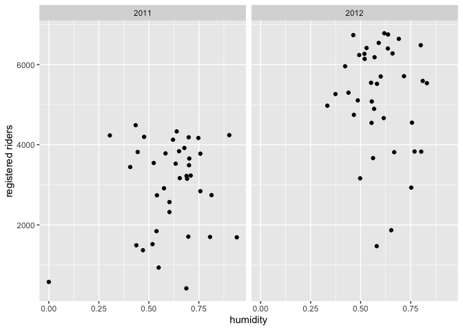
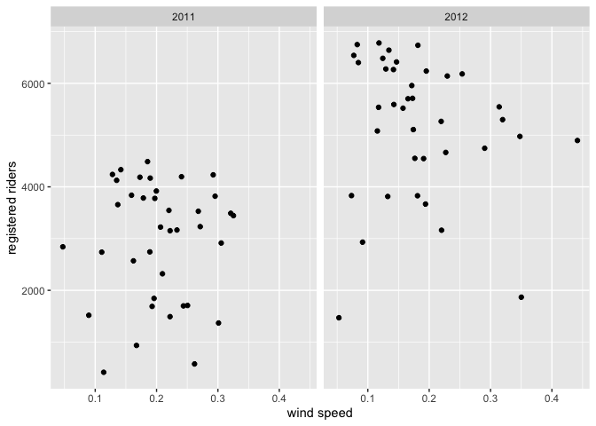
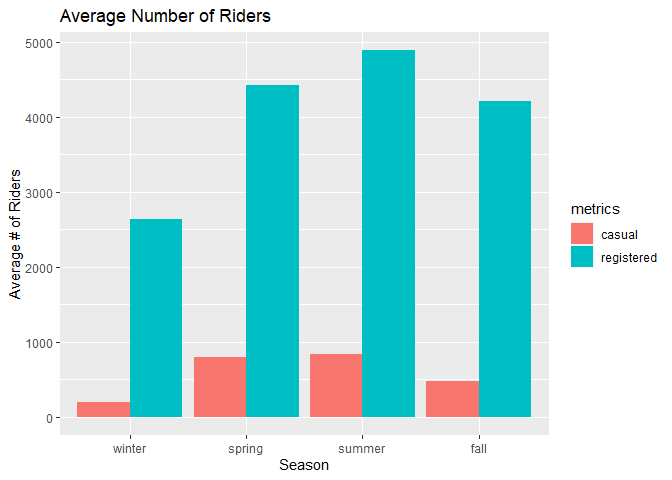
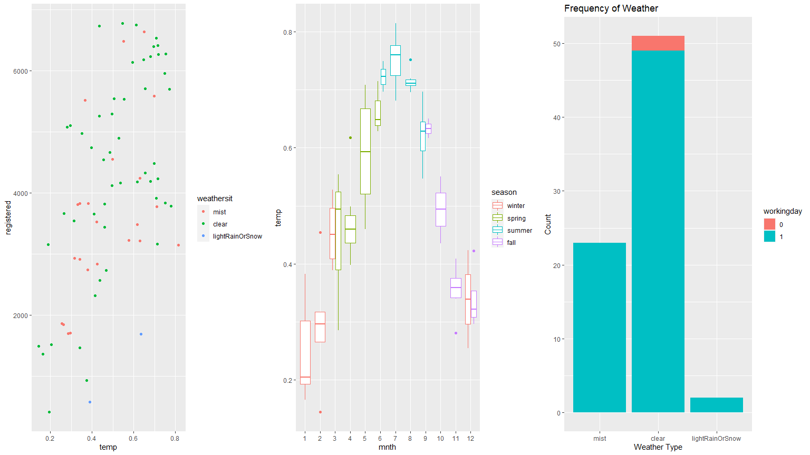
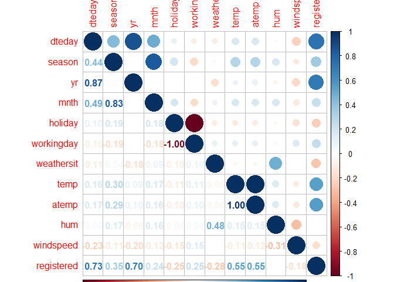
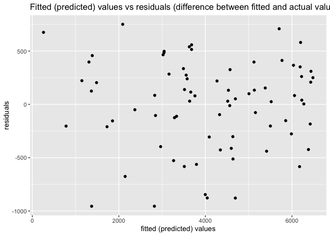
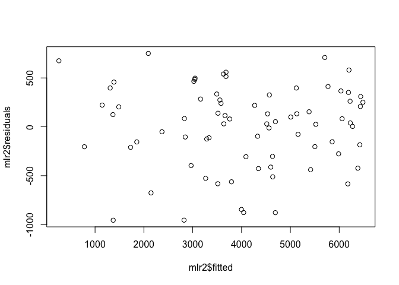
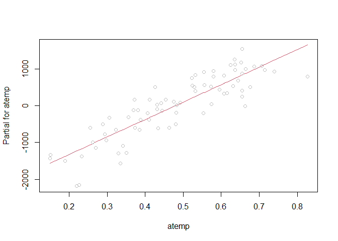
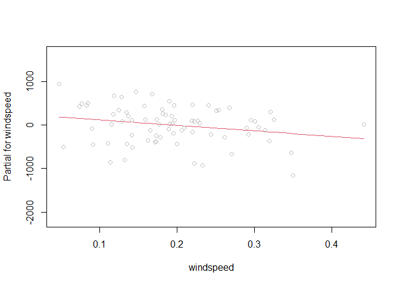
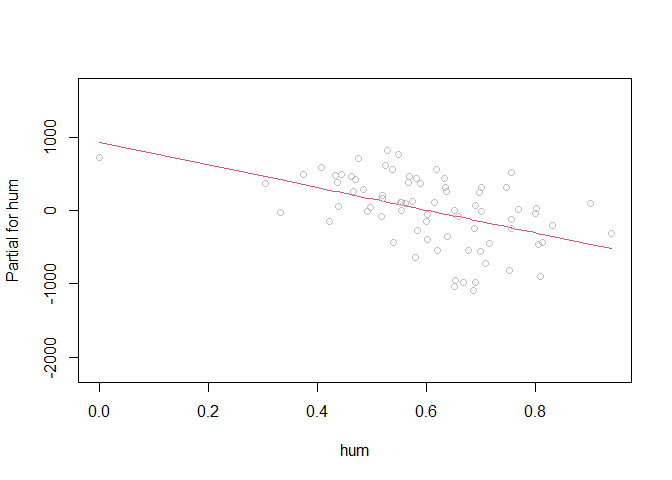

ST 558 Project 2
================
By David Arthur and James Carr
6/28/2021

-   [Introduction](#introduction)
-   [Data](#data)
-   [Summarizations](#summarizations)
-   [Modeling](#modeling)
    -   [First linear regression model](#first-linear-regression-model)
    -   [Second linear regression
        model](#second-linear-regression-model)
    -   [Random Forest Model](#random-forest-model)
    -   [Boosted Regression Tree](#boosted-regression-tree)
-   [Comparison of models](#comparison-of-models)

# Thursday

# Introduction

The data set this program analyzes can be found
[here](https://archive.ics.uci.edu/ml/datasets/Bike+Sharing+Dataset).
The data describes the count of rental bikes between years 2011 and 2012
in the Capital bikeshare system by a few dimensions:

-   season
-   day of the week
-   year
-   month
-   holiday (y/n flag)
-   working day (y/n flag)
-   weather (good, fair, poor, bad)
-   temperature
-   humidity
-   wind

It is further broken down into three response variables:

-   Casual: non-registered riders who use the service casually
-   Registered: registered riders who use the service more regularly
-   Total: casual and registered combined

The split between casual and registered is important, because they
behave completely differently, use the service on different days, times,
holidays, etc. Often, their behavior is inverse of each other, though
the registered rider group is largest portion of riders and would be the
primary client of the business. Keeping in mind that the registered
client represents the largest portion of the clientele, this program
focuses on the registered metric and splits the behavior by each day of
the week.

This analysis constructs 2 linear regression models, a random forest
model, and a boosted tree model, each designed to predict the number of
registered riders on any given day based on the values of the predictor
variables in the data set.

# Data

We begin by reading in the data, changing the names of some factor
levels, and filtering by day of week

``` r
day <- readr::read_csv("day.csv", col_types = cols(
  season = col_factor(),
  yr = col_factor(),
  mnth = col_factor(),
  holiday = col_factor(),
  weekday = col_factor(),
  workingday = col_factor(),
  weathersit = col_factor()))

day <- day %>% mutate(season = fct_recode(season, winter = "1", spring = "2", summer = "3", fall = "4")) %>%
  mutate(yr = fct_recode(yr, "2011" = "0", "2012" = "1")) %>%
  mutate(weekday = fct_recode(weekday, Sunday = "0", Monday = "1", Tuesday = "2", Wednesday = "3", Thursday = "4", Friday = "5", Saturday = "6")) %>%
  mutate(weathersit = fct_recode(weathersit, clear = "1", mist = "2", lightRainOrSnow = "3", heavyRainOrSnow = "4")) %>%
  filter(weekday == params$dayOfWeek)

# read in version without factors for correlation plot
dayNF <- readr::read_csv("day.csv", col_types = cols(
  weekday = col_factor()))
```

Next, we partition the data into training and test sets

``` r
set.seed(21)
trainIndex <- createDataPartition(day$cnt, p = 0.7, list = FALSE)
dayTrain <- day[trainIndex, ]
dayTest <- day[-trainIndex, ]
```

# Summarizations

We begin our exploratory analysis of the data with a graphical overview
of the relationships between variables. Obvious patterns in the plots,
as well as high correlation values, indicate associations between
variables.

``` r
GGally::ggpairs(dayTrain %>% select(2:6, 8:9, atemp, windspeed, registered, casual))
```

<!-- -->

We will now look in more detail at relationships between time-related
variables and the `registered` response variable. When we do our linear
regression modeling we will need to decide which (if any) of these
predictors to use. For example, the date variable (`dteday`) and
`season` may not be useful in the presence of `weekday`, `mnth`, and
`yr` (or vice versa), as they provide largely redundant information.

``` r
g <- ggplot(data = dayTrain)
g + geom_point(aes(x = dteday, y = registered)) +
  labs(title = "Registered riders by date", x = "date", y = "# of registered riders")
```

<!-- -->

``` r
meanByMonthYr <- dayTrain %>% group_by(mnth, yr) %>%
  summarize(meanReg = mean(registered))
g2 <- ggplot(meanByMonthYr, aes(x = mnth))
g2 + geom_bar(aes(y = meanReg, fill = yr), position = "dodge", stat = "identity") +
  labs(title = "Mean daily registered riders by month, grouped by year", x = "month", y = "Mean daily registered riders", fill = "year")
```

<!-- -->

We will look next in more detail at the relationship between
quantitative weather variables and the `registered` response variable.
The appearance of nonlinear relationships in the scatter plots below may
indicate the need for quadratic terms in our linear regression models.
The adjusted temperature variable, `atemp`, seems particularly likely to
require a quadratic term, as both low and high temperatures can
discourage people from bicycling. Similarly, with humidity and
windspeed, low to moderate values may have no effect, but particularly
high values could have an effect, so those variables may also require
quadratic terms.

``` r
g + geom_point(aes(x = atemp, y = registered)) + facet_wrap(~ yr) + 
  labs(x = "adjusted temperature", y = "registered riders")
```

<!-- -->

``` r
g + geom_point(aes(x = hum, y = registered)) + facet_wrap(~ yr) + 
  labs(x = "humidity", y = "registered riders")
```

<!-- -->

``` r
g + geom_point(aes(x = windspeed, y = registered)) + facet_wrap(~ yr) + 
  labs(x = "wind speed", y = "registered riders")
```

<!-- -->

We now view a table displaying the mean number of `registered`,
`casual`, and total riders at each level of the categorical `weathersit`
variable. It seems plausible that in rain or snow, the number of casual
riders might decrease by a larger factor than would the number of
registered riders.

``` r
meanByWeather <- dayTrain %>% group_by(weathersit) %>%
  summarize(meanCas = mean(casual), meanReg = mean(registered), meanTotal = mean(cnt))
kable(meanByWeather, digits = 1, col.names = c("Weather", "Mean Casual Riders", "Mean Registered Riders", "Mean Total Riders"), caption = "Average # of riders by weather category")
```

| Weather         | Mean Casual Riders | Mean Registered Riders | Mean Total Riders |
|:----------------|-------------------:|-----------------------:|------------------:|
| mist            |              388.7 |                 3628.1 |            4016.8 |
| clear           |              706.8 |                 4398.5 |            5105.2 |
| lightRainOrSnow |               99.5 |                 1133.0 |            1232.5 |

Average \# of riders by weather category

``` r
scatter_james <- ggplot(data=dayTrain, aes(x=temp, y=registered)) +
                 geom_point(aes(color=weathersit))
hist_james <- ggplot(data=dayTrain, aes(x=weathersit)) +
              geom_histogram(stat='count', aes(fill=workingday)) +
              ggtitle('Frequency of Weather') +
              xlab('Weather Type') + ylab('Count')

bar_james <- ggplot(data=dayTrain %>% 
                 select(season, casual, registered) %>%
                 pivot_longer(cols=c(casual, registered),
                              names_to = 'metrics',
                              values_to = 'riders') %>%
                 group_by(season, metrics) %>%
                 summarise(avg_riders = mean(riders)), 
            aes(x=season, y=avg_riders, fill=metrics)) +     
            geom_bar(stat='identity', position='dodge') +
            ggtitle('Average Number of Riders') +
              xlab('Season') + ylab('Average # of Riders')
  
box_james <- ggplot(data=dayTrain, aes(x=mnth, y=temp)) +
             geom_boxplot(aes(color=season))
```

Looking at the bar graph below, in all seasons the registered user base
far out-performs the casual base. This further confirms our plan of
analyzing the registered group as the priority.

<!-- -->

Since we don’t have a domain expert, we need to try to figure out what
variables are important and which we could exclude. We already know that
the two temperature variables have near perfect correlation, and clearly
date is redundant with mnth and yr. I would think season is as well
covered by mnth.

That leaves temperature, weather, and the working day flag as the most
likely to be relevant parameters. Looking at the plots below, I think we
can make a few obvious inferences:

-   looking at the scatter plot on the left, we can see that as the
    temperature goes up, the number of riders also goes up - at least up
    to a point. And even in the highest temperatures, ridership is way
    up over lowest temperatures.
-   the middle figure displays that temperature is highest in spring,
    summer, and early fall
-   looking at the figure on the right, there are very few days of
    extremely poor weather. Most days are clear, which are the best days
    for ridership.

<!-- -->

``` r
summ_james <- dayTrain %>% rename(total = cnt) %>%
              pivot_longer(cols=c(casual, registered, total),
                           names_to = 'metrics',
                           values_to = 'riders') %>%
              group_by(metrics) %>%
              summarise(min = min(riders),
                        lower25 = quantile(riders, 0.25),
                        median = median(riders),
                        mean = mean(riders),
                        upper75 = quantile(riders, 0.75),
                        max = max(riders))  %>%
              pivot_longer(cols=c(min, lower25, median,
                                  mean, upper75, max),
                           names_to = 'Summary',
                           values_to = 'stats') %>%
              pivot_wider(names_from = metrics, values_from = stats)

kable(summ_james, digits=0)
```

| Summary | casual | registered | total |
|:--------|-------:|-----------:|------:|
| min     |     15 |        416 |   431 |
| lower25 |    246 |       3097 |  3286 |
| median  |    588 |       4022 |  4721 |
| mean    |    595 |       4079 |  4674 |
| upper75 |    878 |       5524 |  6266 |
| max     |   1363 |       6781 |  7804 |

``` r
pct_diff <- round((summ_james$registered[3] / summ_james$casual[3] - 1) 
                  * 100, 0)
pct_str <- paste0(pct_diff, '%')

inc_dec <- ''
if (pct_diff >= 0) {
  inc_dec <- 'greater'
} else {
  inc_dec <- 'less'
}
```

On the day of the week, Thursday, ridership by registered users is
greater than casual users by 584%.

# Modeling

We will now fit two linear regression models, using differing
approaches, with the goal of creating a model that does a good job of
predicting the number of registered riders on any given day, based on
the values of the predictor variables in the data set. We will fit the
models using the training data set that we partitioned above, and then
test the accuracy of the models’ predictions using the test data set.

Linear regression estimates the effect of each predictor variable on the
mean value of the response variable, with the other predictor variables
held constant. A linear regression model can be expressed as  


where  is the
response,  represents
the observation number,
 are
the predictor variables, and
 is the normally
distributed random error. The

coefficients must be linear, but the predictor variables can be higher
order terms
(e.g. ) or
interaction terms
(e.g. ).
Creating a model to estimate the response using observed data, we have


The

coefficients (estimates for
)
are calculated for each predictor variable to minimize the residual sum
of squares, using the observed values of
 and


^2")

The linear regression model can be used for inference, to understand the
relationships between the predictor variables and the response, as well
as for prediction of a mean response given new values of the predictor
variables. There are varying approaches to choosing which predictor
variables to include in a linear regression model. In both of our
models, our goal is accurate prediction when applied to new data. To
accomplish this we take two different approaches to choosing a subset of
predictor variables, in both cases using a combination of
criterion-based comparison and cross validation.

Criterion-based selection generally involves balancing bias and variance
by adding to the residual sum of squares some penalty that increases
with the number of predictors. This compensates for the fact that
including more predictors will always reduce the RSS for the training
set, but beyond a certain point overfitting becomes a risk, responding
too much to the noise in the training set, and reducing the accuracy of
the model when applied to new data.

Cross validation subdivides the training set into
 folds, then fits a
model using
 of
those folds, and tests its accuracy predicting on the

fold. This is repeated
 more
times, so that each fold gets a turn as the test set. The
 results (residual sum
of squares, etc.) are then averaged. Cross validation can be performed
on a number of candidate models, and the model with the lowest resulting
mean squared error can be chosen as likely to perform best predicting on
new data.

### First linear regression model

I am starting with a best subsets approach, meaning we will look at all
of the predictors and use cross-validation to choose the one that has
the best prediction capability. Since the training set is only around 80
rows, I opted for four-fold cross validation to leave some data in each
fold.

``` r
library(leaps)

data <- dayTrain %>% 
               drop_na() %>%
               select(-instant,-dteday, -season, -holiday,
                    -weekday, -atemp, -casual, -cnt)

#this function converts new data to a model matrix
#so that a prediction can be run via matrix multiplication
#on a best subsets model
predict.regsubsets = function(object,newdata,id,...){
      form = as.formula(object$call[[2]]) 
      mat = model.matrix(form,newdata)    
      coefi = coef(object,id=id)          
      xvars = names(coefi)                
      mat[,xvars]%*%coefi               
}


#let's do cross validation with folds
k <- 4
set.seed(21)
folds <- sample(1:k, nrow(data), replace=T)

cv_errors = matrix(NA, k, 16, dimnames = list(NULL, paste(1:16)))

for (j in 1:k) {
  best <- regsubsets(registered ~ ., 
                     data=data[folds!=j,], nvmax=20)
  
  for (i in 1:16) {
    pred <- predict(best, data[folds==j,], id=i)
    
    
    cv_errors[j, i] <- mean((data$registered[folds==j]-pred)^2)
  }
}
```

    ## Error in eval(x): object 'newX' not found

``` r
# Take the mean of over all folds for each model size
mean_cv_errors = apply(cv_errors, 2, mean)

# Find the model size with the smallest cross-validation error
min = which.min(mean_cv_errors)

#the model w/ 14 variables was best when using 4 fold cv.
#i did 4 fold because there are only about 80 rows of data per weekday

if(length(unique(dayTrain$workingday)) == 1){
  lm.fit1 <- lm(registered ~ yr + mnth + weathersit + temp + hum +
               windspeed, data=dayTrain)
}else{
  lm.fit1 <- lm(registered ~ yr + mnth + weathersit + temp + hum +
               windspeed +workingday, data=dayTrain)
}
```

Using best subsets, the following model was obtained: registered \~ yr +
mnth + weathersit + temp + hum + windspeed + workingday

### Second linear regression model

In this approach, we start with a full linear regression model that
includes all of the predictor variables. We will then reduce
collinearity (correlation among predictor variables) by removing
redundant predictors until we reach an optimal (lowest) AIC, which is
one of the criteria for predictor subset selection described above. We
will calculate the condition number
() for
each of the candidate models, which is a measure of collinearity.
Roughly,

is considered desirable. Finally, we will choose among several
variations of the optimal model (including various higher order terms)
using cross validation (described above).

We begin with the full model, which includes all of the predictors.
`holiday` and `workingday` are excluded for days of the week that
include only one level of `holiday` and `workingday`, respectively.

``` r
mlrFull <- lm(registered ~ dteday + season +  yr + mnth + weathersit + temp + 
                    atemp + hum + windspeed, dayTrain)
if(length(unique(dayTrain$workingday)) != 1){
  mlrFull <- update(mlrFull, . ~ . + workingday)
}
if(length(unique(dayTrain$holiday)) != 1){
  mlrFull <- update(mlrFull, . ~ . + holiday)
}

summary(mlrFull)
```

    ## 
    ## Call:
    ## lm(formula = registered ~ dteday + season + yr + mnth + weathersit + 
    ##     temp + atemp + hum + windspeed + workingday + holiday, data = dayTrain)
    ## 
    ## Residuals:
    ##    Min     1Q Median     3Q    Max 
    ## -958.8 -250.6   51.0  305.7  794.6 
    ## 
    ## Coefficients: (1 not defined because of singularities)
    ##                             Estimate Std. Error t value Pr(>|t|)    
    ## (Intercept)               120436.785 106637.282   1.129  0.26391    
    ## dteday                        -8.143      7.104  -1.146  0.25693    
    ## seasonspring                 766.418    349.363   2.194  0.03275 *  
    ## seasonsummer                 743.338    415.673   1.788  0.07956 .  
    ## seasonfall                  1106.582    368.539   3.003  0.00411 ** 
    ## yr2012                      4882.019   2614.710   1.867  0.06752 .  
    ## mnth2                        286.875    353.938   0.811  0.42133    
    ## mnth3                        543.556    578.222   0.940  0.35154    
    ## mnth4                        397.178    815.996   0.487  0.62849    
    ## mnth5                       1061.870   1026.923   1.034  0.30591    
    ## mnth6                        748.282   1222.554   0.612  0.54316    
    ## mnth7                        647.571   1417.651   0.457  0.64972    
    ## mnth8                       1304.566   1573.292   0.829  0.41078    
    ## mnth9                       2295.231   1748.390   1.313  0.19503    
    ## mnth10                      2937.633   1937.159   1.516  0.13546    
    ## mnth11                      2595.863   2131.314   1.218  0.22874    
    ## mnth12                      2680.140   2358.867   1.136  0.26108    
    ## weathersitclear              212.561    169.538   1.254  0.21553    
    ## weathersitlightRainOrSnow  -2286.597    443.234  -5.159 3.94e-06 ***
    ## temp                        6354.174   4078.506   1.558  0.12531    
    ## atemp                      -1689.596   4271.818  -0.396  0.69408    
    ## hum                        -1707.626    595.705  -2.867  0.00598 ** 
    ## windspeed                  -1724.172    956.500  -1.803  0.07725 .  
    ## workingday1                 3172.224    419.199   7.567 6.18e-10 ***
    ## holiday1                          NA         NA      NA       NA    
    ## ---
    ## Signif. codes:  0 '***' 0.001 '**' 0.01 '*' 0.05 '.' 0.1 ' ' 1
    ## 
    ## Residual standard error: 482.8 on 52 degrees of freedom
    ## Multiple R-squared:  0.9418, Adjusted R-squared:  0.9161 
    ## F-statistic: 36.61 on 23 and 52 DF,  p-value: < 2.2e-16

``` r
AIC(mlrFull)
```

    ## [1] 1176.133

``` r
x <- model.matrix(mlrFull)[, -1]
e <- eigen(t(x) %*% x)
# e$val
# condition number
kappa <- sqrt(e$val[1]/min(e$val))
```

We see that
 =
4.1783708^{7}, which is a sign of high collinearity, so we try removing
some of the insignificant predictors, checking to confirm that AIC
declines, or at least that it increases only marginally.

To help in consideration of which variables to remove, we view the
correlations. For days of the week that don’t include any holidays, `?`
will appear in the `holiday` and `workingday` rows and columns.

``` r
dayNFCor <- cor(as.matrix(dayNF %>%
                            mutate(weekday = fct_recode(weekday, Sunday = "0", Monday = "1", Tuesday = "2", Wednesday = "3", Thursday = "4", Friday = "5", Saturday = "6")) %>%
                            mutate(dteday = as.numeric(dteday)) %>%
                            filter(weekday == params$dayOfWeek) %>%
                            select(2:6, 8:13, registered)))
corrplot(dayNFCor, type = "upper", tl.pos = "lt")
corrplot(dayNFCor, type = "lower", method = "number", add = TRUE, diag = FALSE, tl.pos = "n")
```

<!-- -->

First, we remove `workingday`, as it is fully determined by the day of
the week and the `holiday` variable, so adds nothing to the model. We
also remove `temp`, as it is almost perfectly correlated with `atemp`,
and `dteday`, which adds little if any predictive value beyond `yr` plus
`mnth` plus `season`.

``` r
mlr2 <- update(mlrFull, . ~ . - workingday - temp - dteday)
summary(mlr2)
```

    ## 
    ## Call:
    ## lm(formula = registered ~ season + yr + mnth + weathersit + atemp + 
    ##     hum + windspeed + holiday, data = dayTrain)
    ## 
    ## Residuals:
    ##     Min      1Q  Median      3Q     Max 
    ## -955.44 -226.30   66.09  290.61  751.01 
    ## 
    ## Coefficients:
    ##                           Estimate Std. Error t value Pr(>|t|)    
    ## (Intercept)                1257.08     569.30   2.208  0.03150 *  
    ## seasonspring                780.55     352.82   2.212  0.03120 *  
    ## seasonsummer                818.73     415.40   1.971  0.05387 .  
    ## seasonfall                 1105.77     370.30   2.986  0.00424 ** 
    ## yr2012                     1895.55     121.02  15.664  < 2e-16 ***
    ## mnth2                        76.26     290.26   0.263  0.79376    
    ## mnth3                        85.92     403.84   0.213  0.83233    
    ## mnth4                      -268.66     531.31  -0.506  0.61515    
    ## mnth5                       227.18     592.04   0.384  0.70269    
    ## mnth6                      -199.22     641.45  -0.311  0.75732    
    ## mnth7                      -643.14     694.67  -0.926  0.35866    
    ## mnth8                      -143.00     647.51  -0.221  0.82604    
    ## mnth9                       533.42     557.06   0.958  0.34255    
    ## mnth10                      849.90     538.21   1.579  0.12015    
    ## mnth11                      209.82     469.65   0.447  0.65684    
    ## mnth12                       45.60     377.91   0.121  0.90440    
    ## weathersitclear             279.85     166.29   1.683  0.09818 .  
    ## weathersitlightRainOrSnow -2059.04     428.64  -4.804 1.28e-05 ***
    ## atemp                      4734.69    1035.30   4.573 2.84e-05 ***
    ## hum                       -1545.64     590.86  -2.616  0.01151 *  
    ## windspeed                 -1256.83     928.33  -1.354  0.18142    
    ## holiday1                  -3297.68     412.91  -7.986 1.04e-10 ***
    ## ---
    ## Signif. codes:  0 '***' 0.001 '**' 0.01 '*' 0.05 '.' 0.1 ' ' 1
    ## 
    ## Residual standard error: 487.9 on 54 degrees of freedom
    ## Multiple R-squared:  0.9383, Adjusted R-squared:  0.9143 
    ## F-statistic: 39.13 on 21 and 54 DF,  p-value: < 2.2e-16

``` r
AIC(mlr2)
```

    ## [1] 1176.588

``` r
x <- model.matrix(mlr2)[, -1]
e <- eigen(t(x) %*% x)
# e$val
# condition number
kappa <- sqrt(e$val[1]/min(e$val))
```

We see that AIC has changed little, and that
 =
40.11, which indicates a large reduction in collinearity.

`mnth`, `weathersit` and `windspeed` appear to be marginally
significant, so we look at the effect of removing each of them from the
model:  
Remove `mnth`

``` r
mlr3 <- update(mlr2, . ~ . - mnth)
# summary(mlr3)
AIC(mlr3)
```

    ## [1] 1182.636

Remove `weathersit`

``` r
mlr4 <- update(mlr2, . ~ . - weathersit)
# summary(mlr4)
AIC(mlr4)
```

    ## [1] 1213.045

Remove `windspeed`

``` r
mlr5 <- update(mlr2, . ~ . - windspeed)
# summary(mlr5)
AIC(mlr5)
```

    ## [1] 1177.125

For `mnth`, `weathersit`, and `windspeed`, removal from the model
results in an increase or marginal decrease in AIC. If our main goal
were inference and understanding the relationships between the
variables, we might want to remove them from the model for the sake of
simplicity, interpretability, and more narrow confidence intervals.
Because our primary goal here is prediction, we will leave them in the
model, and choose mlr2 as our base linear regression model.

We will now do some diagnostic plots on our base model, and then
consider adding higher order terms to the model.

We can check for constant variance of our error term, an assumption of
our model, by looking at a plot of the model’s fitted values vs the
residuals (difference between fitted response and observed response). A
“megaphone” shape can indicate non-constant variance.

``` r
g <- ggplot(mlr2)
g + geom_point(aes(x = .fitted, y = .resid)) + labs (title = "Fitted values vs residuals (difference between predicted and actual value)", x = "fitted (predicted) values", y = "residuals")
```

<!-- -->

Another way to assess constant variance is with the Box-Cox method,
which can suggest transformations of the response to address problems
with non-constant variance. If the maximum log-likelihood of

close to 1, as in this case, indicates that non-constant variance is not
a problem with the existing model.

``` r
MASS::boxcox(mlr2)
```

<!-- -->

We will also look at for signs of nonlinearity, which can indicate the
need for quadratic terms for some of the predictors. The partial
residual plots below plot the relationship between each predictor and
the response, with the effect of the other predictors removed.

``` r
termplot(mlr2, partial.resid = TRUE, terms = c("atemp", "windspeed", "hum"))
```

<!-- --><!-- --><!-- -->

For at least some days of the week there is a nonlinear pattern to the
plots, particularly for `atemp`, so we will try adding quadratic terms
for each of them to our base model.

Try adding
 to
base model

``` r
mlr8 <- update(mlr2, . ~ . + I(atemp^2))
summary(mlr8)
```

    ## 
    ## Call:
    ## lm(formula = registered ~ season + yr + mnth + weathersit + atemp + 
    ##     hum + windspeed + holiday + I(atemp^2), data = dayTrain)
    ## 
    ## Residuals:
    ##     Min      1Q  Median      3Q     Max 
    ## -939.89 -181.58   38.88  282.26  657.92 
    ## 
    ## Coefficients:
    ##                           Estimate Std. Error t value Pr(>|t|)    
    ## (Intercept)                -231.47     688.24  -0.336  0.73796    
    ## seasonspring                806.23     324.04   2.488  0.01602 *  
    ## seasonsummer                901.66     382.22   2.359  0.02204 *  
    ## seasonfall                 1107.71     340.00   3.258  0.00196 ** 
    ## yr2012                     1863.90     111.52  16.713  < 2e-16 ***
    ## mnth2                       -21.92     268.14  -0.082  0.93517    
    ## mnth3                      -242.69     383.74  -0.632  0.52982    
    ## mnth4                      -656.38     501.58  -1.309  0.19630    
    ## mnth5                        22.39     547.07   0.041  0.96750    
    ## mnth6                      -239.42     589.08  -0.406  0.68606    
    ## mnth7                      -314.68     645.43  -0.488  0.62788    
    ## mnth8                       -51.31     595.16  -0.086  0.93162    
    ## mnth9                       351.29     514.40   0.683  0.49764    
    ## mnth10                      530.57     503.42   1.054  0.29669    
    ## mnth11                     -103.98     441.43  -0.236  0.81468    
    ## mnth12                     -195.00     354.45  -0.550  0.58453    
    ## weathersitclear             271.57     152.71   1.778  0.08108 .  
    ## weathersitlightRainOrSnow -2184.39     395.37  -5.525 1.02e-06 ***
    ## atemp                     13288.41    2742.74   4.845 1.14e-05 ***
    ## hum                       -1609.55     542.85  -2.965  0.00453 ** 
    ## windspeed                  -859.13     860.72  -0.998  0.32274    
    ## holiday1                  -3281.24     379.16  -8.654 1.02e-11 ***
    ## I(atemp^2)                -9874.86    2970.11  -3.325  0.00161 ** 
    ## ---
    ## Signif. codes:  0 '***' 0.001 '**' 0.01 '*' 0.05 '.' 0.1 ' ' 1
    ## 
    ## Residual standard error: 447.9 on 53 degrees of freedom
    ## Multiple R-squared:  0.949,  Adjusted R-squared:  0.9278 
    ## F-statistic:  44.8 on 22 and 53 DF,  p-value: < 2.2e-16

``` r
AIC(mlr8)
```

    ## [1] 1164.191

Reduced or similar AIC, so keep mlr8 as a candidate model to compare
using cross validation.

Try adding
 and
 to base
model

``` r
mlr9 <- update(mlr8, . ~ . + I(hum^2))
summary(mlr9)
```

    ## 
    ## Call:
    ## lm(formula = registered ~ season + yr + mnth + weathersit + atemp + 
    ##     hum + windspeed + holiday + I(atemp^2) + I(hum^2), data = dayTrain)
    ## 
    ## Residuals:
    ##     Min      1Q  Median      3Q     Max 
    ## -936.55 -178.61   40.12  280.13  657.76 
    ## 
    ## Coefficients:
    ##                           Estimate Std. Error t value Pr(>|t|)    
    ## (Intercept)                -314.68     890.58  -0.353 0.725262    
    ## seasonspring                813.74     330.91   2.459 0.017295 *  
    ## seasonsummer                903.78     386.06   2.341 0.023100 *  
    ## seasonfall                 1104.81     343.73   3.214 0.002249 ** 
    ## yr2012                     1861.62     113.59  16.389  < 2e-16 ***
    ## mnth2                       -23.08     270.76  -0.085 0.932405    
    ## mnth3                      -235.95     389.95  -0.605 0.547760    
    ## mnth4                      -664.87     509.45  -1.305 0.197614    
    ## mnth5                        15.94     553.88   0.029 0.977151    
    ## mnth6                      -246.83     596.66  -0.414 0.680809    
    ## mnth7                      -324.15     654.55  -0.495 0.622526    
    ## mnth8                       -57.92     602.36  -0.096 0.923769    
    ## mnth9                       349.76     519.31   0.673 0.503612    
    ## mnth10                      533.43     508.49   1.049 0.299009    
    ## mnth11                     -101.03     446.00  -0.227 0.821683    
    ## mnth12                     -198.43     358.50  -0.553 0.582294    
    ## weathersitclear             259.03     175.51   1.476 0.146015    
    ## weathersitlightRainOrSnow -2123.51     570.55  -3.722 0.000487 ***
    ## atemp                     13308.05    2771.52   4.802 1.37e-05 ***
    ## hum                       -1222.54    2649.20  -0.461 0.646381    
    ## windspeed                  -893.34     898.46  -0.994 0.324683    
    ## holiday1                  -3287.53     385.02  -8.539 1.81e-11 ***
    ## I(atemp^2)                -9882.57    2998.34  -3.296 0.001771 ** 
    ## I(hum^2)                   -368.96    2471.10  -0.149 0.881886    
    ## ---
    ## Signif. codes:  0 '***' 0.001 '**' 0.01 '*' 0.05 '.' 0.1 ' ' 1
    ## 
    ## Residual standard error: 452.1 on 52 degrees of freedom
    ## Multiple R-squared:  0.949,  Adjusted R-squared:  0.9264 
    ## F-statistic: 42.07 on 23 and 52 DF,  p-value: < 2.2e-16

``` r
AIC(mlr9)
```

    ## [1] 1166.158

Similar AIC for most days of week, so keep mlr9 as a candidate model to
compare using cross validation.

Try adding
 and

to base model

``` r
mlr10 <- update(mlr8, . ~ . + I(windspeed^2))
summary(mlr10)
```

    ## 
    ## Call:
    ## lm(formula = registered ~ season + yr + mnth + weathersit + atemp + 
    ##     hum + windspeed + holiday + I(atemp^2) + I(windspeed^2), 
    ##     data = dayTrain)
    ## 
    ## Residuals:
    ##     Min      1Q  Median      3Q     Max 
    ## -943.88 -181.82   38.12  290.50  661.64 
    ## 
    ## Coefficients:
    ##                           Estimate Std. Error t value Pr(>|t|)    
    ## (Intercept)                -261.34     812.96  -0.321  0.74914    
    ## seasonspring                801.21     334.74   2.393  0.02033 *  
    ## seasonsummer                894.25     399.80   2.237  0.02962 *  
    ## seasonfall                 1096.78     376.40   2.914  0.00525 ** 
    ## yr2012                     1865.59     115.10  16.209  < 2e-16 ***
    ## mnth2                       -25.42     275.18  -0.092  0.92676    
    ## mnth3                      -242.02     387.51  -0.625  0.53500    
    ## mnth4                      -655.77     506.43  -1.295  0.20108    
    ## mnth5                        19.69     553.60   0.036  0.97176    
    ## mnth6                      -241.40     595.35  -0.405  0.68679    
    ## mnth7                      -315.03     651.60  -0.483  0.63079    
    ## mnth8                       -48.59     602.05  -0.081  0.93598    
    ## mnth9                       355.27     522.34   0.680  0.49942    
    ## mnth10                      536.40     514.85   1.042  0.30229    
    ## mnth11                      -95.15     462.78  -0.206  0.83790    
    ## mnth12                     -188.10     370.87  -0.507  0.61416    
    ## weathersitclear             272.80     155.14   1.758  0.08456 .  
    ## weathersitlightRainOrSnow -2188.55     403.42  -5.425 1.53e-06 ***
    ## atemp                     13317.59    2799.38   4.757 1.60e-05 ***
    ## hum                       -1609.24     548.04  -2.936  0.00494 ** 
    ## windspeed                  -614.64    3562.08  -0.173  0.86367    
    ## holiday1                  -3277.74     385.95  -8.493 2.14e-11 ***
    ## I(atemp^2)                -9895.45    3012.47  -3.285  0.00183 ** 
    ## I(windspeed^2)             -555.04    7842.22  -0.071  0.94385    
    ## ---
    ## Signif. codes:  0 '***' 0.001 '**' 0.01 '*' 0.05 '.' 0.1 ' ' 1
    ## 
    ## Residual standard error: 452.2 on 52 degrees of freedom
    ## Multiple R-squared:  0.949,  Adjusted R-squared:  0.9264 
    ## F-statistic: 42.05 on 23 and 52 DF,  p-value: < 2.2e-16

``` r
AIC(mlr10)
```

    ## [1] 1166.184

Similar AIC for most days of week, so keep mlr10 as a candidate model to
compare using cross validation.

Try including all 3 quadratic terms

``` r
mlr11 <- update(mlr8, . ~ . + I(hum^2) + I(windspeed^2))
summary(mlr11)
```

    ## 
    ## Call:
    ## lm(formula = registered ~ season + yr + mnth + weathersit + atemp + 
    ##     hum + windspeed + holiday + I(atemp^2) + I(hum^2) + I(windspeed^2), 
    ##     data = dayTrain)
    ## 
    ## Residuals:
    ##     Min      1Q  Median      3Q     Max 
    ## -940.50 -178.30   39.56  288.31  661.44 
    ## 
    ## Coefficients:
    ##                           Estimate Std. Error t value Pr(>|t|)    
    ## (Intercept)                -344.02     993.83  -0.346 0.730649    
    ## seasonspring                808.75     341.78   2.366 0.021805 *  
    ## seasonsummer                896.45     403.89   2.220 0.030925 *  
    ## seasonfall                 1094.00     380.46   2.875 0.005873 ** 
    ## yr2012                     1863.30     117.23  15.895  < 2e-16 ***
    ## mnth2                       -26.54     277.91  -0.095 0.924296    
    ## mnth3                      -235.30     393.85  -0.597 0.552858    
    ## mnth4                      -664.24     514.48  -1.291 0.202493    
    ## mnth5                        13.29     560.56   0.024 0.981181    
    ## mnth6                      -248.76     603.10  -0.412 0.681719    
    ## mnth7                      -324.47     660.92  -0.491 0.625574    
    ## mnth8                       -55.22     609.45  -0.091 0.928166    
    ## mnth9                       353.70     527.43   0.671 0.505494    
    ## mnth10                      539.19     520.10   1.037 0.304769    
    ## mnth11                      -92.30     467.59  -0.197 0.844304    
    ## mnth12                     -191.60     375.16  -0.511 0.611752    
    ## weathersitclear             260.28     178.13   1.461 0.150098    
    ## weathersitlightRainOrSnow -2127.77     579.35  -3.673 0.000576 ***
    ## atemp                     13336.86    2829.11   4.714 1.92e-05 ***
    ## hum                       -1223.18    2674.93  -0.457 0.649415    
    ## windspeed                  -651.43    3604.70  -0.181 0.857306    
    ## holiday1                  -3284.05     391.97  -8.378 3.74e-11 ***
    ## I(atemp^2)                -9902.91    3041.63  -3.256 0.002012 ** 
    ## I(hum^2)                   -368.06    2495.12  -0.148 0.883308    
    ## I(windspeed^2)             -548.98    7917.15  -0.069 0.944990    
    ## ---
    ## Signif. codes:  0 '***' 0.001 '**' 0.01 '*' 0.05 '.' 0.1 ' ' 1
    ## 
    ## Residual standard error: 456.5 on 51 degrees of freedom
    ## Multiple R-squared:  0.949,  Adjusted R-squared:  0.925 
    ## F-statistic: 39.54 on 24 and 51 DF,  p-value: < 2.2e-16

``` r
AIC(mlr11)
```

    ## [1] 1168.151

Similar AIC for most days of week, so keep mlr11 as a candidate model to
compare using cross validation.

We will now compare the 4 candidate models using cross validation.
Several measures of the performance of the model are returned. We will
choose the best model in terms of lowest Root Mean Squared Error.

``` r
if(length(unique(dayTrain$holiday)) != 1){
  mlrFit8 <- train(registered ~ season + yr + mnth + holiday + weathersit + atemp + hum + windspeed + I(atemp^2), data = dayTrain,
      method = "lm",
      preProcess = c("center", "scale"),
      trControl = trainControl(method = "repeatedcv", number = 4, repeats = 3))
  
  mlrFit9 <- train(registered ~ season + yr + mnth + holiday + weathersit + atemp + hum + windspeed + I(atemp^2) + I(hum^2), data = dayTrain,
      method = "lm",
      preProcess = c("center", "scale"),
      trControl = trainControl(method = "repeatedcv", number = 4, repeats = 3))
  
  mlrFit10 <- train(registered ~ season + yr + mnth + holiday + weathersit + atemp + hum + windspeed + I(atemp^2) + I(windspeed^2), data = dayTrain,
      method = "lm",
      preProcess = c("center", "scale"),
      trControl = trainControl(method = "repeatedcv", number = 4, repeats = 3))
  
  mlrFit11 <- train(registered ~ season + yr + mnth + holiday + weathersit + atemp + hum + windspeed + I(atemp^2) + I(hum^2)+ I(windspeed^2), data = dayTrain,
      method = "lm",
      preProcess = c("center", "scale"),
      trControl = trainControl(method = "repeatedcv", number = 4, repeats = 3))
}else{
  mlrFit8 <- train(registered ~ season + yr + mnth + weathersit + atemp + hum + windspeed + I(atemp^2), data = dayTrain,
      method = "lm",
      preProcess = c("center", "scale"),
      trControl = trainControl(method = "repeatedcv", number = 4, repeats = 3))
  
  mlrFit9 <- train(registered ~ season + yr + mnth + weathersit + atemp + hum + windspeed + I(atemp^2) + I(hum^2), data = dayTrain,
      method = "lm",
      preProcess = c("center", "scale"),
      trControl = trainControl(method = "repeatedcv", number = 4, repeats = 3))
  
  mlrFit10 <- train(registered ~ season + yr + mnth + weathersit + atemp + hum + windspeed + I(atemp^2) + I(windspeed^2), data = dayTrain,
      method = "lm",
      preProcess = c("center", "scale"),
      trControl = trainControl(method = "repeatedcv", number = 4, repeats = 3))
  
  mlrFit11 <- train(registered ~ season + yr + mnth + weathersit + atemp + hum + windspeed + I(atemp^2) + I(hum^2)+ I(windspeed^2), data = dayTrain,
      method = "lm",
      preProcess = c("center", "scale"),
      trControl = trainControl(method = "repeatedcv", number = 4, repeats = 3))
}
comparison <- data.frame(t(mlrFit8$results), t(mlrFit9$results), t(mlrFit10$results), t(mlrFit11$results))
colnames(comparison) <- c("mlrFit8", "mlrFit9", "mlrFit10", "mlrFit11")
kable(comparison)
```

|            |     mlrFit8 |     mlrFit9 |    mlrFit10 |    mlrFit11 |
|:-----------|------------:|------------:|------------:|------------:|
| intercept  |   1.0000000 |   1.0000000 |   1.0000000 |   1.0000000 |
| RMSE       | 674.8345688 | 890.2712853 | 669.7736201 | 803.3757223 |
| Rsquared   |   0.8395842 |   0.7216832 |   0.8687878 |   0.7758233 |
| MAE        | 508.6521079 | 604.0391345 | 508.4251379 | 576.8345204 |
| RMSESD     | 198.7734794 | 289.8252053 | 109.5160047 | 342.8151692 |
| RsquaredSD |   0.1123190 |   0.1628864 |   0.0419575 |   0.2027372 |
| MAESD      |  93.9005590 | 116.7853469 |  82.5070404 | 178.3021033 |

Save the model with the lowest RMSE as our second linear regression
model.

``` r
candidates <- list(mlrFit8 = mlrFit8, mlrFit9 = mlrFit9, mlrFit10 = mlrFit10, mlrFit11 = mlrFit11)
indexLowestRMSE <- which.min(c(candidates[[1]][["results"]]["RMSE"], candidates[[2]][["results"]]["RMSE"], candidates[[3]][["results"]]["RMSE"], candidates[[4]][["results"]]["RMSE"]))
mlrFinal2 <- candidates[[indexLowestRMSE]]
mlrFinal2$call[[2]]
```

    ## registered ~ season + yr + mnth + holiday + weathersit + atemp + 
    ##     hum + windspeed + I(atemp^2) + I(windspeed^2)

The model with the lowest RMSE for Thursday is mlrFit10, with a formula
of registered \~ season + yr + mnth + holiday + weathersit + atemp + hum
+ windspeed + I(atemp^2) + I(windspeed^2)

### Random Forest Model

The random forest model is an improvement on the bagged tree model,
which is an improvement on the basic decision tree model. Decision trees
make predictions by dividing the predictor space into a number of
regions, and determining which region the predictor values of the new
observation fall into by applying a series of splits, each based on the
value of a single predictor. The response for the new observation is
then predicted to be the mean of the responses of the observations in
that region (for regression models; for classification models, the
prediction is the predominant class observed in the region). First a
large tree is grown, with the goal of minimizing the residual sum of
squares, resulting in a tree with many regions, each containing a small
number of observations. But this complex tree will generally be overfit,
with low bias and high variance, so it gets pruned back to an optimal
size, determined by cross validation, that will have higher bias but
lower variance, and ideally perform better when predicting on new data.

Bagged tree models improve on basic decision trees by using the
bootstrap to take many samples from the training data set and producing
an unpruned tree from each sample, then averaging the predictions of
those trees to get the bagged tree model. The averaging of hundreds of
high-variance trees results in a much lower variance model.

The random forest model is a further improvement on the bagged tree,
which works by decorrelating the trees that are generated and averaged
together. In a bagged tree model, many of the trees can end up being
similar, with the main splits dominated by the strongest predictor(s).
The correlation between these trees means that averaging them results in
a smaller reduction in variance than desired. To remedy this, random
forest models consider only a random subset of predictors for each
split, resulting in less correlation between trees, and lower variance
in the final model. The number of predictors considered for each split
is a tuning parameter, whose value can be chosen using cross validation.
…

``` r
rfFit <- train(registered ~ . - instant - casual - cnt, data = dayTrain,
               method = "rf",
               trControl = trainControl(method = "repeatedcv", number = 4, repeats = 3),
               preProcess = c("center", "scale"),
               tuneGrid = expand.grid(mtry = c(2, 7, 10:16, 20, 24)))
rfFit
```

    ## Random Forest 
    ## 
    ## 76 samples
    ## 15 predictors
    ## 
    ## Pre-processing: centered (30), scaled (30) 
    ## Resampling: Cross-Validated (4 fold, repeated 3 times) 
    ## Summary of sample sizes: 57, 58, 56, 57, 57, 57, ... 
    ## Resampling results across tuning parameters:
    ## 
    ##   mtry  RMSE       Rsquared   MAE     
    ##    2    1129.2993  0.7488504  895.3667
    ##    7     836.7594  0.7700409  595.4786
    ##   10     838.4812  0.7668973  581.9909
    ##   11     839.5500  0.7612128  586.6292
    ##   12     840.1982  0.7628970  585.5670
    ##   13     836.6721  0.7637606  584.4475
    ##   14     845.4314  0.7576399  581.3087
    ##   15     844.7301  0.7589868  582.9177
    ##   16     845.6263  0.7581805  580.6466
    ##   20     852.6468  0.7556221  584.1953
    ##   24     850.9158  0.7566955  581.1546
    ## 
    ## RMSE was used to select the optimal model using the smallest value.
    ## The final value used for the model was mtry = 13.

### Boosted Regression Tree

A boosted regression tree is similar to other tree-based regression
models, in that the regression is based on decision trees. Like other
decision-tree models, random samples are taken to build iterations of
the tree, but what makes boosted trees unique is that each iteration
attempts to build and improve on the last version and predictions are
updated as the trees are grown.

The predictions are initialized to 0 and residuals are created. A tree
is then fit to those residuals as a response. The predictions are then
updated again, the response becomes the new residuals, and the process
continues until a pre-determined number of **B** times has been reached.

There are four parameters that can be chosen using cross-validation to
create the best fit:

-   the shrinkage parameter: also known as the learning rate, this
    parameter determines how quickly the model learns. This parameter is
    between 0 and 1, and when tuning, 0.1 is usually a good place to
    start.
-   number of trees: this can lead to over-fitting if the number of
    trees is too large.
-   interaction depth: an interaction depth of 1 would be an additive
    model, while 2 would have two-way interactions. It is generally
    recommended to look at a interaction depth of something near 2 to 8.
-   min observations per node: default is 10, but this number can be
    dropped especially if data is sparse.

``` r
n.trees <- seq(5, 100, 5)
int.depth <- 1:10
shrinkage <- seq(0.05, 0.2, 0.05)
minobs <- seq(2, 12, 2)
grid <- expand.grid(n.trees = n.trees, 
                    interaction.depth = int.depth, 
                    shrinkage = shrinkage, 
                    n.minobsinnode = minobs)

trControl <- trainControl(method='repeatedcv', number=4, repeats=10)
set.seed(1)
fit_boost <- train(registered ~ ., 
                   data=dayTrain %>% 
                        drop_na() %>%
                        select(-instant, -casual, -cnt),
                   method='gbm',
                   tuneGrid = grid,
                   trControl=trControl, 
                   verbose=FALSE)
```

# Comparison of models

We will now compare the performance of the two linear regression models,
the random forest model, and the boosted tree model, by using each to
predict the `registered` response based on the values of the predictor
variables in the test data set that we partitioned at the beginning. We
will choose the best model on the basis of lowest Root Mean Squared
Error.

``` r
final4 <- list(first_linear_regression = lm.fit1, second_linear_regression = mlrFinal2, random_forest = rfFit, boosted_tree = fit_boost)
rmse <- numeric()
results <- list()
predFinal4 <- predict(final4, newdata = dayTest)
for(i in 1:length(final4)){
  results[[i]] <- postResample(predFinal4[[i]], dayTest$registered)
  rmse[i] <- postResample(predFinal4[[i]], dayTest$registered)["RMSE"]
}
resultsComparison <- data.frame(results)
colnames(resultsComparison) <- names(final4)
kable(t(resultsComparison), digits = 3)
```

|                            |    RMSE | Rsquared |     MAE |
|:---------------------------|--------:|---------:|--------:|
| first\_linear\_regression  | 888.141 |    0.748 | 675.464 |
| second\_linear\_regression | 775.345 |    0.795 | 607.240 |
| random\_forest             | 581.957 |    0.866 | 447.759 |
| boosted\_tree              | 583.820 |    0.871 | 457.433 |

``` r
winnerIndex <- which.min(rmse)
```

The best-performing model for Thursday is random\_forest
