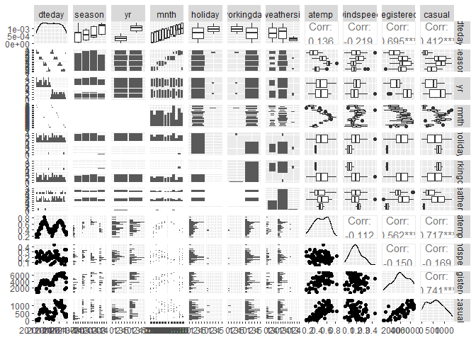
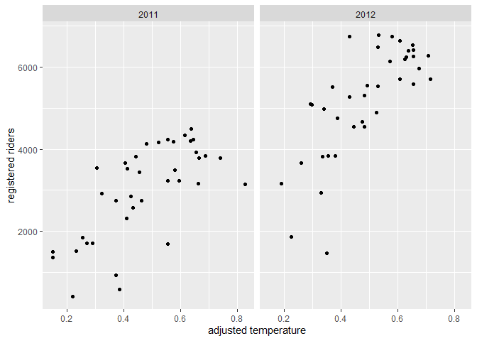
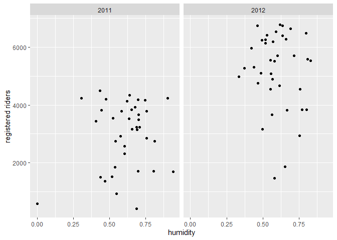
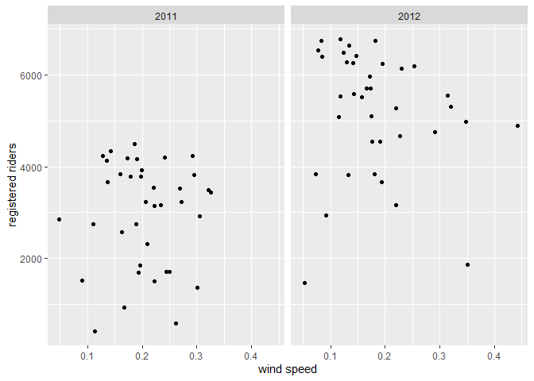
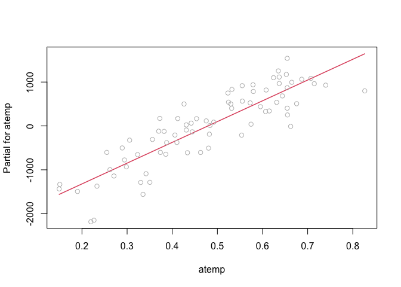
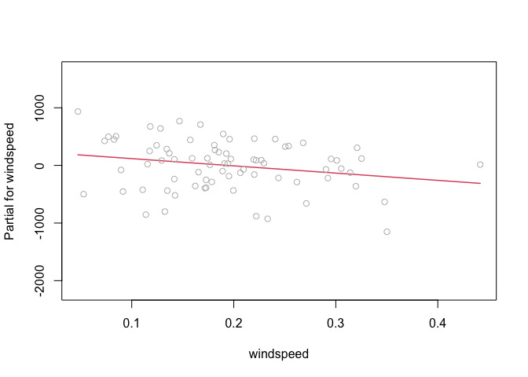
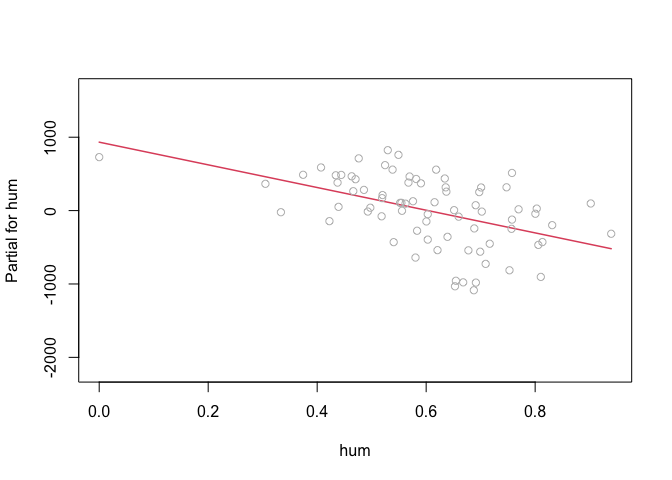

ST 558 Project 2
================
David Arthur
6/28/2021

-   [Introduction](#introduction)
-   [Data](#data)
-   [Summarizations](#summarizations)
-   [Modeling](#modeling)
    -   [First linear regression model](#first-linear-regression-model)
    -   [Second linear regression
        model](#second-linear-regression-model)
    -   [Random Forest Model](#random-forest-model)
-   [Comparison of models](#comparison-of-models)

# Introduction

…

# Data

We begin by reading in the data, changing the names of some factor
levels, and filtering by day of week

``` r
day <- readr::read_csv("day.csv", col_types = cols(
  season = col_factor(),
  yr = col_factor(),
  mnth = col_factor(),
  holiday = col_factor(),
  weekday = col_factor(),
  workingday = col_factor(),
  weathersit = col_factor()))

day <- day %>% mutate(season = fct_recode(season, winter = "1", spring = "2", summer = "3", fall = "4")) %>%
  mutate(yr = fct_recode(yr, "2011" = "0", "2012" = "1")) %>%
  mutate(weekday = fct_recode(weekday, Sunday = "0", Monday = "1", Tuesday = "2", Wednesday = "3", Thursday = "4", Friday = "5", Saturday = "6")) %>%
  mutate(weathersit = fct_recode(weathersit, clear = "1", mist = "2", lightRainOrSnow = "3", heavyRainOrSnow = "4")) %>%
  filter(weekday == params$dayOfWeek)

# read in version without factors for correlation plot
dayNF <- readr::read_csv("day.csv", col_types = cols(
  weekday = col_factor()))
```

Next, we partition the data into training and test sets

``` r
set.seed(21)
trainIndex <- createDataPartition(day$cnt, p = 0.7, list = FALSE)
dayTrain <- day[trainIndex, ]
dayTest <- day[-trainIndex, ]
```

# Summarizations

We begin our exploratory analysis of the data with a graphical overview
of the relationships between variables. Obvious patterns in the plots,
as well as high correlation values, indicate associations between
variables.

``` r
GGally::ggpairs(dayTrain %>% select(2:6, 8:9, atemp, windspeed, registered, casual))
```

<!-- -->

``` r
# dayNFCor <- cor(as.matrix(dayNF %>% select(3:9, atemp, windspeed, casual, registered,cnt)))
# corrplot(dayNFCor, type = "upper", tl.pos = "lt")
# corrplot(dayNFCor, type = "lower", method = "number", add = TRUE, diag = FALSE, tl.pos = "n")
```

We will now look in more detail at relationships between time-related
variables and the `registered` response variable. When we do our linear
regression modeling we will need to decide which (if any) of these
predictors to use. For example, the date variable (`dteday`) and
`season` may not be useful in the presence of `weekday`, `mnth`, and
`yr` (or vice versa), as they provide largely redundant information.

``` r
g <- ggplot(data = dayTrain)
g + geom_point(aes(x = dteday, y = registered))
```

<!-- -->

``` r
meanByMonthYr <- dayTrain %>% group_by(mnth, yr) %>%
  summarize(meanReg = mean(registered))
```

    ## `summarise()` has grouped output by 'mnth'. You can override using the `.groups` argument.

``` r
g2 <- ggplot(meanByMonthYr, aes(x = mnth))
g2 + geom_bar(aes(y = meanReg, fill = yr), position = "dodge", stat = "identity")
```

<!-- -->

We will look next in more detail at the relationship between
quantitative weather variables and the `registered` response variable.
The appearance of nonlinear relationships in the plots may indicate the
need for quadratic terms in our linear regression models. The adjusted
temperature variable, `atemp`, seems particularly likely to require a
quadratic term, as both low and high temperatures can discourage people
from bicycling. Similarly, with humidity and windspeed, low to moderate
values may have no effect, but particularly high values could have an
effect, so those variables may also require quadratic terms.

``` r
g + geom_point(aes(x = atemp, y = registered)) + facet_wrap(~ yr)
```

<!-- -->

``` r
g + geom_point(aes(x = hum, y = registered)) + facet_wrap(~ yr)
```

<!-- -->

``` r
g + geom_point(aes(x = windspeed, y = registered)) + facet_wrap(~ yr)
```

<!-- -->

We now view at a table displaying the mean number of `registered`,
`casual`, and total riders at each level of the categorical `weathersit`
variable. It seems plausible that in rain or snow, the number of casual
riders might decrease by a larger factor than would the number of
registered riders.

``` r
meanByWeather <- dayTrain %>% group_by(weathersit) %>%
  summarize(meanCas = mean(casual), meanReg = mean(registered), meanTotal = mean(cnt))
kable(meanByWeather, digits = 1, col.names = c("Weather", "Mean Casual Riders", "Mean Registered Riders", "Mean Total Riders"), caption = "Average # of riders by weather category")
```

| Weather         | Mean Casual Riders | Mean Registered Riders | Mean Total Riders |
|:----------------|-------------------:|-----------------------:|------------------:|
| mist            |              388.7 |                 3628.1 |            4016.8 |
| clear           |              706.8 |                 4398.5 |            5105.2 |
| lightRainOrSnow |               99.5 |                 1133.0 |            1232.5 |

Average \# of riders by weather category

Exploratory data analysis and summary (James)

``` r
ggpairs(dayTrain %>% select(-instant,-dteday, -season, -yr, -cnt, -weekday), 
        ggplot2::aes(colour=workingday))
```

    ## Error in cor.test.default(x, y, method = method, use = use): not enough finite observations

<!-- --> Notes from
looking at ggpairs plots: Working days are the highest usage for
registered riders, but non-working days are the highest usage for casual
riders. Registered riders are the primary volume, so we definitely care
most about them but worth keeping in mind. There are two types of
non-working days: weekends and holidays, and there is a difference in
volume for each of those rider types depending on whether it is a
holiday or a weekend.

Air temperature and temperature are nearly 100% correlated. We should
probably figure out which one of them we want to use. Speaking of
correlated, can we drop the date and only use months? Unfortunately, it
looks like we need to keep the year field as well, since year 2 had
better performance than year 1. Do we want to keep season and month? I
lean towards keeping year and month, but dropping season and date. Let
me know what you think.

Looking at the scatter of casual vs registered, broken out by working
day, it’s crazy how separate the linear relationships look:

``` r
g <- ggplot(data=dayTrain, aes(x=registered, y=casual))
g + geom_point(aes(color=workingday))
```

<!-- --> On working
days, registered bikes are the main rider group. On non-working days, it
switches to casual. Looking at day of the week, we may be able to
exclude it since it will be covered by the working day flag and holiday
flag, but I guess we can check the models to see if it provides anything
extra.

``` r
g <- ggplot(data=dayTrain %>% 
                 select(weekday, casual, registered) %>%
                 pivot_longer(cols=c(casual, registered),
                              names_to = 'metrics',
                              values_to = 'riders') %>%
                 group_by(weekday, metrics) %>%
                 summarise(avg_riders = mean(riders)), 
            aes(x=weekday, y=avg_riders, fill=metrics))
```

    ## `summarise()` has grouped output by 'weekday'. You can override using the `.groups` argument.

``` r
g + geom_bar(stat='identity', position='dodge')
```

<!-- --> Looking at
this graph, weekday definitely seems relatively stable across the days
(working days for registered and non-working days for casual are the
jumps), but there may be enough variation to include it.

\#\#I like this graph. I thought about doing one like it, but wasn’t
sure how to code it. pivot\_longer hadn’t occurred to me.

\#\#About which variables to include, I agree with your comments. My
understanding is that each of us comes up with our own models (I do a
linear regression and a random forest, you do a linear regression and a
boosted tree), so you and I don’t need to include the same predictors.
We do need to agree ahead of time on which response we’re going to model
(casual, registered, or cnt), so that the results of the 4 models can be
compared to each other. I’m fine with any of the 3. Do you have a
preference?

Yeah, no preference here either. I guess we could just say registered
since it’s the highest volume customer, and if we were doing this
analysis for that company then registered users would be the most
important group.

\#\#Sounds good, we’ll go with registered.

# Modeling

We will now fit two linear regression models, using differing
approaches, with the goal of creating a model that does a good job of
predicting the number of registered riders on any given day, based on
the values of the predictor variables in the data set. We will fit the
models using the training data set that we partitioned above, and then
test the accuracy of the models’ predictions using the test data set.

Linear regression estimates the effect of each predictor variable on the
mean value of the response variable, with the other predictor variables
held constant. A linear regression model can be expressed as  
*Y*<sub>*i*</sub> = *β*<sub>0</sub> + *β*<sub>1</sub>*X*<sub>*i*1</sub> + *β*<sub>2</sub>*X*<sub>*i*2</sub> + ... + *β*<sub>*p*</sub>*X*<sub>*i**p*</sub> + *E*<sub>*i*</sub>

where *Y*<sub>*i*</sub> is the response, *i* represents the observation
number, *X*<sub>*i**j*</sub> are the predictor variables, and
*E*<sub>*i*</sub> is the normally distributed random error. The
*β*<sub>*j*</sub> coefficents must be linear, but the predictor
variables can be higher order terms (e.g. *x*<sup>2</sup>) or
interaction terms (e.g. *x*<sub>1</sub>*x*<sub>2</sub>). Creating a
model to estimate the response using observed data, we have  
$$\\hat{y\_i} = \\hat\\beta\_0 + \\hat\\beta\_1x\_{i1} + \\hat\\beta\_2x\_{i2} + ... + \\hat\\beta\_px\_{ip}$$

The *β̂*<sub>*j*</sub> coefficients (estimates for *β*<sub>*j*</sub>) are
calculated for each predictor variable to minimize the residual sum of
squares, using the observed values of *x*<sub>*i**j*</sub> and
*y*<sub>*i*</sub>  
$$min\_{\\beta\_0, \\beta\_1, ..., \\beta\_p}\\sum\_{i=1}^{n}(y\_i - \\beta\_0 - \\beta\_1x\_{i1} - \\beta\_2x\_{i2} - ... - \\beta\_px\_{ip})^2$$

The linear regression model can be used for inference, to understand the
relationships between the predictor variables and the response, as well
as for prediction of a mean response given new values of the predictor
variables. There are varying approaches to choosing which predictor
variables to include in a linear regression model. For our first linear
regression model, we ….  
For our second linear regression model, we ….

### First linear regression model

``` r
library(leaps)

data <- dayTrain %>% 
               filter(weekday == params$dayOfWeek) %>% drop_na() %>%
               select(-instant,-dteday, -season, 
                    -weekday, -atemp, -casual, -cnt)

#this function converts new data to a model matrix
#so that a prediction can be run via matrix multiplication
#on a best subsets model
predict.regsubsets = function(object,newdata,id,...){
      form = as.formula(object$call[[2]]) 
      mat = model.matrix(form,newdata)    
      coefi = coef(object,id=id)          
      xvars = names(coefi)                
      mat[,xvars]%*%coefi               
}


#let's do cross validation with folds
k <- 4
set.seed(21)
folds <- sample(1:k, nrow(data), replace=T)

cv_errors = matrix(NA, k, 16, dimnames = list(NULL, paste(1:16)))

for (j in 1:k) {
  best <- regsubsets(registered ~ ., 
                     data=data[folds!=j,], nvmax=20)
  
  for (i in 1:16) {
    pred <- predict(best, data[folds==j,], id=i)
    
    
    cv_errors[j, i] <- mean((temp_data$registered[folds==j]-pred)^2)
  }
}
```

    ## Warning in leaps.setup(x, y, wt = wt, nbest = nbest, nvmax = nvmax, force.in = force.in, : 1 linear
    ## dependencies found

    ## Reordering variables and trying again:

    ## Error in eval(x): object 'newX' not found

``` r
# Take the mean of over all folds for each model size
mean_cv_errors = apply(cv_errors, 2, mean)

# Find the model size with the smallest cross-validation error
min = which.min(mean_cv_errors)

#the model w/ 14 variables was best when using 4 fold cv.
#i did 4 fold because there are only about 80 rows of data per weekday

best_full <- regsubsets(registered ~ ., 
                     data=temp_data[folds!=j,], nvmax=20)
```

    ## Error in is.data.frame(data): object 'temp_data' not found

``` r
fit <- lm(registered ~ temp*hum,
        data=dayTrain %>% 
             filter(weekday == params$dayOfWeek) %>% drop_na() %>%
             select(-instant,-dteday, -season, 
                    -weekday, -atemp, -casual, -cnt))
```

### Second linear regression model

In this approach, we start with a full linear regression model that
includes all of the predictor variables. We will then reduce
collinearity (correlation among predictor variables) by removing
redundant predictors until we reach an optimal (lowest) AIC. We will
calculate the condition number (*κ*) for each of the candidate models,
which is a measure of collinearity. Roughly, *κ* &lt; 30 is considered
desirable. Finally, we will choose among several variations of the
optimal model (including various higher order terms) using cross
validation (described below).

We begin with the full model, which includes all of the predictors.
`holiday` and `workingday` are excluded for days of the week that
include only one level of `holiday` and `workingday`, respectively.

``` r
mlrFull <- lm(registered ~ dteday + season +  yr + mnth + weathersit + temp + 
                    atemp + hum + windspeed, dayTrain)
if(length(unique(dayTrain$workingday)) != 1){
  mlrFull <- update(mlrFull, . ~ . + workingday)
}
if(length(unique(dayTrain$holiday)) != 1){
  mlrFull <- update(mlrFull, . ~ . + holiday)
}

summary(mlrFull)
```

    ## 
    ## Call:
    ## lm(formula = registered ~ dteday + season + yr + mnth + weathersit + 
    ##     temp + atemp + hum + windspeed + workingday + holiday, data = dayTrain)
    ## 
    ## Residuals:
    ##    Min     1Q Median     3Q    Max 
    ## -958.8 -250.6   51.0  305.7  794.6 
    ## 
    ## Coefficients: (1 not defined because of singularities)
    ##                             Estimate Std. Error t value Pr(>|t|)    
    ## (Intercept)               120436.785 106637.282   1.129  0.26391    
    ## dteday                        -8.143      7.104  -1.146  0.25693    
    ## seasonspring                 766.418    349.363   2.194  0.03275 *  
    ## seasonsummer                 743.338    415.673   1.788  0.07956 .  
    ## seasonfall                  1106.582    368.539   3.003  0.00411 ** 
    ## yr2012                      4882.019   2614.710   1.867  0.06752 .  
    ## mnth2                        286.875    353.938   0.811  0.42133    
    ## mnth3                        543.556    578.222   0.940  0.35154    
    ## mnth4                        397.178    815.996   0.487  0.62849    
    ## mnth5                       1061.870   1026.923   1.034  0.30591    
    ## mnth6                        748.282   1222.554   0.612  0.54316    
    ## mnth7                        647.571   1417.651   0.457  0.64972    
    ## mnth8                       1304.566   1573.292   0.829  0.41078    
    ## mnth9                       2295.231   1748.390   1.313  0.19503    
    ## mnth10                      2937.633   1937.159   1.516  0.13546    
    ## mnth11                      2595.863   2131.314   1.218  0.22874    
    ## mnth12                      2680.140   2358.867   1.136  0.26108    
    ## weathersitclear              212.561    169.538   1.254  0.21553    
    ## weathersitlightRainOrSnow  -2286.597    443.234  -5.159 3.94e-06 ***
    ## temp                        6354.174   4078.506   1.558  0.12531    
    ## atemp                      -1689.596   4271.818  -0.396  0.69408    
    ## hum                        -1707.626    595.705  -2.867  0.00598 ** 
    ## windspeed                  -1724.172    956.500  -1.803  0.07725 .  
    ## workingday1                 3172.224    419.199   7.567 6.18e-10 ***
    ## holiday1                          NA         NA      NA       NA    
    ## ---
    ## Signif. codes:  0 '***' 0.001 '**' 0.01 '*' 0.05 '.' 0.1 ' ' 1
    ## 
    ## Residual standard error: 482.8 on 52 degrees of freedom
    ## Multiple R-squared:  0.9418, Adjusted R-squared:  0.9161 
    ## F-statistic: 36.61 on 23 and 52 DF,  p-value: < 2.2e-16

``` r
AIC(mlrFull)
```

    ## [1] 1176.133

``` r
x <- model.matrix(mlrFull)[, -1]
e <- eigen(t(x) %*% x)
# e$val
# condition number = sqrt(e$val[1]/min(e$val))
```

We see that *κ* = 4.1783708^{7}, which is a sign of high collinearity,
so we begin removing insignificant predictors one at a time, each time
checking to confirm that AIC declines, or at least that it increases
only marginally.

To help in consideration of which variables to remove, we view the
correlations. For days of the week that don’t include any holidays, `?`
will appear in the `holiday` and `workingday` rows and columns.

``` r
dayNFCor <- cor(as.matrix(dayNF %>%
                            mutate(weekday = fct_recode(weekday, Sunday = "0", Monday = "1", Tuesday = "2", Wednesday = "3", Thursday = "4", Friday = "5", Saturday = "6")) %>%
                            mutate(dteday = as.numeric(dteday)) %>%
                            filter(weekday == params$dayOfWeek) %>%
                            select(2:6, 8:13, registered)))
corrplot(dayNFCor, type = "upper", tl.pos = "lt")
corrplot(dayNFCor, type = "lower", method = "number", add = TRUE, diag = FALSE, tl.pos = "n")
```

<!-- -->

First, we remove `workingday`, as it is fully determined by the day of
the week and the `holiday` variable, so adds nothing to the model. We
also remove `temp`, as it is almost perfectly correlated with `atemp`,
and `dteday`, which adds little if any predictive value beyond `yr` plus
`mnth` plus `season`.

``` r
mlr2 <- update(mlrFull, . ~ . - workingday - temp - dteday)
summary(mlr2)
```

    ## 
    ## Call:
    ## lm(formula = registered ~ season + yr + mnth + weathersit + atemp + 
    ##     hum + windspeed + holiday, data = dayTrain)
    ## 
    ## Residuals:
    ##     Min      1Q  Median      3Q     Max 
    ## -955.44 -226.30   66.09  290.61  751.01 
    ## 
    ## Coefficients:
    ##                           Estimate Std. Error t value Pr(>|t|)    
    ## (Intercept)                1257.08     569.30   2.208  0.03150 *  
    ## seasonspring                780.55     352.82   2.212  0.03120 *  
    ## seasonsummer                818.73     415.40   1.971  0.05387 .  
    ## seasonfall                 1105.77     370.30   2.986  0.00424 ** 
    ## yr2012                     1895.55     121.02  15.664  < 2e-16 ***
    ## mnth2                        76.26     290.26   0.263  0.79376    
    ## mnth3                        85.92     403.84   0.213  0.83233    
    ## mnth4                      -268.66     531.31  -0.506  0.61515    
    ## mnth5                       227.18     592.04   0.384  0.70269    
    ## mnth6                      -199.22     641.45  -0.311  0.75732    
    ## mnth7                      -643.14     694.67  -0.926  0.35866    
    ## mnth8                      -143.00     647.51  -0.221  0.82604    
    ## mnth9                       533.42     557.06   0.958  0.34255    
    ## mnth10                      849.90     538.21   1.579  0.12015    
    ## mnth11                      209.82     469.65   0.447  0.65684    
    ## mnth12                       45.60     377.91   0.121  0.90440    
    ## weathersitclear             279.85     166.29   1.683  0.09818 .  
    ## weathersitlightRainOrSnow -2059.04     428.64  -4.804 1.28e-05 ***
    ## atemp                      4734.69    1035.30   4.573 2.84e-05 ***
    ## hum                       -1545.64     590.86  -2.616  0.01151 *  
    ## windspeed                 -1256.83     928.33  -1.354  0.18142    
    ## holiday1                  -3297.68     412.91  -7.986 1.04e-10 ***
    ## ---
    ## Signif. codes:  0 '***' 0.001 '**' 0.01 '*' 0.05 '.' 0.1 ' ' 1
    ## 
    ## Residual standard error: 487.9 on 54 degrees of freedom
    ## Multiple R-squared:  0.9383, Adjusted R-squared:  0.9143 
    ## F-statistic: 39.13 on 21 and 54 DF,  p-value: < 2.2e-16

``` r
AIC(mlr2)
```

    ## [1] 1176.588

``` r
x <- model.matrix(mlr2)[, -1]
e <- eigen(t(x) %*% x)
# e$val
# condition number = sqrt(e$val[1]/min(e$val))
```

We see that AIC has changed little, and that *κ* = 40.11, which
indicates a large reduction in collinearity.

`mnth`, `weathersit` and `windspeed` appear to be marginally
significant, so we look at the effect of removing each of them from the
model:  
Remove `mnth`

``` r
mlr3 <- update(mlr2, . ~ . - mnth)
summary(mlr3)
```

    ## 
    ## Call:
    ## lm(formula = registered ~ season + yr + weathersit + atemp + 
    ##     hum + windspeed + holiday, data = dayTrain)
    ## 
    ## Residuals:
    ##      Min       1Q   Median       3Q      Max 
    ## -1282.13  -204.62    44.06   264.43  1128.14 
    ## 
    ## Coefficients:
    ##                           Estimate Std. Error t value Pr(>|t|)    
    ## (Intercept)                  725.9      558.3   1.300 0.198155    
    ## seasonspring                 758.5      224.1   3.385 0.001213 ** 
    ## seasonsummer                 731.7      283.2   2.584 0.012027 *  
    ## seasonfall                  1428.8      197.6   7.231 6.77e-10 ***
    ## yr2012                      1974.4      127.8  15.446  < 2e-16 ***
    ## weathersitclear              389.0      169.5   2.295 0.024977 *  
    ## weathersitlightRainOrSnow  -1481.8      426.1  -3.478 0.000907 ***
    ## atemp                       4479.4      670.7   6.679 6.38e-09 ***
    ## hum                         -663.2      561.1  -1.182 0.241511    
    ## windspeed                  -1200.7      958.2  -1.253 0.214670    
    ## holiday1                   -3440.5      414.8  -8.293 8.79e-12 ***
    ## ---
    ## Signif. codes:  0 '***' 0.001 '**' 0.01 '*' 0.05 '.' 0.1 ' ' 1
    ## 
    ## Residual standard error: 534.8 on 65 degrees of freedom
    ## Multiple R-squared:  0.9108, Adjusted R-squared:  0.8971 
    ## F-statistic: 66.37 on 10 and 65 DF,  p-value: < 2.2e-16

``` r
AIC(mlr3)
```

    ## [1] 1182.636

``` r
x <- model.matrix(mlr3)[, -1]
e <- eigen(t(x) %*% x)
# e$val
# condition number = sqrt(e$val[1]/min(e$val))
```

Remove `weathersit`

``` r
mlr4 <- update(mlr2, . ~ . - weathersit)
# summary(mlr4)
AIC(mlr4)
```

    ## [1] 1213.045

``` r
x <- model.matrix(mlr4)[, -1]
e <- eigen(t(x) %*% x)
# e$val
# condition # =
# sqrt(e$val[1]/min(e$val))
```

Remove `windspeed`

``` r
mlr5 <- update(mlr2, . ~ . - windspeed)
# summary(mlr5)
AIC(mlr5)
```

    ## [1] 1177.125

``` r
x <- model.matrix(mlr5)[, -1]
e <- eigen(t(x) %*% x)
# e$val
# condition # =
# sqrt(e$val[1]/min(e$val))
```

For `mnth`, `weathersit`, and `windspeed`, removal from the model
results in only marginal change to AIC. If our main goal were inference
and understanding the relationships between the variables, we might want
to remove them from the model for the sake of simplicity,
interpretability, and more narrow confidence intervals. Because our
primary goal here is prediction, we will leave them in the model, and
choose mlr2 as our base linear regression model.

We will now do some diagnostic plots on our base model, and then
consider adding higher order terms to the model.

``` r
# compare to model chosen by leaps::step() function
mlrStep <- step(mlrFull)
```

    ## Start:  AIC=958.45
    ## registered ~ dteday + season + yr + mnth + weathersit + temp + 
    ##     atemp + hum + windspeed + workingday + holiday
    ## 
    ## 
    ## Step:  AIC=958.45
    ## registered ~ dteday + season + yr + mnth + weathersit + temp + 
    ##     atemp + hum + windspeed + workingday
    ## 
    ##              Df Sum of Sq      RSS     AIC
    ## - atemp       1     36463 12156791  956.68
    ## - dteday      1    306257 12426586  958.35
    ## <none>                    12120328  958.45
    ## - temp        1    565753 12686082  959.92
    ## - windspeed   1    757360 12877688  961.06
    ## - yr          1    812574 12932902  961.39
    ## - mnth       11   5736690 17857019  965.91
    ## - hum         1   1915287 14035616  967.60
    ## - season      3   2702401 14822729  967.75
    ## - weathersit  2   9590194 21710523  998.76
    ## - workingday  1  13347463 25467791 1012.89
    ## 
    ## Step:  AIC=956.68
    ## registered ~ dteday + season + yr + mnth + weathersit + temp + 
    ##     hum + windspeed + workingday
    ## 
    ##              Df Sum of Sq      RSS     AIC
    ## - dteday      1    277452 12434243  956.40
    ## <none>                    12156791  956.68
    ## - windspeed   1    723485 12880276  959.08
    ## - yr          1    776528 12933319  959.39
    ## - mnth       11   5767275 17924066  964.19
    ## - hum         1   1879062 14035854  965.61
    ## - season      3   2723921 14880712  966.05
    ## - temp        1   5574962 17731753  983.37
    ## - weathersit  2   9681853 21838644  997.20
    ## - workingday  1  13556095 25712886 1011.61
    ## 
    ## Step:  AIC=956.4
    ## registered ~ season + yr + mnth + weathersit + temp + hum + windspeed + 
    ##     workingday
    ## 
    ##              Df Sum of Sq      RSS     AIC
    ## <none>                    12434243  956.40
    ## - windspeed   1    641115 13075358  958.22
    ## - mnth       11   5507203 17941446  962.26
    ## - season      3   2604144 15038388  964.85
    ## - hum         1   1896659 14330902  965.19
    ## - temp        1   5395495 17829739  981.79
    ## - weathersit  2   9606266 22040509  995.90
    ## - workingday  1  15039183 27473426 1014.65
    ## - yr          1  57802538 70236781 1085.99

``` r
names(mlrStep)
```

    ##  [1] "coefficients"  "residuals"     "effects"       "rank"          "fitted.values" "assign"       
    ##  [7] "qr"            "df.residual"   "contrasts"     "xlevels"       "call"          "terms"        
    ## [13] "model"         "anova"

``` r
mlrStep$call
```

    ## lm(formula = registered ~ season + yr + mnth + weathersit + temp + 
    ##     hum + windspeed + workingday, data = dayTrain)

``` r
mlr2$call
```

    ## lm(formula = registered ~ season + yr + mnth + weathersit + atemp + 
    ##     hum + windspeed + holiday, data = dayTrain)

``` r
AIC(mlr2, mlrStep)
```

    ##         df      AIC
    ## mlr2    23 1176.588
    ## mlrStep 23 1174.076

``` r
# does mlr3  agrees with step() choice?
```

We can check for constant variance of our error term, an assumption of
our model, by looking at a plot of the model’s fitted values vs the
residuals (difference between fitted response and observed response). A
“megaphone” shape can indicate non-constant variance.

``` r
plot(mlr2$fitted, mlr3$residuals)
```

<!-- -->

Another way to assess constant variance is with the Box-Cox method,
which can suggest transformations of the response to address problems
with non-constant variance. If the maximum log-likelihood of *λ* close
to 1, as in this case, indicates that non-constant variance is not a
problem with the existing model.

``` r
MASS::boxcox(mlr2)
```

    ## Error in `contrasts<-`(`*tmp*`, value = contr.funs[1 + isOF[nn]]): contrasts can be applied only to factors with 2 or more levels

We will also look at for signs of nonlinearity, which can indicate the
need for quadratic terms for some of the predictors. The partial
residual plots below plot the relationship between each predictor and
the response, with the effect of the other predictors removed.

``` r
termplot( mlr2, partial.resid = TRUE, terms = c("atemp", "windspeed", "hum"))
```

<!-- --><!-- --><!-- -->

For at least some days of the week there is a nonlinear pattern to the
plots, particularly for `atemp`, so we will try adding quadratic terms
for each of them to our base model.

Try adding *a**t**e**m**p*<sup>2</sup>

``` r
mlr8 <- update(mlr2, . ~ . + I(atemp^2))
summary(mlr8)
```

    ## 
    ## Call:
    ## lm(formula = registered ~ season + yr + mnth + weathersit + atemp + 
    ##     hum + windspeed + holiday + I(atemp^2), data = dayTrain)
    ## 
    ## Residuals:
    ##     Min      1Q  Median      3Q     Max 
    ## -939.89 -181.58   38.88  282.26  657.92 
    ## 
    ## Coefficients:
    ##                           Estimate Std. Error t value Pr(>|t|)    
    ## (Intercept)                -231.47     688.24  -0.336  0.73796    
    ## seasonspring                806.23     324.04   2.488  0.01602 *  
    ## seasonsummer                901.66     382.22   2.359  0.02204 *  
    ## seasonfall                 1107.71     340.00   3.258  0.00196 ** 
    ## yr2012                     1863.90     111.52  16.713  < 2e-16 ***
    ## mnth2                       -21.92     268.14  -0.082  0.93517    
    ## mnth3                      -242.69     383.74  -0.632  0.52982    
    ## mnth4                      -656.38     501.58  -1.309  0.19630    
    ## mnth5                        22.39     547.07   0.041  0.96750    
    ## mnth6                      -239.42     589.08  -0.406  0.68606    
    ## mnth7                      -314.68     645.43  -0.488  0.62788    
    ## mnth8                       -51.31     595.16  -0.086  0.93162    
    ## mnth9                       351.29     514.40   0.683  0.49764    
    ## mnth10                      530.57     503.42   1.054  0.29669    
    ## mnth11                     -103.98     441.43  -0.236  0.81468    
    ## mnth12                     -195.00     354.45  -0.550  0.58453    
    ## weathersitclear             271.57     152.71   1.778  0.08108 .  
    ## weathersitlightRainOrSnow -2184.39     395.37  -5.525 1.02e-06 ***
    ## atemp                     13288.41    2742.74   4.845 1.14e-05 ***
    ## hum                       -1609.55     542.85  -2.965  0.00453 ** 
    ## windspeed                  -859.13     860.72  -0.998  0.32274    
    ## holiday1                  -3281.24     379.16  -8.654 1.02e-11 ***
    ## I(atemp^2)                -9874.86    2970.11  -3.325  0.00161 ** 
    ## ---
    ## Signif. codes:  0 '***' 0.001 '**' 0.01 '*' 0.05 '.' 0.1 ' ' 1
    ## 
    ## Residual standard error: 447.9 on 53 degrees of freedom
    ## Multiple R-squared:  0.949,  Adjusted R-squared:  0.9278 
    ## F-statistic:  44.8 on 22 and 53 DF,  p-value: < 2.2e-16

``` r
AIC(mlr8)
```

    ## [1] 1164.191

Reduced or similar AIC, so keep mlr8 as new base model.

Try adding *h**u**m*<sup>2</sup>

``` r
mlr9 <- update(mlr8, . ~ . + I(hum^2))
summary(mlr9)
```

    ## 
    ## Call:
    ## lm(formula = registered ~ season + yr + mnth + weathersit + atemp + 
    ##     hum + windspeed + holiday + I(atemp^2) + I(hum^2), data = dayTrain)
    ## 
    ## Residuals:
    ##     Min      1Q  Median      3Q     Max 
    ## -936.55 -178.61   40.12  280.13  657.76 
    ## 
    ## Coefficients:
    ##                           Estimate Std. Error t value Pr(>|t|)    
    ## (Intercept)                -314.68     890.58  -0.353 0.725262    
    ## seasonspring                813.74     330.91   2.459 0.017295 *  
    ## seasonsummer                903.78     386.06   2.341 0.023100 *  
    ## seasonfall                 1104.81     343.73   3.214 0.002249 ** 
    ## yr2012                     1861.62     113.59  16.389  < 2e-16 ***
    ## mnth2                       -23.08     270.76  -0.085 0.932405    
    ## mnth3                      -235.95     389.95  -0.605 0.547760    
    ## mnth4                      -664.87     509.45  -1.305 0.197614    
    ## mnth5                        15.94     553.88   0.029 0.977151    
    ## mnth6                      -246.83     596.66  -0.414 0.680809    
    ## mnth7                      -324.15     654.55  -0.495 0.622526    
    ## mnth8                       -57.92     602.36  -0.096 0.923769    
    ## mnth9                       349.76     519.31   0.673 0.503612    
    ## mnth10                      533.43     508.49   1.049 0.299009    
    ## mnth11                     -101.03     446.00  -0.227 0.821683    
    ## mnth12                     -198.43     358.50  -0.553 0.582294    
    ## weathersitclear             259.03     175.51   1.476 0.146015    
    ## weathersitlightRainOrSnow -2123.51     570.55  -3.722 0.000487 ***
    ## atemp                     13308.05    2771.52   4.802 1.37e-05 ***
    ## hum                       -1222.54    2649.20  -0.461 0.646381    
    ## windspeed                  -893.34     898.46  -0.994 0.324683    
    ## holiday1                  -3287.53     385.02  -8.539 1.81e-11 ***
    ## I(atemp^2)                -9882.57    2998.34  -3.296 0.001771 ** 
    ## I(hum^2)                   -368.96    2471.10  -0.149 0.881886    
    ## ---
    ## Signif. codes:  0 '***' 0.001 '**' 0.01 '*' 0.05 '.' 0.1 ' ' 1
    ## 
    ## Residual standard error: 452.1 on 52 degrees of freedom
    ## Multiple R-squared:  0.949,  Adjusted R-squared:  0.9264 
    ## F-statistic: 42.07 on 23 and 52 DF,  p-value: < 2.2e-16

``` r
AIC(mlr9)
```

    ## [1] 1166.158

Similar AIC for most days of week, so keep mlr9 as a candidate model to
compare using cross validation.

Try adding *w**i**n**d**s**p**e**e**d*<sup>2</sup>

``` r
mlr10 <- update(mlr8, . ~ . + I(windspeed^2))
summary(mlr10)
```

    ## 
    ## Call:
    ## lm(formula = registered ~ season + yr + mnth + weathersit + atemp + 
    ##     hum + windspeed + holiday + I(atemp^2) + I(windspeed^2), 
    ##     data = dayTrain)
    ## 
    ## Residuals:
    ##     Min      1Q  Median      3Q     Max 
    ## -943.88 -181.82   38.12  290.50  661.64 
    ## 
    ## Coefficients:
    ##                           Estimate Std. Error t value Pr(>|t|)    
    ## (Intercept)                -261.34     812.96  -0.321  0.74914    
    ## seasonspring                801.21     334.74   2.393  0.02033 *  
    ## seasonsummer                894.25     399.80   2.237  0.02962 *  
    ## seasonfall                 1096.78     376.40   2.914  0.00525 ** 
    ## yr2012                     1865.59     115.10  16.209  < 2e-16 ***
    ## mnth2                       -25.42     275.18  -0.092  0.92676    
    ## mnth3                      -242.02     387.51  -0.625  0.53500    
    ## mnth4                      -655.77     506.43  -1.295  0.20108    
    ## mnth5                        19.69     553.60   0.036  0.97176    
    ## mnth6                      -241.40     595.35  -0.405  0.68679    
    ## mnth7                      -315.03     651.60  -0.483  0.63079    
    ## mnth8                       -48.59     602.05  -0.081  0.93598    
    ## mnth9                       355.27     522.34   0.680  0.49942    
    ## mnth10                      536.40     514.85   1.042  0.30229    
    ## mnth11                      -95.15     462.78  -0.206  0.83790    
    ## mnth12                     -188.10     370.87  -0.507  0.61416    
    ## weathersitclear             272.80     155.14   1.758  0.08456 .  
    ## weathersitlightRainOrSnow -2188.55     403.42  -5.425 1.53e-06 ***
    ## atemp                     13317.59    2799.38   4.757 1.60e-05 ***
    ## hum                       -1609.24     548.04  -2.936  0.00494 ** 
    ## windspeed                  -614.64    3562.08  -0.173  0.86367    
    ## holiday1                  -3277.74     385.95  -8.493 2.14e-11 ***
    ## I(atemp^2)                -9895.45    3012.47  -3.285  0.00183 ** 
    ## I(windspeed^2)             -555.04    7842.22  -0.071  0.94385    
    ## ---
    ## Signif. codes:  0 '***' 0.001 '**' 0.01 '*' 0.05 '.' 0.1 ' ' 1
    ## 
    ## Residual standard error: 452.2 on 52 degrees of freedom
    ## Multiple R-squared:  0.949,  Adjusted R-squared:  0.9264 
    ## F-statistic: 42.05 on 23 and 52 DF,  p-value: < 2.2e-16

``` r
AIC(mlr10)
```

    ## [1] 1166.184

Similar AIC for most days of week, so keep mlr10 as a candidate model to
compare using cross validation.

Try including all 3 quadratic terms

``` r
mlr11 <- update(mlr8, . ~ . + I(hum^2) + I(windspeed^2))
summary(mlr11)
```

    ## 
    ## Call:
    ## lm(formula = registered ~ season + yr + mnth + weathersit + atemp + 
    ##     hum + windspeed + holiday + I(atemp^2) + I(hum^2) + I(windspeed^2), 
    ##     data = dayTrain)
    ## 
    ## Residuals:
    ##     Min      1Q  Median      3Q     Max 
    ## -940.50 -178.30   39.56  288.31  661.44 
    ## 
    ## Coefficients:
    ##                           Estimate Std. Error t value Pr(>|t|)    
    ## (Intercept)                -344.02     993.83  -0.346 0.730649    
    ## seasonspring                808.75     341.78   2.366 0.021805 *  
    ## seasonsummer                896.45     403.89   2.220 0.030925 *  
    ## seasonfall                 1094.00     380.46   2.875 0.005873 ** 
    ## yr2012                     1863.30     117.23  15.895  < 2e-16 ***
    ## mnth2                       -26.54     277.91  -0.095 0.924296    
    ## mnth3                      -235.30     393.85  -0.597 0.552858    
    ## mnth4                      -664.24     514.48  -1.291 0.202493    
    ## mnth5                        13.29     560.56   0.024 0.981181    
    ## mnth6                      -248.76     603.10  -0.412 0.681719    
    ## mnth7                      -324.47     660.92  -0.491 0.625574    
    ## mnth8                       -55.22     609.45  -0.091 0.928166    
    ## mnth9                       353.70     527.43   0.671 0.505494    
    ## mnth10                      539.19     520.10   1.037 0.304769    
    ## mnth11                      -92.30     467.59  -0.197 0.844304    
    ## mnth12                     -191.60     375.16  -0.511 0.611752    
    ## weathersitclear             260.28     178.13   1.461 0.150098    
    ## weathersitlightRainOrSnow -2127.77     579.35  -3.673 0.000576 ***
    ## atemp                     13336.86    2829.11   4.714 1.92e-05 ***
    ## hum                       -1223.18    2674.93  -0.457 0.649415    
    ## windspeed                  -651.43    3604.70  -0.181 0.857306    
    ## holiday1                  -3284.05     391.97  -8.378 3.74e-11 ***
    ## I(atemp^2)                -9902.91    3041.63  -3.256 0.002012 ** 
    ## I(hum^2)                   -368.06    2495.12  -0.148 0.883308    
    ## I(windspeed^2)             -548.98    7917.15  -0.069 0.944990    
    ## ---
    ## Signif. codes:  0 '***' 0.001 '**' 0.01 '*' 0.05 '.' 0.1 ' ' 1
    ## 
    ## Residual standard error: 456.5 on 51 degrees of freedom
    ## Multiple R-squared:  0.949,  Adjusted R-squared:  0.925 
    ## F-statistic: 39.54 on 24 and 51 DF,  p-value: < 2.2e-16

``` r
AIC(mlr11)
```

    ## [1] 1168.151

Similar AIC for most days of week, so keep mlr11 as a candidate model to
compare using cross validation.

We will now compare the 4 candidate models using cross validation. Cross
validation subdivides the training set into *k* folds, then fits a model
using *k* − 1 of those folds, and tests its accuracy predicting on the
*k*<sup>*t**h*</sup> fold. This is repeated *k* − 1 more times, so that
each fold gets a turn as the test set. Several measures of the
performance of the model are returned. We will choose the best model in
terms of lowest Root Mean Squared Error.

``` r
if(length(unique(dayTrain$holiday)) != 1){
  mlrFit8 <- train(registered ~ season + yr + mnth + holiday + weathersit + atemp + hum + windspeed + I(atemp^2), data = dayTrain,
      method = "lm",
      preProcess = c("center", "scale"),
      trControl = trainControl(method = "repeatedcv", number = 4, repeats = 3))
  
  mlrFit9 <- train(registered ~ season + yr + mnth + holiday + weathersit + atemp + hum + windspeed + I(atemp^2) + I(hum^2), data = dayTrain,
      method = "lm",
      preProcess = c("center", "scale"),
      trControl = trainControl(method = "repeatedcv", number = 4, repeats = 3))
  
  mlrFit10 <- train(registered ~ season + yr + mnth + holiday + weathersit + atemp + hum + windspeed + I(atemp^2) + I(windspeed^2), data = dayTrain,
      method = "lm",
      preProcess = c("center", "scale"),
      trControl = trainControl(method = "repeatedcv", number = 4, repeats = 3))
  
  mlrFit11 <- train(registered ~ season + yr + mnth + holiday + weathersit + atemp + hum + windspeed + I(atemp^2) + I(hum^2)+ I(windspeed^2), data = dayTrain,
      method = "lm",
      preProcess = c("center", "scale"),
      trControl = trainControl(method = "repeatedcv", number = 4, repeats = 3))
}else{
  mlrFit8 <- train(registered ~ season + yr + mnth + weathersit + atemp + hum + windspeed + I(atemp^2), data = dayTrain,
      method = "lm",
      preProcess = c("center", "scale"),
      trControl = trainControl(method = "repeatedcv", number = 4, repeats = 3))
  
  mlrFit9 <- train(registered ~ season + yr + mnth + weathersit + atemp + hum + windspeed + I(atemp^2) + I(hum^2), data = dayTrain,
      method = "lm",
      preProcess = c("center", "scale"),
      trControl = trainControl(method = "repeatedcv", number = 4, repeats = 3))
  
  mlrFit10 <- train(registered ~ season + yr + mnth + weathersit + atemp + hum + windspeed + I(atemp^2) + I(windspeed^2), data = dayTrain,
      method = "lm",
      preProcess = c("center", "scale"),
      trControl = trainControl(method = "repeatedcv", number = 4, repeats = 3))
  
  mlrFit11 <- train(registered ~ season + yr + mnth + weathersit + atemp + hum + windspeed + I(atemp^2) + I(hum^2)+ I(windspeed^2), data = dayTrain,
      method = "lm",
      preProcess = c("center", "scale"),
      trControl = trainControl(method = "repeatedcv", number = 4, repeats = 3))
}
comparison <- data.frame(t(mlrFit8$results), t(mlrFit9$results), t(mlrFit10$results), t(mlrFit11$results))
colnames(comparison) <- c("mlrFit8", "mlrFit9", "mlrFit10", "mlrFit11")
kable(comparison)
```

|            |     mlrFit8 |     mlrFit9 |    mlrFit10 |    mlrFit11 |
|:-----------|------------:|------------:|------------:|------------:|
| intercept  |   1.0000000 |   1.0000000 |   1.0000000 |   1.0000000 |
| RMSE       | 674.8345688 | 890.2712853 | 669.7736201 | 803.3757223 |
| Rsquared   |   0.8395842 |   0.7216832 |   0.8687878 |   0.7758233 |
| MAE        | 508.6521079 | 604.0391345 | 508.4251379 | 576.8345204 |
| RMSESD     | 198.7734794 | 289.8252053 | 109.5160047 | 342.8151692 |
| RsquaredSD |   0.1123190 |   0.1628864 |   0.0419575 |   0.2027372 |
| MAESD      |  93.9005590 | 116.7853469 |  82.5070404 | 178.3021033 |

Save the model with the lowest RMSE as our second linear regression
model.

``` r
candidates <- list(mlrFit8 = mlrFit8, mlrFit9 = mlrFit9, mlrFit10 = mlrFit10, mlrFit11 = mlrFit11)
indexLowestRMSE <- which.min(c(candidates[[1]][["results"]]["RMSE"], candidates[[2]][["results"]]["RMSE"], candidates[[3]][["results"]]["RMSE"], candidates[[4]][["results"]]["RMSE"]))
mlrFinal2 <- candidates[[1]]
mlrFinal2$call
```

    ## train.formula(form = registered ~ season + yr + mnth + holiday + 
    ##     weathersit + atemp + hum + windspeed + I(atemp^2), data = dayTrain, 
    ##     method = "lm", preProcess = c("center", "scale"), trControl = trainControl(method = "repeatedcv", 
    ##         number = 4, repeats = 3))

The model with the lowest RMSE for Thursday is mlrFit10

### Random Forest Model

Intro to Random Forest …

``` r
rfFit <- train(registered ~ . - instant - casual - cnt, data = dayTrain,
               method = "rf",
               trControl = trainControl(method = "repeatedcv", number = 4, repeats = 3),
               preProcess = c("center", "scale"),
               tuneGrid = expand.grid(mtry = c(2, 7, 10:16, 20, 24)))
rfFit
```

    ## Random Forest 
    ## 
    ## 76 samples
    ## 15 predictors
    ## 
    ## Pre-processing: centered (30), scaled (30) 
    ## Resampling: Cross-Validated (4 fold, repeated 3 times) 
    ## Summary of sample sizes: 57, 58, 56, 57, 57, 57, ... 
    ## Resampling results across tuning parameters:
    ## 
    ##   mtry  RMSE       Rsquared   MAE     
    ##    2    1129.2993  0.7488504  895.3667
    ##    7     836.7594  0.7700409  595.4786
    ##   10     838.4812  0.7668973  581.9909
    ##   11     839.5500  0.7612128  586.6292
    ##   12     840.1982  0.7628970  585.5670
    ##   13     836.6721  0.7637606  584.4475
    ##   14     845.4314  0.7576399  581.3087
    ##   15     844.7301  0.7589868  582.9177
    ##   16     845.6263  0.7581805  580.6466
    ##   20     852.6468  0.7556221  584.1953
    ##   24     850.9158  0.7566955  581.1546
    ## 
    ## RMSE was used to select the optimal model using the smallest value.
    ## The final value used for the model was mtry = 13.

# Comparison of models

Discussion …

``` r
# declaration of "winner" needs to be automated
mlrFinal2Pred <- predict(mlrFinal2, newdata = dayTest)
rfFitPred <- predict(rfFit, newdata = dayTest)
postResample(mlrFinal2Pred, dayTest$registered)
```

    ##        RMSE    Rsquared         MAE 
    ## 775.0547362   0.7947041 607.5893987

``` r
postResample(rfFitPred, dayTest$registered)
```

    ##        RMSE    Rsquared         MAE 
    ## 581.9568670   0.8662371 447.7585056

I added an initial version of my MLR and random forest models, and wrote
a separate R script (ST558RenderProject2.r) to automate the reports for
each day of the week. There’s still plenty of clean-up to do with the
output, but the automation generally seems to be working. Since the
dataset now includes only one weekday at a time, some of our graphs,
tables, etc. that included weekday don’t make as much sense. I still
have some questions about whether we’re supposed to do any initial data
exploration with the full training set, or if we only work with one day
at a time. I might post a question on the discussion board or go to
Wednesday office hours unless it’s clear to you.
