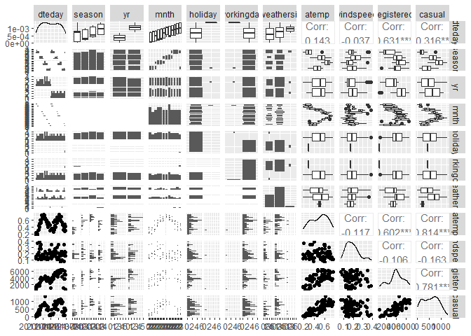
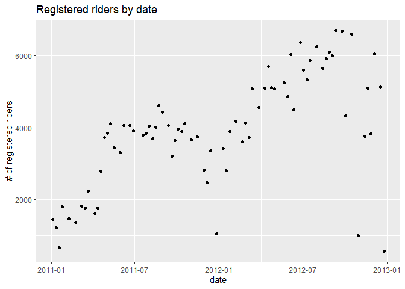
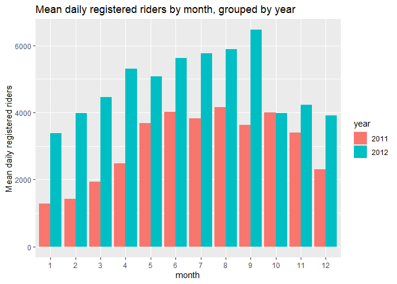
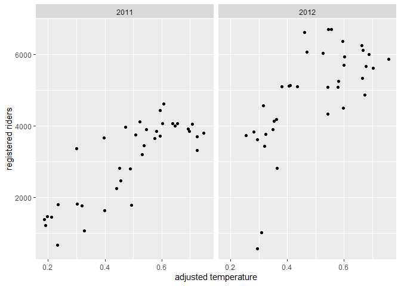
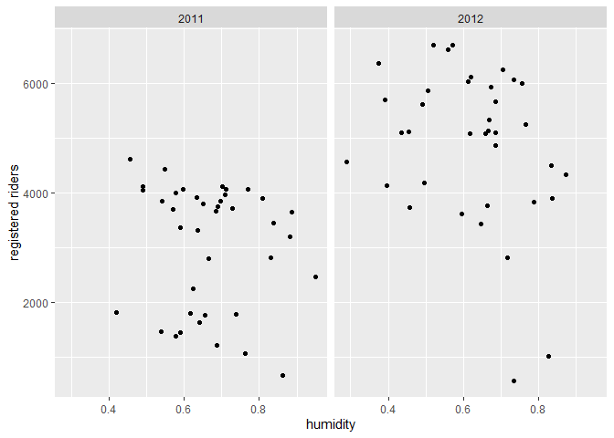

ST 558 Project 2
================
David Arthur
6/28/2021

-   [Introduction](#introduction)
-   [Packages](#packages)
-   [Data](#data)
-   [Summarizations](#summarizations)
-   [Modeling](#modeling)
    -   [First linear regression model](#first-linear-regression-model)
    -   [Second linear regression
        model](#second-linear-regression-model)
    -   [Random Forest Model](#random-forest-model)
    -   [Boosted](#boosted)
-   [Comparison of models](#comparison-of-models)

# Introduction

The data set this program analyzes can be found
[here](https://archive.ics.uci.edu/ml/datasets/Bike+Sharing+Dataset).
The data describes its volume of riders by a few dimensions:

-   season
-   day of the week
-   year
-   month
-   holiday (y/n flag)
-   working day (y/n flag)
-   weather (good, fair, poor, bad)
-   temperature
-   humidity
-   wind

It is further broken down into three response variables:

-   Casual: non-registered riders who use the service casually
-   Registered: registered riders who use the service more regularly
-   Total: casual and registered combined

The split between casual and registered is important, because they
behave completely differently, use the service on different days, times,
holidays, etc. Often, their behavior is inverse of each other, though
the registered rider group is largest portion of riders and would be the
primary client of the business. Keeping in mind that the registered
client represents the largest portion of the clientele, this program
focuses on the registered metric and splits the behavior by each day of
the week.

# Packages

The following packages are required to run this program:

-   tidyverse
-   caret
-   corrplot
-   GGally
-   knitr
-   faraway
-   leaps
-   gridExtra
-   leaps

# Data

We begin by reading in the data, changing the names of some factor
levels, and filtering by day of week

``` r
day <- readr::read_csv("day.csv", col_types = cols(
  season = col_factor(),
  yr = col_factor(),
  mnth = col_factor(),
  holiday = col_factor(),
  weekday = col_factor(),
  workingday = col_factor(),
  weathersit = col_factor()))

day <- day %>% mutate(season = fct_recode(season, winter = "1", spring = "2", summer = "3", fall = "4")) %>%
  mutate(yr = fct_recode(yr, "2011" = "0", "2012" = "1")) %>%
  mutate(weekday = fct_recode(weekday, Sunday = "0", Monday = "1", Tuesday = "2", Wednesday = "3", Thursday = "4", Friday = "5", Saturday = "6")) %>%
  mutate(weathersit = fct_recode(weathersit, clear = "1", mist = "2", lightRainOrSnow = "3", heavyRainOrSnow = "4")) %>%
  filter(weekday == params$dayOfWeek)

# read in version without factors for correlation plot
dayNF <- readr::read_csv("day.csv", col_types = cols(
  weekday = col_factor()))
```

Next, we partition the data into training and test sets

``` r
set.seed(21)
trainIndex <- createDataPartition(day$cnt, p = 0.7, list = FALSE)
dayTrain <- day[trainIndex, ]
dayTest <- day[-trainIndex, ]
```

# Summarizations

We begin our exploratory analysis of the data with a graphical overview
of the relationships between variables. Obvious patterns in the plots,
as well as high correlation values, indicate associations between
variables.

``` r
GGally::ggpairs(dayTrain %>% select(2:6, 8:9, atemp, windspeed, registered, casual))
```

<!-- -->

``` r
# dayNFCor <- cor(as.matrix(dayNF %>% select(3:9, atemp, windspeed, casual, registered,cnt)))
# corrplot(dayNFCor, type = "upper", tl.pos = "lt")
# corrplot(dayNFCor, type = "lower", method = "number", add = TRUE, diag = FALSE, tl.pos = "n")
```

We will now look in more detail at relationships between time-related
variables and the `registered` response variable. When we do our linear
regression modeling we will need to decide which (if any) of these
predictors to use. For example, the date variable (`dteday`) and
`season` may not be useful in the presence of `weekday`, `mnth`, and
`yr` (or vice versa), as they provide largely redundant information.

``` r
g <- ggplot(data = dayTrain)
g + geom_point(aes(x = dteday, y = registered))
```

<!-- -->

``` r
meanByMonthYr <- dayTrain %>% group_by(mnth, yr) %>%
  summarize(meanReg = mean(registered))
```

    ## `summarise()` has grouped output by 'mnth'. You can override using the `.groups` argument.

``` r
g2 <- ggplot(meanByMonthYr, aes(x = mnth))
g2 + geom_bar(aes(y = meanReg, fill = yr), position = "dodge", stat = "identity")
```

<!-- -->

We will look next in more detail at the relationship between
quantitative weather variables and the `registered` response variable.
The appearance of nonlinear relationships in the plots may indicate the
need for quadratic terms in our linear regression models. The adjusted
temperature variable, `atemp`, seems particularly likely to require a
quadratic term, as both low and high temperatures can discourage people
from bicycling. Similarly, with humidity and windspeed, low to moderate
values may have no effect, but particularly high values could have an
effect, so those variables may also require quadratic terms.

``` r
g + geom_point(aes(x = atemp, y = registered)) + facet_wrap(~ yr)
```

<!-- -->

``` r
g + geom_point(aes(x = hum, y = registered)) + facet_wrap(~ yr)
```

<!-- -->

``` r
g + geom_point(aes(x = windspeed, y = registered)) + facet_wrap(~ yr)
```

<!-- -->

We now view at a table displaying the mean number of `registered`,
`casual`, and total riders at each level of the categorical `weathersit`
variable. It seems plausible that in rain or snow, the number of casual
riders might decrease by a larger factor than would the number of
registered riders.

``` r
meanByWeather <- dayTrain %>% group_by(weathersit) %>%
  summarize(meanCas = mean(casual), meanReg = mean(registered), meanTotal = mean(cnt))
kable(meanByWeather, digits = 1, col.names = c("Weather", "Mean Casual Riders", "Mean Registered Riders", "Mean Total Riders"), caption = "Average # of riders by weather category")
```

| Weather         | Mean Casual Riders | Mean Registered Riders | Mean Total Riders |
|:----------------|-------------------:|-----------------------:|------------------:|
| mist            |              421.1 |                 3171.0 |            3592.1 |
| clear           |              653.8 |                 4420.1 |            5073.9 |
| lightRainOrSnow |              220.5 |                 3396.0 |            3616.5 |

Average \# of riders by weather category

Exploratory data analysis and summary (James)

``` r
scatter_james <- ggplot(data=dayTrain, aes(x=temp, y=registered)) +
                 geom_point(aes(color=weathersit))
hist_james <- ggplot(data=dayTrain, aes(x=weathersit)) +
              geom_histogram(stat='count', aes(fill=workingday)) +
              ggtitle('Frequency of Weather') +
              xlab('Weather Type') + ylab('Count')

bar_james <- ggplot(data=dayTrain %>% 
                 select(season, casual, registered) %>%
                 pivot_longer(cols=c(casual, registered),
                              names_to = 'metrics',
                              values_to = 'riders') %>%
                 group_by(season, metrics) %>%
                 summarise(avg_riders = mean(riders)), 
            aes(x=season, y=avg_riders, fill=metrics)) +     
            geom_bar(stat='identity', position='dodge') +
            ggtitle('Average Number of Riders') +
              xlab('Season') + ylab('Average # of Riders')
  
box_james <- ggplot(data=dayTrain, aes(x=mnth, y=temp)) +
             geom_boxplot(aes(color=season))
```

Looking at the bar graph below, in all seasons the registered user base
far out-performs the casual base. This further confirms our plan of
analyzing the registered group as the priority.

<!-- -->

Since we don’t have a domain expert, we need to try to figure out what
variables are important and which we could exclude. We already know that
the two temperature variables have near perfect correlation, and clearly
date is redundant with mnth and yr. I would think season is as well
covered by mnth.

That leaves temperature, weather, and the working day flag as the most
likely to be relevant parameters. Looking at the plots below, I think we
can make a few obvious inferences:

-   looking at the scatter plot on the left, we can see that as the
    temperature goes up, the number of riders also goes up - at least up
    to a point. And even in the highest temperatures, ridership is way
    up over lowest temperatures.
-   the middle figure displays that temperature is highest in spring,
    summer, and early fall
-   looking at the figure on the right, there are very few days of
    extremely poor weather. Most days are clear, which are the best days
    for ridership.

<!-- -->

``` r
summ_james <- dayTrain %>% rename(total = cnt) %>%
              pivot_longer(cols=c(casual, registered, total),
                           names_to = 'metrics',
                           values_to = 'riders') %>%
              group_by(metrics) %>%
              summarise(min = min(riders),
                        lower25 = quantile(riders, 0.25),
                        median = median(riders),
                        mean = mean(riders),
                        upper75 = quantile(riders, 0.75),
                        max = max(riders))  %>%
              pivot_longer(cols=c(min, lower25, median,
                                  mean, upper75, max),
                           names_to = 'Summary',
                           values_to = 'stats') %>%
              pivot_wider(names_from = metrics, values_from = stats)

kable(summ_james, digits=0)
```

| Summary | casual | registered | total |
|:--------|-------:|-----------:|------:|
| min     |      9 |        573 |   683 |
| lower25 |    250 |       3282 |  3579 |
| median  |    542 |       3943 |  4576 |
| mean    |    557 |       3933 |  4490 |
| upper75 |    806 |       5099 |  5769 |
| max     |   1281 |       6697 |  7767 |

``` r
pct_diff <- round((summ_james$registered[3] / summ_james$casual[3] - 1) 
                  * 100, 0)
pct_str <- paste0(pct_diff, '%')

inc_dec <- ''
if (pct_diff >= 0) {
  inc_dec <- 'increased'
} else {
  inc_dec <- 'decreased'
}
```

On the day of the week, Tuesday, ridership by registered users is
increased by 627%.

# Modeling

We will now fit two linear regression models, using differing
approaches, with the goal of creating a model that does a good job of
predicting the number of registered riders on any given day, based on
the values of the predictor variables in the data set. We will fit the
models using the training data set that we partitioned above, and then
test the accuracy of the models’ predictions using the test data set.

Linear regression estimates the effect of each predictor variable on the
mean value of the response variable, with the other predictor variables
held constant. A linear regression model can be expressed as  
*Y*<sub>*i*</sub> = *β*<sub>0</sub> + *β*<sub>1</sub>*X*<sub>*i*1</sub> + *β*<sub>2</sub>*X*<sub>*i*2</sub> + ... + *β*<sub>*p*</sub>*X*<sub>*i**p*</sub> + *E*<sub>*i*</sub>

where *Y*<sub>*i*</sub> is the response, *i* represents the observation
number, *X*<sub>*i**j*</sub> are the predictor variables, and
*E*<sub>*i*</sub> is the normally distributed random error. The
*β*<sub>*j*</sub> coefficients must be linear, but the predictor
variables can be higher order terms (e.g. *x*<sup>2</sup>) or
interaction terms (e.g. *x*<sub>1</sub>*x*<sub>2</sub>). Creating a
model to estimate the response using observed data, we have  
$$\\hat{y\_i} = \\hat\\beta\_0 + \\hat\\beta\_1x\_{i1} + \\hat\\beta\_2x\_{i2} + ... + \\hat\\beta\_px\_{ip}$$

The *β̂*<sub>*j*</sub> coefficients (estimates for *β*<sub>*j*</sub>) are
calculated for each predictor variable to minimize the residual sum of
squares, using the observed values of *x*<sub>*i**j*</sub> and
*y*<sub>*i*</sub>  
$$min\_{\\beta\_0, \\beta\_1, ..., \\beta\_p}\\sum\_{i=1}^{n}(y\_i - \\beta\_0 - \\beta\_1x\_{i1} - \\beta\_2x\_{i2} - ... - \\beta\_px\_{ip})^2$$

The linear regression model can be used for inference, to understand the
relationships between the predictor variables and the response, as well
as for prediction of a mean response given new values of the predictor
variables. There are varying approaches to choosing which predictor
variables to include in a linear regression model. For our first linear
regression model, we ….  
For our second linear regression model, we ….

### First linear regression model

I am starting with a best subsets approach, meaning we will look at all
of the predictors and use cross-validation to choose the one that has
the best prediction capability. Since the training set is only around 80
rows, I opted for four-fold cross validation to leave some data in each
fold.

``` r
library(leaps)

data <- dayTrain %>% 
               drop_na() %>%
               select(-instant,-dteday, -season, 
                    -weekday, -atemp, -casual, -cnt)

#this function converts new data to a model matrix
#so that a prediction can be run via matrix multiplication
#on a best subsets model
predict.regsubsets = function(object,newdata,id,...){
      form = as.formula(object$call[[2]]) 
      mat = model.matrix(form,newdata)    
      coefi = coef(object,id=id)          
      xvars = names(coefi)                
      mat[,xvars]%*%coefi               
}


#let's do cross validation with folds
k <- 4
set.seed(21)
folds <- sample(1:k, nrow(data), replace=T)

cv_errors = matrix(NA, k, 16, dimnames = list(NULL, paste(1:16)))

for (j in 1:k) {
  best <- regsubsets(registered ~ ., 
                     data=data[folds!=j,], nvmax=20)
  
  for (i in 1:16) {
    pred <- predict(best, data[folds==j,], id=i)
    
    
    cv_errors[j, i] <- mean((data$registered[folds==j]-pred)^2)
  }
}
```

    ## Reordering variables and trying again:

    ## Error in eval(x): object 'newX' not found

``` r
# Take the mean of over all folds for each model size
mean_cv_errors = apply(cv_errors, 2, mean)

# Find the model size with the smallest cross-validation error
min = which.min(mean_cv_errors)

#the model w/ 14 variables was best when using 4 fold cv.
#i did 4 fold because there are only about 80 rows of data per weekday

best <- regsubsets(registered ~ ., 
                           data=data, nvmax=20)
```

    ## Reordering variables and trying again:

``` r
best
```

    ## Subset selection object
    ## Call: FUN(newX[, i], ...)
    ## 19 Variables  (and intercept)
    ##                           Forced in Forced out
    ## yr2012                        FALSE      FALSE
    ## mnth2                         FALSE      FALSE
    ## mnth3                         FALSE      FALSE
    ## mnth4                         FALSE      FALSE
    ## mnth5                         FALSE      FALSE
    ## mnth6                         FALSE      FALSE
    ## mnth7                         FALSE      FALSE
    ## mnth8                         FALSE      FALSE
    ## mnth9                         FALSE      FALSE
    ## mnth10                        FALSE      FALSE
    ## mnth11                        FALSE      FALSE
    ## mnth12                        FALSE      FALSE
    ## holiday1                      FALSE      FALSE
    ## weathersitclear               FALSE      FALSE
    ## weathersitlightRainOrSnow     FALSE      FALSE
    ## temp                          FALSE      FALSE
    ## hum                           FALSE      FALSE
    ## windspeed                     FALSE      FALSE
    ## workingday1                   FALSE      FALSE
    ## 1 subsets of each size up to 18
    ## Selection Algorithm: exhaustive

``` r
if(length(unique(dayTrain$workingday)) == 1){
  lm.fit1 <- lm(registered ~ yr + mnth + weathersit + temp + hum +
               windspeed, data=dayTrain)
}else{
  lm.fit1 <- lm(registered ~ yr + mnth + weathersit + temp + hum +
               windspeed +workingday, data=dayTrain)
}
lm.fit1$nbest
```

    ## NULL

``` r
coef(lm.fit1)
```

    ##               (Intercept)                    yr2012                     mnth2 
    ##               -1200.11283                1766.39267                -224.08527 
    ##                     mnth3                     mnth4                     mnth5 
    ##                -164.08761                 329.30061                 558.32161 
    ##                     mnth6                     mnth7                     mnth8 
    ##                 753.19859                 -41.48949                 330.26908 
    ##                     mnth9                    mnth10                    mnth11 
    ##                1204.94018                 888.35707                1156.72542 
    ##                    mnth12           weathersitclear weathersitlightRainOrSnow 
    ##                1066.03372                 379.00784                -290.51769 
    ##                      temp                       hum                 windspeed 
    ##                4085.38882               -2611.57230               -1958.58803 
    ##               workingday1 
    ##                3582.84328

Using best subsets, the following model was obtained: \# coef(best, min)
registered \~ yr + mnth + weathersit + temp + hum + windspeed +
workingday

### Second linear regression model

In this approach, we start with a full linear regression model that
includes all of the predictor variables. We will then reduce
collinearity (correlation among predictor variables) by removing
redundant predictors until we reach an optimal (lowest) AIC. We will
calculate the condition number (*κ*) for each of the candidate models,
which is a measure of collinearity. Roughly, *κ* &lt; 30 is considered
desirable. Finally, we will choose among several variations of the
optimal model (including various higher order terms) using cross
validation (described below).

We begin with the full model, which includes all of the predictors.
`holiday` and `workingday` are excluded for days of the week that
include only one level of `holiday` and `workingday`, respectively.

``` r
mlrFull <- lm(registered ~ dteday + season +  yr + mnth + weathersit + temp + 
                    atemp + hum + windspeed, dayTrain)
if(length(unique(dayTrain$workingday)) != 1){
  mlrFull <- update(mlrFull, . ~ . + workingday)
}
if(length(unique(dayTrain$holiday)) != 1){
  mlrFull <- update(mlrFull, . ~ . + holiday)
}

summary(mlrFull)
```

    ## 
    ## Call:
    ## lm(formula = registered ~ dteday + season + yr + mnth + weathersit + 
    ##     temp + atemp + hum + windspeed + workingday + holiday, data = dayTrain)
    ## 
    ## Residuals:
    ##      Min       1Q   Median       3Q      Max 
    ## -2584.98  -244.20    14.41   333.84  1066.53 
    ## 
    ## Coefficients: (1 not defined because of singularities)
    ##                            Estimate Std. Error t value Pr(>|t|)   
    ## (Intercept)               155068.69  130314.58   1.190  0.23947   
    ## dteday                       -10.41       8.69  -1.198  0.23651   
    ## seasonspring                 234.94     484.44   0.485  0.62974   
    ## seasonsummer                 526.13     601.16   0.875  0.38549   
    ## seasonfall                  1302.77     584.87   2.227  0.03027 * 
    ## yr2012                      5583.40    3193.92   1.748  0.08634 . 
    ## mnth2                        407.71     508.51   0.802  0.42633   
    ## mnth3                        559.85     686.69   0.815  0.41863   
    ## mnth4                       1121.13    1043.22   1.075  0.28748   
    ## mnth5                       1785.78    1276.20   1.399  0.16766   
    ## mnth6                       2293.46    1499.76   1.529  0.13227   
    ## mnth7                       1900.57    1774.22   1.071  0.28902   
    ## mnth8                       2600.71    1994.80   1.304  0.19806   
    ## mnth9                       3241.48    2181.09   1.486  0.14327   
    ## mnth10                      2552.12    2407.57   1.060  0.29403   
    ## mnth11                      3127.87    2680.06   1.167  0.24850   
    ## mnth12                      3448.50    2911.49   1.184  0.24162   
    ## weathersitclear              277.73     232.53   1.194  0.23775   
    ## weathersitlightRainOrSnow   -421.90     554.77  -0.760  0.45039   
    ## temp                      -13434.39    7072.37  -1.900  0.06304 . 
    ## atemp                      19216.70    7704.11   2.494  0.01584 * 
    ## hum                        -2253.51     889.01  -2.535  0.01430 * 
    ## windspeed                  -1389.15    1216.32  -1.142  0.25865   
    ## workingday1                 2361.94     837.74   2.819  0.00679 **
    ## holiday1                         NA         NA      NA       NA   
    ## ---
    ## Signif. codes:  0 '***' 0.001 '**' 0.01 '*' 0.05 '.' 0.1 ' ' 1
    ## 
    ## Residual standard error: 623.8 on 52 degrees of freedom
    ## Multiple R-squared:  0.889,  Adjusted R-squared:   0.84 
    ## F-statistic: 18.12 on 23 and 52 DF,  p-value: < 2.2e-16

``` r
AIC(mlrFull)
```

    ## [1] 1215.092

``` r
x <- model.matrix(mlrFull)[, -1]
e <- eigen(t(x) %*% x)
# e$val
# condition number = sqrt(e$val[1]/min(e$val))
```

We see that *κ* = 3.9500638^{7}, which is a sign of high collinearity,
so we begin removing insignificant predictors one at a time, each time
checking to confirm that AIC declines, or at least that it increases
only marginally.

To help in consideration of which variables to remove, we view the
correlations. For days of the week that don’t include any holidays, `?`
will appear in the `holiday` and `workingday` rows and columns.

``` r
dayNFCor <- cor(as.matrix(dayNF %>%
                            mutate(weekday = fct_recode(weekday, Sunday = "0", Monday = "1", Tuesday = "2", Wednesday = "3", Thursday = "4", Friday = "5", Saturday = "6")) %>%
                            mutate(dteday = as.numeric(dteday)) %>%
                            filter(weekday == params$dayOfWeek) %>%
                            select(2:6, 8:13, registered)))
corrplot(dayNFCor, type = "upper", tl.pos = "lt")
corrplot(dayNFCor, type = "lower", method = "number", add = TRUE, diag = FALSE, tl.pos = "n")
```

<!-- -->

First, we remove `workingday`, as it is fully determined by the day of
the week and the `holiday` variable, so adds nothing to the model. We
also remove `temp`, as it is almost perfectly correlated with `atemp`,
and `dteday`, which adds little if any predictive value beyond `yr` plus
`mnth` plus `season`.

``` r
mlr2 <- update(mlrFull, . ~ . - workingday - temp - dteday)
summary(mlr2)
```

    ## 
    ## Call:
    ## lm(formula = registered ~ season + yr + mnth + weathersit + atemp + 
    ##     hum + windspeed + holiday, data = dayTrain)
    ## 
    ## Residuals:
    ##      Min       1Q   Median       3Q      Max 
    ## -2729.14  -268.55    19.15   312.92  1105.72 
    ## 
    ## Coefficients:
    ##                           Estimate Std. Error t value Pr(>|t|)    
    ## (Intercept)                2197.36     738.52   2.975 0.004370 ** 
    ## seasonspring                247.20     497.24   0.497 0.621109    
    ## seasonsummer                483.43     611.87   0.790 0.432930    
    ## seasonfall                 1272.63     593.83   2.143 0.036629 *  
    ## yr2012                     1758.24     155.87  11.280  8.1e-16 ***
    ## mnth2                      -125.61     406.55  -0.309 0.758536    
    ## mnth3                      -219.49     431.96  -0.508 0.613437    
    ## mnth4                        36.10     673.30   0.054 0.957441    
    ## mnth5                       246.55     718.56   0.343 0.732846    
    ## mnth6                       351.00     728.53   0.482 0.631899    
    ## mnth7                      -524.11     832.23  -0.630 0.531507    
    ## mnth8                      -123.54     778.16  -0.159 0.874451    
    ## mnth9                       435.23     721.21   0.603 0.548719    
    ## mnth10                     -401.84     716.10  -0.561 0.577018    
    ## mnth11                     -150.56     713.91  -0.211 0.833763    
    ## mnth12                       44.75     600.91   0.074 0.940907    
    ## weathersitclear             278.05     238.90   1.164 0.249590    
    ## weathersitlightRainOrSnow  -462.61     542.29  -0.853 0.397392    
    ## atemp                      4823.95    1222.71   3.945 0.000232 ***
    ## hum                       -2628.98     895.16  -2.937 0.004864 ** 
    ## windspeed                 -1939.45    1200.32  -1.616 0.111972    
    ## holiday1                  -2588.86     849.71  -3.047 0.003575 ** 
    ## ---
    ## Signif. codes:  0 '***' 0.001 '**' 0.01 '*' 0.05 '.' 0.1 ' ' 1
    ## 
    ## Residual standard error: 641.1 on 54 degrees of freedom
    ## Multiple R-squared:  0.8783, Adjusted R-squared:  0.831 
    ## F-statistic: 18.56 on 21 and 54 DF,  p-value: < 2.2e-16

``` r
AIC(mlr2)
```

    ## [1] 1218.121

``` r
x <- model.matrix(mlr2)[, -1]
e <- eigen(t(x) %*% x)
# e$val
# condition number = sqrt(e$val[1]/min(e$val))
```

We see that AIC has changed little, and that *κ* = 37, which indicates a
large reduction in collinearity.

`mnth`, `weathersit` and `windspeed` appear to be marginally
significant, so we look at the effect of removing each of them from the
model:  
Remove `mnth`

``` r
mlr3 <- update(mlr2, . ~ . - mnth)
summary(mlr3)
```

    ## 
    ## Call:
    ## lm(formula = registered ~ season + yr + weathersit + atemp + 
    ##     hum + windspeed + holiday, data = dayTrain)
    ## 
    ## Residuals:
    ##      Min       1Q   Median       3Q      Max 
    ## -3091.48  -240.11    24.19   339.63  1216.41 
    ## 
    ## Coefficients:
    ##                           Estimate Std. Error t value Pr(>|t|)    
    ## (Intercept)                 1668.0      644.7   2.587 0.011922 *  
    ## seasonspring                 511.1      314.9   1.623 0.109399    
    ## seasonsummer                 570.7      382.1   1.494 0.140092    
    ## seasonfall                  1211.8      258.0   4.697 1.41e-05 ***
    ## yr2012                      1751.5      152.1  11.516  < 2e-16 ***
    ## weathersitclear              334.8      210.2   1.593 0.116048    
    ## weathersitlightRainOrSnow   -619.4      496.3  -1.248 0.216471    
    ## atemp                       4633.4      917.0   5.053 3.78e-06 ***
    ## hum                        -1933.0      788.3  -2.452 0.016897 *  
    ## windspeed                  -1742.0     1110.8  -1.568 0.121691    
    ## holiday1                   -2496.6      674.2  -3.703 0.000441 ***
    ## ---
    ## Signif. codes:  0 '***' 0.001 '**' 0.01 '*' 0.05 '.' 0.1 ' ' 1
    ## 
    ## Residual standard error: 638.6 on 65 degrees of freedom
    ## Multiple R-squared:  0.8546, Adjusted R-squared:  0.8323 
    ## F-statistic: 38.22 on 10 and 65 DF,  p-value: < 2.2e-16

``` r
AIC(mlr3)
```

    ## [1] 1209.614

``` r
x <- model.matrix(mlr3)[, -1]
e <- eigen(t(x) %*% x)
# e$val
# condition number = sqrt(e$val[1]/min(e$val))
```

Remove `weathersit`

``` r
mlr4 <- update(mlr2, . ~ . - weathersit)
# summary(mlr4)
AIC(mlr4)
```

    ## [1] 1217.475

``` r
x <- model.matrix(mlr4)[, -1]
e <- eigen(t(x) %*% x)
# e$val
# condition # =
# sqrt(e$val[1]/min(e$val))
```

Remove `windspeed`

``` r
mlr5 <- update(mlr2, . ~ . - windspeed)
# summary(mlr5)
AIC(mlr5)
```

    ## [1] 1219.709

``` r
x <- model.matrix(mlr5)[, -1]
e <- eigen(t(x) %*% x)
# e$val
# condition # =
# sqrt(e$val[1]/min(e$val))
```

For `mnth`, `weathersit`, and `windspeed`, removal from the model
results in an increase or marginal decrease to AIC. If our main goal
were inference and understanding the relationships between the
variables, we might want to remove them from the model for the sake of
simplicity, interpretability, and more narrow confidence intervals.
Because our primary goal here is prediction, we will leave them in the
model, and choose mlr2 as our base linear regression model.

We will now do some diagnostic plots on our base model, and then
consider adding higher order terms to the model.

``` r
# # compare to model chosen by leaps::step() function
# mlrStep <- step(mlrFull)
# names(mlrStep)
# mlrStep$call
# mlr2$call
# AIC(mlr2, mlrStep)
# 
```

We can check for constant variance of our error term, an assumption of
our model, by looking at a plot of the model’s fitted values vs the
residuals (difference between fitted response and observed response). A
“megaphone” shape can indicate non-constant variance.

``` r
plot(mlr2$fitted, mlr2$residuals)
```

<!-- -->

Another way to assess constant variance is with the Box-Cox method,
which can suggest transformations of the response to address problems
with non-constant variance. If the maximum log-likelihood of *λ* close
to 1, as in this case, indicates that non-constant variance is not a
problem with the existing model.

``` r
MASS::boxcox(mlr2)
```

    ## Error in `contrasts<-`(`*tmp*`, value = contr.funs[1 + isOF[nn]]): contrasts can be applied only to factors with 2 or more levels

We will also look at for signs of nonlinearity, which can indicate the
need for quadratic terms for some of the predictors. The partial
residual plots below plot the relationship between each predictor and
the response, with the effect of the other predictors removed.

``` r
termplot( mlr2, partial.resid = TRUE, terms = c("atemp", "windspeed", "hum"))
```

<!-- --><!-- --><!-- -->

For at least some days of the week there is a nonlinear pattern to the
plots, particularly for `atemp`, so we will try adding quadratic terms
for each of them to our base model.

Try adding *a**t**e**m**p*<sup>2</sup>

``` r
mlr8 <- update(mlr2, . ~ . + I(atemp^2))
summary(mlr8)
```

    ## 
    ## Call:
    ## lm(formula = registered ~ season + yr + mnth + weathersit + atemp + 
    ##     hum + windspeed + holiday + I(atemp^2), data = dayTrain)
    ## 
    ## Residuals:
    ##      Min       1Q   Median       3Q      Max 
    ## -2429.64  -266.18    19.16   310.11   983.21 
    ## 
    ## Coefficients:
    ##                             Estimate Std. Error t value Pr(>|t|)    
    ## (Intercept)                 -377.628    976.220  -0.387 0.700434    
    ## seasonspring                  35.756    453.319   0.079 0.937428    
    ## seasonsummer                 415.635    553.473   0.751 0.455999    
    ## seasonfall                  1065.195    539.903   1.973 0.053728 .  
    ## yr2012                      1612.402    146.568  11.001 2.69e-15 ***
    ## mnth2                       -201.555    368.142  -0.547 0.586338    
    ## mnth3                       -468.721    396.548  -1.182 0.242481    
    ## mnth4                       -197.435    612.107  -0.323 0.748305    
    ## mnth5                        346.298    650.198   0.533 0.596534    
    ## mnth6                        438.414    659.067   0.665 0.508805    
    ## mnth7                         19.434    767.249   0.025 0.979888    
    ## mnth8                         -4.914    704.257  -0.007 0.994459    
    ## mnth9                        309.140    652.937   0.473 0.637828    
    ## mnth10                      -600.152    649.703  -0.924 0.359812    
    ## mnth11                      -293.309    646.614  -0.454 0.651963    
    ## mnth12                      -254.288    549.509  -0.463 0.645434    
    ## weathersitclear              436.070    220.354   1.979 0.053028 .  
    ## weathersitlightRainOrSnow   -403.719    490.524  -0.823 0.414175    
    ## atemp                      18402.660   3914.992   4.701 1.89e-05 ***
    ## hum                        -2566.850    809.445  -3.171 0.002525 ** 
    ## windspeed                  -1822.046   1085.630  -1.678 0.099170 .  
    ## holiday1                   -2317.158    771.843  -3.002 0.004083 ** 
    ## I(atemp^2)                -15174.357   4197.039  -3.615 0.000668 ***
    ## ---
    ## Signif. codes:  0 '***' 0.001 '**' 0.01 '*' 0.05 '.' 0.1 ' ' 1
    ## 
    ## Residual standard error: 579.6 on 53 degrees of freedom
    ## Multiple R-squared:  0.9024, Adjusted R-squared:  0.8618 
    ## F-statistic: 22.27 on 22 and 53 DF,  p-value: < 2.2e-16

``` r
AIC(mlr8)
```

    ## [1] 1203.367

Reduced or similar AIC, so keep mlr8 as new base model.

Try adding *h**u**m*<sup>2</sup>

``` r
mlr9 <- update(mlr8, . ~ . + I(hum^2))
summary(mlr9)
```

    ## 
    ## Call:
    ## lm(formula = registered ~ season + yr + mnth + weathersit + atemp + 
    ##     hum + windspeed + holiday + I(atemp^2) + I(hum^2), data = dayTrain)
    ## 
    ## Residuals:
    ##      Min       1Q   Median       3Q      Max 
    ## -2355.76  -287.48    11.77   324.79   945.01 
    ## 
    ## Coefficients:
    ##                            Estimate Std. Error t value Pr(>|t|)    
    ## (Intercept)                -1767.06    1578.26  -1.120 0.268019    
    ## seasonspring                 131.00     460.19   0.285 0.777036    
    ## seasonsummer                 535.37     562.44   0.952 0.345570    
    ## seasonfall                  1155.27     544.61   2.121 0.038684 *  
    ## yr2012                      1624.01     146.59  11.079 2.69e-15 ***
    ## mnth2                       -198.90     367.28  -0.542 0.590445    
    ## mnth3                       -445.07     396.17  -1.123 0.266420    
    ## mnth4                       -267.36     613.85  -0.436 0.664972    
    ## mnth5                        270.01     652.23   0.414 0.680594    
    ## mnth6                        382.13     659.43   0.579 0.564765    
    ## mnth7                        -71.93     769.78  -0.093 0.925911    
    ## mnth8                       -101.75     707.90  -0.144 0.886262    
    ## mnth9                        283.42     651.80   0.435 0.665482    
    ## mnth10                      -687.49     652.85  -1.053 0.297185    
    ## mnth11                      -399.96     652.09  -0.613 0.542319    
    ## mnth12                      -321.22     551.46  -0.582 0.562754    
    ## weathersitclear              399.51     222.25   1.798 0.078053 .  
    ## weathersitlightRainOrSnow   -148.50     539.93  -0.275 0.784380    
    ## atemp                      18612.86    3910.25   4.760 1.59e-05 ***
    ## hum                         2120.93    4267.25   0.497 0.621267    
    ## windspeed                  -1821.48    1083.06  -1.682 0.098607 .  
    ## holiday1                   -2288.33     770.45  -2.970 0.004496 ** 
    ## I(atemp^2)                -15527.98    4199.02  -3.698 0.000524 ***
    ## I(hum^2)                   -3815.28    3410.27  -1.119 0.268383    
    ## ---
    ## Signif. codes:  0 '***' 0.001 '**' 0.01 '*' 0.05 '.' 0.1 ' ' 1
    ## 
    ## Residual standard error: 578.3 on 52 degrees of freedom
    ## Multiple R-squared:  0.9047, Adjusted R-squared:  0.8625 
    ## F-statistic: 21.45 on 23 and 52 DF,  p-value: < 2.2e-16

``` r
AIC(mlr9)
```

    ## [1] 1203.559

Similar AIC for most days of week, so keep mlr9 as a candidate model to
compare using cross validation.

Try adding *w**i**n**d**s**p**e**e**d*<sup>2</sup>

``` r
mlr10 <- update(mlr8, . ~ . + I(windspeed^2))
summary(mlr10)
```

    ## 
    ## Call:
    ## lm(formula = registered ~ season + yr + mnth + weathersit + atemp + 
    ##     hum + windspeed + holiday + I(atemp^2) + I(windspeed^2), 
    ##     data = dayTrain)
    ## 
    ## Residuals:
    ##      Min       1Q   Median       3Q      Max 
    ## -2422.63  -268.65    16.21   316.59   987.43 
    ## 
    ## Coefficients:
    ##                             Estimate Std. Error t value Pr(>|t|)    
    ## (Intercept)               -3.358e+02  1.065e+03  -0.315 0.753692    
    ## seasonspring               3.896e+01  4.587e+02   0.085 0.932636    
    ## seasonsummer               4.088e+02  5.626e+02   0.727 0.470705    
    ## seasonfall                 1.062e+03  5.457e+02   1.946 0.057010 .  
    ## yr2012                     1.613e+03  1.482e+02  10.885 5.13e-15 ***
    ## mnth2                     -1.983e+02  3.730e+02  -0.532 0.597289    
    ## mnth3                     -4.623e+02  4.050e+02  -1.141 0.258908    
    ## mnth4                     -2.003e+02  6.185e+02  -0.324 0.747346    
    ## mnth5                      3.393e+02  6.598e+02   0.514 0.609308    
    ## mnth6                      4.421e+02  6.662e+02   0.664 0.509913    
    ## mnth7                      2.376e+01  7.756e+02   0.031 0.975678    
    ## mnth8                      7.447e-01  7.130e+02   0.001 0.999171    
    ## mnth9                      3.122e+02  6.598e+02   0.473 0.638057    
    ## mnth10                    -5.953e+02  6.575e+02  -0.905 0.369485    
    ## mnth11                    -2.898e+02  6.536e+02  -0.443 0.659331    
    ## mnth12                    -2.451e+02  5.618e+02  -0.436 0.664462    
    ## weathersitclear            4.391e+02  2.243e+02   1.957 0.055684 .  
    ## weathersitlightRainOrSnow -4.095e+02  4.983e+02  -0.822 0.414946    
    ## atemp                      1.840e+04  3.952e+03   4.655 2.27e-05 ***
    ## hum                       -2.555e+03  8.249e+02  -3.097 0.003145 ** 
    ## windspeed                 -2.378e+03  5.475e+03  -0.434 0.665856    
    ## holiday1                  -2.320e+03  7.795e+02  -2.976 0.004427 ** 
    ## I(atemp^2)                -1.516e+04  4.239e+03  -3.576 0.000764 ***
    ## I(windspeed^2)             1.256e+03  1.212e+04   0.104 0.917847    
    ## ---
    ## Signif. codes:  0 '***' 0.001 '**' 0.01 '*' 0.05 '.' 0.1 ' ' 1
    ## 
    ## Residual standard error: 585.1 on 52 degrees of freedom
    ## Multiple R-squared:  0.9024, Adjusted R-squared:  0.8592 
    ## F-statistic:  20.9 on 23 and 52 DF,  p-value: < 2.2e-16

``` r
AIC(mlr10)
```

    ## [1] 1205.351

Similar AIC for most days of week, so keep mlr10 as a candidate model to
compare using cross validation.

Try including all 3 quadratic terms

``` r
mlr11 <- update(mlr8, . ~ . + I(hum^2) + I(windspeed^2))
summary(mlr11)
```

    ## 
    ## Call:
    ## lm(formula = registered ~ season + yr + mnth + weathersit + atemp + 
    ##     hum + windspeed + holiday + I(atemp^2) + I(hum^2) + I(windspeed^2), 
    ##     data = dayTrain)
    ## 
    ## Residuals:
    ##      Min       1Q   Median       3Q      Max 
    ## -2358.64  -288.50     9.59   324.00   942.77 
    ## 
    ## Coefficients:
    ##                            Estimate Std. Error t value Pr(>|t|)    
    ## (Intercept)                -1795.43    1695.93  -1.059 0.294738    
    ## seasonspring                 130.06     465.06   0.280 0.780871    
    ## seasonsummer                 539.35     573.72   0.940 0.351604    
    ## seasonfall                  1157.21     551.34   2.099 0.040795 *  
    ## yr2012                      1623.64     148.20  10.956 5.24e-15 ***
    ## mnth2                       -200.45     372.20  -0.539 0.592547    
    ## mnth3                       -447.97     404.39  -1.108 0.273162    
    ## mnth4                       -266.42     620.12  -0.430 0.669281    
    ## mnth5                        272.88     661.19   0.413 0.681550    
    ## mnth6                        380.04     667.22   0.570 0.571457    
    ## mnth7                        -74.55     779.11  -0.096 0.924148    
    ## mnth8                       -105.04     717.94  -0.146 0.884259    
    ## mnth9                        281.81     658.97   0.428 0.670702    
    ## mnth10                      -690.34     661.79  -1.043 0.301798    
    ## mnth11                      -402.28     660.15  -0.609 0.544977    
    ## mnth12                      -326.01     565.37  -0.577 0.566727    
    ## weathersitclear              397.85     226.94   1.753 0.085591 .  
    ## weathersitlightRainOrSnow   -144.19     552.24  -0.261 0.795063    
    ## atemp                      18616.23    3948.91   4.714 1.91e-05 ***
    ## hum                         2144.06    4334.67   0.495 0.622985    
    ## windspeed                  -1557.15    5514.34  -0.282 0.778793    
    ## holiday1                   -2286.97     778.44  -2.938 0.004951 ** 
    ## I(atemp^2)                -15537.29    4244.17  -3.661 0.000597 ***
    ## I(hum^2)                   -3838.65    3476.46  -1.104 0.274696    
    ## I(windspeed^2)              -597.18   12210.71  -0.049 0.961185    
    ## ---
    ## Signif. codes:  0 '***' 0.001 '**' 0.01 '*' 0.05 '.' 0.1 ' ' 1
    ## 
    ## Residual standard error: 583.9 on 51 degrees of freedom
    ## Multiple R-squared:  0.9047, Adjusted R-squared:  0.8598 
    ## F-statistic: 20.17 on 24 and 51 DF,  p-value: < 2.2e-16

``` r
AIC(mlr11)
```

    ## [1] 1205.556

Similar AIC for most days of week, so keep mlr11 as a candidate model to
compare using cross validation.

We will now compare the 4 candidate models using cross validation. Cross
validation subdivides the training set into *k* folds, then fits a model
using *k* − 1 of those folds, and tests its accuracy predicting on the
*k*<sup>*t**h*</sup> fold. This is repeated *k* − 1 more times, so that
each fold gets a turn as the test set. Several measures of the
performance of the model are returned. We will choose the best model in
terms of lowest Root Mean Squared Error.

``` r
if(length(unique(dayTrain$holiday)) != 1){
  mlrFit8 <- train(registered ~ season + yr + mnth + holiday + weathersit + atemp + hum + windspeed + I(atemp^2), data = dayTrain,
      method = "lm",
      preProcess = c("center", "scale"),
      trControl = trainControl(method = "repeatedcv", number = 4, repeats = 3))
  
  mlrFit9 <- train(registered ~ season + yr + mnth + holiday + weathersit + atemp + hum + windspeed + I(atemp^2) + I(hum^2), data = dayTrain,
      method = "lm",
      preProcess = c("center", "scale"),
      trControl = trainControl(method = "repeatedcv", number = 4, repeats = 3))
  
  mlrFit10 <- train(registered ~ season + yr + mnth + holiday + weathersit + atemp + hum + windspeed + I(atemp^2) + I(windspeed^2), data = dayTrain,
      method = "lm",
      preProcess = c("center", "scale"),
      trControl = trainControl(method = "repeatedcv", number = 4, repeats = 3))
  
  mlrFit11 <- train(registered ~ season + yr + mnth + holiday + weathersit + atemp + hum + windspeed + I(atemp^2) + I(hum^2)+ I(windspeed^2), data = dayTrain,
      method = "lm",
      preProcess = c("center", "scale"),
      trControl = trainControl(method = "repeatedcv", number = 4, repeats = 3))
}else{
  mlrFit8 <- train(registered ~ season + yr + mnth + weathersit + atemp + hum + windspeed + I(atemp^2), data = dayTrain,
      method = "lm",
      preProcess = c("center", "scale"),
      trControl = trainControl(method = "repeatedcv", number = 4, repeats = 3))
  
  mlrFit9 <- train(registered ~ season + yr + mnth + weathersit + atemp + hum + windspeed + I(atemp^2) + I(hum^2), data = dayTrain,
      method = "lm",
      preProcess = c("center", "scale"),
      trControl = trainControl(method = "repeatedcv", number = 4, repeats = 3))
  
  mlrFit10 <- train(registered ~ season + yr + mnth + weathersit + atemp + hum + windspeed + I(atemp^2) + I(windspeed^2), data = dayTrain,
      method = "lm",
      preProcess = c("center", "scale"),
      trControl = trainControl(method = "repeatedcv", number = 4, repeats = 3))
  
  mlrFit11 <- train(registered ~ season + yr + mnth + weathersit + atemp + hum + windspeed + I(atemp^2) + I(hum^2)+ I(windspeed^2), data = dayTrain,
      method = "lm",
      preProcess = c("center", "scale"),
      trControl = trainControl(method = "repeatedcv", number = 4, repeats = 3))
}
comparison <- data.frame(t(mlrFit8$results), t(mlrFit9$results), t(mlrFit10$results), t(mlrFit11$results))
colnames(comparison) <- c("mlrFit8", "mlrFit9", "mlrFit10", "mlrFit11")
kable(comparison)
```

|            |     mlrFit8 |     mlrFit9 |    mlrFit10 |    mlrFit11 |
|:-----------|------------:|------------:|------------:|------------:|
| intercept  |   1.0000000 |   1.0000000 |   1.0000000 |   1.0000000 |
| RMSE       | 820.4549028 | 837.1790810 | 823.1789730 | 870.4699206 |
| Rsquared   |   0.7381419 |   0.7505672 |   0.7518812 |   0.7335113 |
| MAE        | 605.0142027 | 606.8091781 | 618.8961634 | 625.7557827 |
| RMSESD     | 229.3117021 | 290.7160097 | 211.5973861 | 181.6336419 |
| RsquaredSD |   0.1201394 |   0.1384714 |   0.1139235 |   0.1120356 |
| MAESD      | 118.7011149 | 160.5250602 | 110.7121839 | 107.2238400 |

Save the model with the lowest RMSE as our second linear regression
model.

``` r
candidates <- list(mlrFit8 = mlrFit8, mlrFit9 = mlrFit9, mlrFit10 = mlrFit10, mlrFit11 = mlrFit11)
indexLowestRMSE <- which.min(c(candidates[[1]][["results"]]["RMSE"], candidates[[2]][["results"]]["RMSE"], candidates[[3]][["results"]]["RMSE"], candidates[[4]][["results"]]["RMSE"]))
mlrFinal2 <- candidates[[indexLowestRMSE]]
mlrFinal2$call[[2]]
```

    ## registered ~ season + yr + mnth + holiday + weathersit + atemp + 
    ##     hum + windspeed + I(atemp^2)

The model with the lowest RMSE for Tuesday is mlrFit8, with a formula of
registered \~ season + yr + mnth + holiday + weathersit + atemp + hum +
windspeed + I(atemp^2)

### Random Forest Model

Intro to Random Forest …

``` r
rfFit <- train(registered ~ . - instant - casual - cnt, data = dayTrain,
               method = "rf",
               trControl = trainControl(method = "repeatedcv", number = 4, repeats = 3),
               preProcess = c("center", "scale"),
               tuneGrid = expand.grid(mtry = c(2, 7, 10:16, 20, 24)))
rfFit
```

    ## Random Forest 
    ## 
    ## 76 samples
    ## 15 predictors
    ## 
    ## Pre-processing: centered (30), scaled (30) 
    ## Resampling: Cross-Validated (4 fold, repeated 3 times) 
    ## Summary of sample sizes: 57, 58, 56, 57, 57, 57, ... 
    ## Resampling results across tuning parameters:
    ## 
    ##   mtry  RMSE       Rsquared   MAE     
    ##    2    1087.3465  0.7072002  846.9857
    ##    7     817.4767  0.7489356  587.4866
    ##   10     798.8025  0.7535180  567.2279
    ##   11     807.1557  0.7417514  569.9587
    ##   12     801.6909  0.7444027  565.9257
    ##   13     799.5275  0.7433566  564.6966
    ##   14     796.4622  0.7467254  562.9941
    ##   15     811.1555  0.7361417  574.9220
    ##   16     799.0340  0.7444508  568.8145
    ##   20     812.4834  0.7327277  574.4787
    ##   24     821.8759  0.7261966  583.4206
    ## 
    ## RMSE was used to select the optimal model using the smallest value.
    ## The final value used for the model was mtry = 14.

### Boosted

``` r
n.trees <- seq(5, 100, 5)
int.depth <- 1:10
shrinkage <- seq(0.05, 0.2, 0.05)
minobs <- seq(2, 12, 2)
grid <- expand.grid(n.trees = n.trees, 
                    interaction.depth = int.depth, 
                    shrinkage = shrinkage, 
                    n.minobsinnode = minobs)

trControl <- trainControl(method='repeatedcv', number=4, repeats=10)
set.seed(1)
fit_boost <- train(registered ~ ., 
                   data=dayTrain %>% 
                        drop_na() %>%
                        select(-instant,-dteday, -season, 
                               -weekday, -atemp, -casual, -cnt),
                   method='gbm',
                   tuneGrid = grid,
                   trControl=trControl, 
                   verbose=FALSE)
```

# Comparison of models

We will now compare the performance of the two linear regression models,
the random forest model, and boosted tree model, by using each to
predict the `registered` response based on the values of the predictor
variables in the test data set that we partitioned at the beginning. We
will choose the best model on the basis of lowest Mean Squared Error.

``` r
final4 <- list(first_linear_regression = lm.fit1, second_linear_regression = mlrFinal2, random_forest = rfFit, boosted_tree = fit_boost)
rmse <- numeric()
results <- list()
predFinal4 <- predict(final4, newdata = dayTest)
for(i in 1:length(final4)){
  results[[i]] <- postResample(predFinal4[[i]], dayTest$registered)
  rmse[i] <- postResample(predFinal4[[i]], dayTest$registered)["RMSE"]
}
resultsComparison <- data.frame(results)
colnames(resultsComparison) <- names(final4)
kable(t(resultsComparison), digits = 3)
```

|                            |    RMSE | Rsquared |     MAE |
|:---------------------------|--------:|---------:|--------:|
| first\_linear\_regression  | 605.679 |    0.850 | 494.093 |
| second\_linear\_regression | 578.775 |    0.864 | 472.839 |
| random\_forest             | 737.344 |    0.772 | 540.928 |
| boosted\_tree              | 811.157 |    0.730 | 678.692 |

``` r
winnerIndex <- which.min(rmse)
```

The best-performing model for Tuesday is second\_linear\_regression
