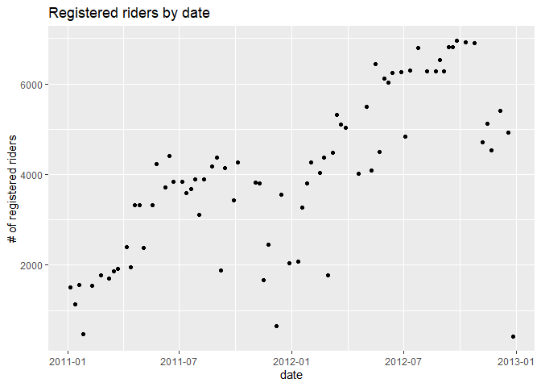
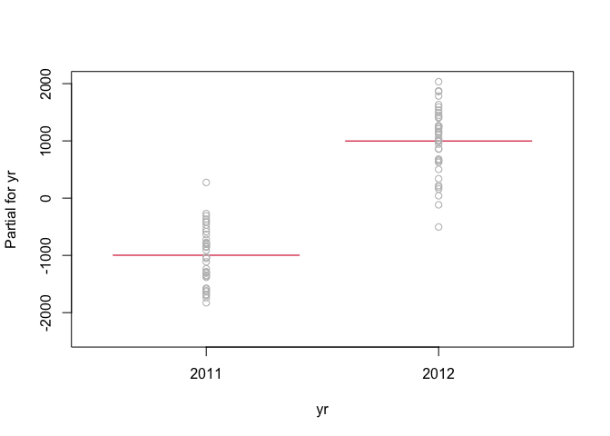

ST 558 Project 2
================
David Arthur
6/28/2021

Read in data, filter by day of week

``` r
day <- readr::read_csv("day.csv", col_types = cols(
  season = col_factor(),
  yr = col_factor(),
  mnth = col_factor(),
  holiday = col_factor(),
  weekday = col_factor(),
  workingday = col_factor(),
  weathersit = col_factor()))

day <- day %>% mutate(season = fct_recode(season, winter = "1", spring = "2", summer = "3", fall = "4")) %>%
  mutate(yr = fct_recode(yr, "2011" = "0", "2012" = "1")) %>%
  mutate(weekday = fct_recode(weekday, Sunday = "0", Monday = "1", Tuesday = "2", Wednesday = "3", Thursday = "4", Friday = "5", Saturday = "6")) %>%
  mutate(weathersit = fct_recode(weathersit, clear = "1", mist = "2", lightRainOrSnow = "3", heavyRainOrSnow = "4")) %>%
  filter(weekday == params$dayOfWeek)
```

    ## Warning: Unknown levels in `f`: 4

``` r
dayNF <- readr::read_csv("day.csv")
```

Partition data into training and test sets

``` r
set.seed(21)
trainIndex <- createDataPartition(day$cnt, p = 0.7, list = FALSE)
dayTrain <- day[trainIndex, ]
dayTest <- day[-trainIndex, ]
```

Exploratory data analysis and summary (David)

``` r
GGally::ggpairs(dayTrain %>% select(3:9, atemp, windspeed, casual, registered, cnt))
```

<!-- -->

``` r
# dayNFCor <- cor(as.matrix(dayNF %>% select(3:9, atemp, windspeed, casual, registered,cnt)))
# corrplot(dayNFCor, type = "upper", tl.pos = "lt")
# corrplot(dayNFCor, type = "lower", method = "number", add = TRUE, diag = FALSE, tl.pos = "n")
```

Exploration of individual predictors

``` r
g <- ggplot(data = dayTrain)
g + geom_point(aes(x = dteday, y = registered))
```

<!-- -->

``` r
meanByMonth <- dayTrain %>% group_by(mnth) %>%
  summarize(meanCas = mean(casual), meanReg = mean(registered), meanTotal = mean(cnt))
g2 <- ggplot(meanByMonth, aes(x = mnth))
g2 + geom_bar(aes(y = meanCas), stat = "identity")
```

<!-- -->

``` r
g2 + geom_bar(aes(y = meanReg), stat = "identity")
```

<!-- -->

``` r
g2 + geom_bar(aes(y = meanTotal), stat = "identity")
```

<!-- -->

``` r
meanByYear <- dayTrain %>% group_by(yr) %>%
  summarize(meanCas = mean(casual), meanReg = mean(registered), meanTotal = mean(cnt))
g2 <- ggplot(meanByYear, aes(x = yr))
g2 + geom_bar(aes(y = meanCas), stat = "identity")
```

<!-- -->

``` r
g2 + geom_bar(aes(y = meanReg), stat = "identity")
```

<!-- -->

``` r
g2 + geom_bar(aes(y = meanTotal), stat = "identity")
```

<!-- -->

``` r
meanByWeather <- dayTrain %>% group_by(weathersit) %>%
  summarize(meanCas = mean(casual), meanReg = mean(registered), meanTotal = mean(cnt))
kable(meanByWeather, digits = 1, col.names = c("Weather", "Mean Casual Riders", "Mean Registered Riders", "Mean Total Riders"), caption = "Average # of riders by weather category")
```

| Weather         | Mean Casual Riders | Mean Registered Riders | Mean Total Riders |
|:----------------|-------------------:|-----------------------:|------------------:|
| mist            |              408.0 |                 3218.2 |            3626.2 |
| clear           |              694.6 |                 4659.9 |            5354.4 |
| lightRainOrSnow |               71.2 |                 1021.8 |            1093.0 |

Average \# of riders by weather category

``` r
meanByHoliday <- dayTrain %>% filter(workingday == 0) %>%
  group_by(holiday) %>%
  summarize(meanCas = mean(casual), meanReg = mean(registered), meanTotal = mean(cnt))
kable(meanByHoliday, digits = 1, col.names = c("Holiday (0 = no, 1 = yes)", "Mean Casual Riders", "Mean Registered Riders", "Mean Total Riders"), caption = "Average # of riders on holidays vs. non-holiday non-workdays")
```

| Holiday (0 = no, 1 = yes) | Mean Casual Riders | Mean Registered Riders | Mean Total Riders |
|:--------------------------|-------------------:|-----------------------:|------------------:|
| 1                         |               2562 |                   4841 |              7403 |

Average \# of riders on holidays vs. non-holiday non-workdays

Exploratory data analysis and summary (James)

``` r
ggpairs(dayTrain %>% select(-instant,-dteday, -season, -yr, -cnt), 
        ggplot2::aes(colour=workingday))
```

    ## Warning: Groups with fewer than two data points have been dropped.

    ## Warning in max(ids, na.rm = TRUE): no non-missing arguments to max; returning -Inf

    ## Error in cor.test.default(x, y, method = method, use = use): not enough finite observations

<!-- --> Notes from
looking at ggpairs plots: Working days are the highest usage for
registered riders, but non-working days are the highest usage for casual
riders. Registered riders are the primary volume, so we definitely care
most about them but worth keeping in mind. There are two types of
non-working days: weekends and holidays, and there is a difference in
volume for each of those rider types depending on whether it is a
holiday or a weekend.

Air temperature and temperature are nearly 100% correlated. We should
probably figure out which one of them we want to use. Speaking of
correlated, can we drop the date and only use months? Unfortunately, it
looks like we need to keep the year field as well, since year 2 had
better performance than year 1. Do we want to keep season and month? I
lean towards keeping year and month, but dropping season and date. Let
me know what you think.

Looking at the scatter of casual vs registered, broken out by working
day, it’s crazy how separate the linear relationships look:

``` r
g <- ggplot(data=dayTrain, aes(x=registered, y=casual))
g + geom_point(aes(color=workingday))
```

<!-- --> On working
days, registered bikes are the main rider group. On non-working days, it
switches to casual. Looking at day of the week, we may be able to
exclude it since it will be covered by the working day flag and holiday
flag, but I guess we can check the models to see if it provides anything
extra.

``` r
g <- ggplot(data=dayTrain %>% 
                 select(weekday, casual, registered) %>%
                 pivot_longer(cols=c(casual, registered),
                              names_to = 'metrics',
                              values_to = 'riders') %>%
                 group_by(weekday, metrics) %>%
                 summarise(avg_riders = mean(riders)), 
            aes(x=weekday, y=avg_riders, fill=metrics))
```

    ## `summarise()` has grouped output by 'weekday'. You can override using the `.groups` argument.

``` r
g + geom_bar(stat='identity', position='dodge')
```

<!-- --> Looking at
this graph, weekday definitely seems relatively stable across the days
(working days for registered and non-working days for casual are the
jumps), but there may be enough variation to include it.

\#\#I like this graph. I thought about doing one like it, but wasn’t
sure how to code it. pivot\_longer hadn’t occurred to me.

\#\#About which variables to include, I agree with your comments. My
understanding is that each of us comes up with our own models (I do a
linear regression and a random forest, you do a linear regression and a
boosted tree), so you and I don’t need to include the same predictors.
We do need to agree ahead of time on which response we’re going to model
(casual, registered, or cnt), so that the results of the 4 models can be
compared to each other. I’m fine with any of the 3. Do you have a
preference?

Yeah, no preference here either. I guess we could just say registered
since it’s the highest volume customer, and if we were doing this
analysis for that company then registered users would be the most
important group.

\#\#Sounds good, we’ll go with registered.

``` r
library(leaps)

data <- dayTrain %>% 
               filter(weekday == params$dayOfWeek) %>% drop_na() %>%
               select(-instant,-dteday, -season, 
                    -weekday, -atemp, -casual, -cnt)

#this function converts new data to a model matrix
#so that a prediction can be run via matrix multiplication
#on a best subsets model
predict.regsubsets = function(object,newdata,id,...){
      form = as.formula(object$call[[2]]) 
      mat = model.matrix(form,newdata)    
      coefi = coef(object,id=id)          
      xvars = names(coefi)                
      mat[,xvars]%*%coefi               
}


#let's do cross validation with folds
k <- 4
set.seed(21)
folds <- sample(1:k, nrow(data), replace=T)

cv_errors = matrix(NA, k, 16, dimnames = list(NULL, paste(1:16)))

for (j in 1:k) {
  best <- regsubsets(registered ~ ., 
                     data=data[folds!=j,], nvmax=20)
  
  for (i in 1:16) {
    pred <- predict(best, data[folds==j,], id=i)
    
    
    cv_errors[j, i] <- mean((temp_data$registered[folds==j]-pred)^2)
  }
}
```

    ## Warning in leaps.setup(x, y, wt = wt, nbest = nbest, nvmax = nvmax, force.in = force.in, : 1 linear
    ## dependencies found

    ## Reordering variables and trying again:

    ## Error in eval(x): object 'newX' not found

``` r
# Take the mean of over all folds for each model size
mean_cv_errors = apply(cv_errors, 2, mean)

# Find the model size with the smallest cross-validation error
min = which.min(mean_cv_errors)

#the model w/ 14 variables was best when using 4 fold cv.
#i did 4 fold because there are only about 80 rows of data per weekday

best_full <- regsubsets(registered ~ ., 
                     data=temp_data[folds!=j,], nvmax=20)
```

    ## Error in is.data.frame(data): object 'temp_data' not found

``` r
fit <- lm(registered ~ temp*hum,
        data=dayTrain %>% 
             filter(weekday == params$dayOfWeek) %>% drop_na() %>%
             select(-instant,-dteday, -season, 
                    -weekday, -atemp, -casual, -cnt))
```

``` r
names(dayTrain)
```

    ##  [1] "instant"    "dteday"     "season"     "yr"         "mnth"       "holiday"    "weekday"   
    ##  [8] "workingday" "weathersit" "temp"       "atemp"      "hum"        "windspeed"  "casual"    
    ## [15] "registered" "cnt"

``` r
# GGally::ggpairs(dayTrain %>% select(3:9, atemp, windspeed, casual, registered, cnt))
dayNFCor <- cor(as.matrix(dayNF %>% select(3:13, registered)))
corrplot(dayNFCor, type = "upper", tl.pos = "lt")
corrplot(dayNFCor, type = "lower", method = "number", add = TRUE, diag = FALSE, tl.pos = "n")
```

<!-- -->

``` r
mlrFull <- lm(registered ~ dteday + season +  yr + mnth + holiday + workingday + weathersit + temp + atemp + hum + windspeed, dayTrain)
summary(mlrFull)
```

    ## 
    ## Call:
    ## lm(formula = registered ~ dteday + season + yr + mnth + holiday + 
    ##     workingday + weathersit + temp + atemp + hum + windspeed, 
    ##     data = dayTrain)
    ## 
    ## Residuals:
    ##      Min       1Q   Median       3Q      Max 
    ## -1164.22  -351.85    38.45   302.57  1095.89 
    ## 
    ## Coefficients: (1 not defined because of singularities)
    ##                             Estimate Std. Error t value Pr(>|t|)   
    ## (Intercept)               -84638.937 124987.989  -0.677  0.50130   
    ## dteday                         5.767      8.338   0.692  0.49223   
    ## seasonspring                 662.967    392.816   1.688  0.09745 . 
    ## seasonsummer                 801.246    497.639   1.610  0.11343   
    ## seasonfall                  1384.010    450.200   3.074  0.00336 **
    ## yr2012                      -191.817   3066.214  -0.063  0.95036   
    ## mnth2                       -319.093    445.755  -0.716  0.47729   
    ## mnth3                        259.143    615.683   0.421  0.67556   
    ## mnth4                       -320.876    927.264  -0.346  0.73070   
    ## mnth5                        141.635   1100.125   0.129  0.89806   
    ## mnth6                       -154.994   1344.634  -0.115  0.90868   
    ## mnth7                       -634.990   1601.266  -0.397  0.69332   
    ## mnth8                       -512.902   1839.950  -0.279  0.78154   
    ## mnth9                       -360.293   2052.533  -0.176  0.86134   
    ## mnth10                      -609.114   2304.946  -0.264  0.79262   
    ## mnth11                     -1704.023   2559.082  -0.666  0.50844   
    ## mnth12                     -2043.775   2822.966  -0.724  0.47232   
    ## holiday1                   -1276.251    627.175  -2.035  0.04697 * 
    ## workingday1                       NA         NA      NA       NA   
    ## weathersitclear              580.749    209.545   2.771  0.00772 **
    ## weathersitlightRainOrSnow  -1131.917    371.597  -3.046  0.00364 **
    ## temp                        -783.701   6228.503  -0.126  0.90036   
    ## atemp                       3229.461   6877.928   0.470  0.64065   
    ## hum                        -1630.664    843.564  -1.933  0.05868 . 
    ## windspeed                  -1502.885   1023.793  -1.468  0.14814   
    ## ---
    ## Signif. codes:  0 '***' 0.001 '**' 0.01 '*' 0.05 '.' 0.1 ' ' 1
    ## 
    ## Residual standard error: 561.8 on 52 degrees of freedom
    ## Multiple R-squared:  0.9297, Adjusted R-squared:  0.8986 
    ## F-statistic: 29.91 on 23 and 52 DF,  p-value: < 2.2e-16

``` r
AIC(mlrFull)
```

    ## [1] 1199.181

``` r
x <- model.matrix(mlrFull)[, -1]
e <- eigen(t(x) %*% x)
e$val
```

    ##  [1] 1.787543e+10 3.109057e+01 2.409083e+01 2.116214e+01 1.423841e+01 1.054856e+01 7.212744e+00
    ##  [8] 7.130395e+00 6.919220e+00 6.505255e+00 5.735549e+00 5.378920e+00 3.999517e+00 2.992975e+00
    ## [15] 2.283308e+00 1.619750e+00 1.095404e+00 8.286893e-01 6.164291e-01 3.917010e-01 3.046802e-01
    ## [22] 1.295489e-01 4.010196e-03 1.009668e-05

``` r
sqrt(e$val[1]/min(e$val))
```

    ## [1] 42076439

``` r
vif(x)
```

    ##                    dteday              seasonspring              seasonsummer                seasonfall 
    ##                736.507756                  7.203824                 11.922799                  8.110527 
    ##                    yr2012                     mnth2                     mnth3                     mnth4 
    ##                565.899966                  3.478641                  7.631834                 12.723388 
    ##                     mnth5                     mnth6                     mnth7                     mnth8 
    ##                 27.444222                 31.653733                 51.622796                 68.159592 
    ##                     mnth9                    mnth10                    mnth11                    mnth12 
    ##                 84.819392                 48.499030                131.850870                139.517328 
    ##                  holiday1               workingday1           weathersitclear weathersitlightRainOrSnow 
    ##                       Inf                       Inf                  2.421480                  2.043343 
    ##                      temp                     atemp                       hum                 windspeed 
    ##                291.447948                282.065980                  3.307968                  1.622238

``` r
#remove dteday (high collinearity, low p-value)
mlr2 <- update(mlrFull, . ~ . - dteday)
summary(mlr2)
```

    ## 
    ## Call:
    ## lm(formula = registered ~ season + yr + mnth + holiday + workingday + 
    ##     weathersit + temp + atemp + hum + windspeed, data = dayTrain)
    ## 
    ## Residuals:
    ##      Min       1Q   Median       3Q      Max 
    ## -1107.01  -323.25    51.74   320.34  1153.14 
    ## 
    ## Coefficients: (1 not defined because of singularities)
    ##                           Estimate Std. Error t value Pr(>|t|)    
    ## (Intercept)                1808.54     705.65   2.563  0.01325 *  
    ## seasonspring                674.26     390.54   1.726  0.09009 .  
    ## seasonsummer                811.23     494.98   1.639  0.10715    
    ## seasonfall                 1392.96     447.79   3.111  0.00300 ** 
    ## yr2012                     1926.64     142.41  13.529  < 2e-16 ***
    ## mnth2                      -128.17     348.28  -0.368  0.71433    
    ## mnth3                       592.14     381.87   1.551  0.12695    
    ## mnth4                       189.36     559.03   0.339  0.73616    
    ## mnth5                       793.41     564.89   1.405  0.16599    
    ## mnth6                       674.68     604.57   1.116  0.26947    
    ## mnth7                       359.44     701.44   0.512  0.61047    
    ## mnth8                       668.98     678.92   0.985  0.32892    
    ## mnth9                       999.84     585.18   1.709  0.09338 .  
    ## mnth10                      929.58     600.14   1.549  0.12735    
    ## mnth11                       28.94     518.27   0.056  0.95568    
    ## mnth12                     -114.68     433.83  -0.264  0.79255    
    ## holiday1                  -1353.96     613.98  -2.205  0.03180 *  
    ## workingday1                     NA         NA      NA       NA    
    ## weathersitclear             581.00     208.51   2.786  0.00738 ** 
    ## weathersitlightRainOrSnow -1150.43     368.80  -3.119  0.00293 ** 
    ## temp                        495.49    5918.24   0.084  0.93359    
    ## atemp                      1891.93    6567.91   0.288  0.77443    
    ## hum                       -1591.38     837.50  -1.900  0.06286 .  
    ## windspeed                 -1564.27    1014.91  -1.541  0.12919    
    ## ---
    ## Signif. codes:  0 '***' 0.001 '**' 0.01 '*' 0.05 '.' 0.1 ' ' 1
    ## 
    ## Residual standard error: 559.1 on 53 degrees of freedom
    ## Multiple R-squared:  0.9291, Adjusted R-squared:  0.8996 
    ## F-statistic: 31.56 on 22 and 53 DF,  p-value: < 2.2e-16

``` r
AIC(mlr2)
```

    ## [1] 1197.877

``` r
x <- model.matrix(mlr2)[, -1]
e <- eigen(t(x) %*% x)
e$val
```

    ##  [1] 2.250378e+02 2.943167e+01 2.372587e+01 1.934650e+01 1.405701e+01 9.355882e+00 7.210105e+00
    ##  [8] 7.019233e+00 6.878978e+00 6.487295e+00 5.705382e+00 5.378364e+00 3.998136e+00 2.971285e+00
    ## [15] 2.111709e+00 1.127266e+00 1.081393e+00 7.521691e-01 4.871330e-01 3.876317e-01 1.671339e-01
    ## [22] 1.287360e-01 4.008814e-03

``` r
sqrt(e$val[1]/min(e$val))
```

    ## [1] 236.9299

``` r
vif(x)
```

    ##              seasonspring              seasonsummer                seasonfall                    yr2012 
    ##                  7.191376                 11.912761                  8.103822                  1.232830 
    ##                     mnth2                     mnth3                     mnth4                     mnth5 
    ##                  2.144678                  2.965181                  4.670548                  7.307863 
    ##                     mnth6                     mnth7                     mnth8                     mnth9 
    ##                  6.462582                 10.004411                  9.372261                  6.962939 
    ##                    mnth10                    mnth11                    mnth12                  holiday1 
    ##                  3.320576                  5.461667                  3.327712                       Inf 
    ##               workingday1           weathersitclear weathersitlightRainOrSnow                      temp 
    ##                       Inf                  2.421473                  2.032745                265.750860 
    ##                     atemp                       hum                 windspeed 
    ##                259.768117                  3.292972                  1.610046

``` r
#reduced AIC and condition number

#remove temp (high collinearity, low p-value)
mlr3 <- update(mlr2, . ~ . - temp)
summary(mlr3)
```

    ## 
    ## Call:
    ## lm(formula = registered ~ season + yr + mnth + holiday + workingday + 
    ##     weathersit + atemp + hum + windspeed, data = dayTrain)
    ## 
    ## Residuals:
    ##      Min       1Q   Median       3Q      Max 
    ## -1103.46  -319.98    48.85   325.36  1151.78 
    ## 
    ## Coefficients: (1 not defined because of singularities)
    ##                           Estimate Std. Error t value Pr(>|t|)    
    ## (Intercept)                 1808.7      699.1   2.587  0.01241 *  
    ## seasonspring                 669.7      383.1   1.748  0.08614 .  
    ## seasonsummer                 802.2      478.5   1.676  0.09945 .  
    ## seasonfall                  1387.5      438.9   3.162  0.00257 ** 
    ## yr2012                      1926.4      141.1  13.656  < 2e-16 ***
    ## mnth2                       -135.7      333.4  -0.407  0.68568    
    ## mnth3                        592.7      378.3   1.567  0.12301    
    ## mnth4                        189.6      553.9   0.342  0.73342    
    ## mnth5                        802.0      550.4   1.457  0.15086    
    ## mnth6                        682.4      592.0   1.153  0.25410    
    ## mnth7                        377.6      661.1   0.571  0.57027    
    ## mnth8                        686.0      641.9   1.069  0.28997    
    ## mnth9                       1012.3      560.8   1.805  0.07662 .  
    ## mnth10                       933.5      592.8   1.575  0.12113    
    ## mnth11                        30.0      513.3   0.058  0.95361    
    ## mnth12                      -116.5      429.2  -0.272  0.78702    
    ## holiday1                   -1356.2      607.7  -2.232  0.02981 *  
    ## workingday1                     NA         NA      NA       NA    
    ## weathersitclear              577.6      202.6   2.851  0.00615 ** 
    ## weathersitlightRainOrSnow  -1139.6      342.2  -3.330  0.00157 ** 
    ## atemp                       2433.7     1111.2   2.190  0.03285 *  
    ## hum                        -1615.5      778.9  -2.074  0.04285 *  
    ## windspeed                  -1534.7      942.5  -1.628  0.10929    
    ## ---
    ## Signif. codes:  0 '***' 0.001 '**' 0.01 '*' 0.05 '.' 0.1 ' ' 1
    ## 
    ## Residual standard error: 553.9 on 54 degrees of freedom
    ## Multiple R-squared:  0.9291, Adjusted R-squared:  0.9015 
    ## F-statistic: 33.68 on 21 and 54 DF,  p-value: < 2.2e-16

``` r
AIC(mlr3)
```

    ## [1] 1195.887

``` r
x <- model.matrix(mlr3)[, -1]
e <- eigen(t(x) %*% x)
e$val
```

    ##  [1] 204.3825859  29.3143211  23.3311330  19.0400423  14.0373343   9.1425108   7.2100823   7.0137747
    ##  [9]   6.8672556   6.4836088   5.7044158   5.3749398   3.8429403   2.9660501   2.0379329   1.1149052
    ## [17]   1.0755604   0.6934930   0.4871329   0.2755010   0.1628818   0.1168294

``` r
sqrt(e$val[1]/min(e$val))
```

    ## [1] 41.82595

``` r
vif(x)
```

    ##              seasonspring              seasonsummer                seasonfall                    yr2012 
    ##                  7.049154                 11.342460                  7.929148                  1.232436 
    ##                     mnth2                     mnth3                     mnth4                     mnth5 
    ##                  2.002565                  2.964269                  4.670407                  7.067218 
    ##                     mnth6                     mnth7                     mnth8                     mnth9 
    ##                  6.312332                  9.052339                  8.534924                  6.513631 
    ##                    mnth10                    mnth11                    mnth12                  holiday1 
    ##                  3.300170                  5.458393                  3.318819                       Inf 
    ##               workingday1           weathersitclear weathersitlightRainOrSnow                     atemp 
    ##                       Inf                  2.328005                  1.782513                  7.574772 
    ##                       hum                 windspeed 
    ##                  2.901766                  1.414603

``` r
#reduced AIC and condition number

#remove workingday (high collinearity, low p-value)
mlr4 <- update(mlr3, . ~ . - workingday)
summary(mlr4)
```

    ## 
    ## Call:
    ## lm(formula = registered ~ season + yr + mnth + holiday + weathersit + 
    ##     atemp + hum + windspeed, data = dayTrain)
    ## 
    ## Residuals:
    ##      Min       1Q   Median       3Q      Max 
    ## -1103.46  -319.98    48.85   325.36  1151.78 
    ## 
    ## Coefficients:
    ##                           Estimate Std. Error t value Pr(>|t|)    
    ## (Intercept)                 1808.7      699.1   2.587  0.01241 *  
    ## seasonspring                 669.7      383.1   1.748  0.08614 .  
    ## seasonsummer                 802.2      478.5   1.676  0.09945 .  
    ## seasonfall                  1387.5      438.9   3.162  0.00257 ** 
    ## yr2012                      1926.4      141.1  13.656  < 2e-16 ***
    ## mnth2                       -135.7      333.4  -0.407  0.68568    
    ## mnth3                        592.7      378.3   1.567  0.12301    
    ## mnth4                        189.6      553.9   0.342  0.73342    
    ## mnth5                        802.0      550.4   1.457  0.15086    
    ## mnth6                        682.4      592.0   1.153  0.25410    
    ## mnth7                        377.6      661.1   0.571  0.57027    
    ## mnth8                        686.0      641.9   1.069  0.28997    
    ## mnth9                       1012.3      560.8   1.805  0.07662 .  
    ## mnth10                       933.5      592.8   1.575  0.12113    
    ## mnth11                        30.0      513.3   0.058  0.95361    
    ## mnth12                      -116.5      429.2  -0.272  0.78702    
    ## holiday1                   -1356.2      607.7  -2.232  0.02981 *  
    ## weathersitclear              577.6      202.6   2.851  0.00615 ** 
    ## weathersitlightRainOrSnow  -1139.6      342.2  -3.330  0.00157 ** 
    ## atemp                       2433.7     1111.2   2.190  0.03285 *  
    ## hum                        -1615.5      778.9  -2.074  0.04285 *  
    ## windspeed                  -1534.7      942.5  -1.628  0.10929    
    ## ---
    ## Signif. codes:  0 '***' 0.001 '**' 0.01 '*' 0.05 '.' 0.1 ' ' 1
    ## 
    ## Residual standard error: 553.9 on 54 degrees of freedom
    ## Multiple R-squared:  0.9291, Adjusted R-squared:  0.9015 
    ## F-statistic: 33.68 on 21 and 54 DF,  p-value: < 2.2e-16

``` r
AIC(mlr4)
```

    ## [1] 1195.887

``` r
x <- model.matrix(mlr4)[, -1]
e <- eigen(t(x) %*% x)
e$val
```

    ##  [1] 134.5288122  28.4966357  23.2317217  17.2136033  13.9417185   8.1060037   7.1450719   7.0038103
    ##  [9]   6.7876118   6.3576275   5.7038468   5.3650334   3.8345859   2.9462137   1.5418781   1.1082764
    ## [17]   0.8180466   0.6930556   0.4599315   0.2746849   0.1170620

``` r
sqrt(e$val[1]/min(e$val))
```

    ## [1] 33.9

``` r
vif(x)
```

    ##              seasonspring              seasonsummer                seasonfall                    yr2012 
    ##                  7.049154                 11.342460                  7.929148                  1.232436 
    ##                     mnth2                     mnth3                     mnth4                     mnth5 
    ##                  2.002565                  2.964269                  4.670407                  7.067218 
    ##                     mnth6                     mnth7                     mnth8                     mnth9 
    ##                  6.312332                  9.052339                  8.534924                  6.513631 
    ##                    mnth10                    mnth11                    mnth12                  holiday1 
    ##                  3.300170                  5.458393                  3.318819                  1.187921 
    ##           weathersitclear weathersitlightRainOrSnow                     atemp                       hum 
    ##                  2.328005                  1.782513                  7.574772                  2.901766 
    ##                 windspeed 
    ##                  1.414603

``` r
#reduced AIC and condition number

#remove season (high collinearity, low p-value)
mlr5 <- update(mlr4, . ~ . - season)
summary(mlr5)
```

    ## 
    ## Call:
    ## lm(formula = registered ~ yr + mnth + holiday + weathersit + 
    ##     atemp + hum + windspeed, data = dayTrain)
    ## 
    ## Residuals:
    ##      Min       1Q   Median       3Q      Max 
    ## -1470.75  -335.66    11.09   298.06  1332.11 
    ## 
    ## Coefficients:
    ##                           Estimate Std. Error t value Pr(>|t|)    
    ## (Intercept)                 1660.6      744.7   2.230 0.029706 *  
    ## yr2012                      1917.9      150.1  12.774  < 2e-16 ***
    ## mnth2                       -230.1      354.3  -0.650 0.518575    
    ## mnth3                        680.3      371.1   1.833 0.072012 .  
    ## mnth4                        603.9      447.0   1.351 0.182020    
    ## mnth5                       1131.3      455.8   2.482 0.016048 *  
    ## mnth6                       1055.6      541.9   1.948 0.056333 .  
    ## mnth7                        779.9      587.6   1.327 0.189692    
    ## mnth8                       1091.8      559.1   1.953 0.055773 .  
    ## mnth9                       1668.7      486.6   3.429 0.001132 ** 
    ## mnth10                      2058.7      507.3   4.058 0.000152 ***
    ## mnth11                      1291.6      345.1   3.742 0.000426 ***
    ## mnth12                       768.5      349.2   2.201 0.031802 *  
    ## holiday1                   -1390.0      648.7  -2.143 0.036403 *  
    ## weathersitclear              494.0      214.3   2.305 0.024836 *  
    ## weathersitlightRainOrSnow  -1372.3      354.3  -3.874 0.000279 ***
    ## atemp                       3325.1     1135.6   2.928 0.004893 ** 
    ## hum                        -1529.5      826.0  -1.852 0.069253 .  
    ## windspeed                  -1722.5     1002.8  -1.718 0.091289 .  
    ## ---
    ## Signif. codes:  0 '***' 0.001 '**' 0.01 '*' 0.05 '.' 0.1 ' ' 1
    ## 
    ## Residual standard error: 591.4 on 57 degrees of freedom
    ## Multiple R-squared:  0.9146, Adjusted R-squared:  0.8877 
    ## F-statistic: 33.93 on 18 and 57 DF,  p-value: < 2.2e-16

``` r
AIC(mlr5)
```

    ## [1] 1203.957

``` r
#don't remove season because AIC increased

#remove month (high collinearity, low p-value)
mlr6 <- update(mlr4, . ~ . - mnth)
summary(mlr6)
```

    ## 
    ## Call:
    ## lm(formula = registered ~ season + yr + holiday + weathersit + 
    ##     atemp + hum + windspeed, data = dayTrain)
    ## 
    ## Residuals:
    ##      Min       1Q   Median       3Q      Max 
    ## -1501.45  -353.96    71.14   404.77  1271.24 
    ## 
    ## Coefficients:
    ##                           Estimate Std. Error t value Pr(>|t|)    
    ## (Intercept)                 1093.6      654.9   1.670 0.099726 .  
    ## seasonspring                 833.5      266.4   3.129 0.002628 ** 
    ## seasonsummer                 928.4      337.2   2.753 0.007650 ** 
    ## seasonfall                  1403.4      224.9   6.241 3.71e-08 ***
    ## yr2012                      1994.4      141.3  14.119  < 2e-16 ***
    ## holiday1                   -1773.3      607.2  -2.920 0.004802 ** 
    ## weathersitclear              586.8      199.9   2.936 0.004598 ** 
    ## weathersitlightRainOrSnow  -1291.6      333.8  -3.869 0.000256 ***
    ## atemp                       3828.5      850.4   4.502 2.86e-05 ***
    ## hum                        -1111.2      752.6  -1.477 0.144614    
    ## windspeed                  -1437.3      939.3  -1.530 0.130815    
    ## ---
    ## Signif. codes:  0 '***' 0.001 '**' 0.01 '*' 0.05 '.' 0.1 ' ' 1
    ## 
    ## Residual standard error: 584.5 on 65 degrees of freedom
    ## Multiple R-squared:  0.9049, Adjusted R-squared:  0.8903 
    ## F-statistic: 61.87 on 10 and 65 DF,  p-value: < 2.2e-16

``` r
AIC(mlr6)
```

    ## [1] 1196.15

``` r
x <- model.matrix(mlr6)[, -1]
e <- eigen(t(x) %*% x)
e$val
```

    ##  [1] 128.6883971  22.9704414  17.9635511  15.9261091  12.4077091   4.4520762   2.4201836   0.9375150
    ##  [9]   0.5386103   0.3706386

``` r
sqrt(e$val[1]/min(e$val))
```

    ## [1] 18.6335

``` r
vif(x)
```

    ##              seasonspring              seasonsummer                seasonfall                    yr2012 
    ##                  3.061225                  5.059037                  1.869560                  1.109748 
    ##                  holiday1           weathersitclear weathersitlightRainOrSnow                     atemp 
    ##                  1.065094                  2.035596                  1.523567                  3.984065 
    ##                       hum                 windspeed 
    ##                  2.432646                  1.261687

``` r
#reduced AIC and condition number

#remove year from full model instead of dteday (high collinearity)
mlr7 <- update(mlrFull, . ~ . - yr - workingday - temp, dayTrain)
summary(mlr7)
```

    ## 
    ## Call:
    ## lm(formula = registered ~ dteday + season + mnth + holiday + 
    ##     weathersit + atemp + hum + windspeed, data = dayTrain)
    ## 
    ## Residuals:
    ##      Min       1Q   Median       3Q      Max 
    ## -1163.95  -354.46    40.84   299.16  1102.92 
    ## 
    ## Coefficients:
    ##                             Estimate Std. Error t value Pr(>|t|)    
    ## (Intercept)               -76831.113   5890.036 -13.044  < 2e-16 ***
    ## dteday                         5.246      0.382  13.735  < 2e-16 ***
    ## seasonspring                 670.161    381.369   1.757 0.084543 .  
    ## seasonsummer                 814.381    476.388   1.709 0.093102 .  
    ## seasonfall                  1392.263    436.898   3.187 0.002393 ** 
    ## mnth2                       -291.727    332.134  -0.878 0.383650    
    ## mnth3                        288.491    376.034   0.767 0.446308    
    ## mnth4                       -275.007    546.302  -0.503 0.616732    
    ## mnth5                        188.986    546.423   0.346 0.730792    
    ## mnth6                        -90.336    582.723  -0.155 0.877380    
    ## mnth7                       -569.457    650.206  -0.876 0.385013    
    ## mnth8                       -428.944    632.773  -0.678 0.500742    
    ## mnth9                       -254.180    560.185  -0.454 0.651833    
    ## mnth10                      -475.433    597.138  -0.796 0.429411    
    ## mnth11                     -1548.927    523.399  -2.959 0.004570 ** 
    ## mnth12                     -1867.013    448.350  -4.164 0.000113 ***
    ## holiday1                   -1280.299    604.331  -2.119 0.038746 *  
    ## weathersitclear              585.400    201.660   2.903 0.005344 ** 
    ## weathersitlightRainOrSnow  -1148.191    340.629  -3.371 0.001390 ** 
    ## atemp                       2377.765   1106.933   2.148 0.036212 *  
    ## hum                        -1594.304    775.721  -2.055 0.044705 *  
    ## windspeed                  -1548.337    938.299  -1.650 0.104717    
    ## ---
    ## Signif. codes:  0 '***' 0.001 '**' 0.01 '*' 0.05 '.' 0.1 ' ' 1
    ## 
    ## Residual standard error: 551.4 on 54 degrees of freedom
    ## Multiple R-squared:  0.9297, Adjusted R-squared:  0.9024 
    ## F-statistic: 34.01 on 21 and 54 DF,  p-value: < 2.2e-16

``` r
AIC(mlr7)
```

    ## [1] 1195.205

``` r
x <- model.matrix(mlr7)[, -1]
e <- eigen(t(x) %*% x)
e$val
```

    ##  [1] 1.787543e+10 3.027999e+01 2.353534e+01 1.621258e+01 1.004751e+01 7.216778e+00 7.021890e+00
    ##  [8] 6.928637e+00 6.629803e+00 6.033819e+00 5.383610e+00 3.867112e+00 3.020652e+00 2.134366e+00
    ## [15] 1.122165e+00 8.492773e-01 7.428315e-01 6.265243e-01 3.123472e-01 2.747860e-01 1.204790e-01

``` r
sqrt(e$val[1]/min(e$val))
```

    ## [1] 385187.8

``` r
vif(x)
```

    ##                    dteday              seasonspring              seasonsummer                seasonfall 
    ##                  1.604486                  7.049036                 11.342886                  7.929609 
    ##                     mnth2                     mnth3                     mnth4                     mnth5 
    ##                  2.004915                  2.955429                  4.584725                  7.028733 
    ##                     mnth6                     mnth7                     mnth8                     mnth9 
    ##                  6.171535                  8.836260                  8.368793                  6.558896 
    ##                    mnth10                    mnth11                    mnth12                  holiday1 
    ##                  3.379200                  5.725753                  3.653461                  1.185306 
    ##           weathersitclear weathersitlightRainOrSnow                     atemp                       hum 
    ##                  2.328197                  1.782426                  7.584562                  2.903951 
    ##                 windspeed 
    ##                  1.414571

``` r
#higher AIC than mlr4

#compare to model chosen by leaps::step() function
mlrStep <- step(mlrFull)
```

    ## Start:  AIC=981.5
    ## registered ~ dteday + season + yr + mnth + holiday + workingday + 
    ##     weathersit + temp + atemp + hum + windspeed
    ## 
    ## 
    ## Step:  AIC=981.5
    ## registered ~ dteday + season + yr + mnth + holiday + weathersit + 
    ##     temp + atemp + hum + windspeed
    ## 
    ##              Df Sum of Sq      RSS    AIC
    ## - yr          1      1235 16415527 979.51
    ## - temp        1      4997 16419290 979.53
    ## - atemp       1     69593 16483885 979.82
    ## - dteday      1    151008 16565300 980.20
    ## - mnth       11   5479357 21893649 981.39
    ## <none>                    16414292 981.50
    ## - windspeed   1    680214 17094506 982.59
    ## - hum         1   1179538 17593830 984.78
    ## - holiday     1   1307114 17721407 985.33
    ## - season      3   3281324 19695617 989.35
    ## - weathersit  2   5393640 21807933 999.10
    ## 
    ## Step:  AIC=979.51
    ## registered ~ dteday + season + mnth + holiday + weathersit + 
    ##     temp + atemp + hum + windspeed
    ## 
    ##              Df Sum of Sq      RSS     AIC
    ## - temp        1      3981 16419508  977.53
    ## - atemp       1     70056 16485583  977.83
    ## <none>                    16415527  979.51
    ## - windspeed   1    690387 17105914  980.64
    ## - hum         1   1180680 17596207  982.79
    ## - holiday     1   1368606 17784133  983.59
    ## - season      3   3289943 19705470  987.39
    ## - mnth       11  10882237 27297764  996.16
    ## - weathersit  2   5418941 21834469  997.19
    ## - dteday      1  57357181 73772709 1091.72
    ## 
    ## Step:  AIC=977.53
    ## registered ~ dteday + season + mnth + holiday + weathersit + 
    ##     atemp + hum + windspeed
    ## 
    ##              Df Sum of Sq      RSS     AIC
    ## <none>                    16419508  977.53
    ## - windspeed   1    827971 17247480  979.27
    ## - hum         1   1284390 17703898  981.25
    ## - holiday     1   1364708 17784217  981.59
    ## - atemp       1   1403013 17822521  981.76
    ## - season      3   3377892 19797400  985.74
    ## - mnth       11  11014269 27433777  994.54
    ## - weathersit  2   6558955 22978463  999.07
    ## - dteday      1  57361027 73780536 1089.73

``` r
names(mlrStep)
```

    ##  [1] "coefficients"  "residuals"     "effects"       "rank"          "fitted.values" "assign"       
    ##  [7] "qr"            "df.residual"   "contrasts"     "xlevels"       "call"          "terms"        
    ## [13] "model"         "anova"

``` r
mlrStep$call
```

    ## lm(formula = registered ~ dteday + season + mnth + holiday + 
    ##     weathersit + atemp + hum + windspeed, data = dayTrain)

``` r
mlr6$call
```

    ## lm(formula = registered ~ season + yr + holiday + weathersit + 
    ##     atemp + hum + windspeed, data = dayTrain)

``` r
AIC(mlr6, mlrStep)
```

    ##         df      AIC
    ## mlr6    12 1196.150
    ## mlrStep 23 1195.205

``` r
#my choice agrees with step() choice

#diagnostics plot
plot(mlr6$fitted, mlr6$residuals)
```

<!-- -->

``` r
#indication of mild nonconstant variance
MASS::boxcox(mlr6)
```

<!-- -->

``` r
#Box-Cox lambda close to 1, so no need for transformation of response

#look for nonlinearity with partial residuals plots
termplot(mlr6, partial.resid = TRUE)
```

<!-- --><!-- --><!-- --><!-- --><!-- --><!-- --><!-- -->

``` r
#atemp, hum, and windspeed look somewhat nonlinear, so try quadratic terms for them
mlr8 <- update(mlr6, . ~ . + I(atemp^2))
summary(mlr8)
```

    ## 
    ## Call:
    ## lm(formula = registered ~ season + yr + holiday + weathersit + 
    ##     atemp + hum + windspeed + I(atemp^2), data = dayTrain)
    ## 
    ## Residuals:
    ##      Min       1Q   Median       3Q      Max 
    ## -1534.86  -366.37    94.45   386.27  1347.95 
    ## 
    ## Coefficients:
    ##                           Estimate Std. Error t value Pr(>|t|)    
    ## (Intercept)                  681.2      852.1   0.799 0.427007    
    ## seasonspring                 787.4      274.1   2.873 0.005514 ** 
    ## seasonsummer                 951.3      339.7   2.801 0.006739 ** 
    ## seasonfall                  1345.7      238.0   5.654 3.92e-07 ***
    ## yr2012                      1964.3      147.2  13.347  < 2e-16 ***
    ## holiday1                   -1662.7      626.4  -2.655 0.010008 *  
    ## weathersitclear              578.8      200.8   2.882 0.005369 ** 
    ## weathersitlightRainOrSnow  -1282.5      335.1  -3.827 0.000297 ***
    ## atemp                       6346.2     3420.7   1.855 0.068171 .  
    ## hum                        -1190.7      762.2  -1.562 0.123184    
    ## windspeed                  -1446.6      942.4  -1.535 0.129715    
    ## I(atemp^2)                 -2764.6     3637.4  -0.760 0.450024    
    ## ---
    ## Signif. codes:  0 '***' 0.001 '**' 0.01 '*' 0.05 '.' 0.1 ' ' 1
    ## 
    ## Residual standard error: 586.4 on 64 degrees of freedom
    ## Multiple R-squared:  0.9058, Adjusted R-squared:  0.8896 
    ## F-statistic: 55.93 on 11 and 64 DF,  p-value: < 2.2e-16

``` r
AIC(mlr8)
```

    ## [1] 1197.468

``` r
#improved AIC, so keep atemp^2 in model

mlr9 <- update(mlr8, . ~ . + I(hum^2))
summary(mlr9)
```

    ## 
    ## Call:
    ## lm(formula = registered ~ season + yr + holiday + weathersit + 
    ##     atemp + hum + windspeed + I(atemp^2) + I(hum^2), data = dayTrain)
    ## 
    ## Residuals:
    ##      Min       1Q   Median       3Q      Max 
    ## -1449.55  -382.79    38.98   354.96  1217.44 
    ## 
    ## Coefficients:
    ##                           Estimate Std. Error t value Pr(>|t|)    
    ## (Intercept)                -2017.9     1819.3  -1.109  0.27158    
    ## seasonspring                 770.3      270.5   2.848  0.00594 ** 
    ## seasonsummer                 953.6      335.0   2.847  0.00596 ** 
    ## seasonfall                  1304.7      236.0   5.528 6.62e-07 ***
    ## yr2012                      1901.1      150.0  12.676  < 2e-16 ***
    ## holiday1                   -1622.6      618.2  -2.625  0.01087 *  
    ## weathersitclear              491.6      204.8   2.401  0.01933 *  
    ## weathersitlightRainOrSnow   -885.9      406.8  -2.178  0.03317 *  
    ## atemp                       7755.0     3477.2   2.230  0.02930 *  
    ## hum                         7234.2     5092.4   1.421  0.16037    
    ## windspeed                  -1315.0      932.8  -1.410  0.16354    
    ## I(atemp^2)                 -4242.0     3694.5  -1.148  0.25523    
    ## I(hum^2)                   -6852.7     4096.7  -1.673  0.09934 .  
    ## ---
    ## Signif. codes:  0 '***' 0.001 '**' 0.01 '*' 0.05 '.' 0.1 ' ' 1
    ## 
    ## Residual standard error: 578.3 on 63 degrees of freedom
    ## Multiple R-squared:  0.9098, Adjusted R-squared:  0.8926 
    ## F-statistic: 52.94 on 12 and 63 DF,  p-value: < 2.2e-16

``` r
AIC(mlr9)
```

    ## [1] 1196.165

``` r
#improved AIC, so keep hum^2 in model

mlr10 <- update(mlr9, . ~ . + I(windspeed^2))
summary(mlr10)
```

    ## 
    ## Call:
    ## lm(formula = registered ~ season + yr + holiday + weathersit + 
    ##     atemp + hum + windspeed + I(atemp^2) + I(hum^2) + I(windspeed^2), 
    ##     data = dayTrain)
    ## 
    ## Residuals:
    ##      Min       1Q   Median       3Q      Max 
    ## -1434.79  -373.05    46.55   352.52  1219.18 
    ## 
    ## Coefficients:
    ##                           Estimate Std. Error t value Pr(>|t|)    
    ## (Intercept)                -1881.4     1886.6  -0.997  0.32252    
    ## seasonspring                 765.9      272.8   2.807  0.00667 ** 
    ## seasonsummer                 950.0      337.7   2.813  0.00656 ** 
    ## seasonfall                  1296.8      239.1   5.422 1.03e-06 ***
    ## yr2012                      1896.6      151.8  12.496  < 2e-16 ***
    ## holiday1                   -1622.1      622.7  -2.605  0.01149 *  
    ## weathersitclear              489.4      206.4   2.371  0.02087 *  
    ## weathersitlightRainOrSnow   -895.6      411.0  -2.179  0.03313 *  
    ## atemp                       7746.3     3502.6   2.212  0.03069 *  
    ## hum                         7136.3     5139.5   1.389  0.16995    
    ## windspeed                  -2501.3     4003.9  -0.625  0.53446    
    ## I(atemp^2)                 -4209.6     3722.9  -1.131  0.26253    
    ## I(hum^2)                   -6771.2     4135.2  -1.637  0.10660    
    ## I(windspeed^2)              2827.6     9277.2   0.305  0.76155    
    ## ---
    ## Signif. codes:  0 '***' 0.001 '**' 0.01 '*' 0.05 '.' 0.1 ' ' 1
    ## 
    ## Residual standard error: 582.5 on 62 degrees of freedom
    ## Multiple R-squared:  0.9099, Adjusted R-squared:  0.891 
    ## F-statistic: 48.18 on 13 and 62 DF,  p-value: < 2.2e-16

``` r
AIC(mlr10)
```

    ## [1] 1198.051

``` r
#slightly improved AIC, compare using cross validation

#interaction of weather vars w/ holiday seems possible, so try adding to model
mlr11 <- update(mlr9, . ~ . + weathersit:holiday)
summary(mlr11)
```

    ## 
    ## Call:
    ## lm(formula = registered ~ season + yr + holiday + weathersit + 
    ##     atemp + hum + windspeed + I(atemp^2) + I(hum^2) + holiday:weathersit, 
    ##     data = dayTrain)
    ## 
    ## Residuals:
    ##      Min       1Q   Median       3Q      Max 
    ## -1449.55  -382.79    38.98   354.96  1217.44 
    ## 
    ## Coefficients: (2 not defined because of singularities)
    ##                                    Estimate Std. Error t value Pr(>|t|)    
    ## (Intercept)                         -2017.9     1819.3  -1.109  0.27158    
    ## seasonspring                          770.3      270.5   2.848  0.00594 ** 
    ## seasonsummer                          953.6      335.0   2.847  0.00596 ** 
    ## seasonfall                           1304.7      236.0   5.528 6.62e-07 ***
    ## yr2012                               1901.1      150.0  12.676  < 2e-16 ***
    ## holiday1                            -1622.6      618.2  -2.625  0.01087 *  
    ## weathersitclear                       491.6      204.8   2.401  0.01933 *  
    ## weathersitlightRainOrSnow            -885.9      406.8  -2.178  0.03317 *  
    ## atemp                                7755.0     3477.2   2.230  0.02930 *  
    ## hum                                  7234.2     5092.4   1.421  0.16037    
    ## windspeed                           -1315.0      932.8  -1.410  0.16354    
    ## I(atemp^2)                          -4242.0     3694.5  -1.148  0.25523    
    ## I(hum^2)                            -6852.7     4096.7  -1.673  0.09934 .  
    ## holiday1:weathersitclear                 NA         NA      NA       NA    
    ## holiday1:weathersitlightRainOrSnow       NA         NA      NA       NA    
    ## ---
    ## Signif. codes:  0 '***' 0.001 '**' 0.01 '*' 0.05 '.' 0.1 ' ' 1
    ## 
    ## Residual standard error: 578.3 on 63 degrees of freedom
    ## Multiple R-squared:  0.9098, Adjusted R-squared:  0.8926 
    ## F-statistic: 52.94 on 12 and 63 DF,  p-value: < 2.2e-16

``` r
AIC(mlr11)
```

    ## [1] 1196.165

``` r
#slightly worse AIC, compare using cross validation
mlr12 <- update(mlr9, . ~ . + atemp:holiday)
summary(mlr12)
```

    ## 
    ## Call:
    ## lm(formula = registered ~ season + yr + holiday + weathersit + 
    ##     atemp + hum + windspeed + I(atemp^2) + I(hum^2) + holiday:atemp, 
    ##     data = dayTrain)
    ## 
    ## Residuals:
    ##      Min       1Q   Median       3Q      Max 
    ## -1449.55  -382.79    38.98   354.96  1217.44 
    ## 
    ## Coefficients: (1 not defined because of singularities)
    ##                           Estimate Std. Error t value Pr(>|t|)    
    ## (Intercept)                -2017.9     1819.3  -1.109  0.27158    
    ## seasonspring                 770.3      270.5   2.848  0.00594 ** 
    ## seasonsummer                 953.6      335.0   2.847  0.00596 ** 
    ## seasonfall                  1304.7      236.0   5.528 6.62e-07 ***
    ## yr2012                      1901.1      150.0  12.676  < 2e-16 ***
    ## holiday1                   -1622.6      618.2  -2.625  0.01087 *  
    ## weathersitclear              491.6      204.8   2.401  0.01933 *  
    ## weathersitlightRainOrSnow   -885.9      406.8  -2.178  0.03317 *  
    ## atemp                       7755.0     3477.2   2.230  0.02930 *  
    ## hum                         7234.2     5092.4   1.421  0.16037    
    ## windspeed                  -1315.0      932.8  -1.410  0.16354    
    ## I(atemp^2)                 -4242.0     3694.5  -1.148  0.25523    
    ## I(hum^2)                   -6852.7     4096.7  -1.673  0.09934 .  
    ## holiday1:atemp                  NA         NA      NA       NA    
    ## ---
    ## Signif. codes:  0 '***' 0.001 '**' 0.01 '*' 0.05 '.' 0.1 ' ' 1
    ## 
    ## Residual standard error: 578.3 on 63 degrees of freedom
    ## Multiple R-squared:  0.9098, Adjusted R-squared:  0.8926 
    ## F-statistic: 52.94 on 12 and 63 DF,  p-value: < 2.2e-16

``` r
AIC(mlr12)
```

    ## [1] 1196.165

``` r
#marginal decrease in AIC, compare using cross validation

#fit best candidate models using cross validation w/ caret package
mlrFit9 <- train(registered ~ season + yr + holiday + weathersit + atemp + hum + windspeed + I(atemp^2) + I(hum^2), data = dayTrain,
    method = "lm",
    preProcess = c("center", "scale"),
    trControl = trainControl(method = "repeatedcv", number = 4, repeats = 3))

mlrFit10 <- train(registered ~ season + yr + holiday + weathersit + atemp + hum + windspeed + I(atemp^2) + I(hum^2)+ I(windspeed^2), data = dayTrain,
    method = "lm",
    preProcess = c("center", "scale"),
    trControl = trainControl(method = "repeatedcv", number = 4, repeats = 3))

mlrFit11 <- train(registered ~ season + yr + holiday + weathersit + atemp + hum + windspeed + I(atemp^2) + I(hum^2) + holiday:weathersit, data = dayTrain,
    method = "lm",
    preProcess = c("center", "scale"),
    trControl = trainControl(method = "repeatedcv", number = 4, repeats = 3))

mlrFit12 <- train(registered ~ season + yr + holiday + weathersit + atemp + hum + windspeed + I(atemp^2) + I(hum^2) + holiday:atemp, data = dayTrain,
    method = "lm",
    preProcess = c("center", "scale"),
    trControl = trainControl(method = "repeatedcv", number = 4, repeats = 3))

comparison <- data.frame(t(mlrFit9$results), t(mlrFit10$results), t(mlrFit11$results), t(mlrFit12$results))
colnames(comparison) <- c("mlrFit9", "mlrFit10", "mlrFit11", "mlrFit12")
comparison
```

    ##                 mlrFit9     mlrFit10     mlrFit11     mlrFit12
    ## intercept    1.00000000   1.00000000   1.00000000   1.00000000
    ## RMSE       655.34799493 703.22004474 673.94670607 664.19799246
    ## Rsquared     0.87600428   0.87548486   0.87210761   0.87793785
    ## MAE        520.82114389 562.57888910 524.59613746 523.68721180
    ## RMSESD     107.54668687 127.67479888 101.39595076 103.44614377
    ## RsquaredSD   0.03274148   0.02311275   0.03265469   0.03897308
    ## MAESD       77.57038620 101.50396832  70.70929780  85.14849831

``` r
#The lowest RMSE out of the 4 candidate models varies each time I run cross validation, so I will choose the simplest of the 4, mlrFit9
mlrBest <- mlrFit9

# for potentially automating choice of model
# which.min(c(mlrFit9$results["RMSE"], mlrFit10$results["RMSE"], mlrFit11$results["RMSE"], mlrFit12$results["RMSE"]))
```

``` r
rfFit <- train(registered ~ . - instant - casual - cnt, data = dayTrain,
               method = "rf",
               trControl = trainControl(method = "repeatedcv", number = 4, repeats = 3),
               preProcess = c("center", "scale"),
               tuneGrid = expand.grid(mtry = c(2, 7, 10:16, 20, 24)))
```

    ## Warning in preProcess.default(thresh = 0.95, k = 5, freqCut = 19, uniqueCut = 10, : These variables
    ## have zero variances: weekdaySunday, weekdayMonday, weekdayTuesday, weekdayWednesday, weekdayThursday,
    ## weekdayFriday

    ## Warning in preProcess.default(thresh = 0.95, k = 5, freqCut = 19, uniqueCut = 10, : These variables
    ## have zero variances: weekdaySunday, weekdayMonday, weekdayTuesday, weekdayWednesday, weekdayThursday,
    ## weekdayFriday

    ## Warning in preProcess.default(thresh = 0.95, k = 5, freqCut = 19, uniqueCut = 10, : These variables
    ## have zero variances: weekdaySunday, weekdayMonday, weekdayTuesday, weekdayWednesday, weekdayThursday,
    ## weekdayFriday

    ## Warning in preProcess.default(thresh = 0.95, k = 5, freqCut = 19, uniqueCut = 10, : These variables
    ## have zero variances: weekdaySunday, weekdayMonday, weekdayTuesday, weekdayWednesday, weekdayThursday,
    ## weekdayFriday

    ## Warning in preProcess.default(thresh = 0.95, k = 5, freqCut = 19, uniqueCut = 10, : These variables
    ## have zero variances: weekdaySunday, weekdayMonday, weekdayTuesday, weekdayWednesday, weekdayThursday,
    ## weekdayFriday

    ## Warning in preProcess.default(thresh = 0.95, k = 5, freqCut = 19, uniqueCut = 10, : These variables
    ## have zero variances: weekdaySunday, weekdayMonday, weekdayTuesday, weekdayWednesday, weekdayThursday,
    ## weekdayFriday

    ## Warning in preProcess.default(thresh = 0.95, k = 5, freqCut = 19, uniqueCut = 10, : These variables
    ## have zero variances: weekdaySunday, weekdayMonday, weekdayTuesday, weekdayWednesday, weekdayThursday,
    ## weekdayFriday

    ## Warning in preProcess.default(thresh = 0.95, k = 5, freqCut = 19, uniqueCut = 10, : These variables
    ## have zero variances: weekdaySunday, weekdayMonday, weekdayTuesday, weekdayWednesday, weekdayThursday,
    ## weekdayFriday

    ## Warning in preProcess.default(thresh = 0.95, k = 5, freqCut = 19, uniqueCut = 10, : These variables
    ## have zero variances: weekdaySunday, weekdayMonday, weekdayTuesday, weekdayWednesday, weekdayThursday,
    ## weekdayFriday

    ## Warning in preProcess.default(thresh = 0.95, k = 5, freqCut = 19, uniqueCut = 10, : These variables
    ## have zero variances: weekdaySunday, weekdayMonday, weekdayTuesday, weekdayWednesday, weekdayThursday,
    ## weekdayFriday

    ## Warning in preProcess.default(thresh = 0.95, k = 5, freqCut = 19, uniqueCut = 10, : These variables
    ## have zero variances: weekdaySunday, weekdayMonday, weekdayTuesday, weekdayWednesday, weekdayThursday,
    ## weekdayFriday

    ## Warning in preProcess.default(thresh = 0.95, k = 5, freqCut = 19, uniqueCut = 10, : These variables have
    ## zero variances: holiday1, weekdaySunday, weekdayMonday, weekdayTuesday, weekdayWednesday, weekdayThursday,
    ## weekdayFriday, workingday1

    ## Warning in preProcess.default(thresh = 0.95, k = 5, freqCut = 19, uniqueCut = 10, : These variables have
    ## zero variances: holiday1, weekdaySunday, weekdayMonday, weekdayTuesday, weekdayWednesday, weekdayThursday,
    ## weekdayFriday, workingday1

    ## Warning in preProcess.default(thresh = 0.95, k = 5, freqCut = 19, uniqueCut = 10, : These variables have
    ## zero variances: holiday1, weekdaySunday, weekdayMonday, weekdayTuesday, weekdayWednesday, weekdayThursday,
    ## weekdayFriday, workingday1

    ## Warning in preProcess.default(thresh = 0.95, k = 5, freqCut = 19, uniqueCut = 10, : These variables have
    ## zero variances: holiday1, weekdaySunday, weekdayMonday, weekdayTuesday, weekdayWednesday, weekdayThursday,
    ## weekdayFriday, workingday1

    ## Warning in preProcess.default(thresh = 0.95, k = 5, freqCut = 19, uniqueCut = 10, : These variables have
    ## zero variances: holiday1, weekdaySunday, weekdayMonday, weekdayTuesday, weekdayWednesday, weekdayThursday,
    ## weekdayFriday, workingday1

    ## Warning in preProcess.default(thresh = 0.95, k = 5, freqCut = 19, uniqueCut = 10, : These variables have
    ## zero variances: holiday1, weekdaySunday, weekdayMonday, weekdayTuesday, weekdayWednesday, weekdayThursday,
    ## weekdayFriday, workingday1

    ## Warning in preProcess.default(thresh = 0.95, k = 5, freqCut = 19, uniqueCut = 10, : These variables have
    ## zero variances: holiday1, weekdaySunday, weekdayMonday, weekdayTuesday, weekdayWednesday, weekdayThursday,
    ## weekdayFriday, workingday1

    ## Warning in preProcess.default(thresh = 0.95, k = 5, freqCut = 19, uniqueCut = 10, : These variables have
    ## zero variances: holiday1, weekdaySunday, weekdayMonday, weekdayTuesday, weekdayWednesday, weekdayThursday,
    ## weekdayFriday, workingday1

    ## Warning in preProcess.default(thresh = 0.95, k = 5, freqCut = 19, uniqueCut = 10, : These variables have
    ## zero variances: holiday1, weekdaySunday, weekdayMonday, weekdayTuesday, weekdayWednesday, weekdayThursday,
    ## weekdayFriday, workingday1

    ## Warning in preProcess.default(thresh = 0.95, k = 5, freqCut = 19, uniqueCut = 10, : These variables have
    ## zero variances: holiday1, weekdaySunday, weekdayMonday, weekdayTuesday, weekdayWednesday, weekdayThursday,
    ## weekdayFriday, workingday1

    ## Warning in preProcess.default(thresh = 0.95, k = 5, freqCut = 19, uniqueCut = 10, : These variables have
    ## zero variances: holiday1, weekdaySunday, weekdayMonday, weekdayTuesday, weekdayWednesday, weekdayThursday,
    ## weekdayFriday, workingday1

    ## Warning in preProcess.default(thresh = 0.95, k = 5, freqCut = 19, uniqueCut = 10, : These variables
    ## have zero variances: weekdaySunday, weekdayMonday, weekdayTuesday, weekdayWednesday, weekdayThursday,
    ## weekdayFriday

    ## Warning in preProcess.default(thresh = 0.95, k = 5, freqCut = 19, uniqueCut = 10, : These variables
    ## have zero variances: weekdaySunday, weekdayMonday, weekdayTuesday, weekdayWednesday, weekdayThursday,
    ## weekdayFriday

    ## Warning in preProcess.default(thresh = 0.95, k = 5, freqCut = 19, uniqueCut = 10, : These variables
    ## have zero variances: weekdaySunday, weekdayMonday, weekdayTuesday, weekdayWednesday, weekdayThursday,
    ## weekdayFriday

    ## Warning in preProcess.default(thresh = 0.95, k = 5, freqCut = 19, uniqueCut = 10, : These variables
    ## have zero variances: weekdaySunday, weekdayMonday, weekdayTuesday, weekdayWednesday, weekdayThursday,
    ## weekdayFriday

    ## Warning in preProcess.default(thresh = 0.95, k = 5, freqCut = 19, uniqueCut = 10, : These variables
    ## have zero variances: weekdaySunday, weekdayMonday, weekdayTuesday, weekdayWednesday, weekdayThursday,
    ## weekdayFriday

    ## Warning in preProcess.default(thresh = 0.95, k = 5, freqCut = 19, uniqueCut = 10, : These variables
    ## have zero variances: weekdaySunday, weekdayMonday, weekdayTuesday, weekdayWednesday, weekdayThursday,
    ## weekdayFriday

    ## Warning in preProcess.default(thresh = 0.95, k = 5, freqCut = 19, uniqueCut = 10, : These variables
    ## have zero variances: weekdaySunday, weekdayMonday, weekdayTuesday, weekdayWednesday, weekdayThursday,
    ## weekdayFriday

    ## Warning in preProcess.default(thresh = 0.95, k = 5, freqCut = 19, uniqueCut = 10, : These variables
    ## have zero variances: weekdaySunday, weekdayMonday, weekdayTuesday, weekdayWednesday, weekdayThursday,
    ## weekdayFriday

    ## Warning in preProcess.default(thresh = 0.95, k = 5, freqCut = 19, uniqueCut = 10, : These variables
    ## have zero variances: weekdaySunday, weekdayMonday, weekdayTuesday, weekdayWednesday, weekdayThursday,
    ## weekdayFriday

    ## Warning in preProcess.default(thresh = 0.95, k = 5, freqCut = 19, uniqueCut = 10, : These variables
    ## have zero variances: weekdaySunday, weekdayMonday, weekdayTuesday, weekdayWednesday, weekdayThursday,
    ## weekdayFriday

    ## Warning in preProcess.default(thresh = 0.95, k = 5, freqCut = 19, uniqueCut = 10, : These variables
    ## have zero variances: weekdaySunday, weekdayMonday, weekdayTuesday, weekdayWednesday, weekdayThursday,
    ## weekdayFriday

    ## Warning in preProcess.default(thresh = 0.95, k = 5, freqCut = 19, uniqueCut = 10, : These variables
    ## have zero variances: weekdaySunday, weekdayMonday, weekdayTuesday, weekdayWednesday, weekdayThursday,
    ## weekdayFriday

    ## Warning in preProcess.default(thresh = 0.95, k = 5, freqCut = 19, uniqueCut = 10, : These variables
    ## have zero variances: weekdaySunday, weekdayMonday, weekdayTuesday, weekdayWednesday, weekdayThursday,
    ## weekdayFriday

    ## Warning in preProcess.default(thresh = 0.95, k = 5, freqCut = 19, uniqueCut = 10, : These variables
    ## have zero variances: weekdaySunday, weekdayMonday, weekdayTuesday, weekdayWednesday, weekdayThursday,
    ## weekdayFriday

    ## Warning in preProcess.default(thresh = 0.95, k = 5, freqCut = 19, uniqueCut = 10, : These variables
    ## have zero variances: weekdaySunday, weekdayMonday, weekdayTuesday, weekdayWednesday, weekdayThursday,
    ## weekdayFriday

    ## Warning in preProcess.default(thresh = 0.95, k = 5, freqCut = 19, uniqueCut = 10, : These variables
    ## have zero variances: weekdaySunday, weekdayMonday, weekdayTuesday, weekdayWednesday, weekdayThursday,
    ## weekdayFriday

    ## Warning in preProcess.default(thresh = 0.95, k = 5, freqCut = 19, uniqueCut = 10, : These variables
    ## have zero variances: weekdaySunday, weekdayMonday, weekdayTuesday, weekdayWednesday, weekdayThursday,
    ## weekdayFriday

    ## Warning in preProcess.default(thresh = 0.95, k = 5, freqCut = 19, uniqueCut = 10, : These variables
    ## have zero variances: weekdaySunday, weekdayMonday, weekdayTuesday, weekdayWednesday, weekdayThursday,
    ## weekdayFriday

    ## Warning in preProcess.default(thresh = 0.95, k = 5, freqCut = 19, uniqueCut = 10, : These variables
    ## have zero variances: weekdaySunday, weekdayMonday, weekdayTuesday, weekdayWednesday, weekdayThursday,
    ## weekdayFriday

    ## Warning in preProcess.default(thresh = 0.95, k = 5, freqCut = 19, uniqueCut = 10, : These variables
    ## have zero variances: weekdaySunday, weekdayMonday, weekdayTuesday, weekdayWednesday, weekdayThursday,
    ## weekdayFriday

    ## Warning in preProcess.default(thresh = 0.95, k = 5, freqCut = 19, uniqueCut = 10, : These variables
    ## have zero variances: weekdaySunday, weekdayMonday, weekdayTuesday, weekdayWednesday, weekdayThursday,
    ## weekdayFriday

    ## Warning in preProcess.default(thresh = 0.95, k = 5, freqCut = 19, uniqueCut = 10, : These variables
    ## have zero variances: weekdaySunday, weekdayMonday, weekdayTuesday, weekdayWednesday, weekdayThursday,
    ## weekdayFriday

    ## Warning in preProcess.default(thresh = 0.95, k = 5, freqCut = 19, uniqueCut = 10, : These variables have
    ## zero variances: holiday1, weekdaySunday, weekdayMonday, weekdayTuesday, weekdayWednesday, weekdayThursday,
    ## weekdayFriday, workingday1

    ## Warning in preProcess.default(thresh = 0.95, k = 5, freqCut = 19, uniqueCut = 10, : These variables have
    ## zero variances: holiday1, weekdaySunday, weekdayMonday, weekdayTuesday, weekdayWednesday, weekdayThursday,
    ## weekdayFriday, workingday1

    ## Warning in preProcess.default(thresh = 0.95, k = 5, freqCut = 19, uniqueCut = 10, : These variables have
    ## zero variances: holiday1, weekdaySunday, weekdayMonday, weekdayTuesday, weekdayWednesday, weekdayThursday,
    ## weekdayFriday, workingday1

    ## Warning in preProcess.default(thresh = 0.95, k = 5, freqCut = 19, uniqueCut = 10, : These variables have
    ## zero variances: holiday1, weekdaySunday, weekdayMonday, weekdayTuesday, weekdayWednesday, weekdayThursday,
    ## weekdayFriday, workingday1

    ## Warning in preProcess.default(thresh = 0.95, k = 5, freqCut = 19, uniqueCut = 10, : These variables have
    ## zero variances: holiday1, weekdaySunday, weekdayMonday, weekdayTuesday, weekdayWednesday, weekdayThursday,
    ## weekdayFriday, workingday1

    ## Warning in preProcess.default(thresh = 0.95, k = 5, freqCut = 19, uniqueCut = 10, : These variables have
    ## zero variances: holiday1, weekdaySunday, weekdayMonday, weekdayTuesday, weekdayWednesday, weekdayThursday,
    ## weekdayFriday, workingday1

    ## Warning in preProcess.default(thresh = 0.95, k = 5, freqCut = 19, uniqueCut = 10, : These variables have
    ## zero variances: holiday1, weekdaySunday, weekdayMonday, weekdayTuesday, weekdayWednesday, weekdayThursday,
    ## weekdayFriday, workingday1

    ## Warning in preProcess.default(thresh = 0.95, k = 5, freqCut = 19, uniqueCut = 10, : These variables have
    ## zero variances: holiday1, weekdaySunday, weekdayMonday, weekdayTuesday, weekdayWednesday, weekdayThursday,
    ## weekdayFriday, workingday1

    ## Warning in preProcess.default(thresh = 0.95, k = 5, freqCut = 19, uniqueCut = 10, : These variables have
    ## zero variances: holiday1, weekdaySunday, weekdayMonday, weekdayTuesday, weekdayWednesday, weekdayThursday,
    ## weekdayFriday, workingday1

    ## Warning in preProcess.default(thresh = 0.95, k = 5, freqCut = 19, uniqueCut = 10, : These variables have
    ## zero variances: holiday1, weekdaySunday, weekdayMonday, weekdayTuesday, weekdayWednesday, weekdayThursday,
    ## weekdayFriday, workingday1

    ## Warning in preProcess.default(thresh = 0.95, k = 5, freqCut = 19, uniqueCut = 10, : These variables have
    ## zero variances: holiday1, weekdaySunday, weekdayMonday, weekdayTuesday, weekdayWednesday, weekdayThursday,
    ## weekdayFriday, workingday1

    ## Warning in preProcess.default(thresh = 0.95, k = 5, freqCut = 19, uniqueCut = 10, : These variables
    ## have zero variances: weekdaySunday, weekdayMonday, weekdayTuesday, weekdayWednesday, weekdayThursday,
    ## weekdayFriday

    ## Warning in preProcess.default(thresh = 0.95, k = 5, freqCut = 19, uniqueCut = 10, : These variables
    ## have zero variances: weekdaySunday, weekdayMonday, weekdayTuesday, weekdayWednesday, weekdayThursday,
    ## weekdayFriday

    ## Warning in preProcess.default(thresh = 0.95, k = 5, freqCut = 19, uniqueCut = 10, : These variables
    ## have zero variances: weekdaySunday, weekdayMonday, weekdayTuesday, weekdayWednesday, weekdayThursday,
    ## weekdayFriday

    ## Warning in preProcess.default(thresh = 0.95, k = 5, freqCut = 19, uniqueCut = 10, : These variables
    ## have zero variances: weekdaySunday, weekdayMonday, weekdayTuesday, weekdayWednesday, weekdayThursday,
    ## weekdayFriday

    ## Warning in preProcess.default(thresh = 0.95, k = 5, freqCut = 19, uniqueCut = 10, : These variables
    ## have zero variances: weekdaySunday, weekdayMonday, weekdayTuesday, weekdayWednesday, weekdayThursday,
    ## weekdayFriday

    ## Warning in preProcess.default(thresh = 0.95, k = 5, freqCut = 19, uniqueCut = 10, : These variables
    ## have zero variances: weekdaySunday, weekdayMonday, weekdayTuesday, weekdayWednesday, weekdayThursday,
    ## weekdayFriday

    ## Warning in preProcess.default(thresh = 0.95, k = 5, freqCut = 19, uniqueCut = 10, : These variables
    ## have zero variances: weekdaySunday, weekdayMonday, weekdayTuesday, weekdayWednesday, weekdayThursday,
    ## weekdayFriday

    ## Warning in preProcess.default(thresh = 0.95, k = 5, freqCut = 19, uniqueCut = 10, : These variables
    ## have zero variances: weekdaySunday, weekdayMonday, weekdayTuesday, weekdayWednesday, weekdayThursday,
    ## weekdayFriday

    ## Warning in preProcess.default(thresh = 0.95, k = 5, freqCut = 19, uniqueCut = 10, : These variables
    ## have zero variances: weekdaySunday, weekdayMonday, weekdayTuesday, weekdayWednesday, weekdayThursday,
    ## weekdayFriday

    ## Warning in preProcess.default(thresh = 0.95, k = 5, freqCut = 19, uniqueCut = 10, : These variables
    ## have zero variances: weekdaySunday, weekdayMonday, weekdayTuesday, weekdayWednesday, weekdayThursday,
    ## weekdayFriday

    ## Warning in preProcess.default(thresh = 0.95, k = 5, freqCut = 19, uniqueCut = 10, : These variables
    ## have zero variances: weekdaySunday, weekdayMonday, weekdayTuesday, weekdayWednesday, weekdayThursday,
    ## weekdayFriday

    ## Warning in preProcess.default(thresh = 0.95, k = 5, freqCut = 19, uniqueCut = 10, : These variables
    ## have zero variances: weekdaySunday, weekdayMonday, weekdayTuesday, weekdayWednesday, weekdayThursday,
    ## weekdayFriday

    ## Warning in preProcess.default(thresh = 0.95, k = 5, freqCut = 19, uniqueCut = 10, : These variables
    ## have zero variances: weekdaySunday, weekdayMonday, weekdayTuesday, weekdayWednesday, weekdayThursday,
    ## weekdayFriday

    ## Warning in preProcess.default(thresh = 0.95, k = 5, freqCut = 19, uniqueCut = 10, : These variables
    ## have zero variances: weekdaySunday, weekdayMonday, weekdayTuesday, weekdayWednesday, weekdayThursday,
    ## weekdayFriday

    ## Warning in preProcess.default(thresh = 0.95, k = 5, freqCut = 19, uniqueCut = 10, : These variables
    ## have zero variances: weekdaySunday, weekdayMonday, weekdayTuesday, weekdayWednesday, weekdayThursday,
    ## weekdayFriday

    ## Warning in preProcess.default(thresh = 0.95, k = 5, freqCut = 19, uniqueCut = 10, : These variables
    ## have zero variances: weekdaySunday, weekdayMonday, weekdayTuesday, weekdayWednesday, weekdayThursday,
    ## weekdayFriday

    ## Warning in preProcess.default(thresh = 0.95, k = 5, freqCut = 19, uniqueCut = 10, : These variables
    ## have zero variances: weekdaySunday, weekdayMonday, weekdayTuesday, weekdayWednesday, weekdayThursday,
    ## weekdayFriday

    ## Warning in preProcess.default(thresh = 0.95, k = 5, freqCut = 19, uniqueCut = 10, : These variables
    ## have zero variances: weekdaySunday, weekdayMonday, weekdayTuesday, weekdayWednesday, weekdayThursday,
    ## weekdayFriday

    ## Warning in preProcess.default(thresh = 0.95, k = 5, freqCut = 19, uniqueCut = 10, : These variables
    ## have zero variances: weekdaySunday, weekdayMonday, weekdayTuesday, weekdayWednesday, weekdayThursday,
    ## weekdayFriday

    ## Warning in preProcess.default(thresh = 0.95, k = 5, freqCut = 19, uniqueCut = 10, : These variables
    ## have zero variances: weekdaySunday, weekdayMonday, weekdayTuesday, weekdayWednesday, weekdayThursday,
    ## weekdayFriday

    ## Warning in preProcess.default(thresh = 0.95, k = 5, freqCut = 19, uniqueCut = 10, : These variables
    ## have zero variances: weekdaySunday, weekdayMonday, weekdayTuesday, weekdayWednesday, weekdayThursday,
    ## weekdayFriday

    ## Warning in preProcess.default(thresh = 0.95, k = 5, freqCut = 19, uniqueCut = 10, : These variables
    ## have zero variances: weekdaySunday, weekdayMonday, weekdayTuesday, weekdayWednesday, weekdayThursday,
    ## weekdayFriday

    ## Warning in preProcess.default(thresh = 0.95, k = 5, freqCut = 19, uniqueCut = 10, : These variables
    ## have zero variances: weekdaySunday, weekdayMonday, weekdayTuesday, weekdayWednesday, weekdayThursday,
    ## weekdayFriday

    ## Warning in preProcess.default(thresh = 0.95, k = 5, freqCut = 19, uniqueCut = 10, : These variables
    ## have zero variances: weekdaySunday, weekdayMonday, weekdayTuesday, weekdayWednesday, weekdayThursday,
    ## weekdayFriday

    ## Warning in preProcess.default(thresh = 0.95, k = 5, freqCut = 19, uniqueCut = 10, : These variables
    ## have zero variances: weekdaySunday, weekdayMonday, weekdayTuesday, weekdayWednesday, weekdayThursday,
    ## weekdayFriday

    ## Warning in preProcess.default(thresh = 0.95, k = 5, freqCut = 19, uniqueCut = 10, : These variables
    ## have zero variances: weekdaySunday, weekdayMonday, weekdayTuesday, weekdayWednesday, weekdayThursday,
    ## weekdayFriday

    ## Warning in preProcess.default(thresh = 0.95, k = 5, freqCut = 19, uniqueCut = 10, : These variables
    ## have zero variances: weekdaySunday, weekdayMonday, weekdayTuesday, weekdayWednesday, weekdayThursday,
    ## weekdayFriday

    ## Warning in preProcess.default(thresh = 0.95, k = 5, freqCut = 19, uniqueCut = 10, : These variables
    ## have zero variances: weekdaySunday, weekdayMonday, weekdayTuesday, weekdayWednesday, weekdayThursday,
    ## weekdayFriday

    ## Warning in preProcess.default(thresh = 0.95, k = 5, freqCut = 19, uniqueCut = 10, : These variables
    ## have zero variances: weekdaySunday, weekdayMonday, weekdayTuesday, weekdayWednesday, weekdayThursday,
    ## weekdayFriday

    ## Warning in preProcess.default(thresh = 0.95, k = 5, freqCut = 19, uniqueCut = 10, : These variables
    ## have zero variances: weekdaySunday, weekdayMonday, weekdayTuesday, weekdayWednesday, weekdayThursday,
    ## weekdayFriday

    ## Warning in preProcess.default(thresh = 0.95, k = 5, freqCut = 19, uniqueCut = 10, : These variables
    ## have zero variances: weekdaySunday, weekdayMonday, weekdayTuesday, weekdayWednesday, weekdayThursday,
    ## weekdayFriday

    ## Warning in preProcess.default(thresh = 0.95, k = 5, freqCut = 19, uniqueCut = 10, : These variables
    ## have zero variances: weekdaySunday, weekdayMonday, weekdayTuesday, weekdayWednesday, weekdayThursday,
    ## weekdayFriday

    ## Warning in preProcess.default(thresh = 0.95, k = 5, freqCut = 19, uniqueCut = 10, : These variables
    ## have zero variances: weekdaySunday, weekdayMonday, weekdayTuesday, weekdayWednesday, weekdayThursday,
    ## weekdayFriday

    ## Warning in preProcess.default(thresh = 0.95, k = 5, freqCut = 19, uniqueCut = 10, : These variables have
    ## zero variances: holiday1, weekdaySunday, weekdayMonday, weekdayTuesday, weekdayWednesday, weekdayThursday,
    ## weekdayFriday, workingday1

    ## Warning in preProcess.default(thresh = 0.95, k = 5, freqCut = 19, uniqueCut = 10, : These variables have
    ## zero variances: holiday1, weekdaySunday, weekdayMonday, weekdayTuesday, weekdayWednesday, weekdayThursday,
    ## weekdayFriday, workingday1

    ## Warning in preProcess.default(thresh = 0.95, k = 5, freqCut = 19, uniqueCut = 10, : These variables have
    ## zero variances: holiday1, weekdaySunday, weekdayMonday, weekdayTuesday, weekdayWednesday, weekdayThursday,
    ## weekdayFriday, workingday1

    ## Warning in preProcess.default(thresh = 0.95, k = 5, freqCut = 19, uniqueCut = 10, : These variables have
    ## zero variances: holiday1, weekdaySunday, weekdayMonday, weekdayTuesday, weekdayWednesday, weekdayThursday,
    ## weekdayFriday, workingday1

    ## Warning in preProcess.default(thresh = 0.95, k = 5, freqCut = 19, uniqueCut = 10, : These variables have
    ## zero variances: holiday1, weekdaySunday, weekdayMonday, weekdayTuesday, weekdayWednesday, weekdayThursday,
    ## weekdayFriday, workingday1

    ## Warning in preProcess.default(thresh = 0.95, k = 5, freqCut = 19, uniqueCut = 10, : These variables have
    ## zero variances: holiday1, weekdaySunday, weekdayMonday, weekdayTuesday, weekdayWednesday, weekdayThursday,
    ## weekdayFriday, workingday1

    ## Warning in preProcess.default(thresh = 0.95, k = 5, freqCut = 19, uniqueCut = 10, : These variables have
    ## zero variances: holiday1, weekdaySunday, weekdayMonday, weekdayTuesday, weekdayWednesday, weekdayThursday,
    ## weekdayFriday, workingday1

    ## Warning in preProcess.default(thresh = 0.95, k = 5, freqCut = 19, uniqueCut = 10, : These variables have
    ## zero variances: holiday1, weekdaySunday, weekdayMonday, weekdayTuesday, weekdayWednesday, weekdayThursday,
    ## weekdayFriday, workingday1

    ## Warning in preProcess.default(thresh = 0.95, k = 5, freqCut = 19, uniqueCut = 10, : These variables have
    ## zero variances: holiday1, weekdaySunday, weekdayMonday, weekdayTuesday, weekdayWednesday, weekdayThursday,
    ## weekdayFriday, workingday1

    ## Warning in preProcess.default(thresh = 0.95, k = 5, freqCut = 19, uniqueCut = 10, : These variables have
    ## zero variances: holiday1, weekdaySunday, weekdayMonday, weekdayTuesday, weekdayWednesday, weekdayThursday,
    ## weekdayFriday, workingday1

    ## Warning in preProcess.default(thresh = 0.95, k = 5, freqCut = 19, uniqueCut = 10, : These variables have
    ## zero variances: holiday1, weekdaySunday, weekdayMonday, weekdayTuesday, weekdayWednesday, weekdayThursday,
    ## weekdayFriday, workingday1

    ## Warning in preProcess.default(thresh = 0.95, k = 5, freqCut = 19, uniqueCut = 10, : These variables have
    ## zero variances: mnth10, weekdaySunday, weekdayMonday, weekdayTuesday, weekdayWednesday, weekdayThursday,
    ## weekdayFriday

    ## Warning in preProcess.default(thresh = 0.95, k = 5, freqCut = 19, uniqueCut = 10, : These variables have
    ## zero variances: mnth10, weekdaySunday, weekdayMonday, weekdayTuesday, weekdayWednesday, weekdayThursday,
    ## weekdayFriday

    ## Warning in preProcess.default(thresh = 0.95, k = 5, freqCut = 19, uniqueCut = 10, : These variables have
    ## zero variances: mnth10, weekdaySunday, weekdayMonday, weekdayTuesday, weekdayWednesday, weekdayThursday,
    ## weekdayFriday

    ## Warning in preProcess.default(thresh = 0.95, k = 5, freqCut = 19, uniqueCut = 10, : These variables have
    ## zero variances: mnth10, weekdaySunday, weekdayMonday, weekdayTuesday, weekdayWednesday, weekdayThursday,
    ## weekdayFriday

    ## Warning in preProcess.default(thresh = 0.95, k = 5, freqCut = 19, uniqueCut = 10, : These variables have
    ## zero variances: mnth10, weekdaySunday, weekdayMonday, weekdayTuesday, weekdayWednesday, weekdayThursday,
    ## weekdayFriday

    ## Warning in preProcess.default(thresh = 0.95, k = 5, freqCut = 19, uniqueCut = 10, : These variables have
    ## zero variances: mnth10, weekdaySunday, weekdayMonday, weekdayTuesday, weekdayWednesday, weekdayThursday,
    ## weekdayFriday

    ## Warning in preProcess.default(thresh = 0.95, k = 5, freqCut = 19, uniqueCut = 10, : These variables have
    ## zero variances: mnth10, weekdaySunday, weekdayMonday, weekdayTuesday, weekdayWednesday, weekdayThursday,
    ## weekdayFriday

    ## Warning in preProcess.default(thresh = 0.95, k = 5, freqCut = 19, uniqueCut = 10, : These variables have
    ## zero variances: mnth10, weekdaySunday, weekdayMonday, weekdayTuesday, weekdayWednesday, weekdayThursday,
    ## weekdayFriday

    ## Warning in preProcess.default(thresh = 0.95, k = 5, freqCut = 19, uniqueCut = 10, : These variables have
    ## zero variances: mnth10, weekdaySunday, weekdayMonday, weekdayTuesday, weekdayWednesday, weekdayThursday,
    ## weekdayFriday

    ## Warning in preProcess.default(thresh = 0.95, k = 5, freqCut = 19, uniqueCut = 10, : These variables have
    ## zero variances: mnth10, weekdaySunday, weekdayMonday, weekdayTuesday, weekdayWednesday, weekdayThursday,
    ## weekdayFriday

    ## Warning in preProcess.default(thresh = 0.95, k = 5, freqCut = 19, uniqueCut = 10, : These variables have
    ## zero variances: mnth10, weekdaySunday, weekdayMonday, weekdayTuesday, weekdayWednesday, weekdayThursday,
    ## weekdayFriday

    ## Warning in preProcess.default(thresh = 0.95, k = 5, freqCut = 19, uniqueCut = 10, : These variables
    ## have zero variances: weekdaySunday, weekdayMonday, weekdayTuesday, weekdayWednesday, weekdayThursday,
    ## weekdayFriday

    ## Warning in preProcess.default(thresh = 0.95, k = 5, freqCut = 19, uniqueCut = 10, : These variables
    ## have zero variances: weekdaySunday, weekdayMonday, weekdayTuesday, weekdayWednesday, weekdayThursday,
    ## weekdayFriday

    ## Warning in preProcess.default(thresh = 0.95, k = 5, freqCut = 19, uniqueCut = 10, : These variables
    ## have zero variances: weekdaySunday, weekdayMonday, weekdayTuesday, weekdayWednesday, weekdayThursday,
    ## weekdayFriday

    ## Warning in preProcess.default(thresh = 0.95, k = 5, freqCut = 19, uniqueCut = 10, : These variables
    ## have zero variances: weekdaySunday, weekdayMonday, weekdayTuesday, weekdayWednesday, weekdayThursday,
    ## weekdayFriday

    ## Warning in preProcess.default(thresh = 0.95, k = 5, freqCut = 19, uniqueCut = 10, : These variables
    ## have zero variances: weekdaySunday, weekdayMonday, weekdayTuesday, weekdayWednesday, weekdayThursday,
    ## weekdayFriday

    ## Warning in preProcess.default(thresh = 0.95, k = 5, freqCut = 19, uniqueCut = 10, : These variables
    ## have zero variances: weekdaySunday, weekdayMonday, weekdayTuesday, weekdayWednesday, weekdayThursday,
    ## weekdayFriday

    ## Warning in preProcess.default(thresh = 0.95, k = 5, freqCut = 19, uniqueCut = 10, : These variables
    ## have zero variances: weekdaySunday, weekdayMonday, weekdayTuesday, weekdayWednesday, weekdayThursday,
    ## weekdayFriday

    ## Warning in preProcess.default(thresh = 0.95, k = 5, freqCut = 19, uniqueCut = 10, : These variables
    ## have zero variances: weekdaySunday, weekdayMonday, weekdayTuesday, weekdayWednesday, weekdayThursday,
    ## weekdayFriday

    ## Warning in preProcess.default(thresh = 0.95, k = 5, freqCut = 19, uniqueCut = 10, : These variables
    ## have zero variances: weekdaySunday, weekdayMonday, weekdayTuesday, weekdayWednesday, weekdayThursday,
    ## weekdayFriday

    ## Warning in preProcess.default(thresh = 0.95, k = 5, freqCut = 19, uniqueCut = 10, : These variables
    ## have zero variances: weekdaySunday, weekdayMonday, weekdayTuesday, weekdayWednesday, weekdayThursday,
    ## weekdayFriday

    ## Warning in preProcess.default(thresh = 0.95, k = 5, freqCut = 19, uniqueCut = 10, : These variables
    ## have zero variances: weekdaySunday, weekdayMonday, weekdayTuesday, weekdayWednesday, weekdayThursday,
    ## weekdayFriday

    ## Warning in preProcess.default(thresh = 0.95, k = 5, freqCut = 19, uniqueCut = 10, : These variables
    ## have zero variances: weekdaySunday, weekdayMonday, weekdayTuesday, weekdayWednesday, weekdayThursday,
    ## weekdayFriday

    ## Warning in preProcess.default(thresh = 0.95, k = 5, freqCut = 19, uniqueCut = 10, : These variables
    ## have zero variances: weekdaySunday, weekdayMonday, weekdayTuesday, weekdayWednesday, weekdayThursday,
    ## weekdayFriday

    ## Warning in preProcess.default(thresh = 0.95, k = 5, freqCut = 19, uniqueCut = 10, : These variables
    ## have zero variances: weekdaySunday, weekdayMonday, weekdayTuesday, weekdayWednesday, weekdayThursday,
    ## weekdayFriday

    ## Warning in preProcess.default(thresh = 0.95, k = 5, freqCut = 19, uniqueCut = 10, : These variables
    ## have zero variances: weekdaySunday, weekdayMonday, weekdayTuesday, weekdayWednesday, weekdayThursday,
    ## weekdayFriday

    ## Warning in preProcess.default(thresh = 0.95, k = 5, freqCut = 19, uniqueCut = 10, : These variables
    ## have zero variances: weekdaySunday, weekdayMonday, weekdayTuesday, weekdayWednesday, weekdayThursday,
    ## weekdayFriday

    ## Warning in preProcess.default(thresh = 0.95, k = 5, freqCut = 19, uniqueCut = 10, : These variables
    ## have zero variances: weekdaySunday, weekdayMonday, weekdayTuesday, weekdayWednesday, weekdayThursday,
    ## weekdayFriday

    ## Warning in preProcess.default(thresh = 0.95, k = 5, freqCut = 19, uniqueCut = 10, : These variables
    ## have zero variances: weekdaySunday, weekdayMonday, weekdayTuesday, weekdayWednesday, weekdayThursday,
    ## weekdayFriday

    ## Warning in preProcess.default(thresh = 0.95, k = 5, freqCut = 19, uniqueCut = 10, : These variables
    ## have zero variances: weekdaySunday, weekdayMonday, weekdayTuesday, weekdayWednesday, weekdayThursday,
    ## weekdayFriday

    ## Warning in preProcess.default(thresh = 0.95, k = 5, freqCut = 19, uniqueCut = 10, : These variables
    ## have zero variances: weekdaySunday, weekdayMonday, weekdayTuesday, weekdayWednesday, weekdayThursday,
    ## weekdayFriday

    ## Warning in preProcess.default(thresh = 0.95, k = 5, freqCut = 19, uniqueCut = 10, : These variables
    ## have zero variances: weekdaySunday, weekdayMonday, weekdayTuesday, weekdayWednesday, weekdayThursday,
    ## weekdayFriday

    ## Warning in preProcess.default(thresh = 0.95, k = 5, freqCut = 19, uniqueCut = 10, : These variables
    ## have zero variances: weekdaySunday, weekdayMonday, weekdayTuesday, weekdayWednesday, weekdayThursday,
    ## weekdayFriday

    ## Warning in preProcess.default(thresh = 0.95, k = 5, freqCut = 19, uniqueCut = 10, : These variables
    ## have zero variances: weekdaySunday, weekdayMonday, weekdayTuesday, weekdayWednesday, weekdayThursday,
    ## weekdayFriday

``` r
rfFit
```

    ## Random Forest 
    ## 
    ## 76 samples
    ## 15 predictors
    ## 
    ## Pre-processing: centered (30), scaled (30) 
    ## Resampling: Cross-Validated (4 fold, repeated 3 times) 
    ## Summary of sample sizes: 57, 58, 56, 57, 57, 57, ... 
    ## Resampling results across tuning parameters:
    ## 
    ##   mtry  RMSE       Rsquared   MAE     
    ##    2    1076.7243  0.8557197  890.8661
    ##    7     738.7018  0.8612492  573.2194
    ##   10     739.0018  0.8501349  553.9870
    ##   11     739.4557  0.8444490  547.4586
    ##   12     746.7602  0.8390557  547.0814
    ##   13     750.0277  0.8368340  549.5310
    ##   14     759.7321  0.8307481  550.3715
    ##   15     760.5277  0.8286920  553.3443
    ##   16     764.4022  0.8233636  551.6432
    ##   20     786.8087  0.8093484  561.5521
    ##   24     803.2911  0.7994283  576.2451
    ## 
    ## RMSE was used to select the optimal model using the smallest value.
    ## The final value used for the model was mtry = 7.
